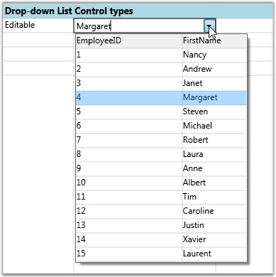
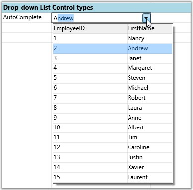
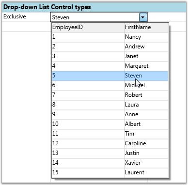

::: {style="DISPLAY: none"}
{#d2h_url_template}{#d2h_package_url style="WIDTH: 0px; DISPLAY: none; HEIGHT: 0px"}
:::

:::: {.d2h_secondary_topic style="PADDING-BOTTOM: 10pt; MARGIN: 0pt; PADDING-LEFT: 0pt; PADDING-RIGHT: 0pt; PADDING-TOP: 0pt"}
##### Drop-down List Cells {#drop-down-list-cells style="tab-stops: 0pt"}

This cell type serves the same purpose as combo box control. The difference is that it will associate a multicolumn drop-down to the owner cell. The other common features like DropDownStyle, ItemsSource, DisplayMember and ValueMember are applicable to this cell too.

 

The code snippets below allow the user to construct different List Control Cells and their output. To set up drop-down List cell, set its CellType to "DropDownList".

 

Creating Editable Drop-down List Bound to Linq Source with 'FirstName' as its Display Member

+----------------------------------------------------------------------------------------------------------+
| [\[C#\]]{style="FONT-FAMILY: 'Courier New'; COLOR: black"}                                               |
|                                                                                                          |
| []{style="FONT-FAMILY: 'Courier New'"}                                                                   |
|                                                                                                          |
| [var dropdown1 = [this]{style="COLOR: blue"}.grid.Model\[7, 2\];]{style="FONT-FAMILY: 'Courier New'"}    |
|                                                                                                          |
| [dropdown1.CellType = [\"DropDownList\"]{style="COLOR: #a31515"};]{style="FONT-FAMILY: 'Courier New'"}   |
|                                                                                                          |
| [dropdown1.ItemsSource = northWind.Employees.Select(emp =\>]{style="FONT-FAMILY: 'Courier New'"}         |
|                                                                                                          |
| [        [new]{style="COLOR: blue"}]{style="FONT-FAMILY: 'Courier New'"}                                 |
|                                                                                                          |
| [        {]{style="FONT-FAMILY: 'Courier New'"}                                                          |
|                                                                                                          |
| [            EmployeeID = emp.EmployeeID,]{style="FONT-FAMILY: 'Courier New'"}                           |
|                                                                                                          |
| [            FirstName = emp.FirstName,]{style="FONT-FAMILY: 'Courier New'"}                             |
|                                                                                                          |
| [            LastName = emp.LastName,]{style="FONT-FAMILY: 'Courier New'"}                               |
|                                                                                                          |
| [            Phone = emp.HomePhone]{style="FONT-FAMILY: 'Courier New'"}                                  |
|                                                                                                          |
| [        }).ToList();]{style="FONT-FAMILY: 'Courier New'"}                                               |
|                                                                                                          |
| [dropdown1.DisplayMember = [\"FirstName\"]{style="COLOR: #a31515"};]{style="FONT-FAMILY: 'Courier New'"} |
|                                                                                                          |
| [dropdown1.DropDownStyle = GridDropDownStyle.Editable;]{style="FONT-FAMILY: 'Courier New'"}              |
+----------------------------------------------------------------------------------------------------------+

[]{style="COLOR: #15428b"} 

Output

The following output is generated using the code above.

 

{border="0"}

Figure 22:  Editable Drop-down List Control

 

An Editable drop-down list is created.

Autocomplete Drop-down List Bound to Linq source with 'FirstName' as its Display Member and 'EmployeeID' as its ValueMember

 

+----------------------------------------------------------------------------------------------------------+
| [\[C#\]]{style="FONT-FAMILY: 'Courier New'; COLOR: black"}                                               |
|                                                                                                          |
| **[]{style="FONT-FAMILY: 'Courier New'; COLOR: black"}**                                                 |
|                                                                                                          |
| [var dropdown2 = [this]{style="COLOR: blue"}.grid.Model\[8, 2\];]{style="FONT-FAMILY: 'Courier New'"}    |
|                                                                                                          |
| [dropdown2.CellType = [\"DropDownList\"]{style="COLOR: #a31515"};]{style="FONT-FAMILY: 'Courier New'"}   |
|                                                                                                          |
| [dropdown2.ItemsSource = northWind.Employees.Select(emp =\>]{style="FONT-FAMILY: 'Courier New'"}         |
|                                                                                                          |
| [        [new]{style="COLOR: blue"}]{style="FONT-FAMILY: 'Courier New'"}                                 |
|                                                                                                          |
| [        {]{style="FONT-FAMILY: 'Courier New'"}                                                          |
|                                                                                                          |
| [            EmployeeID = emp.EmployeeID,]{style="FONT-FAMILY: 'Courier New'"}                           |
|                                                                                                          |
| [            FirstName = emp.FirstName,]{style="FONT-FAMILY: 'Courier New'"}                             |
|                                                                                                          |
| [            LastName = emp.LastName,]{style="FONT-FAMILY: 'Courier New'"}                               |
|                                                                                                          |
| [            Phone = emp.HomePhone]{style="FONT-FAMILY: 'Courier New'"}                                  |
|                                                                                                          |
| [        }).ToList();]{style="FONT-FAMILY: 'Courier New'"}                                               |
|                                                                                                          |
| [dropdown2.DisplayMember = [\"FirstName\"]{style="COLOR: #a31515"};]{style="FONT-FAMILY: 'Courier New'"} |
|                                                                                                          |
| [dropdown2.ValueMember = [\"EmployeeID\"]{style="COLOR: #a31515"};]{style="FONT-FAMILY: 'Courier New'"}  |
|                                                                                                          |
| [dropdown2.DropDownStyle = GridDropDownStyle.AutoComplete;]{style="FONT-FAMILY: 'Courier New'"}          |
+----------------------------------------------------------------------------------------------------------+

[]{style="COLOR: #15428b"} 

Output

The following output is generated using the code above.

[]{style="COLOR: #15428b"} 

{border="0"}

Figure 23:  Autocomplete Drop-down List Control

 

Exclusive Drop-down List Bound to Linq Source with FirstName as its DisplayMember.

+----------------------------------------------------------------------------------------------------------+
| [\[C#\]]{style="FONT-FAMILY: 'Courier New'; COLOR: black"}                                               |
|                                                                                                          |
| **[]{style="FONT-FAMILY: 'Courier New'; COLOR: black"}**                                                 |
|                                                                                                          |
| [var dropdown3 = [this]{style="COLOR: blue"}.grid.Model\[9, 2\];]{style="FONT-FAMILY: 'Courier New'"}    |
|                                                                                                          |
| [dropdown3.CellType = [\"DropDownList\"]{style="COLOR: #a31515"};]{style="FONT-FAMILY: 'Courier New'"}   |
|                                                                                                          |
| [dropdown3.ItemsSource = northWind.Employees.Select(emp =\>]{style="FONT-FAMILY: 'Courier New'"}         |
|                                                                                                          |
| [    [new]{style="COLOR: blue"}]{style="FONT-FAMILY: 'Courier New'"}                                     |
|                                                                                                          |
| [    {]{style="FONT-FAMILY: 'Courier New'"}                                                              |
|                                                                                                          |
| [        EmployeeID = emp.EmployeeID,]{style="FONT-FAMILY: 'Courier New'"}                               |
|                                                                                                          |
| [        FirstName = emp.FirstName,]{style="FONT-FAMILY: 'Courier New'"}                                 |
|                                                                                                          |
| [        LastName = emp.LastName,]{style="FONT-FAMILY: 'Courier New'"}                                   |
|                                                                                                          |
| [        Phone = emp.HomePhone]{style="FONT-FAMILY: 'Courier New'"}                                      |
|                                                                                                          |
| [    }).ToList();]{style="FONT-FAMILY: 'Courier New'"}                                                   |
|                                                                                                          |
| [dropdown3.DisplayMember = [\"FirstName\"]{style="COLOR: #a31515"};]{style="FONT-FAMILY: 'Courier New'"} |
|                                                                                                          |
| [dropdown3.DropDownStyle = GridDropDownStyle.Exclusive;]{style="FONT-FAMILY: 'Courier New'"}             |
+----------------------------------------------------------------------------------------------------------+

[]{style="COLOR: #15428b"} 

Output

The following output is generated using the code above.

[]{style="COLOR: #15428b"} 

{border="0"}

Figure 24:  Exclusive Drop-down List Control

::: {style="BORDER-BOTTOM: windowtext 1pt solid; BORDER-LEFT: medium none; PADDING-BOTTOM: 1pt; MARGIN-TOP: 9pt; PADDING-LEFT: 0pt; PADDING-RIGHT: 0pt; MARGIN-BOTTOM: 9pt; BORDER-TOP: windowtext 1pt solid; BORDER-RIGHT: medium none; PADDING-TOP: 1pt"}
{border="0"}Note: For complete code, please refer to the following browser sample.
:::

[]{style="COLOR: #15428b"} 

***\...\\My Documents\\Syncfusion\\EssentialStudio\\\<Version Number\>\\WPF\\Grid.WPF\\Samples\\3.5\\WindowsSamples\\Cell Types\\Combo Box Cell Demo***

[]{#related-topics}
::::
