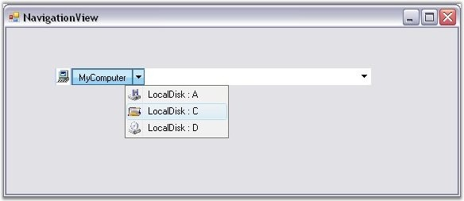
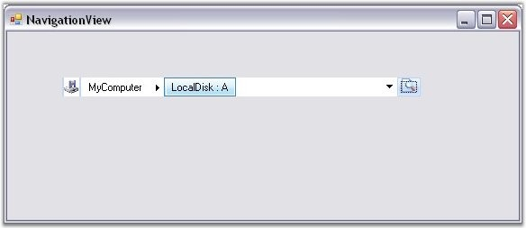
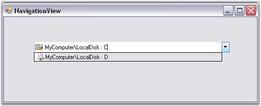
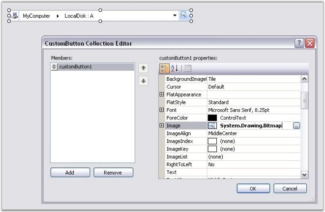
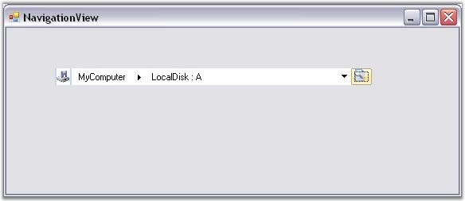

::: {style="DISPLAY: none"}
{#d2h_url_template}{#d2h_package_url style="WIDTH: 0px; DISPLAY: none; HEIGHT: 0px"}
:::

::: {.d2h_secondary_topic style="PADDING-BOTTOM: 10pt; MARGIN: 0pt; PADDING-LEFT: 0pt; PADDING-RIGHT: 0pt; PADDING-TOP: 0pt"}
#### Drop-Down Selection {#drop-down-selection style="MARGIN-LEFT: 18pt; tab-stops: 18.0pt"}

[]{style="COLOR: #15428b"} 

NavigationView control provides drop-down selection support.

[]{style="COLOR: #15428b"} 

Each folder that is navigated through, is shown in the Address Bar, separated by a Forward Arrow. Clicking on this arrow, will show a drop-down list, displaying all the folders directly below the one you have opened.

[]{style="FONT-FAMILY: 'Times New Roman','serif'; FONT-SIZE: 12pt"} 

{border="0"}

 

Figure 1478: DropDown Selection in NavigationView

 

**Images Support**

 

NavigationView control provides support for adding images to both Parent Bars and Child Bars. It displays the image of the Selected Bar to the left of the control.

[]{style="COLOR: #15428b"} 

+-----------------------------------------------------------------------------------------------------------+
| **[\[C#\]]{style="FONT-FAMILY: 'Courier New'; COLOR: black"}**                                            |
|                                                                                                           |
| []{style="FONT-FAMILY: 'Courier New'; COLOR: black"}                                                      |
|                                                                                                           |
| [navigationView4.ImageList = [this]{style="COLOR: blue"}.imageList1;]{style="FONT-FAMILY: 'Courier New'"} |
|                                                                                                           |
| [Rootbar.ImageIndex = 0;]{style="FONT-FAMILY: 'Courier New'"}                                             |
|                                                                                                           |
| [ChildBar1.ImageIndex = 1;]{style="FONT-FAMILY: 'Courier New'"}                                           |
|                                                                                                           |
| [ChildBar2.ImageIndex = 1;]{style="FONT-FAMILY: 'Courier New'"}[]{style="FONT-FAMILY: 'Courier New'"}     |
+-----------------------------------------------------------------------------------------------------------+

[]{style="COLOR: #15428b"} 

+--------------------------------------------------------------------------------------------------------+
| **[\[VB.NET\]]{style="FONT-FAMILY: 'Courier New'; COLOR: black"}**                                     |
|                                                                                                        |
| []{style="FONT-FAMILY: 'Courier New'; COLOR: black"}                                                   |
|                                                                                                        |
| [navigationView4.ImageList = [Me]{style="COLOR: blue"}.imageList1]{style="FONT-FAMILY: 'Courier New'"} |
|                                                                                                        |
| [Rootbar.ImageIndex = 0]{style="FONT-FAMILY: 'Courier New'"}                                           |
|                                                                                                        |
| [ChildBar1.ImageIndex = 1]{style="FONT-FAMILY: 'Courier New'"}                                         |
|                                                                                                        |
| [ChildBar2.ImageIndex = 1]{style="FONT-FAMILY: 'Courier New'"}[]{style="FONT-FAMILY: 'Courier New'"}   |
+--------------------------------------------------------------------------------------------------------+

[]{style="COLOR: #15428b"} 

The following illustration shows the NavigationView with Bar Images.

[]{style="COLOR: #15428b"} 

{border="0"}

[]{style="COLOR: #15428b"} 

Figure 1479: NavigationView with Bar Images

 

Tracking the Previously Selected Items using DropDown Button

 

You can trace the previously selected locations by clicking on the Drop-Down button of the NavigationView.

 

The following illustration shows the NavigationView displaying Previously Selected Items.

[]{style="COLOR: #15428b"} 

[{border="0"}]{style="COLOR: #15428b"}[]{style="COLOR: #15428b"}

**[]{style="COLOR: #15428b"}** 

Figure 1480: NavigationView displaying Previously Selected Items

 

**Custom Button Collection**

 

You can add one or more custom buttons to the NavigationView through designer and code. This is illustrated below.

[]{style="COLOR: #15428b"} 

[·      ]{style="FONT-FAMILY: Symbol"}Adding Custom Button Through Designer

[]{style="COLOR: #15428b"} 

You can add custom buttons to the NavigationView using the **CustomButton Collection** **Editor**.

[]{style="COLOR: #15428b"} 

The following illustration shows the CustomButton Collection Editor.

[]{style="COLOR: #15428b"} 

{border="0"}

[]{style="COLOR: #15428b"} 

Figure 1481: CustomButton Collection Editor

[]{style="COLOR: #15428b"} 

[·      ]{style="FONT-FAMILY: Symbol"}Adding Custom Button Through Code[]{#p1206}

[]{style="COLOR: #15428b"} 

+------------------------------------------------------------------------------------------------------------------------------------------------------------------------------------------------------------------+
| **[\[C#\]]{style="FONT-FAMILY: 'Courier New'; COLOR: black"}**                                                                                                                                                   |
|                                                                                                                                                                                                                  |
| []{style="FONT-FAMILY: 'Courier New'; COLOR: black"}                                                                                                                                                             |
|                                                                                                                                                                                                                  |
| [Syncfusion.Windows.Forms.Tools.Navigation.CustomButton customButton = [new]{style="COLOR: blue"} Syncfusion.Windows.Forms.Tools.Navigation.CustomButton();]{style="FONT-FAMILY: 'Courier New'"}                 |
|                                                                                                                                                                                                                  |
| [customButton.Appearance = Syncfusion.Windows.Forms.[ButtonAppearance]{style="COLOR: teal"}.Office2007;]{style="FONT-FAMILY: 'Courier New'"}                                                                     |
|                                                                                                                                                                                                                  |
| [customButton.Name = [\"customButton\"]{style="COLOR: maroon"};]{style="FONT-FAMILY: 'Courier New'"}                                                                                                             |
|                                                                                                                                                                                                                  |
| [Bitmap]{style="FONT-FAMILY: 'Courier New'; COLOR: teal"}[ img = [new]{style="COLOR: blue"} [Bitmap]{style="COLOR: teal"}([\"..//..//Search.gif\"]{style="COLOR: maroon"});]{style="FONT-FAMILY: 'Courier New'"} |
|                                                                                                                                                                                                                  |
| [customButton.Image = img;]{style="FONT-FAMILY: 'Courier New'"}                                                                                                                                                  |
|                                                                                                                                                                                                                  |
| [navigationView4.Controls.Add(customButton);]{style="FONT-FAMILY: 'Courier New'"}[]{style="FONT-FAMILY: 'Courier New'"}                                                                                          |
+------------------------------------------------------------------------------------------------------------------------------------------------------------------------------------------------------------------+

[]{style="COLOR: #15428b"} 

+----------------------------------------------------------------------------------------------------------------------------------------------------------------------------------------------------------------------------------------------------------------------------------+
| **[\[VB.NET\]]{style="FONT-FAMILY: 'Courier New'; COLOR: black"}**                                                                                                                                                                                                               |
|                                                                                                                                                                                                                                                                                  |
| []{style="FONT-FAMILY: 'Courier New'; COLOR: black"}                                                                                                                                                                                                                             |
|                                                                                                                                                                                                                                                                                  |
| [Dim]{style="FONT-FAMILY: 'Courier New'; COLOR: blue"}[ customButton [As]{style="COLOR: blue"} Syncfusion.Windows.Forms.Tools.Navigation.CustomButton = [New]{style="COLOR: blue"} Syncfusion.Windows.Forms.Tools.Navigation.CustomButton()]{style="FONT-FAMILY: 'Courier New'"} |
|                                                                                                                                                                                                                                                                                  |
| [customButton.Appearance = Syncfusion.Windows.Forms.ButtonAppearance.Office2007]{style="FONT-FAMILY: 'Courier New'"}                                                                                                                                                             |
|                                                                                                                                                                                                                                                                                  |
| [customButton.Name = [\"customButton\"]{style="COLOR: #a31515"}]{style="FONT-FAMILY: 'Courier New'"}                                                                                                                                                                             |
|                                                                                                                                                                                                                                                                                  |
| [Dim]{style="FONT-FAMILY: 'Courier New'; COLOR: blue"}[ img [As]{style="COLOR: blue"} Bitmap = [New]{style="COLOR: blue"} Bitmap([\"..//..//Search.gif\"]{style="COLOR: #a31515"})]{style="FONT-FAMILY: 'Courier New'"}                                                          |
|                                                                                                                                                                                                                                                                                  |
| [customButton.Image = img]{style="FONT-FAMILY: 'Courier New'"}                                                                                                                                                                                                                   |
|                                                                                                                                                                                                                                                                                  |
| [navigationView4.Controls.Add(customButton)]{style="FONT-FAMILY: 'Courier New'"}[]{style="FONT-FAMILY: 'Courier New'"}                                                                                                                                                           |
+----------------------------------------------------------------------------------------------------------------------------------------------------------------------------------------------------------------------------------------------------------------------------------+

[]{style="COLOR: #15428b"} 

[]{style="COLOR: #15428b"} 

The following illustration shows the NavigationView with Custom Button.

[]{style="COLOR: #15428b"} 

{border="0"}

[]{style="COLOR: #15428b"} 

Figure 1482: NavigationView with Custom Button

 

[]{#related-topics}
:::
