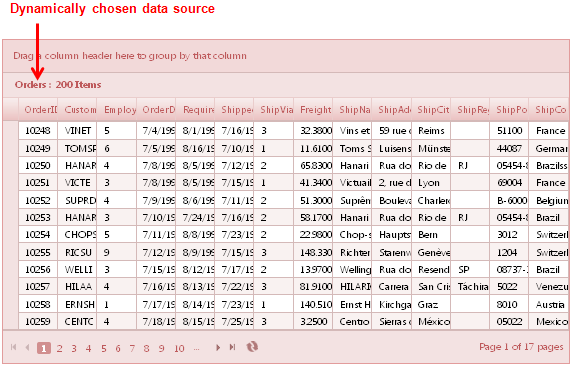
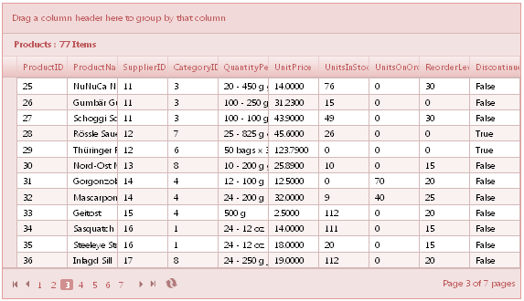
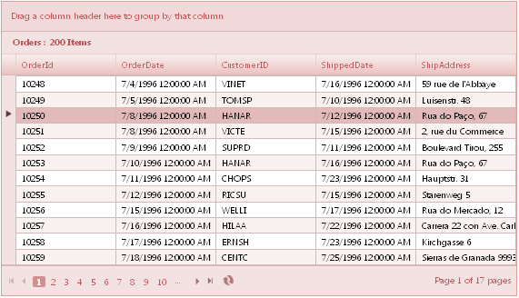

::: {style="DISPLAY: none"}
{#d2h_url_template}{#d2h_package_url style="WIDTH: 0px; DISPLAY: none; HEIGHT: 0px"}
:::

::::: {#nsbanner .d2h_main_nsbanner style="BORDER-BOTTOM: #999999 1px solid; POSITION: relative; PADDING-BOTTOM: 0px; BACKGROUND-COLOR: transparent; PADDING-LEFT: 0px; PADDING-RIGHT: 0px; DISPLAY: none; BORDER-TOP: #999999 1px solid; PADDING-TOP: 0px; LEFT: 0px"}
:::: {#TitleRow .d2h_main_titlerow style="PADDING-BOTTOM: 4px; BACKGROUND-COLOR: transparent; PADDING-LEFT: 22px; WIDTH: 100%; PADDING-RIGHT: 10px; DISPLAY: none; PADDING-TOP: 4px"}
::: {#ienav .d2h_main_ienav style="DISPLAY: none"}
{#D2HPrevious .D2HPreviousEnabled}  {#D2HNext .D2HNextEnabled}
:::
::::
:::::

::::::::::::::::: {#nstext .d2h_main_nstext style="PADDING-BOTTOM: 10px; BACKGROUND-COLOR: transparent; PADDING-LEFT: 22px; PADDING-RIGHT: 10px; HEIGHT: 100%; OVERFLOW: auto; PADDING-TOP: 5px" hasuserbackground="true" valign="bottom"}
::: {#d2h_breadcrumbs .d2h_breadcrumbs}
[Essential Studio User Guide Documentation](ms-xhelp:///?Id=12457748-09e3-4d74-a240-8e049cedf030){.d2h_breadcrumbsNormal}[ \> ]{.d2h_breadcrumbsLinkSeparator}[User Interface Edition](ms-xhelp:///?Id=c29296b7-531c-413b-a0ec-488ca1f7f669){.d2h_breadcrumbsNormal}[ \> ]{.d2h_breadcrumbsLinkSeparator}[Essential ASP.NET MVC](ms-xhelp:///?Id=4b14e7d1-65c4-4f67-b1aa-2c37709905a5){.d2h_breadcrumbsNormal}[ \> ]{.d2h_breadcrumbsLinkSeparator}[Essential Grid]{.d2h_breadcrumbsContentsOnly}[ \> ]{.d2h_breadcrumbsLinkSeparator}[Getting Started](ms-xhelp:///?Id=c7ed3902-b25b-4170-be58-1d3d0b57748a){.d2h_breadcrumbsNormal}[ \> ]{.d2h_breadcrumbsLinkSeparator}[Feature Summary](ms-xhelp:///?Id=1923e679-441a-44e0-9bca-e0e50988a857){.d2h_breadcrumbsNormal}[ \> ]{.d2h_breadcrumbsLinkSeparator}[Concepts and Features](ms-xhelp:///?Id=4a1657fa-4756-42b9-9153-aebf5dcfc503){.d2h_breadcrumbsNormal}[ \> ]{.d2h_breadcrumbsLinkSeparator}[Data Binding](ms-xhelp:///?Id=4e3356df-66f2-4ab8-801e-d5ab48a4e93a){.d2h_breadcrumbsNormal}
:::

### Dynamic Data Binding {#dynamic-data-binding style="tab-stops: 0pt"}

 

The dynamic data binding feature does not need any parameters to define the grid. This feature will be useful to dynamically define the **ModelType** of the grid. According to the data source the grid will render the columns internally.

 

Use Case Scenarios

 

Dynamic data binding can be used for:

1.  Automatically generating columns without mapping to column names. (Auto-generated column support)

2.  Dynamically binding data sources to the Grid control. (Dynamic data binding support)

 

Dynamically Bind Data to Grid

 

Through GridBuilder

 

To dynamically bind data to the grid through **GridBuilder**:

1.   Create a model in the application (Refer to [[[Getting Started\>Adding a Model to the Application]{style="COLOR: blue"}]{.underline}](http://help.syncfusion.com/ug_91/User%20Interface/ASP.NET%20MVC/Grid/Documents/addingamodeltotheapplication.htm)).

2.  Create the Grid control in the view of type **object** and configure its properties.

 

::: {align="center"}
+---------------------------------------------------------------------------------------------------------------------------------------------------------------------------------------------------------------------+
| **[View \[ASPX\]]{style="FONT-FAMILY: 'Courier New'"}**                                                                                                                                                             |
|                                                                                                                                                                                                                     |
| **[]{style="FONT-FAMILY: 'Courier New'"}**                                                                                                                                                                          |
|                                                                                                                                                                                                                     |
| [    [\<%]{style="BACKGROUND: yellow"}[ =]{style="COLOR: blue"}Html.Grid\<[object]{style="COLOR: blue"}\>([\"Grid1\"]{style="COLOR: #a31515"})]{style="LINE-HEIGHT: 115%; FONT-FAMILY: Consolas; FONT-SIZE: 9.5pt"} |
|                                                                                                                                                                                                                     |
| [                        .Datasource(([IEnumerable]{style="COLOR: #2b91af"})ViewData\[[\"data\"]{style="COLOR: #a31515"}\])]{style="LINE-HEIGHT: 115%; FONT-FAMILY: Consolas; FONT-SIZE: 9.5pt"}                    |
|                                                                                                                                                                                                                     |
| [                        .Caption([\"Dynamic DataSource\"]{style="COLOR: #a31515"})                         ]{style="LINE-HEIGHT: 115%; FONT-FAMILY: Consolas; FONT-SIZE: 9.5pt"}                                   |
|                                                                                                                                                                                                                     |
| [                        .AutoFormat([Skins]{style="COLOR: #2b91af"}.Almond)]{style="LINE-HEIGHT: 115%; FONT-FAMILY: Consolas; FONT-SIZE: 9.5pt"}                                                                   |
|                                                                                                                                                                                                                     |
| [    [%\>]{style="BACKGROUND: yellow"} ]{style="LINE-HEIGHT: 115%; FONT-FAMILY: Consolas; FONT-SIZE: 9.5pt"}                                                                                                        |
|                                                                                                                                                                                                                     |
| []{style="FONT-FAMILY: 'Courier New'"}                                                                                                                                                                              |
+---------------------------------------------------------------------------------------------------------------------------------------------------------------------------------------------------------------------+
:::

 

::: {align="center"}
+--------------------------------------------------------------------------------------------------------------------------------------------------------------------------------------------------+
| **[View \[]{style="FONT-FAMILY: 'Courier New'"}[cshtml]{style="LINE-HEIGHT: 115%; FONT-FAMILY: 'Courier New'"}[\]]{style="FONT-FAMILY: 'Courier New'"}**                                         |
|                                                                                                                                                                                                  |
| [   [\@{]{style="BACKGROUND: yellow"} Html.Grid\<[object]{style="COLOR: blue"}\>([\"Grid1\"]{style="COLOR: #a31515"})]{style="LINE-HEIGHT: 115%; FONT-FAMILY: Consolas; FONT-SIZE: 9.5pt"}       |
|                                                                                                                                                                                                  |
| [                        .Datasource(([IEnumerable]{style="COLOR: #2b91af"})ViewData\[[\"data\"]{style="COLOR: #a31515"}\])]{style="LINE-HEIGHT: 115%; FONT-FAMILY: Consolas; FONT-SIZE: 9.5pt"} |
|                                                                                                                                                                                                  |
| [                        .Caption(ViewData\[[\"datatype\"]{style="COLOR: #a31515"}\].ToString())]{style="LINE-HEIGHT: 115%; FONT-FAMILY: Consolas; FONT-SIZE: 9.5pt"}                            |
|                                                                                                                                                                                                  |
| [                        .AutoFormat([Skins]{style="COLOR: #2b91af"}.Almond)]{style="LINE-HEIGHT: 115%; FONT-FAMILY: Consolas; FONT-SIZE: 9.5pt"}                                                |
|                                                                                                                                                                                                  |
| [                .Render();]{style="LINE-HEIGHT: 115%; FONT-FAMILY: Consolas; FONT-SIZE: 9.5pt"}                                                                                                 |
|                                                                                                                                                                                                  |
| [    [}]{style="BACKGROUND: yellow"}]{style="LINE-HEIGHT: 115%; FONT-FAMILY: Consolas; FONT-SIZE: 9.5pt"}                                                                                        |
|                                                                                                                                                                                                  |
| []{style="FONT-FAMILY: 'Courier New'"}                                                                                                                                                           |
+--------------------------------------------------------------------------------------------------------------------------------------------------------------------------------------------------+
:::

 

3.  Set its data source in the corresponding **ViewData** and render the view.

 

::: {align="center"}
+---------------------------------------------------------------------------------------------------------------------------------------------+
| **[\[C#\]]{style="FONT-FAMILY: 'Courier New'"}**                                                                                            |
|                                                                                                                                             |
|         [public]{style="COLOR: blue"} [ActionResult]{style="COLOR: #2b91af"} Index()\                                                       |
| \                                                                                                                                           |
|                                                                                                                                             |
|         {\                                                                                                                                  |
| \                                                                                                                                           |
|                                                                                                                                             |
|             [var]{style="COLOR: blue"} data = [new]{style="COLOR: blue"} [NorthwindDataContext]{style="COLOR: #2b91af"}().Orders;           |
|                                                                                                                                             |
| [              ViewData\[[\"data\"]{style="COLOR: #a31515"}\] = data;]{style="LINE-HEIGHT: 115%; FONT-FAMILY: Consolas; FONT-SIZE: 9.5pt"}\ |
| \                                                                                                                                           |
|                                                                                                                                             |
|             [return]{style="COLOR: blue"} View();\                                                                                          |
| \                                                                                                                                           |
|                                                                                                                                             |
|         }                                                                                                                                   |
+---------------------------------------------------------------------------------------------------------------------------------------------+
:::

 

4.  Run the application, the grid will appear as shown below:

 

{border="0"}

Figure 101: Grid Bound to Dynamic Data Source through GridBuilder

[   ]{style="FONT-FAMILY: 'Courier New'"}

 

Through GridPropertiesModel

To dynamically bind data to the grid through **GridPropertiesModel**:

1.   Create a model in the application (Refer to [[[Getting Started\>Adding a Model to the Application]{style="COLOR: blue"}]{.underline}](http://help.syncfusion.com/ug_91/User%20Interface/ASP.NET%20MVC/Grid/Documents/addingamodeltotheapplication.htm)).

2.  Add the following code in the **Index.aspx** file to create the Grid control in the view.

 

::: {align="center"}
+----------------------------------------------------------------------------------------------------------------------------------------------------------------------------------------------------------------------------------+
| **[View \[ASPX\]]{style="FONT-FAMILY: 'Courier New'"}**                                                                                                                                                                          |
|                                                                                                                                                                                                                                  |
| [    [\<%]{style="BACKGROUND: yellow"}[=]{style="COLOR: blue"} Html.Syncfusion().Grid\<[object]{style="COLOR: blue"}\>([\"Grid1\"]{style="COLOR: #a31515"},]{style="LINE-HEIGHT: 115%; FONT-FAMILY: Consolas; FONT-SIZE: 9.5pt"} |
|                                                                                                                                                                                                                                  |
| [    ([GridPropertiesModel]{style="COLOR: #2b91af"}\<[object]{style="COLOR: blue"}\>)ViewData\[[\"GridModel\"]{style="COLOR: #a31515"}\] ]{style="LINE-HEIGHT: 115%; FONT-FAMILY: Consolas; FONT-SIZE: 9.5pt"}                   |
|                                                                                                                                                                                                                                  |
| [    [%\>]{style="BACKGROUND: yellow"}]{style="LINE-HEIGHT: 115%; FONT-FAMILY: Consolas; FONT-SIZE: 9.5pt"}                                                                                                                      |
+----------------------------------------------------------------------------------------------------------------------------------------------------------------------------------------------------------------------------------+
:::

 

::: {align="center"}
+----------------------------------------------------------------------------------------------------------------------------------------------------------------------------------------------------------------------------------------------------------------------------------------------------------------------------------------------------------------------------------------------------------------------------------------------------------------------------------------------------------------------------------------------------------------------------+
| **[View \[]{style="FONT-FAMILY: 'Courier New'"}[cshtml]{style="LINE-HEIGHT: 115%; FONT-FAMILY: 'Courier New'"}[\]]{style="FONT-FAMILY: 'Courier New'"}**                                                                                                                                                                                                                                                                                                                                                                                                                   |
|                                                                                                                                                                                                                                                                                                                                                                                                                                                                                                                                                                            |
| [@(]{style="LINE-HEIGHT: 115%; FONT-FAMILY: Consolas; BACKGROUND: yellow; FONT-SIZE: 9.5pt"}[new]{style="LINE-HEIGHT: 115%; FONT-FAMILY: Consolas; COLOR: blue; FONT-SIZE: 9.5pt"}[ [HtmlString]{style="COLOR: #2b91af"}(Html.Syncfusion().Grid\<[object]{style="COLOR: blue"}\>([\"Grid1\"]{style="COLOR: #a31515"}, ([GridPropertiesModel]{style="COLOR: #2b91af"}\<[object]{style="COLOR: blue"}\>)ViewData\[[\"GridModel\"]{style="COLOR: #a31515"}\]).ToString())[)]{style="BACKGROUND: yellow"}]{style="LINE-HEIGHT: 115%; FONT-FAMILY: Consolas; FONT-SIZE: 9.5pt"} |
|                                                                                                                                                                                                                                                                                                                                                                                                                                                                                                                                                                            |
| []{style="LINE-HEIGHT: 115%; FONT-FAMILY: Consolas; FONT-SIZE: 9.5pt"}                                                                                                                                                                                                                                                                                                                                                                                                                                                                                                     |
+----------------------------------------------------------------------------------------------------------------------------------------------------------------------------------------------------------------------------------------------------------------------------------------------------------------------------------------------------------------------------------------------------------------------------------------------------------------------------------------------------------------------------------------------------------------------------+
:::

 

 

3.  Create a **GridPropertiesModel** of type **object** in the **Index** method.

 

::: {align="center"}
+-------------------------------------------------------------------------------------------------------------------------------------------------------------------------------------------------------------------------------------------------------------------------------------+
| **[\[C#\]]{style="FONT-FAMILY: 'Courier New'"}**                                                                                                                                                                                                                                    |
|                                                                                                                                                                                                                                                                                     |
| [    [public]{style="COLOR: blue"} [ActionResult]{style="COLOR: #2b91af"} Index()\                                                                                                                                                                                                  |
|     {]{style="FONT-FAMILY: Consolas"}\                                                                                                                                                                                                                                              |
| [       [GridPropertiesModel]{style="COLOR: #2b91af"}\<[object]{style="COLOR: blue"}\> gridModel = [new]{style="COLOR: blue"} [GridPropertiesModel]{style="COLOR: #2b91af"}\<[object]{style="COLOR: blue"}\>()]{style="LINE-HEIGHT: 115%; FONT-FAMILY: Consolas; FONT-SIZE: 9.5pt"} |
|                                                                                                                                                                                                                                                                                     |
| [       {]{style="LINE-HEIGHT: 115%; FONT-FAMILY: Consolas; FONT-SIZE: 9.5pt"}                                                                                                                                                                                                      |
|                                                                                                                                                                                                                                                                                     |
| [               DataSource = [new]{style="COLOR: blue"} [NorthwindDataContext]{style="COLOR: #2b91af"}().Orders,]{style="LINE-HEIGHT: 115%; FONT-FAMILY: Consolas; FONT-SIZE: 9.5pt"}                                                                                               |
|                                                                                                                                                                                                                                                                                     |
| [               Caption = [\"Orders\"]{style="COLOR: #a31515"},]{style="LINE-HEIGHT: 115%; FONT-FAMILY: Consolas; FONT-SIZE: 9.5pt"}                                                                                                                                                |
|                                                                                                                                                                                                                                                                                     |
| [       };]{style="LINE-HEIGHT: 115%; FONT-FAMILY: Consolas; FONT-SIZE: 9.5pt"}                                                                                                                                                                                                     |
|                                                                                                                                                                                                                                                                                     |
| []{style="LINE-HEIGHT: 115%; FONT-FAMILY: Consolas; FONT-SIZE: 9.5pt"}                                                                                                                                                                                                              |
|                                                                                                                                                                                                                                                                                     |
| [       ViewData\[[\"GridModel\"]{style="COLOR: #a31515"}\] = gridModel;]{style="LINE-HEIGHT: 115%; FONT-FAMILY: Consolas; FONT-SIZE: 9.5pt"}                                                                                                                                       |
|                                                                                                                                                                                                                                                                                     |
| [       [return]{style="COLOR: blue"} View();]{style="LINE-HEIGHT: 115%; FONT-FAMILY: Consolas; FONT-SIZE: 9.5pt"}                                                                                                                                                                  |
|                                                                                                                                                                                                                                                                                     |
| \                                                                                                                                                                                                                                                                                   |
|         }[]{style="LINE-HEIGHT: 115%; FONT-FAMILY: Consolas; FONT-SIZE: 9.5pt"}                                                                                                                                                                                                     |
|                                                                                                                                                                                                                                                                                     |
| [   ]{style="FONT-FAMILY: 'Courier New'"}                                                                                                                                                                                                                                           |
+-------------------------------------------------------------------------------------------------------------------------------------------------------------------------------------------------------------------------------------------------------------------------------------+
:::

 

4.  Run the application. The grid will appear as shown below:

 

{border="0"}

Figure 102: Grid Bound to Dynamic Data Source through GridPropertiesModel

 

Tables for Methods (Properties and Events Not Applicable)

 

Methods

 

::: {align="center"}
  Method    Description                                   Parameters   Type   Return type
  --------- --------------------------------------------- ------------ ------ -------------------------
  UnBound   Gets or sets the column to be bound or not.   IsUnBound    bool   IGridColumnBuilder\<T\>
:::

 

 

How to Add Columns

 

Through GridBuilder

To add columns in a dynamically bound grid through **GridBuilder**:

1.   Create a model in the application (Refer to [[[Getting Started\>Adding a Model to the Application]{style="COLOR: blue"}]{.underline}](http://help.syncfusion.com/ug_91/User%20Interface/ASP.NET%20MVC/Grid/Documents/addingamodeltotheapplication.htm)).

2.   Create the Grid control in the view of type **object** and configure its properties.

3.   Add columns using the following code snippet:

::: {align="center"}
+---------------------------------------------------------------------------------------------------------------------------------------------------------------------------------------------------------------------+
| **[View \[ASPX\]]{style="FONT-FAMILY: 'Courier New'"}**                                                                                                                                                             |
|                                                                                                                                                                                                                     |
| **[]{style="FONT-FAMILY: 'Courier New'"}**                                                                                                                                                                          |
|                                                                                                                                                                                                                     |
| [    [\<%]{style="BACKGROUND: yellow"}[ =]{style="COLOR: blue"}Html.Grid\<[object]{style="COLOR: blue"}\>([\"Grid1\"]{style="COLOR: #a31515"})]{style="LINE-HEIGHT: 115%; FONT-FAMILY: Consolas; FONT-SIZE: 9.5pt"} |
|                                                                                                                                                                                                                     |
| [                        .Datasource(([IEnumerable]{style="COLOR: #2b91af"})ViewData\[[\"data\"]{style="COLOR: #a31515"}\])]{style="LINE-HEIGHT: 115%; FONT-FAMILY: Consolas; FONT-SIZE: 9.5pt"}                    |
|                                                                                                                                                                                                                     |
| [                        .Column(col=\>{]{style="LINE-HEIGHT: 115%; FONT-FAMILY: Consolas; FONT-SIZE: 9.5pt"}                                                                                                       |
|                                                                                                                                                                                                                     |
| [                            col.Add([\"OrderId\"]{style="COLOR: #a31515"}).UnBound([false]{style="COLOR: blue"});]{style="LINE-HEIGHT: 115%; FONT-FAMILY: Consolas; FONT-SIZE: 9.5pt"}                             |
|                                                                                                                                                                                                                     |
| [                            col.Add([\"OrderDate\"]{style="COLOR: #a31515"}).UnBound([false]{style="COLOR: blue"});]{style="LINE-HEIGHT: 115%; FONT-FAMILY: Consolas; FONT-SIZE: 9.5pt"}                           |
|                                                                                                                                                                                                                     |
| [                            col.Add([\"CustomerID\"]{style="COLOR: #a31515"}).UnBound([false]{style="COLOR: blue"});]{style="LINE-HEIGHT: 115%; FONT-FAMILY: Consolas; FONT-SIZE: 9.5pt"}                          |
|                                                                                                                                                                                                                     |
| [                            col.Add([\"ShippedDate\"]{style="COLOR: #a31515"}).UnBound([false]{style="COLOR: blue"});]{style="LINE-HEIGHT: 115%; FONT-FAMILY: Consolas; FONT-SIZE: 9.5pt"}                         |
|                                                                                                                                                                                                                     |
| [                            col.Add([\"ShipAddress\"]{style="COLOR: #a31515"}).UnBound([false]{style="COLOR: blue"});]{style="LINE-HEIGHT: 115%; FONT-FAMILY: Consolas; FONT-SIZE: 9.5pt"}                         |
|                                                                                                                                                                                                                     |
| [                        })]{style="LINE-HEIGHT: 115%; FONT-FAMILY: Consolas; FONT-SIZE: 9.5pt"}                                                                                                                    |
|                                                                                                                                                                                                                     |
| [                         .Caption([\"Dynamic DataSource\"]{style="COLOR: #a31515"})                         ]{style="LINE-HEIGHT: 115%; FONT-FAMILY: Consolas; FONT-SIZE: 9.5pt"}                                  |
|                                                                                                                                                                                                                     |
| [                         .AutoFormat([Skins]{style="COLOR: #2b91af"}.Almond)]{style="LINE-HEIGHT: 115%; FONT-FAMILY: Consolas; FONT-SIZE: 9.5pt"}                                                                  |
|                                                                                                                                                                                                                     |
| [    [%\>]{style="BACKGROUND: yellow"} ]{style="LINE-HEIGHT: 115%; FONT-FAMILY: Consolas; FONT-SIZE: 9.5pt"}                                                                                                        |
|                                                                                                                                                                                                                     |
| []{style="FONT-FAMILY: 'Courier New'"}                                                                                                                                                                              |
+---------------------------------------------------------------------------------------------------------------------------------------------------------------------------------------------------------------------+
:::

 

::: {align="center"}
+--------------------------------------------------------------------------------------------------------------------------------------------------------------------------------------------------+
| **[View \[]{style="FONT-FAMILY: 'Courier New'"}[cshtml]{style="LINE-HEIGHT: 115%; FONT-FAMILY: 'Courier New'"}[\]]{style="FONT-FAMILY: 'Courier New'"}**                                         |
|                                                                                                                                                                                                  |
| **[]{style="FONT-FAMILY: 'Courier New'"}**                                                                                                                                                       |
|                                                                                                                                                                                                  |
| [   [\@{]{style="BACKGROUND: yellow"} Html.Grid\<[object]{style="COLOR: blue"}\>([\"Grid1\"]{style="COLOR: #a31515"})]{style="LINE-HEIGHT: 115%; FONT-FAMILY: Consolas; FONT-SIZE: 9.5pt"}       |
|                                                                                                                                                                                                  |
| [                        .Datasource(([IEnumerable]{style="COLOR: #2b91af"})ViewData\[[\"data\"]{style="COLOR: #a31515"}\])]{style="LINE-HEIGHT: 115%; FONT-FAMILY: Consolas; FONT-SIZE: 9.5pt"} |
|                                                                                                                                                                                                  |
| [                        .Column(col=\>{]{style="LINE-HEIGHT: 115%; FONT-FAMILY: Consolas; FONT-SIZE: 9.5pt"}                                                                                    |
|                                                                                                                                                                                                  |
| [                            col.Add([\"OrderId\"]{style="COLOR: #a31515"}).UnBound([false]{style="COLOR: blue"});]{style="LINE-HEIGHT: 115%; FONT-FAMILY: Consolas; FONT-SIZE: 9.5pt"}          |
|                                                                                                                                                                                                  |
| [                            col.Add([\"OrderDate\"]{style="COLOR: #a31515"}).UnBound([false]{style="COLOR: blue"});]{style="LINE-HEIGHT: 115%; FONT-FAMILY: Consolas; FONT-SIZE: 9.5pt"}        |
|                                                                                                                                                                                                  |
| [                            col.Add([\"CustomerID\"]{style="COLOR: #a31515"}).UnBound([false]{style="COLOR: blue"});]{style="LINE-HEIGHT: 115%; FONT-FAMILY: Consolas; FONT-SIZE: 9.5pt"}       |
|                                                                                                                                                                                                  |
| [                            col.Add([\"ShippedDate\"]{style="COLOR: #a31515"}).UnBound([false]{style="COLOR: blue"});]{style="LINE-HEIGHT: 115%; FONT-FAMILY: Consolas; FONT-SIZE: 9.5pt"}      |
|                                                                                                                                                                                                  |
| [                            col.Add([\"ShipAddress\"]{style="COLOR: #a31515"}).UnBound([false]{style="COLOR: blue"});]{style="LINE-HEIGHT: 115%; FONT-FAMILY: Consolas; FONT-SIZE: 9.5pt"}      |
|                                                                                                                                                                                                  |
| [                        })]{style="LINE-HEIGHT: 115%; FONT-FAMILY: Consolas; FONT-SIZE: 9.5pt"}                                                                                                 |
|                                                                                                                                                                                                  |
| [                        .Caption(ViewData\[[\"datatype\"]{style="COLOR: #a31515"}\].ToString())]{style="LINE-HEIGHT: 115%; FONT-FAMILY: Consolas; FONT-SIZE: 9.5pt"}                            |
|                                                                                                                                                                                                  |
| [                        .AutoFormat([Skins]{style="COLOR: #2b91af"}.Almond)]{style="LINE-HEIGHT: 115%; FONT-FAMILY: Consolas; FONT-SIZE: 9.5pt"}                                                |
|                                                                                                                                                                                                  |
| []{style="LINE-HEIGHT: 115%; FONT-FAMILY: Consolas; FONT-SIZE: 9.5pt"}                                                                                                                           |
|                                                                                                                                                                                                  |
| [          .Render();]{style="LINE-HEIGHT: 115%; FONT-FAMILY: Consolas; FONT-SIZE: 9.5pt"}                                                                                                       |
|                                                                                                                                                                                                  |
| [    [}]{style="BACKGROUND: yellow"} ]{style="LINE-HEIGHT: 115%; FONT-FAMILY: Consolas; FONT-SIZE: 9.5pt"}                                                                                       |
|                                                                                                                                                                                                  |
| []{style="FONT-FAMILY: 'Courier New'"}                                                                                                                                                           |
+--------------------------------------------------------------------------------------------------------------------------------------------------------------------------------------------------+
:::

 

4.   Set its data source in corresponding **ViewData** and render the view.

 

::: {align="center"}
+---------------------------------------------------------------------------------------------------------------------------------------------+
| **[\[C#\]]{style="FONT-FAMILY: 'Courier New'"}**                                                                                            |
|                                                                                                                                             |
|         [public]{style="COLOR: blue"} [ActionResult]{style="COLOR: #2b91af"} Index()\                                                       |
| \                                                                                                                                           |
|                                                                                                                                             |
|         {\                                                                                                                                  |
| \                                                                                                                                           |
|                                                                                                                                             |
|             [var]{style="COLOR: blue"} data = [new]{style="COLOR: blue"} [NorthwindDataContext]{style="COLOR: #2b91af"}().Orders;           |
|                                                                                                                                             |
| [              ViewData\[[\"data\"]{style="COLOR: #a31515"}\] = data;]{style="LINE-HEIGHT: 115%; FONT-FAMILY: Consolas; FONT-SIZE: 9.5pt"}\ |
| \                                                                                                                                           |
|                                                                                                                                             |
|             [return]{style="COLOR: blue"} View();\                                                                                          |
| \                                                                                                                                           |
|                                                                                                                                             |
|         }                                                                                                                                   |
+---------------------------------------------------------------------------------------------------------------------------------------------+
:::

 

5.   Run the application. The grid will appear as shown below:

 

{border="0"}

Figure 103: Grid with Columns Added through GridBuilder

 

Through GridPropertiesModel

To add columns in a dynamically bound grid through **GridPropertiesModel**:

1.   Create a model in the application (Refer to [[[Getting Started\>Adding a Model to the Application]{style="COLOR: blue"}]{.underline}](http://help.syncfusion.com/ug_91/User%20Interface/ASP.NET%20MVC/Grid/Documents/addingamodeltotheapplication.htm)).

2.   Add the following code in the **Index.aspx** file to create the Grid control in the view.

3.   Add columns using the code shown below.

 

::: {align="center"}
+----------------------------------------------------------------------------------------------------------------------------------------------------------------------------------------------------------------------------------------------------------------------------------------------------------------------------+
| **[View \[ASPX\]]{style="FONT-FAMILY: 'Courier New'"}**                                                                                                                                                                                                                                                                    |
|                                                                                                                                                                                                                                                                                                                            |
| [    [\<%]{style="BACKGROUND: yellow"}[=]{style="COLOR: blue"} Html.Syncfusion().Grid\<[object]{style="COLOR: blue"}\>([\"Grid1\"]{style="COLOR: #a31515"},[\"GridModel\"]{style="COLOR: #a31515"},[\"GridModel\"]{style="COLOR: #a31515"}, col =\> {]{style="LINE-HEIGHT: 115%; FONT-FAMILY: Consolas; FONT-SIZE: 9.5pt"} |
|                                                                                                                                                                                                                                                                                                                            |
| []{style="LINE-HEIGHT: 115%; FONT-FAMILY: Consolas; FONT-SIZE: 9.5pt"}                                                                                                                                                                                                                                                     |
|                                                                                                                                                                                                                                                                                                                            |
| [                            col.Add([\"OrderId\"]{style="COLOR: #a31515"}).UnBound([false]{style="COLOR: blue"});]{style="LINE-HEIGHT: 115%; FONT-FAMILY: Consolas; FONT-SIZE: 9.5pt"}                                                                                                                                    |
|                                                                                                                                                                                                                                                                                                                            |
| [                            col.Add([\"OrderDate\"]{style="COLOR: #a31515"}).UnBound([false]{style="COLOR: blue"});]{style="LINE-HEIGHT: 115%; FONT-FAMILY: Consolas; FONT-SIZE: 9.5pt"}                                                                                                                                  |
|                                                                                                                                                                                                                                                                                                                            |
| [                            col.Add([\"CustomerID\"]{style="COLOR: #a31515"}).UnBound([false]{style="COLOR: blue"});]{style="LINE-HEIGHT: 115%; FONT-FAMILY: Consolas; FONT-SIZE: 9.5pt"}                                                                                                                                 |
|                                                                                                                                                                                                                                                                                                                            |
| [                            col.Add([\"ShippedDate\"]{style="COLOR: #a31515"}).UnBound([false]{style="COLOR: blue"});]{style="LINE-HEIGHT: 115%; FONT-FAMILY: Consolas; FONT-SIZE: 9.5pt"}                                                                                                                                |
|                                                                                                                                                                                                                                                                                                                            |
| [                            col.Add([\"ShipAddress\"]{style="COLOR: #a31515"}).UnBound([false]{style="COLOR: blue"});]{style="LINE-HEIGHT: 115%; FONT-FAMILY: Consolas; FONT-SIZE: 9.5pt"}                                                                                                                                |
|                                                                                                                                                                                                                                                                                                                            |
| []{style="LINE-HEIGHT: 115%; FONT-FAMILY: Consolas; FONT-SIZE: 9.5pt"}                                                                                                                                                                                                                                                     |
|                                                                                                                                                                                                                                                                                                                            |
| []{style="LINE-HEIGHT: 115%; FONT-FAMILY: Consolas; FONT-SIZE: 9.5pt"}                                                                                                                                                                                                                                                     |
|                                                                                                                                                                                                                                                                                                                            |
| [       } ) [%\>]{style="BACKGROUND: yellow"}]{style="LINE-HEIGHT: 115%; FONT-FAMILY: Consolas; FONT-SIZE: 9.5pt"}                                                                                                                                                                                                         |
+----------------------------------------------------------------------------------------------------------------------------------------------------------------------------------------------------------------------------------------------------------------------------------------------------------------------------+
:::

 

 

::: {align="center"}
+------------------------------------------------------------------------------------------------------------------------------------------------------------------------------------------------------------------------------------------------------------------------------------------------------------------------------------------------------------------+
| **[View \[]{style="FONT-FAMILY: 'Courier New'"}[cshtml]{style="LINE-HEIGHT: 115%; FONT-FAMILY: 'Courier New'"}[\]]{style="FONT-FAMILY: 'Courier New'"}**                                                                                                                                                                                                         |
|                                                                                                                                                                                                                                                                                                                                                                  |
| [    [@(]{style="BACKGROUND: yellow"}[new]{style="COLOR: blue"} [HtmlString]{style="COLOR: #2b91af"}(Html.Syncfusion().Grid\<[object]{style="COLOR: blue"}\>([\"Grid1\"]{style="COLOR: #a31515"},[\"GridModel\"]{style="COLOR: #a31515"},[\"GridModel\"]{style="COLOR: #a31515"}, col =\> {]{style="LINE-HEIGHT: 115%; FONT-FAMILY: Consolas; FONT-SIZE: 9.5pt"} |
|                                                                                                                                                                                                                                                                                                                                                                  |
| []{style="LINE-HEIGHT: 115%; FONT-FAMILY: Consolas; FONT-SIZE: 9.5pt"}                                                                                                                                                                                                                                                                                           |
|                                                                                                                                                                                                                                                                                                                                                                  |
| [                            col.Add([\"OrderId\"]{style="COLOR: #a31515"}).UnBound([false]{style="COLOR: blue"});]{style="LINE-HEIGHT: 115%; FONT-FAMILY: Consolas; FONT-SIZE: 9.5pt"}                                                                                                                                                                          |
|                                                                                                                                                                                                                                                                                                                                                                  |
| [                            col.Add([\"OrderDate\"]{style="COLOR: #a31515"}).UnBound([false]{style="COLOR: blue"});]{style="LINE-HEIGHT: 115%; FONT-FAMILY: Consolas; FONT-SIZE: 9.5pt"}                                                                                                                                                                        |
|                                                                                                                                                                                                                                                                                                                                                                  |
| [                            col.Add([\"CustomerID\"]{style="COLOR: #a31515"}).UnBound([false]{style="COLOR: blue"});]{style="LINE-HEIGHT: 115%; FONT-FAMILY: Consolas; FONT-SIZE: 9.5pt"}                                                                                                                                                                       |
|                                                                                                                                                                                                                                                                                                                                                                  |
| [                            col.Add([\"ShippedDate\"]{style="COLOR: #a31515"}).UnBound([false]{style="COLOR: blue"});]{style="LINE-HEIGHT: 115%; FONT-FAMILY: Consolas; FONT-SIZE: 9.5pt"}                                                                                                                                                                      |
|                                                                                                                                                                                                                                                                                                                                                                  |
| [                            col.Add([\"ShipAddress\"]{style="COLOR: #a31515"}).UnBound([false]{style="COLOR: blue"});]{style="LINE-HEIGHT: 115%; FONT-FAMILY: Consolas; FONT-SIZE: 9.5pt"}                                                                                                                                                                      |
|                                                                                                                                                                                                                                                                                                                                                                  |
| []{style="LINE-HEIGHT: 115%; FONT-FAMILY: Consolas; FONT-SIZE: 9.5pt"}                                                                                                                                                                                                                                                                                           |
|                                                                                                                                                                                                                                                                                                                                                                  |
| []{style="LINE-HEIGHT: 115%; FONT-FAMILY: Consolas; FONT-SIZE: 9.5pt"}                                                                                                                                                                                                                                                                                           |
|                                                                                                                                                                                                                                                                                                                                                                  |
| [       } ).ToString())[)]{style="BACKGROUND: yellow"}]{style="LINE-HEIGHT: 115%; FONT-FAMILY: Consolas; FONT-SIZE: 9.5pt"}                                                                                                                                                                                                                                      |
|                                                                                                                                                                                                                                                                                                                                                                  |
| []{style="LINE-HEIGHT: 115%; FONT-FAMILY: Consolas; BACKGROUND: yellow; FONT-SIZE: 9.5pt"}                                                                                                                                                                                                                                                                       |
+------------------------------------------------------------------------------------------------------------------------------------------------------------------------------------------------------------------------------------------------------------------------------------------------------------------------------------------------------------------+
:::

 

4.   Create a **GridPropertiesModel** of type **object** in the **Index** method.

 

::: {align="center"}
+-------------------------------------------------------------------------------------------------------------------------------------------------------------------------------------------------------------------------------------------------------------------------------------+
| **[\[C#\]]{style="FONT-FAMILY: 'Courier New'"}**                                                                                                                                                                                                                                    |
|                                                                                                                                                                                                                                                                                     |
| [    [public]{style="COLOR: blue"} [ActionResult]{style="COLOR: #2b91af"} Index()\                                                                                                                                                                                                  |
|     {]{style="FONT-FAMILY: Consolas"}\                                                                                                                                                                                                                                              |
| [       [GridPropertiesModel]{style="COLOR: #2b91af"}\<[object]{style="COLOR: blue"}\> gridModel = [new]{style="COLOR: blue"} [GridPropertiesModel]{style="COLOR: #2b91af"}\<[object]{style="COLOR: blue"}\>()]{style="LINE-HEIGHT: 115%; FONT-FAMILY: Consolas; FONT-SIZE: 9.5pt"} |
|                                                                                                                                                                                                                                                                                     |
| [       {]{style="LINE-HEIGHT: 115%; FONT-FAMILY: Consolas; FONT-SIZE: 9.5pt"}                                                                                                                                                                                                      |
|                                                                                                                                                                                                                                                                                     |
| [               DataSource = [new]{style="COLOR: blue"} [NorthwindDataContext]{style="COLOR: #2b91af"}().Orders,]{style="LINE-HEIGHT: 115%; FONT-FAMILY: Consolas; FONT-SIZE: 9.5pt"}                                                                                               |
|                                                                                                                                                                                                                                                                                     |
| [               Caption = [\"Orders\"]{style="COLOR: #a31515"},]{style="LINE-HEIGHT: 115%; FONT-FAMILY: Consolas; FONT-SIZE: 9.5pt"}                                                                                                                                                |
|                                                                                                                                                                                                                                                                                     |
| [       };]{style="LINE-HEIGHT: 115%; FONT-FAMILY: Consolas; FONT-SIZE: 9.5pt"}                                                                                                                                                                                                     |
|                                                                                                                                                                                                                                                                                     |
| []{style="LINE-HEIGHT: 115%; FONT-FAMILY: Consolas; FONT-SIZE: 9.5pt"}                                                                                                                                                                                                              |
|                                                                                                                                                                                                                                                                                     |
| [       ViewData\[[\"GridModel\"]{style="COLOR: #a31515"}\] = gridModel;]{style="LINE-HEIGHT: 115%; FONT-FAMILY: Consolas; FONT-SIZE: 9.5pt"}                                                                                                                                       |
|                                                                                                                                                                                                                                                                                     |
| [       [return]{style="COLOR: blue"} View();]{style="LINE-HEIGHT: 115%; FONT-FAMILY: Consolas; FONT-SIZE: 9.5pt"}                                                                                                                                                                  |
|                                                                                                                                                                                                                                                                                     |
| \                                                                                                                                                                                                                                                                                   |
|         }[]{style="LINE-HEIGHT: 115%; FONT-FAMILY: Consolas; FONT-SIZE: 9.5pt"}                                                                                                                                                                                                     |
|                                                                                                                                                                                                                                                                                     |
| [   ]{style="FONT-FAMILY: 'Courier New'"}                                                                                                                                                                                                                                           |
+-------------------------------------------------------------------------------------------------------------------------------------------------------------------------------------------------------------------------------------------------------------------------------------+
:::

 

5.   Run the application. The Grid will appear as shown below:

{border="0"}

Figure 104: Grid with Columns Added through GridPropertiesModel

 

Sample Link

To view the samples, follow the steps below:

1.   Open the ASP.NET MVC sample browser from the dashboard.

2.   Navigate to the **Grid** samples.

3.   Select the **Data Binding** category and select the **Dynamic Data Binding** sample.

 

[]{#related-topics}
:::::::::::::::::
