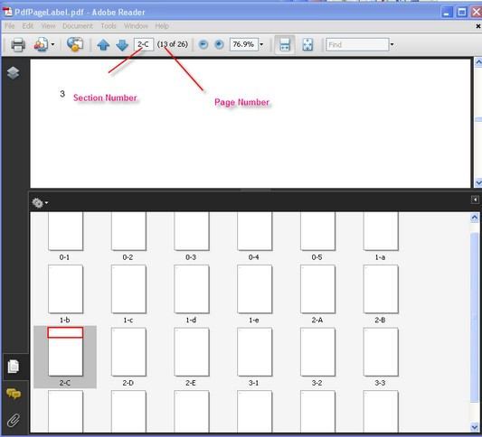

::: {style="DISPLAY: none"}
{#d2h_url_template}{#d2h_package_url style="WIDTH: 0px; DISPLAY: none; HEIGHT: 0px"}
:::

::::: {.d2h_secondary_topic style="PADDING-BOTTOM: 10pt; MARGIN: 0pt; PADDING-LEFT: 0pt; PADDING-RIGHT: 0pt; PADDING-TOP: 0pt"}
#### Dynamic Fields {#dynamic-fields style="tab-stops: 0pt"}

 

Automatic Fields or Dynamic Fields are special objects that display information calculated automatically, just before the document is saved. \\

 

The fields display the following:

 

[·      ]{style="FONT-FAMILY: Symbol"}Page number

[·      ]{style="FONT-FAMILY: Symbol"}Count of pages

[·      ]{style="FONT-FAMILY: Symbol"}Author of the document

[·      ]{style="FONT-FAMILY: Symbol"}Creation and current date

 

It also displays other information of the document, which is not always evaluated at the moment of constructing the document.

 

To display the correct value of the field, you should specify the following important properties.

 

[·      ]{style="FONT-FAMILY: Symbol"}**Font-**Font used to display the value of the field. Exception is thrown if this property is not set.

[·      ]{style="FONT-FAMILY: Symbol"}**Brush**-Brush used to print the value of the field. Exception is thrown if this property is not set.

[·      ]{style="FONT-FAMILY: Symbol"}**Bounds**-Specifies the bounds of the field.

 

You can also use the **Location** and **Size** properties to define the bounds of the field.

 

[·      ]{style="FONT-FAMILY: Symbol"}**Location**-Location of the field. Default point is (0, 0).

[·      ]{style="FONT-FAMILY: Symbol"}**Size**-Size of the field. If it is not set, the size of the field is automatically calculated to display the value.

[]{style="FONT-FAMILY: 'Trebuchet MS','sans-serif'; COLOR: #15428b; FONT-SIZE: 9pt"} 

::: {style="BORDER-BOTTOM: windowtext 1pt solid; BORDER-LEFT: medium none; PADDING-BOTTOM: 1pt; MARGIN-TOP: 9pt; PADDING-LEFT: 0pt; PADDING-RIGHT: 0pt; MARGIN-BOTTOM: 9pt; BORDER-TOP: windowtext 1pt solid; BORDER-RIGHT: medium none; PADDING-TOP: 1pt"}
{border="0"}Note: It is not necessary to set the Bounds and Size with Location at the same time. Size and Bounds.Size have the same values.
:::

 

Numeric fields have an additional **NumberingStyle** property. There are five possible numbering styles supported by the automatic fields:

 

[·      ]{style="FONT-FAMILY: Symbol"}**Arabic (1, 2, 3, 4, \...)**

[·      ]{style="FONT-FAMILY: Symbol"}**Upper Roman (I, II, III, IV, \...)**

[·      ]{style="FONT-FAMILY: Symbol"}**Roman (i, ii, iii, iv, \...)**

[·      ]{style="FONT-FAMILY: Symbol"}**Upper Latin (A, B, C, D, \..., Z, AA, AB, \...)**

[·      ]{style="FONT-FAMILY: Symbol"}**Latin (a, b, c, d, \..., z, aa, ab, \...)**

 

A brief description on various numbering fields is given below:

 

[·      ]{style="FONT-FAMILY: Symbol"}**PdfPageNumberField**-Number of the page on which the field has been drawn

[·      ]{style="FONT-FAMILY: Symbol"}**PdfPageCountField**-Total number of pages in the document

[·      ]{style="FONT-FAMILY: Symbol"}**PdfSectionPageNumberField**-Number of pages within a section

[·      ]{style="FONT-FAMILY: Symbol"}**PdfSectionPageCountField-**Number of sections in a document

[·      ]{style="FONT-FAMILY: Symbol"}**PdfSectionNumberField-**Number of sections within a document

[·      ]{style="FONT-FAMILY: Symbol"}**PdfCreationDateField**-Creating date of the document; the value is taken from the **DocumentInformation.CreationDate** property

[·      ]{style="FONT-FAMILY: Symbol"}**PdfDateTimeField-**Current date and time

[·      ]{style="FONT-FAMILY: Symbol"}**PdfDestinationPageNumberField**-Number of the specified destination page

[·      ]{style="FONT-FAMILY: Symbol"}**PdfCompositeField**-Value of the field is composed of any number of other automatic fields

 

PdfCreationDateField and PdfDateTimeField have the **DateFormatString** property, which defines the formatting string for the value of the field. This property uses the same formatting rules and specifiers as DateTime type of .NET. For detailed information on formatting specifiers, see [[http://msdn2.microsoft.com/en-us/library/73ctwf33(VS.80).aspx]{.UGHyperlink}](http://msdn2.microsoft.com/en-us/library/73ctwf33(VS.80).aspx).

 

You can draw the Automatic Fields on the **PdfTemplate** and set them as the document template or manually draw them on the necessary pages. The values of the fields will be automatically populated on each copy of the template.

 

The following code example illustrates how to insert dynamic fields such as page number, count, datetime, composite fields, and so on, into the existing document.

[]{style="FONT-FAMILY: 'Trebuchet MS','sans-serif'; COLOR: #15428b; FONT-SIZE: 9pt"} 

+-----------------------------------------------------------------------------------------------------------------------------------------------------------------------------------------------------------------------------------------------------------------------------------------------------------------------------------+
| **[\[C#\]]{style="FONT-FAMILY: 'Courier New'; COLOR: black"}**                                                                                                                                                                                                                                                                    |
|                                                                                                                                                                                                                                                                                                                                   |
| []{style="FONT-FAMILY: 'Courier New'; COLOR: teal"}                                                                                                                                                                                                                                                                               |
|                                                                                                                                                                                                                                                                                                                                   |
| [PdfLoadedDocument]{style="FONT-FAMILY: 'Courier New'; COLOR: teal"}[ doc = [new]{style="COLOR: blue"} [PdfLoadedDocument]{style="COLOR: teal"}([@\"../../Sample.pdf\"]{style="COLOR: maroon"});]{style="FONT-FAMILY: 'Courier New'"}                                                                                             |
|                                                                                                                                                                                                                                                                                                                                   |
| [PdfFont]{style="FONT-FAMILY: 'Courier New'; COLOR: teal"}[ font = [new]{style="COLOR: blue"} [PdfStandardFont]{style="COLOR: teal"}([PdfFontFamily]{style="COLOR: teal"}.Helvetica, 12);]{style="FONT-FAMILY: 'Courier New'"}                                                                                                    |
|                                                                                                                                                                                                                                                                                                                                   |
| []{style="FONT-FAMILY: 'Courier New'"}                                                                                                                                                                                                                                                                                            |
|                                                                                                                                                                                                                                                                                                                                   |
| [//Create page number field]{style="FONT-FAMILY: 'Courier New'; COLOR: green"}                                                                                                                                                                                                                                                    |
|                                                                                                                                                                                                                                                                                                                                   |
| [PdfPageNumberField]{style="FONT-FAMILY: 'Courier New'; COLOR: teal"}[ pageNumber = [new]{style="COLOR: blue"} [PdfPageNumberField]{style="COLOR: teal"}(font, [PdfBrushes]{style="COLOR: teal"}.Black);]{style="FONT-FAMILY: 'Courier New'"}                                                                                     |
|                                                                                                                                                                                                                                                                                                                                   |
| []{style="FONT-FAMILY: 'Courier New'"}                                                                                                                                                                                                                                                                                            |
|                                                                                                                                                                                                                                                                                                                                   |
| [//Create page count field]{style="FONT-FAMILY: 'Courier New'; COLOR: green"}                                                                                                                                                                                                                                                     |
|                                                                                                                                                                                                                                                                                                                                   |
| [PdfPageCountField]{style="FONT-FAMILY: 'Courier New'; COLOR: teal"}[ count = [new]{style="COLOR: blue"} [PdfPageCountField]{style="COLOR: teal"}(font, [PdfBrushes]{style="COLOR: teal"}.Black);]{style="FONT-FAMILY: 'Courier New'"}                                                                                            |
|                                                                                                                                                                                                                                                                                                                                   |
| [PdfDateTimeField]{style="FONT-FAMILY: 'Courier New'; COLOR: teal"}[ datetimefield = [new]{style="COLOR: blue"} [PdfDateTimeField]{style="COLOR: teal"}(font, [PdfBrushes]{style="COLOR: teal"}.Black);]{style="FONT-FAMILY: 'Courier New'"}                                                                                      |
|                                                                                                                                                                                                                                                                                                                                   |
| [PdfCompositeField]{style="FONT-FAMILY: 'Courier New'; COLOR: teal"}[ compositeField = [new]{style="COLOR: blue"} [PdfCompositeField]{style="COLOR: teal"}(font, [PdfBrushes]{style="COLOR: teal"}.Black, [\"Page {0} of {1}{2}\"]{style="COLOR: maroon"}, pageNumber, count,datetimefield);]{style="FONT-FAMILY: 'Courier New'"} |
|                                                                                                                                                                                                                                                                                                                                   |
| [compositeField.Bounds = [new]{style="COLOR: blue"} [RectangleF]{style="COLOR: teal"}(0,0,250,100);]{style="FONT-FAMILY: 'Courier New'"}                                                                                                                                                                                          |
|                                                                                                                                                                                                                                                                                                                                   |
| [compositeField.Draw(doc.Pages\[0\].Graphics, [new]{style="COLOR: blue"} [PointF]{style="COLOR: teal"}(0, 0));]{style="FONT-FAMILY: 'Courier New'"}                                                                                                                                                                               |
|                                                                                                                                                                                                                                                                                                                                   |
| []{style="FONT-FAMILY: 'Courier New'"}                                                                                                                                                                                                                                                                                            |
|                                                                                                                                                                                                                                                                                                                                   |
| [PdfCreationDateField]{style="FONT-FAMILY: 'Courier New'; COLOR: teal"}[ datefield = [new]{style="COLOR: blue"} [PdfCreationDateField]{style="COLOR: teal"}(font, [PdfBrushes]{style="COLOR: teal"}.Black);]{style="FONT-FAMILY: 'Courier New'"}                                                                                  |
+-----------------------------------------------------------------------------------------------------------------------------------------------------------------------------------------------------------------------------------------------------------------------------------------------------------------------------------+

[]{style="FONT-FAMILY: 'Trebuchet MS','sans-serif'; COLOR: #15428b; FONT-SIZE: 9pt"} 

+-----------------------------------------------------------------------------------------------------------------------------------------------------------------------------------------------------------------------------------------------------------------------------------------------+
| **[\[VB.NET\]]{style="FONT-FAMILY: 'Courier New'; COLOR: black"}**                                                                                                                                                                                                                            |
|                                                                                                                                                                                                                                                                                               |
| []{style="FONT-FAMILY: 'Courier New'; COLOR: black"}                                                                                                                                                                                                                                          |
|                                                                                                                                                                                                                                                                                               |
| [Dim]{style="FONT-FAMILY: 'Courier New'; COLOR: blue"}[ doc [As]{style="COLOR: blue"} [New]{style="COLOR: blue"} PdfLoadedDocument([\"../../Sample.pdf\"]{style="COLOR: maroon"})]{style="FONT-FAMILY: 'Courier New'"}                                                                        |
|                                                                                                                                                                                                                                                                                               |
| [Dim]{style="FONT-FAMILY: 'Courier New'; COLOR: blue"}[ font [As]{style="COLOR: blue"} PdfFont = [New]{style="COLOR: blue"} PdfStandardFont(PdfFontFamily.Helvetica, 12)]{style="FONT-FAMILY: 'Courier New'"}                                                                                 |
|                                                                                                                                                                                                                                                                                               |
| []{style="FONT-FAMILY: 'Courier New'"}                                                                                                                                                                                                                                                        |
|                                                                                                                                                                                                                                                                                               |
| [\'Create page number field]{style="FONT-FAMILY: 'Courier New'; COLOR: green"}                                                                                                                                                                                                                |
|                                                                                                                                                                                                                                                                                               |
| [Dim]{style="FONT-FAMILY: 'Courier New'; COLOR: blue"}[ pageNumber [As]{style="COLOR: blue"} [New]{style="COLOR: blue"} PdfPageNumberField(font, PdfBrushes.Black)]{style="FONT-FAMILY: 'Courier New'"}                                                                                       |
|                                                                                                                                                                                                                                                                                               |
| []{style="FONT-FAMILY: 'Courier New'"}                                                                                                                                                                                                                                                        |
|                                                                                                                                                                                                                                                                                               |
| [\'Create page count field]{style="FONT-FAMILY: 'Courier New'; COLOR: green"}                                                                                                                                                                                                                 |
|                                                                                                                                                                                                                                                                                               |
| [Dim]{style="FONT-FAMILY: 'Courier New'; COLOR: blue"}[ count [As]{style="COLOR: blue"} [New]{style="COLOR: blue"} PdfPageCountField(font, PdfBrushes.Black)]{style="FONT-FAMILY: 'Courier New'"}                                                                                             |
|                                                                                                                                                                                                                                                                                               |
| [Dim]{style="FONT-FAMILY: 'Courier New'; COLOR: blue"}[ datetimefield [As]{style="COLOR: blue"} [New]{style="COLOR: blue"} PdfDateTimeField(font, PdfBrushes.Black)]{style="FONT-FAMILY: 'Courier New'"}                                                                                      |
|                                                                                                                                                                                                                                                                                               |
| [Dim]{style="FONT-FAMILY: 'Courier New'; COLOR: blue"}[ compositeField [As]{style="COLOR: blue"} [New]{style="COLOR: blue"} PdfCompositeField(font, PdfBrushes.Black, [\"Page {0} of {1}{2}\"]{style="COLOR: maroon"}, pageNumber, count, datetimefield)]{style="FONT-FAMILY: 'Courier New'"} |
|                                                                                                                                                                                                                                                                                               |
| [compositeField.Bounds = [New]{style="COLOR: blue"} RectangleF(0, 0, 250, 100)]{style="FONT-FAMILY: 'Courier New'"}                                                                                                                                                                           |
|                                                                                                                                                                                                                                                                                               |
| [compositeField.Draw(doc.Pages(0).Graphics, [New]{style="COLOR: blue"} PointF(0, 0))]{style="FONT-FAMILY: 'Courier New'"}                                                                                                                                                                     |
|                                                                                                                                                                                                                                                                                               |
| []{style="FONT-FAMILY: 'Courier New'"}                                                                                                                                                                                                                                                        |
|                                                                                                                                                                                                                                                                                               |
| [Dim]{style="FONT-FAMILY: 'Courier New'; COLOR: blue"}[ datefield [As]{style="COLOR: blue"} [New]{style="COLOR: blue"} PdfCreationDateField(font, PdfBrushes.Black)]{style="FONT-FAMILY: 'Courier New'"}                                                                                      |
+-----------------------------------------------------------------------------------------------------------------------------------------------------------------------------------------------------------------------------------------------------------------------------------------------+

 

When an automatic field is used as a component of the composite field, it is not necessary to specify its Font, Brush and Bounds properties. Just call its constructor without parameters.

 

::: {style="BORDER-BOTTOM: windowtext 1pt solid; BORDER-LEFT: medium none; PADDING-BOTTOM: 1pt; MARGIN-TOP: 9pt; PADDING-LEFT: 0pt; PADDING-RIGHT: 0pt; MARGIN-BOTTOM: 9pt; BORDER-TOP: windowtext 1pt solid; BORDER-RIGHT: medium none; PADDING-TOP: 1pt"}
{border="0"}Note: You must specify the preceding properties for the composite field.
:::

 

The following code example illustrates how to use automatic fields in templates.

 

+---------------------------------------------------------------------------------------------------------------------------------------------------------------------------------------------------------------------------------------+
| **[\[C#\]]{style="FONT-FAMILY: 'Courier New'; COLOR: black"}**                                                                                                                                                                        |
|                                                                                                                                                                                                                                       |
| []{style="FONT-FAMILY: 'Courier New'"}                                                                                                                                                                                                |
|                                                                                                                                                                                                                                       |
| [PdfLoadedDocument]{style="FONT-FAMILY: 'Courier New'; COLOR: teal"}[ doc = [new]{style="COLOR: blue"} [PdfLoadedDocument]{style="COLOR: teal"}([@\"../../Sample.pdf\"]{style="COLOR: maroon"});]{style="FONT-FAMILY: 'Courier New'"} |
|                                                                                                                                                                                                                                       |
| []{style="FONT-FAMILY: 'Courier New'"}                                                                                                                                                                                                |
|                                                                                                                                                                                                                                       |
| [PdfFont]{style="FONT-FAMILY: 'Courier New'; COLOR: teal"}[ font = [new]{style="COLOR: blue"} [PdfStandardFont]{style="COLOR: teal"}([PdfFontFamily]{style="COLOR: teal"}.Helvetica, 12f);]{style="FONT-FAMILY: 'Courier New'"}       |
|                                                                                                                                                                                                                                       |
| [PdfBrush]{style="FONT-FAMILY: 'Courier New'; COLOR: teal"}[ brush = [PdfBrushes]{style="COLOR: teal"}.Black;]{style="FONT-FAMILY: 'Courier New'"}                                                                                    |
|                                                                                                                                                                                                                                       |
| []{style="FONT-FAMILY: 'Courier New'"}                                                                                                                                                                                                |
|                                                                                                                                                                                                                                       |
| [PdfTemplate]{style="FONT-FAMILY: 'Courier New'; COLOR: teal"}[ template = [new]{style="COLOR: blue"} [PdfTemplate]{style="COLOR: teal"}(15, 15);]{style="FONT-FAMILY: 'Courier New'"}                                                |
|                                                                                                                                                                                                                                       |
| []{style="FONT-FAMILY: 'Courier New'"}                                                                                                                                                                                                |
|                                                                                                                                                                                                                                       |
| [PdfDateTimeField]{style="FONT-FAMILY: 'Courier New'; COLOR: teal"}[ dateField = [new]{style="COLOR: blue"} [PdfDateTimeField]{style="COLOR: teal"}(font, brush);]{style="FONT-FAMILY: 'Courier New'"}                                |
|                                                                                                                                                                                                                                       |
| [dateField.DateFormatString = [\"dd\'/\'MMMM\'/\'yyyy\"]{style="COLOR: maroon"};]{style="FONT-FAMILY: 'Courier New'"}                                                                                                                 |
|                                                                                                                                                                                                                                       |
| []{style="FONT-FAMILY: 'Courier New'"}                                                                                                                                                                                                |
|                                                                                                                                                                                                                                       |
| [dateField.Draw(template.Graphics);]{style="FONT-FAMILY: 'Courier New'"}                                                                                                                                                              |
|                                                                                                                                                                                                                                       |
| []{style="FONT-FAMILY: 'Courier New'"}                                                                                                                                                                                                |
|                                                                                                                                                                                                                                       |
| [for]{style="FONT-FAMILY: 'Courier New'; COLOR: blue"}[ ([int]{style="COLOR: blue"} i = 0; i \< 50; i++)]{style="FONT-FAMILY: 'Courier New'"}                                                                                         |
|                                                                                                                                                                                                                                       |
| [{]{style="FONT-FAMILY: 'Courier New'"}                                                                                                                                                                                               |
|                                                                                                                                                                                                                                       |
| [PdfPage]{style="FONT-FAMILY: 'Courier New'; COLOR: teal"}[ page = document.Pages.Add();]{style="FONT-FAMILY: 'Courier New'"}                                                                                                         |
|                                                                                                                                                                                                                                       |
| [page.Graphics.DrawPdfTemplate(template, [new]{style="COLOR: blue"} [Point]{style="COLOR: teal"}(50, 50));]{style="FONT-FAMILY: 'Courier New'"}                                                                                       |
|                                                                                                                                                                                                                                       |
| [}]{style="FONT-FAMILY: 'Courier New'"}                                                                                                                                                                                               |
+---------------------------------------------------------------------------------------------------------------------------------------------------------------------------------------------------------------------------------------+

[]{style="FONT-FAMILY: 'Trebuchet MS','sans-serif'; COLOR: #15428b; FONT-SIZE: 9pt"} 

+------------------------------------------------------------------------------------------------------------------------------------------------------------------------------------------------------------------+
| **[\[VB.NET\]]{style="FONT-FAMILY: 'Courier New'; COLOR: black"}**                                                                                                                                               |
|                                                                                                                                                                                                                  |
| []{style="FONT-FAMILY: 'Courier New'; COLOR: black"}                                                                                                                                                             |
|                                                                                                                                                                                                                  |
| [Dim]{style="FONT-FAMILY: 'Courier New'; COLOR: blue"}[ doc [As]{style="COLOR: blue"} PdfLoadedDocument = [New]{style="COLOR: blue"} PdfLoadedDocument()]{style="FONT-FAMILY: 'Courier New'"}                    |
|                                                                                                                                                                                                                  |
| []{style="FONT-FAMILY: 'Courier New'"}                                                                                                                                                                           |
|                                                                                                                                                                                                                  |
| [Dim]{style="FONT-FAMILY: 'Courier New'; COLOR: blue"}[ font [As]{style="COLOR: blue"} PdfFont = [New]{style="COLOR: blue"} PdfStandardFont(PdfFontFamily.Helvetica, 12.0F)]{style="FONT-FAMILY: 'Courier New'"} |
|                                                                                                                                                                                                                  |
| [Dim]{style="FONT-FAMILY: 'Courier New'; COLOR: blue"}[ brush [As]{style="COLOR: blue"} PdfBrush = PdfBrushes.Black]{style="FONT-FAMILY: 'Courier New'"}                                                         |
|                                                                                                                                                                                                                  |
| []{style="FONT-FAMILY: 'Courier New'"}                                                                                                                                                                           |
|                                                                                                                                                                                                                  |
| [Dim]{style="FONT-FAMILY: 'Courier New'; COLOR: blue"}[ template [As]{style="COLOR: blue"} PdfTemplate = [New]{style="COLOR: blue"} PdfTemplate(15, 15)]{style="FONT-FAMILY: 'Courier New'"}                     |
|                                                                                                                                                                                                                  |
| []{style="FONT-FAMILY: 'Courier New'"}                                                                                                                                                                           |
|                                                                                                                                                                                                                  |
| [Dim]{style="FONT-FAMILY: 'Courier New'; COLOR: blue"}[ dateField [As]{style="COLOR: blue"} PdfDateTimeField = [New]{style="COLOR: blue"} PdfDateTimeField(font, brush)]{style="FONT-FAMILY: 'Courier New'"}     |
|                                                                                                                                                                                                                  |
| [Dim]{style="FONT-FAMILY: 'Courier New'; COLOR: blue"}[ dateField.DateFormatString = [\"dd\'/\'MMMM\'/\'yyyy\"]{style="COLOR: maroon"}]{style="FONT-FAMILY: 'Courier New'"}                                      |
|                                                                                                                                                                                                                  |
| []{style="FONT-FAMILY: 'Courier New'; COLOR: maroon"}                                                                                                                                                            |
|                                                                                                                                                                                                                  |
| [dateField.Draw(template.Graphics)]{style="FONT-FAMILY: 'Courier New'"}                                                                                                                                          |
|                                                                                                                                                                                                                  |
| []{style="FONT-FAMILY: 'Courier New'"}                                                                                                                                                                           |
|                                                                                                                                                                                                                  |
| [For]{style="FONT-FAMILY: 'Courier New'; COLOR: blue"}[ i [As]{style="COLOR: blue"} [Integer]{style="COLOR: blue"} = 0 [To]{style="COLOR: blue"} 49]{style="FONT-FAMILY: 'Courier New'"}                         |
|                                                                                                                                                                                                                  |
| [Dim]{style="FONT-FAMILY: 'Courier New'; COLOR: blue"}[ page [As]{style="COLOR: blue"} PdfPage = document.Pages.Add()]{style="FONT-FAMILY: 'Courier New'"}                                                       |
|                                                                                                                                                                                                                  |
| [page.Graphics.DrawPdfTemplate(template, [New]{style="COLOR: blue"} Point(50, 50))]{style="FONT-FAMILY: 'Courier New'"}                                                                                          |
|                                                                                                                                                                                                                  |
| [Next]{style="FONT-FAMILY: 'Courier New'; COLOR: blue"}[ i]{style="FONT-FAMILY: 'Courier New'"}                                                                                                                  |
+------------------------------------------------------------------------------------------------------------------------------------------------------------------------------------------------------------------+

 

PDF Page Label

 

A PdfPageLabel object specifies a new numbering range to be applied to the document sections. The following code example illustrates how to set the numbering range to the PDF document sections.

[]{style="FONT-FAMILY: 'Trebuchet MS','sans-serif'; COLOR: #15428b; FONT-SIZE: 9pt"} 

+--------------------------------------------------------------------------------------------------------------------------------------------------------------------+
| **[\[C#\]]{style="FONT-FAMILY: 'Courier New'; COLOR: black"}**                                                                                                     |
|                                                                                                                                                                    |
| []{style="FONT-FAMILY: 'Courier New'; COLOR: teal"}                                                                                                                |
|                                                                                                                                                                    |
| [for]{style="FONT-FAMILY: 'Courier New'; COLOR: blue"}[ ([int]{style="COLOR: blue"} k = 0,i1=0; k \< ldoc.Section.Count; k++)]{style="FONT-FAMILY: 'Courier New'"} |
|                                                                                                                                                                    |
| [{]{style="FONT-FAMILY: 'Courier New'"}                                                                                                                            |
|                                                                                                                                                                    |
| [        [PdfPageLabel]{style="COLOR: teal"} label = [new]{style="COLOR: blue"} [PdfPageLabel]{style="COLOR: teal"}();]{style="FONT-FAMILY: 'Courier New'"}        |
|                                                                                                                                                                    |
| [        label.StartNumber = 1;]{style="FONT-FAMILY: 'Courier New'"}                                                                                               |
|                                                                                                                                                                    |
| [        [if]{style="COLOR: blue"} (k == 0)]{style="FONT-FAMILY: 'Courier New'"}                                                                                   |
|                                                                                                                                                                    |
| [        {]{style="FONT-FAMILY: 'Courier New'"}                                                                                                                    |
|                                                                                                                                                                    |
| [            label.NumberStyle = [PdfNumberStyle]{style="COLOR: teal"}.Numeric;]{style="FONT-FAMILY: 'Courier New'"}                                               |
|                                                                                                                                                                    |
| [        }]{style="FONT-FAMILY: 'Courier New'"}                                                                                                                    |
|                                                                                                                                                                    |
| [        [else]{style="COLOR: blue"} [if]{style="COLOR: blue"} (k == 1)]{style="FONT-FAMILY: 'Courier New'"}                                                       |
|                                                                                                                                                                    |
| [        {]{style="FONT-FAMILY: 'Courier New'"}                                                                                                                    |
|                                                                                                                                                                    |
| [            label.NumberStyle = [PdfNumberStyle]{style="COLOR: teal"}.LowerLatin;]{style="FONT-FAMILY: 'Courier New'"}                                            |
|                                                                                                                                                                    |
| [        }]{style="FONT-FAMILY: 'Courier New'"}                                                                                                                    |
|                                                                                                                                                                    |
| [            [else]{style="COLOR: blue"} [if]{style="COLOR: blue"} (k == 2)]{style="FONT-FAMILY: 'Courier New'"}                                                   |
|                                                                                                                                                                    |
| [        {]{style="FONT-FAMILY: 'Courier New'"}                                                                                                                    |
|                                                                                                                                                                    |
| [           label.NumberStyle = [PdfNumberStyle]{style="COLOR: teal"}.UpperLatin;]{style="FONT-FAMILY: 'Courier New'"}                                             |
|                                                                                                                                                                    |
| [        }]{style="FONT-FAMILY: 'Courier New'"}                                                                                                                    |
|                                                                                                                                                                    |
| [                      ]{style="FONT-FAMILY: 'Courier New'"}                                                                                                       |
|                                                                                                                                                                    |
| [           label.Prefix = i1 + [\"-\"]{style="COLOR: maroon"};]{style="FONT-FAMILY: 'Courier New'"}                                                               |
|                                                                                                                                                                    |
| [           ldoc.LoadedPageLabel = label;]{style="FONT-FAMILY: 'Courier New'"}                                                                                     |
|                                                                                                                                                                    |
| [           i1++;]{style="FONT-FAMILY: 'Courier New'"}                                                                                                             |
|                                                                                                                                                                    |
| [}        ]{style="FONT-FAMILY: 'Courier New'"}                                                                                                                    |
+--------------------------------------------------------------------------------------------------------------------------------------------------------------------+

[]{style="FONT-FAMILY: 'Trebuchet MS','sans-serif'; COLOR: #15428b; FONT-SIZE: 9pt"} 

+------------------------------------------------------------------------------------------------------------------------------------------------------------------------------------------------------------------------------+
| **[\[VB.NET\]]{style="FONT-FAMILY: 'Courier New'; COLOR: black"}**                                                                                                                                                           |
|                                                                                                                                                                                                                              |
| []{style="FONT-FAMILY: 'Courier New'; COLOR: black"}                                                                                                                                                                         |
|                                                                                                                                                                                                                              |
| [Dim]{style="FONT-FAMILY: 'Courier New'; COLOR: blue"}[ k [As]{style="COLOR: blue"} [Integer]{style="COLOR: blue"} = 0, i1 [As]{style="COLOR: blue"} [Integer]{style="COLOR: blue"} = 0]{style="FONT-FAMILY: 'Courier New'"} |
|                                                                                                                                                                                                                              |
| [While]{style="FONT-FAMILY: 'Courier New'; COLOR: blue"}[ k \< ldoc.Section.Count]{style="FONT-FAMILY: 'Courier New'"}                                                                                                       |
|                                                                                                                                                                                                                              |
| [Dim]{style="FONT-FAMILY: 'Courier New'; COLOR: blue"}[ label [As]{style="COLOR: blue"} [New]{style="COLOR: blue"} PdfPageLabel()]{style="FONT-FAMILY: 'Courier New'"}                                                       |
|                                                                                                                                                                                                                              |
| [    label.StartNumber = 1]{style="FONT-FAMILY: 'Courier New'"}                                                                                                                                                              |
|                                                                                                                                                                                                                              |
| [    [If]{style="COLOR: blue"} k = 0 [Then]{style="COLOR: blue"}]{style="FONT-FAMILY: 'Courier New'"}                                                                                                                        |
|                                                                                                                                                                                                                              |
| [        label.NumberStyle = PdfNumberStyle.Numeric]{style="FONT-FAMILY: 'Courier New'"}                                                                                                                                     |
|                                                                                                                                                                                                                              |
| [    [ElseIf]{style="COLOR: blue"} k = 1 [Then]{style="COLOR: blue"}]{style="FONT-FAMILY: 'Courier New'"}                                                                                                                    |
|                                                                                                                                                                                                                              |
| [        label.NumberStyle = PdfNumberStyle.LowerLatin]{style="FONT-FAMILY: 'Courier New'"}                                                                                                                                  |
|                                                                                                                                                                                                                              |
| [    [ElseIf]{style="COLOR: blue"} k = 2 [Then]{style="COLOR: blue"}]{style="FONT-FAMILY: 'Courier New'"}                                                                                                                    |
|                                                                                                                                                                                                                              |
| [        label.NumberStyle = PdfNumberStyle.UpperLatin]{style="FONT-FAMILY: 'Courier New'"}                                                                                                                                  |
|                                                                                                                                                                                                                              |
| [    [End]{style="COLOR: blue"} [If]{style="COLOR: blue"}]{style="FONT-FAMILY: 'Courier New'"}                                                                                                                               |
|                                                                                                                                                                                                                              |
| []{style="FONT-FAMILY: 'Courier New'; COLOR: blue"}                                                                                                                                                                          |
|                                                                                                                                                                                                                              |
| [    label.Prefix = i1 & [\"-\"]{style="COLOR: maroon"}]{style="FONT-FAMILY: 'Courier New'"}                                                                                                                                 |
|                                                                                                                                                                                                                              |
| [    ldoc.LoadedPageLabel = label]{style="FONT-FAMILY: 'Courier New'"}                                                                                                                                                       |
|                                                                                                                                                                                                                              |
| [    i1 += 1]{style="FONT-FAMILY: 'Courier New'"}                                                                                                                                                                            |
|                                                                                                                                                                                                                              |
| [    k += 1]{style="FONT-FAMILY: 'Courier New'"}                                                                                                                                                                             |
|                                                                                                                                                                                                                              |
| [End]{style="FONT-FAMILY: 'Courier New'; COLOR: blue"}[ [While]{style="COLOR: blue"}]{style="FONT-FAMILY: 'Courier New'"}                                                                                                    |
+------------------------------------------------------------------------------------------------------------------------------------------------------------------------------------------------------------------------------+

[]{style="FONT-FAMILY: 'Trebuchet MS','sans-serif'; COLOR: #15428b; FONT-SIZE: 9pt"} 

[]{style="FONT-FAMILY: 'Trebuchet MS','sans-serif'; COLOR: #15428b; FONT-SIZE: 9pt"} 

{border="0"}

Figure 58: Setting the numbering Range for PDF document

 

 

 

[]{#related-topics}
:::::
