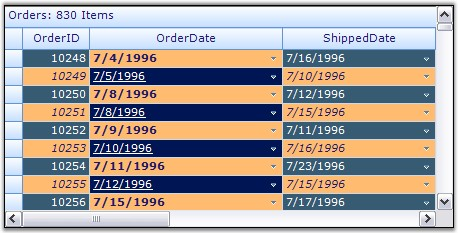

::: {style="DISPLAY: none"}
{#d2h_url_template}{#d2h_package_url style="WIDTH: 0px; DISPLAY: none; HEIGHT: 0px"}
:::

:::: {.d2h_secondary_topic style="PADDING-BOTTOM: 10pt; MARGIN: 0pt; PADDING-LEFT: 0pt; PADDING-RIGHT: 0pt; PADDING-TOP: 0pt"}
##### Dynamic Formatting {#dynamic-formatting style="tab-stops: 0pt"}

[]{style="FONT-FAMILY: 'Trebuchet MS','sans-serif'; COLOR: #15428b; FONT-SIZE: 9pt"} 

Style Settings can be applied to different grid elements dynamically at run time. This can be achieved by proper handling of the **QueryCellStyleInfo** event. It provides the GridStyleInfo object for a cell on demand.

 

**QueryCellStyleInfo** is raised every time a request is made to access the style information for a cell. You can do any type of formatting cells with this event. It accepts **GridTableCellStyleInfoEventArgs** as one of its parameters which can be used to customize the cells of the grouping grid control. For instance, you can apply style settings for a given CellType by using the **TableCellIdentity.TableCellType** property on the instances of GridTableCellStyleInfoEventArgs. style for a given cell.

 

Here is an example code that applies different styles to different cells in the grouping grid.

[]{style="FONT-FAMILY: 'Trebuchet MS','sans-serif'; FONT-SIZE: 9pt"} 

+----------------------------------------------------------------------------------------------------------------------------------------------------------------------------------------------------------------------------------------------------------------------------+
| **[\[C#\]]{style="FONT-FAMILY: 'Courier New'; COLOR: black"}**                                                                                                                                                                                                             |
|                                                                                                                                                                                                                                                                            |
| []{style="FONT-FAMILY: 'Courier New'; COLOR: black"}                                                                                                                                                                                                                       |
|                                                                                                                                                                                                                                                                            |
| [// Hook up the event.]{style="FONT-FAMILY: 'Courier New'; COLOR: green"}                                                                                                                                                                                                  |
|                                                                                                                                                                                                                                                                            |
| [this]{style="FONT-FAMILY: 'Courier New'; COLOR: blue"}[.gridGroupingControl1.QueryCellStyleInfo += [new]{style="COLOR: blue"} [GridTableCellStyleInfoEventHandler]{style="COLOR: #2b91af"}(gridGroupingControl1_QueryCellStyleInfo);]{style="FONT-FAMILY: 'Courier New'"} |
|                                                                                                                                                                                                                                                                            |
| []{style="FONT-FAMILY: 'Courier New'"}                                                                                                                                                                                                                                     |
|                                                                                                                                                                                                                                                                            |
| [// QueryCellStyleInfo event : To Format Cell by Cell Basis on demand.]{style="FONT-FAMILY: 'Courier New'; COLOR: green"}                                                                                                                                                  |
|                                                                                                                                                                                                                                                                            |
| [private]{style="FONT-FAMILY: 'Courier New'; COLOR: blue"}[ [void]{style="COLOR: blue"} gridGroupingControl1_QueryCellStyleInfo([object]{style="COLOR: blue"} sender, [GridTableCellStyleInfoEventArgs]{style="COLOR: #2b91af"} e)]{style="FONT-FAMILY: 'Courier New'"}    |
|                                                                                                                                                                                                                                                                            |
| [{]{style="FONT-FAMILY: 'Courier New'"}                                                                                                                                                                                                                                    |
|                                                                                                                                                                                                                                                                            |
| [    [if]{style="COLOR: blue"}(e.TableCellIdentity.TableCellType == [GridTableCellType]{style="COLOR: #2b91af"}.RecordFieldCell)]{style="FONT-FAMILY: 'Courier New'"}                                                                                                      |
|                                                                                                                                                                                                                                                                            |
| [    {]{style="FONT-FAMILY: 'Courier New'"}                                                                                                                                                                                                                                |
|                                                                                                                                                                                                                                                                            |
| [        [if]{style="COLOR: blue"}(e.TableCellIdentity.ColIndex %2 == 0)]{style="FONT-FAMILY: 'Courier New'"}                                                                                                                                                              |
|                                                                                                                                                                                                                                                                            |
| [        {]{style="FONT-FAMILY: 'Courier New'"}                                                                                                                                                                                                                            |
|                                                                                                                                                                                                                                                                            |
| [            e.Style.BackColor = [Color]{style="COLOR: #2b91af"}.FromArgb(255, 187, 111);]{style="FONT-FAMILY: 'Courier New'"}                                                                                                                                             |
|                                                                                                                                                                                                                                                                            |
| [            e.Style.Font.FontStyle = [FontStyle]{style="COLOR: #2b91af"}.Bold;]{style="FONT-FAMILY: 'Courier New'"}                                                                                                                                                       |
|                                                                                                                                                                                                                                                                            |
| [        }]{style="FONT-FAMILY: 'Courier New'"}                                                                                                                                                                                                                            |
|                                                                                                                                                                                                                                                                            |
| [        [else]{style="COLOR: blue"}]{style="FONT-FAMILY: 'Courier New'"}                                                                                                                                                                                                  |
|                                                                                                                                                                                                                                                                            |
| [        {]{style="FONT-FAMILY: 'Courier New'"}                                                                                                                                                                                                                            |
|                                                                                                                                                                                                                                                                            |
| [            e.Style.TextColor = [Color]{style="COLOR: #2b91af"}.White;]{style="FONT-FAMILY: 'Courier New'"}                                                                                                                                                               |
|                                                                                                                                                                                                                                                                            |
| [            e.Style.BackColor = [Color]{style="COLOR: #2b91af"}.FromArgb(55, 91, 114);]{style="FONT-FAMILY: 'Courier New'"}                                                                                                                                               |
|                                                                                                                                                                                                                                                                            |
| [        }]{style="FONT-FAMILY: 'Courier New'"}                                                                                                                                                                                                                            |
|                                                                                                                                                                                                                                                                            |
| [    }]{style="FONT-FAMILY: 'Courier New'"}                                                                                                                                                                                                                                |
|                                                                                                                                                                                                                                                                            |
| [    [else]{style="COLOR: blue"} [if]{style="COLOR: blue"}( e.TableCellIdentity.TableCellType == [GridTableCellType]{style="COLOR: #2b91af"}.AlternateRecordFieldCell)]{style="FONT-FAMILY: 'Courier New'"}                                                                |
|                                                                                                                                                                                                                                                                            |
| [    {]{style="FONT-FAMILY: 'Courier New'"}                                                                                                                                                                                                                                |
|                                                                                                                                                                                                                                                                            |
| [        [if]{style="COLOR: blue"}(e.TableCellIdentity.ColIndex%2==0)]{style="FONT-FAMILY: 'Courier New'"}                                                                                                                                                                 |
|                                                                                                                                                                                                                                                                            |
| [        {]{style="FONT-FAMILY: 'Courier New'"}                                                                                                                                                                                                                            |
|                                                                                                                                                                                                                                                                            |
| [            e.Style.Font.FontStyle = [FontStyle]{style="COLOR: #2b91af"}.Underline;]{style="FONT-FAMILY: 'Courier New'"}                                                                                                                                                  |
|                                                                                                                                                                                                                                                                            |
| [            e.Style.BackColor = [Color]{style="COLOR: #2b91af"}.FromArgb(0, 21, 84);]{style="FONT-FAMILY: 'Courier New'"}                                                                                                                                                 |
|                                                                                                                                                                                                                                                                            |
| [            e.Style.TextColor = [Color]{style="COLOR: #2b91af"}.White;]{style="FONT-FAMILY: 'Courier New'"}                                                                                                                                                               |
|                                                                                                                                                                                                                                                                            |
| [        }]{style="FONT-FAMILY: 'Courier New'"}                                                                                                                                                                                                                            |
|                                                                                                                                                                                                                                                                            |
| [        [else]{style="COLOR: blue"}]{style="FONT-FAMILY: 'Courier New'"}                                                                                                                                                                                                  |
|                                                                                                                                                                                                                                                                            |
| [        {]{style="FONT-FAMILY: 'Courier New'"}                                                                                                                                                                                                                            |
|                                                                                                                                                                                                                                                                            |
| [            e.Style.BackColor = [Color]{style="COLOR: #2b91af"}.FromArgb(255, 188, 112);]{style="FONT-FAMILY: 'Courier New'"}                                                                                                                                             |
|                                                                                                                                                                                                                                                                            |
| [            e.Style.Font.FontStyle = [FontStyle]{style="COLOR: #2b91af"}.Italic;]{style="FONT-FAMILY: 'Courier New'"}                                                                                                                                                     |
|                                                                                                                                                                                                                                                                            |
| [        }]{style="FONT-FAMILY: 'Courier New'"}                                                                                                                                                                                                                            |
|                                                                                                                                                                                                                                                                            |
| [    }]{style="FONT-FAMILY: 'Courier New'"}                                                                                                                                                                                                                                |
|                                                                                                                                                                                                                                                                            |
| [}]{style="FONT-FAMILY: 'Courier New'"}                                                                                                                                                                                                                                    |
+----------------------------------------------------------------------------------------------------------------------------------------------------------------------------------------------------------------------------------------------------------------------------+

[]{style="FONT-FAMILY: 'Trebuchet MS','sans-serif'; COLOR: #15428b; FONT-SIZE: 9pt"} 

+------------------------------------------------------------------------------------------------------------------------------------------------------------------------------------------------------------------------------------------------------------------------------------------------------------------------------------------------------------+
| **[\[VB.NET\]]{style="FONT-FAMILY: 'Courier New'; COLOR: black"}**                                                                                                                                                                                                                                                                                         |
|                                                                                                                                                                                                                                                                                                                                                            |
| []{style="FONT-FAMILY: 'Courier New'; COLOR: black"}                                                                                                                                                                                                                                                                                                       |
|                                                                                                                                                                                                                                                                                                                                                            |
| [\' Hook up the event.]{style="FONT-FAMILY: 'Courier New'; COLOR: green"}                                                                                                                                                                                                                                                                                  |
|                                                                                                                                                                                                                                                                                                                                                            |
| [AddHandler]{style="FONT-FAMILY: 'Courier New'; COLOR: blue"}[ gridGroupingControl1.QueryCellStyleInfo, [AddressOf]{style="COLOR: blue"} gridGroupingControl1_QueryCellStyleInfo]{style="FONT-FAMILY: 'Courier New'"}                                                                                                                                      |
|                                                                                                                                                                                                                                                                                                                                                            |
| []{style="FONT-FAMILY: 'Courier New'"}                                                                                                                                                                                                                                                                                                                     |
|                                                                                                                                                                                                                                                                                                                                                            |
| [\' QueryCellStyleInfo event : To Format Cell by Cell Basis on demand. ]{style="FONT-FAMILY: 'Courier New'; COLOR: green"}                                                                                                                                                                                                                                 |
|                                                                                                                                                                                                                                                                                                                                                            |
| [Private]{style="FONT-FAMILY: 'Courier New'; COLOR: blue"}[ [Sub]{style="COLOR: blue"} gridGroupingControl1_QueryCellStyleInfo([ByVal]{style="COLOR: blue"} sender [As]{style="COLOR: blue"} [Object]{style="COLOR: blue"}, [ByVal]{style="COLOR: blue"} e [As]{style="COLOR: blue"} GridTableCellStyleInfoEventArgs)]{style="FONT-FAMILY: 'Courier New'"} |
|                                                                                                                                                                                                                                                                                                                                                            |
| [If]{style="FONT-FAMILY: 'Courier New'; COLOR: blue"}[ e.TableCellIdentity.TableCellType = GridTableCellType.RecordFieldCell [Then]{style="COLOR: blue"}]{style="FONT-FAMILY: 'Courier New'"}                                                                                                                                                              |
|                                                                                                                                                                                                                                                                                                                                                            |
| [If]{style="FONT-FAMILY: 'Courier New'; COLOR: blue"}[ e.TableCellIdentity.ColIndex [Mod]{style="COLOR: blue"} 2 = 0 [Then]{style="COLOR: blue"}]{style="FONT-FAMILY: 'Courier New'"}                                                                                                                                                                      |
|                                                                                                                                                                                                                                                                                                                                                            |
| [e.Style.BackColor = Color.FromArgb(255, 187, 111)]{style="FONT-FAMILY: 'Courier New'"}                                                                                                                                                                                                                                                                    |
|                                                                                                                                                                                                                                                                                                                                                            |
| [e.Style.Font.FontStyle = FontStyle.Bold]{style="FONT-FAMILY: 'Courier New'"}                                                                                                                                                                                                                                                                              |
|                                                                                                                                                                                                                                                                                                                                                            |
| [Else]{style="FONT-FAMILY: 'Courier New'; COLOR: blue"}                                                                                                                                                                                                                                                                                                    |
|                                                                                                                                                                                                                                                                                                                                                            |
| [e.Style.TextColor = Color.White]{style="FONT-FAMILY: 'Courier New'"}                                                                                                                                                                                                                                                                                      |
|                                                                                                                                                                                                                                                                                                                                                            |
| [e.Style.BackColor = Color.FromArgb(55, 91, 114)]{style="FONT-FAMILY: 'Courier New'"}                                                                                                                                                                                                                                                                      |
|                                                                                                                                                                                                                                                                                                                                                            |
| [End]{style="FONT-FAMILY: 'Courier New'; COLOR: blue"}[ [If]{style="COLOR: blue"}]{style="FONT-FAMILY: 'Courier New'"}                                                                                                                                                                                                                                     |
|                                                                                                                                                                                                                                                                                                                                                            |
| [ElseIf]{style="FONT-FAMILY: 'Courier New'; COLOR: blue"}[ e.TableCellIdentity.TableCellType = GridTableCellType.AlternateRecordFieldCell [Then]{style="COLOR: blue"}]{style="FONT-FAMILY: 'Courier New'"}                                                                                                                                                 |
|                                                                                                                                                                                                                                                                                                                                                            |
| [If]{style="FONT-FAMILY: 'Courier New'; COLOR: blue"}[ e.TableCellIdentity.ColIndex [Mod]{style="COLOR: blue"} 2 = 0 [Then]{style="COLOR: blue"}]{style="FONT-FAMILY: 'Courier New'"}                                                                                                                                                                      |
|                                                                                                                                                                                                                                                                                                                                                            |
| [e.Style.BackColor = Color.FromArgb(0, 21, 84)]{style="FONT-FAMILY: 'Courier New'"}                                                                                                                                                                                                                                                                        |
|                                                                                                                                                                                                                                                                                                                                                            |
| [e.Style.Font.FontStyle = FontStyle.Underline]{style="FONT-FAMILY: 'Courier New'"}                                                                                                                                                                                                                                                                         |
|                                                                                                                                                                                                                                                                                                                                                            |
| [e.Style.TextColor = Color.White]{style="FONT-FAMILY: 'Courier New'"}                                                                                                                                                                                                                                                                                      |
|                                                                                                                                                                                                                                                                                                                                                            |
| [Else]{style="FONT-FAMILY: 'Courier New'; COLOR: blue"}                                                                                                                                                                                                                                                                                                    |
|                                                                                                                                                                                                                                                                                                                                                            |
| [e.Style.BackColor = Color.FromArgb(255, 188, 112)]{style="FONT-FAMILY: 'Courier New'"}                                                                                                                                                                                                                                                                    |
|                                                                                                                                                                                                                                                                                                                                                            |
| [e.Style.Font.FontStyle = FontStyle.Italic]{style="FONT-FAMILY: 'Courier New'"}                                                                                                                                                                                                                                                                            |
|                                                                                                                                                                                                                                                                                                                                                            |
| [End]{style="FONT-FAMILY: 'Courier New'; COLOR: blue"}[ [If]{style="COLOR: blue"}]{style="FONT-FAMILY: 'Courier New'"}                                                                                                                                                                                                                                     |
|                                                                                                                                                                                                                                                                                                                                                            |
| [End]{style="FONT-FAMILY: 'Courier New'; COLOR: blue"}[ [If]{style="COLOR: blue"}]{style="FONT-FAMILY: 'Courier New'"}                                                                                                                                                                                                                                     |
|                                                                                                                                                                                                                                                                                                                                                            |
| [End]{style="FONT-FAMILY: 'Courier New'; COLOR: blue"}[ [Sub]{style="COLOR: blue"}]{style="FONT-FAMILY: 'Courier New'"}                                                                                                                                                                                                                                    |
+------------------------------------------------------------------------------------------------------------------------------------------------------------------------------------------------------------------------------------------------------------------------------------------------------------------------------------------------------------+

[]{style="FONT-FAMILY: 'Trebuchet MS','sans-serif'; COLOR: #15428b; FONT-SIZE: 9pt"} 

Given below is a sample screen shot.

[]{style="FONT-FAMILY: 'Trebuchet MS','sans-serif'; COLOR: #15428b; FONT-SIZE: 9pt"} 

{border="0"}

[]{style="FONT-FAMILY: 'Trebuchet MS','sans-serif'; COLOR: #15428b; FONT-SIZE: 9pt"} 

*[Figure ]{style="FONT-SIZE: 9pt"}[326]{style="FONT-SIZE: 9pt"}[: Dynamic Formatting applied to the Grid Grouping Control]{style="FONT-SIZE: 9pt"}****[]{style="FONT-FAMILY: 'Trebuchet MS','sans-serif'; COLOR: #15428b; FONT-SIZE: 9pt"}***

[]{style="FONT-FAMILY: 'Trebuchet MS','sans-serif'; COLOR: #15428b; FONT-SIZE: 9pt"} 

::: {style="BORDER-BOTTOM: windowtext 1pt solid; BORDER-LEFT: medium none; PADDING-BOTTOM: 1pt; MARGIN-TOP: 9pt; PADDING-LEFT: 0pt; PADDING-RIGHT: 0pt; MARGIN-BOTTOM: 9pt; BORDER-TOP: windowtext 1pt solid; BORDER-RIGHT: medium none; PADDING-TOP: 1pt"}
{border="0"}Note: For more details, refer the following browser sample:

 

\<Install Location\>\\Syncfusion\\EssentialStudio\\\[Version Number\]\\Windows\\Grid.Grouping.Windows\\Samples\\2.0\\Appearance\\Dynamic Formatting Demo
:::

 

[]{#p453} 

 

[]{#related-topics}
::::
