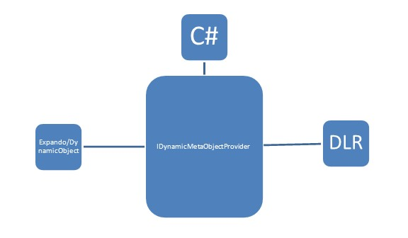

::: {style="DISPLAY: none"}
{#d2h_url_template}{#d2h_package_url style="WIDTH: 0px; DISPLAY: none; HEIGHT: 0px"}
:::

::: {.d2h_secondary_topic style="PADDING-BOTTOM: 10pt; MARGIN: 0pt; PADDING-LEFT: 0pt; PADDING-RIGHT: 0pt; PADDING-TOP: 0pt"}
#### Dynamic Keyword Support {#dynamic-keyword-support style="tab-stops: 0pt"}

[]{style="FONT-FAMILY: 'Trebuchet MS','sans-serif'; COLOR: #15428b; FONT-SIZE: 9pt"} 

C# 4.0 introduces a new type of object: **dynamic**. More information can be found in [MSDN]{style="COLOR: black"}. The dynamic object offers a way to get or set values dynamically using CallSites and binders from the C# language service. Using this service, we are able to generate dynamic compile-time execution and representing that acts as an object to GridDataControl. By enabling it to work with dynamic objects, the grid seamlessly allows working with any DLR-based language.

 

The **IDynamicMetaObjectProvider** interface defines the interface between the dynamic run-time types.

 

 

{border="0"}

Figure 115: Dynamic Keyword Suppor

Usage Scenarios

**[]{style="FONT-FAMILY: 'Trebuchet MS','sans-serif'; COLOR: #15428b; FONT-SIZE: 9pt"}** 

Define a List\<dynamic\> object to be set as **ItemsSource** for the grid.

[]{style="FONT-FAMILY: 'Trebuchet MS','sans-serif'; COLOR: #15428b; FONT-SIZE: 9pt"} 

+-----------------------------------------------------------------------------------------+
| **[\[C# \] ]{style="FONT-FAMILY: 'Courier New'"}**                                      |
|                                                                                         |
| **[]{style="FONT-FAMILY: 'Courier New'"}**                                              |
|                                                                                         |
| [ var list = new List\<dynamic\>();]{style="FONT-FAMILY: 'Courier New'"}                |
|                                                                                         |
| [            dynamic d = new ExpandoObject();]{style="FONT-FAMILY: 'Courier New'"}      |
|                                                                                         |
| [            d.Name = \"Robert\";]{style="FONT-FAMILY: 'Courier New'"}                  |
|                                                                                         |
| [            d.Age = 24;]{style="FONT-FAMILY: 'Courier New'"}                           |
|                                                                                         |
| [            d.Occupation = \"Software Engineer\";]{style="FONT-FAMILY: 'Courier New'"} |
|                                                                                         |
| [            d.HasCar = true;]{style="FONT-FAMILY: 'Courier New'"}                      |
|                                                                                         |
| [            dynamic d1 = new ExpandoObject();]{style="FONT-FAMILY: 'Courier New'"}     |
|                                                                                         |
| [            d1.Name = \"James\";]{style="FONT-FAMILY: 'Courier New'"}                  |
|                                                                                         |
| [            d1.Age = 25;]{style="FONT-FAMILY: 'Courier New'"}                          |
|                                                                                         |
| [            d1.Occupation = \"Business\";]{style="FONT-FAMILY: 'Courier New'"}         |
|                                                                                         |
| [            d1.HasCar = false;]{style="FONT-FAMILY: 'Courier New'"}                    |
|                                                                                         |
| [            list.Add(d);]{style="FONT-FAMILY: 'Courier New'"}                          |
|                                                                                         |
| [            list.Add(d1);]{style="FONT-FAMILY: 'Courier New'"}                         |
|                                                                                         |
| [            this.dataGrid.ItemsSource = list;]{style="FONT-FAMILY: 'Courier New'"}     |
+-----------------------------------------------------------------------------------------+

**[]{style="FONT-FAMILY: 'Trebuchet MS','sans-serif'; COLOR: #15428b; FONT-SIZE: 9pt"}** 

Features that work with dynamic objects

**[]{style="FONT-FAMILY: 'Trebuchet MS','sans-serif'; COLOR: #15428b; FONT-SIZE: 9pt"}** 

[·      ]{style="FONT-FAMILY: Symbol"}Sorting

[·      ]{style="FONT-FAMILY: Symbol"}Filtering

[·      ]{style="FONT-FAMILY: Symbol"}Grouping

[·      ]{style="FONT-FAMILY: Symbol"}Summaries

[·      ]{style="FONT-FAMILY: Symbol"}Conditional formatting

[]{style="FONT-FAMILY: 'Trebuchet MS','sans-serif'; COLOR: #15428b; FONT-SIZE: 9pt"} 

The internal view uses **LINQ** expression syntax to generate operations, this works well for including custom **LINQ** expressions inside operations such as sorting, filtering, grouping, etc.

[]{style="FONT-FAMILY: 'Trebuchet MS','sans-serif'; COLOR: #15428b; FONT-SIZE: 9pt"} 

Specific Dynamic Type Handling

**[]{style="FONT-FAMILY: 'Trebuchet MS','sans-serif'; COLOR: #15428b; FONT-SIZE: 9pt"}** 

Column Type

**[]{style="FONT-FAMILY: 'Trebuchet MS','sans-serif'; COLOR: #15428b; FONT-SIZE: 9pt"}** 

Since the collections are dynamic, we need to specify the proper type for the column to work properly in all scenarios. **GridDataVisibleColumn** provides a **DataType** property to specify the type for the column.

[]{style="FONT-FAMILY: 'Trebuchet MS','sans-serif'; COLOR: #15428b; FONT-SIZE: 9pt"} 

+-----------------------------------------------------------------------------------------------------------------------------------+
| [ ** \[XAML\]**]{style="FONT-FAMILY: 'Courier New'"}                                                                              |
|                                                                                                                                   |
| **[]{style="FONT-FAMILY: 'Courier New'"}**                                                                                        |
|                                                                                                                                   |
| [     \<syncfusion:GridDataVisibleColumn MappingName=\"OrderDate\" DataType=\"DateTime\" /\>]{style="FONT-FAMILY: 'Courier New'"} |
+-----------------------------------------------------------------------------------------------------------------------------------+

**[]{style="FONT-FAMILY: 'Trebuchet MS','sans-serif'; COLOR: #15428b; FONT-SIZE: 9pt"}** 

Handling Relations

**[]{style="FONT-FAMILY: 'Trebuchet MS','sans-serif'; COLOR: #15428b; FONT-SIZE: 9pt"}** 

Relations have to be handled in **XAML** or **C#**. The **AutoPopulateRelations** property will not work on dynamic object types.

[]{style="FONT-FAMILY: 'Courier New'; COLOR: #15428b"} 

+-----------------------------------------------------------------------------------------------------------------------------------+
| **[ \[XAML\]]{style="FONT-FAMILY: 'Courier New'"}**                                                                               |
|                                                                                                                                   |
| **[]{style="FONT-FAMILY: 'Courier New'"}**                                                                                        |
|                                                                                                                                   |
| [                     \<syncfusion:GridDataControl.Relations\>]{style="FONT-FAMILY: 'Courier New'"}                               |
|                                                                                                                                   |
| [                        \<syncfusion:GridDataRelation RelationalColumn=\"OrderDetails\" /\>]{style="FONT-FAMILY: 'Courier New'"} |
|                                                                                                                                   |
| [                    \</syncfusion:GridDataControl.Relations\>]{style="FONT-FAMILY: 'Courier New'"}                               |
+-----------------------------------------------------------------------------------------------------------------------------------+

[]{#p239} 

 

[]{#related-topics}
:::
