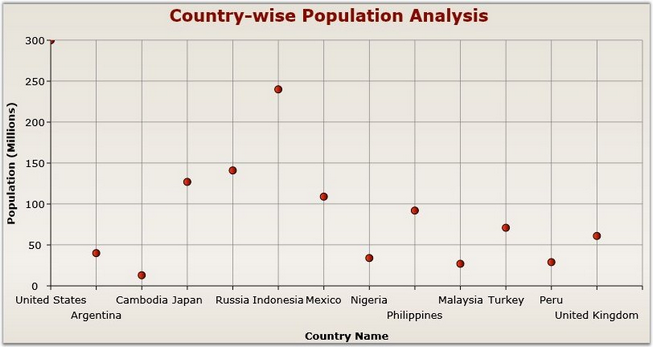
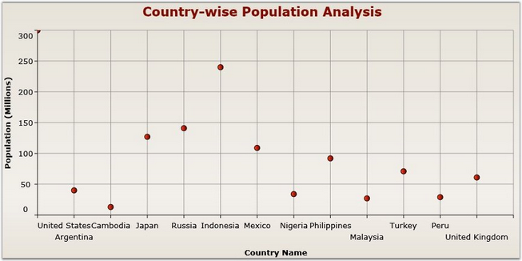

::: {style="DISPLAY: none"}
{#d2h_url_template}{#d2h_package_url style="WIDTH: 0px; DISPLAY: none; HEIGHT: 0px"}
:::

:::: {.d2h_secondary_topic style="PADDING-BOTTOM: 10pt; MARGIN: 0pt; PADDING-LEFT: 0pt; PADDING-RIGHT: 0pt; PADDING-TOP: 0pt"}
##### Edge Labels Drawing Modes {#edge-labels-drawing-modes style="tab-stops: 0pt"}

[]{style="COLOR: #15428b"} 

The EdgeLabelsDrawingMode property is used to determine the drawing options of edge labels. This property has the following two options to render the edge labels.

**[]{style="COLOR: #15428b"}** 

::: {align="center"}
  ------------------------ -------------------------------------------------------------------------------------------------------------------------
  EdgeLabelsDrawingModes   Usage
  Center                   Axis labels are placed at the center of the Grid lines. Part of the axis label may be displayed outside the chart area.
  Shift                    The label should be shifted to either right or left so that it comes within the chart area.
  ------------------------ -------------------------------------------------------------------------------------------------------------------------
:::

**[]{style="COLOR: #15428b"}** 

The below given code snippet can be used to customize the edge labels.

[]{style="COLOR: #15428b"} 

+------------------------------------------------------------------------------------------------------------------------------------------------------------------------------------------------------------------------------------------------------------------------------------------------------------------------------------------------------------------------------------------------------------------+
| [\[XAML\]]{style="FONT-FAMILY: 'Courier New'"}                                                                                                                                                                                                                                                                                                                                                                   |
|                                                                                                                                                                                                                                                                                                                                                                                                                  |
| **[]{style="FONT-FAMILY: 'Courier New'"}**                                                                                                                                                                                                                                                                                                                                                                       |
|                                                                                                                                                                                                                                                                                                                                                                                                                  |
| [\<]{style="FONT-FAMILY: 'Courier New'; COLOR: blue"}[syncfusion:ChartArea.PrimaryAxis]{style="FONT-FAMILY: 'Courier New'; COLOR: #a31515"}[\>]{style="FONT-FAMILY: 'Courier New'; COLOR: blue"}                                                                                                                                                                                                                 |
|                                                                                                                                                                                                                                                                                                                                                                                                                  |
| [  \<]{style="FONT-FAMILY: 'Courier New'; COLOR: blue"}[syncfusion:ChartAxis]{style="FONT-FAMILY: 'Courier New'; COLOR: #a31515"}[ ]{style="FONT-FAMILY: 'Courier New'; COLOR: blue"}[EdgeLabelsDrawingMode]{style="FONT-FAMILY: 'Courier New'; COLOR: red"}[=]{style="FONT-FAMILY: 'Courier New'; COLOR: blue"}[\"[Shift]{style="COLOR: blue"}\"[/\>]{style="COLOR: blue"}]{style="FONT-FAMILY: 'Courier New'"} |
|                                                                                                                                                                                                                                                                                                                                                                                                                  |
| [\</]{style="FONT-FAMILY: 'Courier New'; COLOR: blue"}[syncfusion:ChartArea.PrimaryAxis]{style="FONT-FAMILY: 'Courier New'; COLOR: #a31515"}[\>]{style="FONT-FAMILY: 'Courier New'; COLOR: blue"}                                                                                                                                                                                                                |
+------------------------------------------------------------------------------------------------------------------------------------------------------------------------------------------------------------------------------------------------------------------------------------------------------------------------------------------------------------------------------------------------------------------+

[]{style="COLOR: #15428b"} 

+-------------------------------------------------------------------------------------------------+
| [\[C#\]]{style="FONT-FAMILY: 'Courier New'"}                                                    |
|                                                                                                 |
| []{style="FONT-FAMILY: 'Courier New'"}                                                          |
|                                                                                                 |
| [ChartArea area = [new]{style="COLOR: blue"} ChartArea();]{style="FONT-FAMILY: 'Courier New'"}  |
|                                                                                                 |
| [ChartAxis axis = [new]{style="COLOR: blue"} ChartAxis();]{style="FONT-FAMILY: 'Courier New'"}  |
|                                                                                                 |
| [axis.EdgeLabelsDrawingMode = EdgeLabelsDrawingMode.Shift;]{style="FONT-FAMILY: 'Courier New'"} |
|                                                                                                 |
| [area.PrimaryAxis = axis;]{style="FONT-FAMILY: 'Courier New'"}                                  |
+-------------------------------------------------------------------------------------------------+

[]{style="COLOR: #15428b"} 

{border="0"}

Figure 95: EdgeLabelsDrawingMode = \"Center\"

**[]{style="COLOR: #15428b"}** 

{border="0"}

Figure 96: EdgeLabelsDrawingMode = \"Shift\"

[]{#related-topics}
::::
