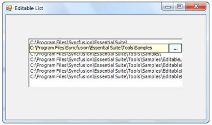

::: {style="DISPLAY: none"}
{#d2h_url_template}{#d2h_package_url style="WIDTH: 0px; DISPLAY: none; HEIGHT: 0px"}
:::

::: {.d2h_secondary_topic style="PADDING-BOTTOM: 10pt; MARGIN: 0pt; PADDING-LEFT: 0pt; PADDING-RIGHT: 0pt; PADDING-TOP: 0pt"}
#### EditableList {#editablelist style="tab-stops: 0pt"}

The** EditableList control** provides an editable Windows Forms list box with a Windows Forms text box and button on the current row to facilitate in-place editing.[ ]{style="FONT-FAMILY: 'Times New Roman','serif'; COLOR: black; FONT-SIZE: 12pt"}The events present in the Textbox, Button and ListBox are applicable for EditableList control.[]{style="COLOR: black"}

[]{style="COLOR: black"} 

{border="0"}[]{style="COLOR: black"}

[]{style="COLOR: black"} 

Figure 521: Editable List Control

 

More:

[ ]{#related-topics}

[{border="0" align="absMiddle"}Features](ms-xhelp:///?Id=2f3ca906-1b04-4aae-98f6-4f739c7aef6f){style="TEXT-DECORATION: none"}

[{border="0" align="absMiddle"}Creating Editable List](ms-xhelp:///?Id=a06c353a-9c97-4d77-a4d7-e5d23dfd744d){style="TEXT-DECORATION: none"}

[{border="0" align="absMiddle"}Concepts and Features](ms-xhelp:///?Id=077e5241-ef14-4f8b-8bb9-8172ab49b74d){style="TEXT-DECORATION: none"}

[{border="0" align="absMiddle"}Event Handling](ms-xhelp:///?Id=d7d7659e-5224-4472-8030-acaed556c6de){style="TEXT-DECORATION: none"}
:::
