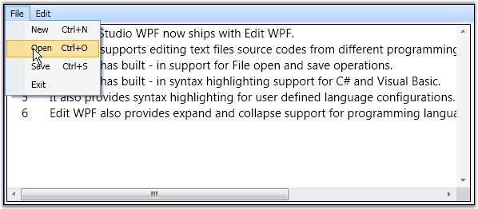
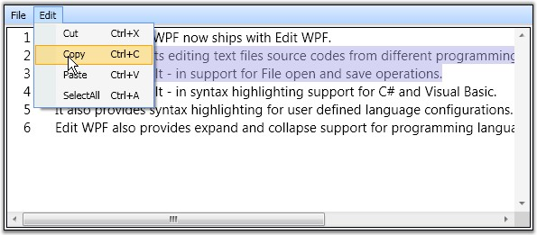

::: {style="DISPLAY: none"}
{#d2h_url_template}{#d2h_package_url style="WIDTH: 0px; DISPLAY: none; HEIGHT: 0px"}
:::

::::: {#nsbanner .d2h_main_nsbanner style="BORDER-BOTTOM: #999999 1px solid; POSITION: relative; PADDING-BOTTOM: 0px; BACKGROUND-COLOR: transparent; PADDING-LEFT: 0px; PADDING-RIGHT: 0px; DISPLAY: none; BORDER-TOP: #999999 1px solid; PADDING-TOP: 0px; LEFT: 0px"}
:::: {#TitleRow .d2h_main_titlerow style="PADDING-BOTTOM: 4px; BACKGROUND-COLOR: transparent; PADDING-LEFT: 22px; WIDTH: 100%; PADDING-RIGHT: 10px; DISPLAY: none; PADDING-TOP: 4px"}
::: {#ienav .d2h_main_ienav style="DISPLAY: none"}
{#D2HPrevious .D2HPreviousEnabled}  {#D2HNext .D2HNextEnabled}
:::
::::
:::::

:::: {#nstext .d2h_main_nstext style="PADDING-BOTTOM: 10px; BACKGROUND-COLOR: transparent; PADDING-LEFT: 22px; PADDING-RIGHT: 10px; HEIGHT: 100%; OVERFLOW: auto; PADDING-TOP: 5px" hasuserbackground="true" valign="bottom"}
::: {#d2h_breadcrumbs .d2h_breadcrumbs}
[Essential Studio User Guide Documentation](ms-xhelp:///?Id=12457748-09e3-4d74-a240-8e049cedf030){.d2h_breadcrumbsNormal}[ \> ]{.d2h_breadcrumbsLinkSeparator}[User Interface Edition](ms-xhelp:///?Id=c29296b7-531c-413b-a0ec-488ca1f7f669){.d2h_breadcrumbsNormal}[ \> ]{.d2h_breadcrumbsLinkSeparator}[Essential WPF](ms-xhelp:///?Id=7f4f82c5-151c-4262-94d0-75c4626c77bc){.d2h_breadcrumbsNormal}[ \> ]{.d2h_breadcrumbsLinkSeparator}[Essential Edit]{.d2h_breadcrumbsContentsOnly}[ \> ]{.d2h_breadcrumbsLinkSeparator}[Concepts and Features](ms-xhelp:///?Id=f61feb80-1940-4b18-ab36-1ab89df8b52a){.d2h_breadcrumbsNormal}
:::

## Edit Commands {#edit-commands style="tab-stops: 0pt"}

Essential Edit for WPF contains built-in **RoutedUICommands** for all editing and file operations like select all, cut, copy, paste, new, open, save, and so on. The built-in RoutedUICommands can be bound to the control by using the **Command** property of the external control like button, menu item, and so on. The following lines of code can be used to bind the RoutedUICommands with external controls.

[]{style="FONT-FAMILY: 'Trebuchet MS','sans-serif'; COLOR: #15428b; FONT-SIZE: 9pt"} 

+--------------------------------------------------------------------------------------------------------------------------------------------------------------------------------------------------------------------------------------------------------------------------------------------------------------------------------------------------------------------+
| **[\[XAML\]]{style="FONT-FAMILY: 'Courier New'; COLOR: black"}**                                                                                                                                                                                                                                                                                                   |
|                                                                                                                                                                                                                                                                                                                                                                    |
| []{style="FONT-FAMILY: 'Courier New'; COLOR: blue"}                                                                                                                                                                                                                                                                                                                |
|                                                                                                                                                                                                                                                                                                                                                                    |
| [\<]{style="FONT-FAMILY: 'Courier New'; COLOR: blue"}[MenuItem]{style="FONT-FAMILY: 'Courier New'; COLOR: maroon"}[ [Header]{style="COLOR: red"}[=\"\_File\"]{style="COLOR: blue"} [Background]{style="COLOR: red"}[=\"Transparent\"]{style="COLOR: blue"} [Width]{style="COLOR: red"}[=\"{Binding}\"\>]{style="COLOR: blue"}]{style="FONT-FAMILY: 'Courier New'"} |
|                                                                                                                                                                                                                                                                                                                                                                    |
| [    [\<]{style="COLOR: blue"}[MenuItem]{style="COLOR: maroon"} [Command]{style="COLOR: red"}[=\"{x:Static sfedit:EditCommands.New}\"]{style="COLOR: blue"} [CommandTarget]{style="COLOR: red"}[=\"{Binding ElementName=Edit1}\"/\>]{style="COLOR: blue"}]{style="FONT-FAMILY: 'Courier New'"}                                                                     |
|                                                                                                                                                                                                                                                                                                                                                                    |
| [    [\<]{style="COLOR: blue"}[MenuItem]{style="COLOR: maroon"} [Command]{style="COLOR: red"}[=\"{x:Static sfedit:EditCommands.Open}\"]{style="COLOR: blue"} [CommandTarget]{style="COLOR: red"}[=\"{Binding ElementName=Edit1}\"/\>]{style="COLOR: blue"}]{style="FONT-FAMILY: 'Courier New'"}                                                                    |
|                                                                                                                                                                                                                                                                                                                                                                    |
| [    [\<]{style="COLOR: blue"}[MenuItem]{style="COLOR: maroon"} [Command]{style="COLOR: red"}[=\"{x:Static sfedit:EditCommands.Save}\"]{style="COLOR: blue"} [CommandTarget]{style="COLOR: red"}[=\"{Binding ElementName=Edit1}\"/\>]{style="COLOR: blue"}]{style="FONT-FAMILY: 'Courier New'"}                                                                    |
|                                                                                                                                                                                                                                                                                                                                                                    |
| [ [\</]{style="COLOR: blue"}[MenuItem]{style="COLOR: maroon"}[\>]{style="COLOR: blue"}]{style="FONT-FAMILY: 'Courier New'"}                                                                                                                                                                                                                                        |
|                                                                                                                                                                                                                                                                                                                                                                    |
| []{style="FONT-FAMILY: 'Courier New'; COLOR: blue"}                                                                                                                                                                                                                                                                                                                |
|                                                                                                                                                                                                                                                                                                                                                                    |
| [\<]{style="FONT-FAMILY: 'Courier New'; COLOR: blue"}[MenuItem]{style="FONT-FAMILY: 'Courier New'; COLOR: maroon"}[ [Header]{style="COLOR: red"}[=\"Edit\"]{style="COLOR: blue"} [Background]{style="COLOR: red"}[=\"Transparent\"]{style="COLOR: blue"} [Width]{style="COLOR: red"}[=\"{Binding}\"\>]{style="COLOR: blue"}]{style="FONT-FAMILY: 'Courier New'"}   |
|                                                                                                                                                                                                                                                                                                                                                                    |
| [    [\<]{style="COLOR: blue"}[MenuItem]{style="COLOR: maroon"} [Command]{style="COLOR: red"}[=\"{x:Static sfedit:EditCommands.Cut}\"]{style="COLOR: blue"} [CommandTarget]{style="COLOR: red"}[=\"{Binding ElementName=Edit1}\"/\>]{style="COLOR: blue"}]{style="FONT-FAMILY: 'Courier New'"}                                                                     |
|                                                                                                                                                                                                                                                                                                                                                                    |
| [    [\<]{style="COLOR: blue"}[MenuItem]{style="COLOR: maroon"} [Command]{style="COLOR: red"}[=\"{x:Static sfedit:EditCommands.Copy}\"]{style="COLOR: blue"} [CommandTarget]{style="COLOR: red"}[=\"{Binding ElementName=Edit1}\"/\>]{style="COLOR: blue"}]{style="FONT-FAMILY: 'Courier New'"}                                                                    |
|                                                                                                                                                                                                                                                                                                                                                                    |
| [    [\<]{style="COLOR: blue"}[MenuItem]{style="COLOR: maroon"} [Command]{style="COLOR: red"}[=\"{x:Static sfedit:EditCommands.Paste}\"]{style="COLOR: blue"} [CommandTarget]{style="COLOR: red"}[=\"{Binding ElementName=Edit1}\"/\>]{style="COLOR: blue"}]{style="FONT-FAMILY: 'Courier New'"}                                                                   |
|                                                                                                                                                                                                                                                                                                                                                                    |
| [    [\<]{style="COLOR: blue"}[MenuItem]{style="COLOR: maroon"} [Command]{style="COLOR: red"}[=\"{x:Static sfedit:EditCommands.SelectAll}\"]{style="COLOR: blue"} [CommandTarget]{style="COLOR: red"}[=\"{Binding ElementName=Edit1}\"/\>]{style="COLOR: blue"}]{style="FONT-FAMILY: 'Courier New'"}                                                               |
|                                                                                                                                                                                                                                                                                                                                                                    |
| [\</]{style="FONT-FAMILY: 'Courier New'; COLOR: blue"}[MenuItem]{style="FONT-FAMILY: 'Courier New'; COLOR: maroon"}[\>]{style="FONT-FAMILY: 'Courier New'; COLOR: blue"}                                                                                                                                                                                           |
+--------------------------------------------------------------------------------------------------------------------------------------------------------------------------------------------------------------------------------------------------------------------------------------------------------------------------------------------------------------------+

[]{style="FONT-FAMILY: 'Trebuchet MS','sans-serif'; COLOR: #15428b; FONT-SIZE: 9pt"} 

+------------------------------------------------------------------------------------------------------------+
| **[\[C#\]]{style="FONT-FAMILY: 'Courier New'; COLOR: black"}**                                             |
|                                                                                                            |
| []{style="FONT-FAMILY: 'Courier New'"}                                                                     |
|                                                                                                            |
| [menuitem_open.Command = [EditCommands]{style="COLOR: #2b91af"}.Open;]{style="FONT-FAMILY: 'Courier New'"} |
|                                                                                                            |
| [menuitem_open.CommandTarget = Edit1;]{style="FONT-FAMILY: 'Courier New'"}                                 |
+------------------------------------------------------------------------------------------------------------+

[]{style="FONT-FAMILY: 'Trebuchet MS','sans-serif'; COLOR: #15428b; FONT-SIZE: 9pt"} 

[]{style="FONT-FAMILY: 'Trebuchet MS','sans-serif'; COLOR: #15428b; FONT-SIZE: 9pt"} 

[]{style="FONT-FAMILY: 'Trebuchet MS','sans-serif'; COLOR: #15428b; FONT-SIZE: 9pt"} 

{border="0"}

Figure 7: \"Open\" Edit Command

[]{style="FONT-FAMILY: 'Trebuchet MS','sans-serif'; COLOR: #15428b; FONT-SIZE: 9pt"} 

{border="0"}

Figure 8: \"Copy\" Edit Command

[]{#related-topics}
::::
