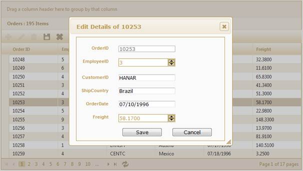
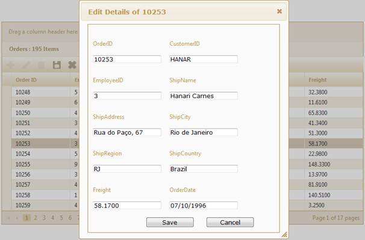

::: {style="DISPLAY: none"}
{#d2h_url_template}{#d2h_package_url style="WIDTH: 0px; DISPLAY: none; HEIGHT: 0px"}
:::

::: {.d2h_secondary_topic style="PADDING-BOTTOM: 10pt; MARGIN: 0pt; PADDING-LEFT: 0pt; PADDING-RIGHT: 0pt; PADDING-TOP: 0pt"}
#### Edit Mode Configuration {#edit-mode-configuration style="tab-stops: 0pt"}

Essential Grid provides two types for dialog editing mode. To change the editing mode, use the **EditMode()** method as shown in the following code sample:

 

+--------------------------------------------------------------------------------------------------------------------------------------------------------------------------------------------------------------------------------------------------+
| **[\[ASPX\]]{style="FONT-FAMILY: 'Courier New'"}**                                                                                                                                                                                               |
|                                                                                                                                                                                                                                                  |
| [\<%]{style="FONT-FAMILY: 'Courier New'; BACKGROUND: yellow"}[=]{style="FONT-FAMILY: 'Courier New'; COLOR: blue"}[Html.Grid\<[EditableOrder]{style="COLOR: #2b91af"}\>([\"Grid1\"]{style="COLOR: #a31515"})]{style="FONT-FAMILY: 'Courier New'"} |
|                                                                                                                                                                                                                                                  |
| [   .Datasource(Model)]{style="FONT-FAMILY: 'Courier New'"}                                                                                                                                                                                      |
|                                                                                                                                                                                                                                                  |
| [.Editing( edit=\>{]{style="FONT-FAMILY: 'Courier New'"}                                                                                                                                                                                         |
|                                                                                                                                                                                                                                                  |
| [       edit.EditMode([GridEditMode]{style="COLOR: #2b91af"}.Dialog);[// Specify the grid edit mode.]{style="COLOR: green"}]{style="FONT-FAMILY: 'Courier New'"}                                                                                 |
|                                                                                                                                                                                                                                                  |
| [                                                             ]{style="FONT-FAMILY: 'Courier New'; COLOR: green"}[]{style="FONT-FAMILY: 'Courier New'"}                                                                                          |
|                                                                                                                                                                                                                                                  |
| [ })[%\>]{style="BACKGROUND: yellow"}]{style="FONT-FAMILY: 'Courier New'"}                                                                                                                                                                       |
+--------------------------------------------------------------------------------------------------------------------------------------------------------------------------------------------------------------------------------------------------+

 

+-----------------------------------------------------------------------------------------------------------------------------------------------------------------------------------------------+
| **[\[Razor\]]{style="FONT-FAMILY: 'Courier New'"}**                                                                                                                                           |
|                                                                                                                                                                                               |
| [\@{]{style="FONT-FAMILY: 'Courier New'; BACKGROUND: yellow"}[ Html.Grid\<[EditableOrder]{style="COLOR: #2b91af"}\>([\"Grid1\"]{style="COLOR: #a31515"})]{style="FONT-FAMILY: 'Courier New'"} |
|                                                                                                                                                                                               |
| [   .Datasource(Model)]{style="FONT-FAMILY: 'Courier New'"}                                                                                                                                   |
|                                                                                                                                                                                               |
| [.Editing( edit=\>{]{style="FONT-FAMILY: 'Courier New'"}                                                                                                                                      |
|                                                                                                                                                                                               |
| [       edit.EditMode([GridEditMode]{style="COLOR: #2b91af"}.Dialog);[// Specify the grid edit mode.]{style="COLOR: green"}]{style="FONT-FAMILY: 'Courier New'"}                              |
|                                                                                                                                                                                               |
| [                                                             ]{style="FONT-FAMILY: 'Courier New'; COLOR: green"}[]{style="FONT-FAMILY: 'Courier New'"}                                       |
|                                                                                                                                                                                               |
| [ }).Render();]{style="FONT-FAMILY: 'Courier New'"}                                                                                                                                           |
|                                                                                                                                                                                               |
| [       ]{style="FONT-FAMILY: 'Courier New'"}                                                                                                                                                 |
|                                                                                                                                                                                               |
| [ [}]{style="BACKGROUND: yellow"}]{style="FONT-FAMILY: 'Courier New'"}                                                                                                                        |
+-----------------------------------------------------------------------------------------------------------------------------------------------------------------------------------------------+

 

[The ]{style="FONT-FAMILY: Consolas; FONT-SIZE: 9.5pt"}grid will appear in the dialog editing mode as displayed below:

 

{border="0"}

Figure 185: Dialog Edit Mode**[]{style="FONT-STYLE: normal"}**

 

If you want to use the **DialogTemplate** mode, follow the steps displayed below. 

1.   Create the template in partial view, as displayed below

 

+----------------------------------------------------------------------------------------------------------------------------------------------------------------------------------------------------------------------------------------------------------------------------------------------------------------------------------------------------------------+
| **[\[ASPX\]]{style="FONT-FAMILY: 'Courier New'"}**                                                                                                                                                                                                                                                                                                             |
|                                                                                                                                                                                                                                                                                                                                                                |
| [\<]{style="FONT-FAMILY: 'Courier New'; COLOR: blue"}[fieldset]{style="FONT-FAMILY: 'Courier New'; COLOR: maroon"}[\>]{style="FONT-FAMILY: 'Courier New'; COLOR: blue"}                                                                                                                                                                                        |
|                                                                                                                                                                                                                                                                                                                                                                |
| [    [\<]{style="COLOR: blue"}[legend]{style="COLOR: maroon"}[\>]{style="COLOR: blue"}Fields[\</]{style="COLOR: blue"}[legend]{style="COLOR: maroon"}[\>]{style="COLOR: blue"}]{style="FONT-FAMILY: 'Courier New'"}[]{style="FONT-FAMILY: 'Times New Roman','serif'"}                                                                                          |
|                                                                                                                                                                                                                                                                                                                                                                |
| [    [\<]{style="COLOR: blue"}[div]{style="COLOR: maroon"} [class]{style="COLOR: red"}[=\"tablediv\"\>]{style="COLOR: blue"}]{style="FONT-FAMILY: 'Courier New'"}[]{style="FONT-FAMILY: 'Times New Roman','serif'"}                                                                                                                                            |
|                                                                                                                                                                                                                                                                                                                                                                |
| [        [\<]{style="COLOR: blue"}[div]{style="COLOR: maroon"} [class]{style="COLOR: red"}[=\"rowdiv\"\>]{style="COLOR: blue"}]{style="FONT-FAMILY: 'Courier New'"}[]{style="FONT-FAMILY: 'Times New Roman','serif'"}                                                                                                                                          |
|                                                                                                                                                                                                                                                                                                                                                                |
| [            [\<]{style="COLOR: blue"}[div]{style="COLOR: maroon"} [class]{style="COLOR: red"}[=\"celldiv\"]{style="COLOR: blue"} [style]{style="COLOR: red"}[=\"]{style="COLOR: blue"}[height]{style="COLOR: red"}[: auto\"\>]{style="COLOR: blue"}]{style="FONT-FAMILY: 'Courier New'"}[]{style="FONT-FAMILY: 'Times New Roman','serif'"}                    |
|                                                                                                                                                                                                                                                                                                                                                                |
| [                [\<]{style="COLOR: blue"}[div]{style="COLOR: maroon"} [class]{style="COLOR: red"}[=\"editor-label\"\>]{style="COLOR: blue"}]{style="FONT-FAMILY: 'Courier New'"}[]{style="FONT-FAMILY: 'Times New Roman','serif'"}                                                                                                                            |
|                                                                                                                                                                                                                                                                                                                                                                |
| [                    [\<%]{style="BACKGROUND: yellow"}[=]{style="COLOR: blue"} Html.Syncfusion().LabelFor(model =\> model.OrderID) [%\>]{style="BACKGROUND: yellow"}]{style="FONT-FAMILY: 'Courier New'"}[]{style="FONT-FAMILY: 'Times New Roman','serif'"}                                                                                                    |
|                                                                                                                                                                                                                                                                                                                                                                |
| [                [\</]{style="COLOR: blue"}[div]{style="COLOR: maroon"}[\>]{style="COLOR: blue"}]{style="FONT-FAMILY: 'Courier New'"}[]{style="FONT-FAMILY: 'Times New Roman','serif'"}                                                                                                                                                                        |
|                                                                                                                                                                                                                                                                                                                                                                |
| [                [\<]{style="COLOR: blue"}[div]{style="COLOR: maroon"} [class]{style="COLOR: red"}[=\"editor-field\"\>]{style="COLOR: blue"}]{style="FONT-FAMILY: 'Courier New'"}[]{style="FONT-FAMILY: 'Times New Roman','serif'"}                                                                                                                            |
|                                                                                                                                                                                                                                                                                                                                                                |
| [                    [\<%]{style="BACKGROUND: yellow"}[=]{style="COLOR: blue"} Html.Syncfusion().TextBoxFor(model =\> model.OrderID) [%\>]{style="BACKGROUND: yellow"}]{style="FONT-FAMILY: 'Courier New'"}[]{style="FONT-FAMILY: 'Times New Roman','serif'"}                                                                                                  |
|                                                                                                                                                                                                                                                                                                                                                                |
| [                    [\<%]{style="BACKGROUND: yellow"}[=]{style="COLOR: blue"} Html.Syncfusion().ValidationMessageFor(model =\> model.OrderID) [%\>]{style="BACKGROUND: yellow"}]{style="FONT-FAMILY: 'Courier New'"}[]{style="FONT-FAMILY: 'Times New Roman','serif'"}                                                                                        |
|                                                                                                                                                                                                                                                                                                                                                                |
| [                [\</]{style="COLOR: blue"}[div]{style="COLOR: maroon"}[\>]{style="COLOR: blue"}]{style="FONT-FAMILY: 'Courier New'"}[]{style="FONT-FAMILY: 'Times New Roman','serif'"}                                                                                                                                                                        |
|                                                                                                                                                                                                                                                                                                                                                                |
| [            [\</]{style="COLOR: blue"}[div]{style="COLOR: maroon"}[\>]{style="COLOR: blue"}]{style="FONT-FAMILY: 'Courier New'"}[]{style="FONT-FAMILY: 'Times New Roman','serif'"}                                                                                                                                                                            |
|                                                                                                                                                                                                                                                                                                                                                                |
| [            [\<]{style="COLOR: blue"}[div]{style="COLOR: maroon"} [class]{style="COLOR: red"}[=\"celldiv\"]{style="COLOR: blue"} [style]{style="COLOR: red"}[=\"]{style="COLOR: blue"}[height]{style="COLOR: red"}[: auto\"\>]{style="COLOR: blue"}]{style="FONT-FAMILY: 'Courier New'"}[]{style="FONT-FAMILY: 'Times New Roman','serif'"}                    |
|                                                                                                                                                                                                                                                                                                                                                                |
| [                [\<]{style="COLOR: blue"}[div]{style="COLOR: maroon"} [class]{style="COLOR: red"}[=\"editor-label\"\>]{style="COLOR: blue"}]{style="FONT-FAMILY: 'Courier New'"}[]{style="FONT-FAMILY: 'Times New Roman','serif'"}                                                                                                                            |
|                                                                                                                                                                                                                                                                                                                                                                |
| [                    [\<%]{style="BACKGROUND: yellow"}[=]{style="COLOR: blue"} Html.Syncfusion().LabelFor(model =\> model.CustomerID) [%\>]{style="BACKGROUND: yellow"}]{style="FONT-FAMILY: 'Courier New'"}[]{style="FONT-FAMILY: 'Times New Roman','serif'"}                                                                                                 |
|                                                                                                                                                                                                                                                                                                                                                                |
| [                [\</]{style="COLOR: blue"}[div]{style="COLOR: maroon"}[\>]{style="COLOR: blue"}]{style="FONT-FAMILY: 'Courier New'"}[]{style="FONT-FAMILY: 'Times New Roman','serif'"}                                                                                                                                                                        |
|                                                                                                                                                                                                                                                                                                                                                                |
| [                [\<]{style="COLOR: blue"}[div]{style="COLOR: maroon"} [class]{style="COLOR: red"}[=\"editor-field\"\>]{style="COLOR: blue"}]{style="FONT-FAMILY: 'Courier New'"}[]{style="FONT-FAMILY: 'Times New Roman','serif'"}                                                                                                                            |
|                                                                                                                                                                                                                                                                                                                                                                |
| [                    [\<%]{style="BACKGROUND: yellow"}[=]{style="COLOR: blue"} Html.Syncfusion().TextBoxFor(model =\> model.CustomerID) [%\>]{style="BACKGROUND: yellow"}]{style="FONT-FAMILY: 'Courier New'"}[]{style="FONT-FAMILY: 'Times New Roman','serif'"}                                                                                               |
|                                                                                                                                                                                                                                                                                                                                                                |
| [                    [\<%]{style="BACKGROUND: yellow"}[=]{style="COLOR: blue"} Html.Syncfusion().ValidationMessageFor(model =\> model.CustomerID) [%\>]{style="BACKGROUND: yellow"}]{style="FONT-FAMILY: 'Courier New'"}[]{style="FONT-FAMILY: 'Times New Roman','serif'"}                                                                                     |
|                                                                                                                                                                                                                                                                                                                                                                |
| [                [\</]{style="COLOR: blue"}[div]{style="COLOR: maroon"}[\>]{style="COLOR: blue"}]{style="FONT-FAMILY: 'Courier New'"}[]{style="FONT-FAMILY: 'Times New Roman','serif'"}                                                                                                                                                                        |
|                                                                                                                                                                                                                                                                                                                                                                |
| [            [\</]{style="COLOR: blue"}[div]{style="COLOR: maroon"}[\>]{style="COLOR: blue"}]{style="FONT-FAMILY: 'Courier New'"}[]{style="FONT-FAMILY: 'Times New Roman','serif'"}                                                                                                                                                                            |
|                                                                                                                                                                                                                                                                                                                                                                |
| [        [\</]{style="COLOR: blue"}[div]{style="COLOR: maroon"}[\>]{style="COLOR: blue"}]{style="FONT-FAMILY: 'Courier New'"}[]{style="FONT-FAMILY: 'Times New Roman','serif'"}                                                                                                                                                                                |
|                                                                                                                                                                                                                                                                                                                                                                |
| [        [\<]{style="COLOR: blue"}[div]{style="COLOR: maroon"} [class]{style="COLOR: red"}[=\"rowdiv\"\>]{style="COLOR: blue"}]{style="FONT-FAMILY: 'Courier New'"}[]{style="FONT-FAMILY: 'Times New Roman','serif'"}                                                                                                                                          |
|                                                                                                                                                                                                                                                                                                                                                                |
| [            [\<]{style="COLOR: blue"}[div]{style="COLOR: maroon"} [class]{style="COLOR: red"}[=\"celldiv\"]{style="COLOR: blue"} [style]{style="COLOR: red"}[=\"]{style="COLOR: blue"}[height]{style="COLOR: red"}[: auto\"\>]{style="COLOR: blue"}]{style="FONT-FAMILY: 'Courier New'"}[]{style="FONT-FAMILY: 'Times New Roman','serif'"}                    |
|                                                                                                                                                                                                                                                                                                                                                                |
| [                [\<]{style="COLOR: blue"}[div]{style="COLOR: maroon"} [class]{style="COLOR: red"}[=\"editor-label\"\>]{style="COLOR: blue"}]{style="FONT-FAMILY: 'Courier New'"}[]{style="FONT-FAMILY: 'Times New Roman','serif'"}                                                                                                                            |
|                                                                                                                                                                                                                                                                                                                                                                |
| [                    [\<%]{style="BACKGROUND: yellow"}[=]{style="COLOR: blue"} Html.Syncfusion().LabelFor(model =\> model.EmployeeID) [%\>]{style="BACKGROUND: yellow"}]{style="FONT-FAMILY: 'Courier New'"}[]{style="FONT-FAMILY: 'Times New Roman','serif'"}                                                                                                 |
|                                                                                                                                                                                                                                                                                                                                                                |
| [                [\</]{style="COLOR: blue"}[div]{style="COLOR: maroon"}[\>]{style="COLOR: blue"}]{style="FONT-FAMILY: 'Courier New'"}[]{style="FONT-FAMILY: 'Times New Roman','serif'"}                                                                                                                                                                        |
|                                                                                                                                                                                                                                                                                                                                                                |
| [                [\<]{style="COLOR: blue"}[div]{style="COLOR: maroon"} [class]{style="COLOR: red"}[=\"editor-field\"\>]{style="COLOR: blue"}]{style="FONT-FAMILY: 'Courier New'"}[]{style="FONT-FAMILY: 'Times New Roman','serif'"}                                                                                                                            |
|                                                                                                                                                                                                                                                                                                                                                                |
| [                    [\<%]{style="BACKGROUND: yellow"}[=]{style="COLOR: blue"} Html.Syncfusion().TextBoxFor(model =\> model.EmployeeID) [%\>]{style="BACKGROUND: yellow"}]{style="FONT-FAMILY: 'Courier New'"}[]{style="FONT-FAMILY: 'Times New Roman','serif'"}                                                                                               |
|                                                                                                                                                                                                                                                                                                                                                                |
| [                    [\<%]{style="BACKGROUND: yellow"}[=]{style="COLOR: blue"} Html.Syncfusion().ValidationMessageFor(model =\> model.EmployeeID) [%\>]{style="BACKGROUND: yellow"}]{style="FONT-FAMILY: 'Courier New'"}[]{style="FONT-FAMILY: 'Times New Roman','serif'"}                                                                                     |
|                                                                                                                                                                                                                                                                                                                                                                |
| [                [\</]{style="COLOR: blue"}[div]{style="COLOR: maroon"}[\>]{style="COLOR: blue"}]{style="FONT-FAMILY: 'Courier New'"}[]{style="FONT-FAMILY: 'Times New Roman','serif'"}                                                                                                                                                                        |
|                                                                                                                                                                                                                                                                                                                                                                |
| [            [\</]{style="COLOR: blue"}[div]{style="COLOR: maroon"}[\>]{style="COLOR: blue"}]{style="FONT-FAMILY: 'Courier New'"}[]{style="FONT-FAMILY: 'Times New Roman','serif'"}                                                                                                                                                                            |
|                                                                                                                                                                                                                                                                                                                                                                |
| [            [\<]{style="COLOR: blue"}[div]{style="COLOR: maroon"} [class]{style="COLOR: red"}[=\"celldiv\"]{style="COLOR: blue"} [style]{style="COLOR: red"}[=\"]{style="COLOR: blue"}[height]{style="COLOR: red"}[: auto\"\>]{style="COLOR: blue"}]{style="FONT-FAMILY: 'Courier New'"}[]{style="FONT-FAMILY: 'Times New Roman','serif'"}                    |
|                                                                                                                                                                                                                                                                                                                                                                |
| [                [\<]{style="COLOR: blue"}[div]{style="COLOR: maroon"} [class]{style="COLOR: red"}[=\"editor-label\"\>]{style="COLOR: blue"}]{style="FONT-FAMILY: 'Courier New'"}[]{style="FONT-FAMILY: 'Times New Roman','serif'"}                                                                                                                            |
|                                                                                                                                                                                                                                                                                                                                                                |
| [                    [\<%]{style="BACKGROUND: yellow"}[=]{style="COLOR: blue"} Html.Syncfusion().LabelFor(model =\> model.ShipName) [%\>]{style="BACKGROUND: yellow"}]{style="FONT-FAMILY: 'Courier New'"}[]{style="FONT-FAMILY: 'Times New Roman','serif'"}                                                                                                   |
|                                                                                                                                                                                                                                                                                                                                                                |
| [                [\</]{style="COLOR: blue"}[div]{style="COLOR: maroon"}[\>]{style="COLOR: blue"}]{style="FONT-FAMILY: 'Courier New'"}[]{style="FONT-FAMILY: 'Times New Roman','serif'"}                                                                                                                                                                        |
|                                                                                                                                                                                                                                                                                                                                                                |
| [                [\<]{style="COLOR: blue"}[div]{style="COLOR: maroon"} [class]{style="COLOR: red"}[=\"editor-field\"\>]{style="COLOR: blue"}]{style="FONT-FAMILY: 'Courier New'"}[]{style="FONT-FAMILY: 'Times New Roman','serif'"}                                                                                                                            |
|                                                                                                                                                                                                                                                                                                                                                                |
| [                    [\<%]{style="BACKGROUND: yellow"}[=]{style="COLOR: blue"} Html.Syncfusion().TextBoxFor(model =\> model.ShipName) [%\>]{style="BACKGROUND: yellow"}]{style="FONT-FAMILY: 'Courier New'"}[]{style="FONT-FAMILY: 'Times New Roman','serif'"}                                                                                                 |
|                                                                                                                                                                                                                                                                                                                                                                |
| [                    [\<%]{style="BACKGROUND: yellow"}[=]{style="COLOR: blue"} Html.Syncfusion().ValidationMessageFor(model =\> model.ShipName) [%\>]{style="BACKGROUND: yellow"}]{style="FONT-FAMILY: 'Courier New'"}[]{style="FONT-FAMILY: 'Times New Roman','serif'"}                                                                                       |
|                                                                                                                                                                                                                                                                                                                                                                |
| [                [\</]{style="COLOR: blue"}[div]{style="COLOR: maroon"}[\>]{style="COLOR: blue"}]{style="FONT-FAMILY: 'Courier New'"}[]{style="FONT-FAMILY: 'Times New Roman','serif'"}                                                                                                                                                                        |
|                                                                                                                                                                                                                                                                                                                                                                |
| [            [\</]{style="COLOR: blue"}[div]{style="COLOR: maroon"}[\>]{style="COLOR: blue"}]{style="FONT-FAMILY: 'Courier New'"}[]{style="FONT-FAMILY: 'Times New Roman','serif'"}                                                                                                                                                                            |
|                                                                                                                                                                                                                                                                                                                                                                |
| [        [\</]{style="COLOR: blue"}[div]{style="COLOR: maroon"}[\>]{style="COLOR: blue"}]{style="FONT-FAMILY: 'Courier New'"}[]{style="FONT-FAMILY: 'Times New Roman','serif'"}                                                                                                                                                                                |
|                                                                                                                                                                                                                                                                                                                                                                |
| [        [\<]{style="COLOR: blue"}[div]{style="COLOR: maroon"} [class]{style="COLOR: red"}[=\"rowdiv\"\>]{style="COLOR: blue"}]{style="FONT-FAMILY: 'Courier New'"}[]{style="FONT-FAMILY: 'Times New Roman','serif'"}                                                                                                                                          |
|                                                                                                                                                                                                                                                                                                                                                                |
| [            [\<]{style="COLOR: blue"}[div]{style="COLOR: maroon"} [class]{style="COLOR: red"}[=\"celldiv\"]{style="COLOR: blue"} [style]{style="COLOR: red"}[=\"]{style="COLOR: blue"}[height]{style="COLOR: red"}[: auto\"\>]{style="COLOR: blue"}]{style="FONT-FAMILY: 'Courier New'"}[]{style="FONT-FAMILY: 'Times New Roman','serif'"}                    |
|                                                                                                                                                                                                                                                                                                                                                                |
| [                [\<]{style="COLOR: blue"}[div]{style="COLOR: maroon"} [class]{style="COLOR: red"}[=\"editor-label\"\>]{style="COLOR: blue"}]{style="FONT-FAMILY: 'Courier New'"}[]{style="FONT-FAMILY: 'Times New Roman','serif'"}                                                                                                                            |
|                                                                                                                                                                                                                                                                                                                                                                |
| [                    [\<%]{style="BACKGROUND: yellow"}[=]{style="COLOR: blue"} Html.Syncfusion().LabelFor(model =\> model.ShipAddress) [%\>]{style="BACKGROUND: yellow"}]{style="FONT-FAMILY: 'Courier New'"}[]{style="FONT-FAMILY: 'Times New Roman','serif'"}                                                                                                |
|                                                                                                                                                                                                                                                                                                                                                                |
| [                [\</]{style="COLOR: blue"}[div]{style="COLOR: maroon"}[\>]{style="COLOR: blue"}]{style="FONT-FAMILY: 'Courier New'"}[]{style="FONT-FAMILY: 'Times New Roman','serif'"}                                                                                                                                                                        |
|                                                                                                                                                                                                                                                                                                                                                                |
| [                [\<]{style="COLOR: blue"}[div]{style="COLOR: maroon"} [class]{style="COLOR: red"}[=\"editor-field\"\>]{style="COLOR: blue"}]{style="FONT-FAMILY: 'Courier New'"}[]{style="FONT-FAMILY: 'Times New Roman','serif'"}                                                                                                                            |
|                                                                                                                                                                                                                                                                                                                                                                |
| [                    [\<%]{style="BACKGROUND: yellow"}[=]{style="COLOR: blue"} Html.Syncfusion().TextBoxFor(model =\> model.ShipAddress) [%\>]{style="BACKGROUND: yellow"}]{style="FONT-FAMILY: 'Courier New'"}[]{style="FONT-FAMILY: 'Times New Roman','serif'"}                                                                                              |
|                                                                                                                                                                                                                                                                                                                                                                |
| [                    [\<%]{style="BACKGROUND: yellow"}[=]{style="COLOR: blue"} Html.Syncfusion().ValidationMessageFor(model =\> model.ShipAddress) [%\>]{style="BACKGROUND: yellow"}]{style="FONT-FAMILY: 'Courier New'"}[]{style="FONT-FAMILY: 'Times New Roman','serif'"}                                                                                    |
|                                                                                                                                                                                                                                                                                                                                                                |
| [                [\</]{style="COLOR: blue"}[div]{style="COLOR: maroon"}[\>]{style="COLOR: blue"}]{style="FONT-FAMILY: 'Courier New'"}[]{style="FONT-FAMILY: 'Times New Roman','serif'"}                                                                                                                                                                        |
|                                                                                                                                                                                                                                                                                                                                                                |
| [            [\</]{style="COLOR: blue"}[div]{style="COLOR: maroon"}[\>]{style="COLOR: blue"}]{style="FONT-FAMILY: 'Courier New'"}[]{style="FONT-FAMILY: 'Times New Roman','serif'"}                                                                                                                                                                            |
|                                                                                                                                                                                                                                                                                                                                                                |
| [            [\<]{style="COLOR: blue"}[div]{style="COLOR: maroon"} [class]{style="COLOR: red"}[=\"celldiv\"]{style="COLOR: blue"} [style]{style="COLOR: red"}[=\"]{style="COLOR: blue"}[height]{style="COLOR: red"}[: auto\"\>]{style="COLOR: blue"}]{style="FONT-FAMILY: 'Courier New'"}[]{style="FONT-FAMILY: 'Times New Roman','serif'"}                    |
|                                                                                                                                                                                                                                                                                                                                                                |
| [                [\<]{style="COLOR: blue"}[div]{style="COLOR: maroon"} [class]{style="COLOR: red"}[=\"editor-label\"\>]{style="COLOR: blue"}]{style="FONT-FAMILY: 'Courier New'"}[]{style="FONT-FAMILY: 'Times New Roman','serif'"}                                                                                                                            |
|                                                                                                                                                                                                                                                                                                                                                                |
| [                    [\<%]{style="BACKGROUND: yellow"}[=]{style="COLOR: blue"} Html.Syncfusion().LabelFor(model =\> model.ShipCity) [%\>]{style="BACKGROUND: yellow"}]{style="FONT-FAMILY: 'Courier New'"}[]{style="FONT-FAMILY: 'Times New Roman','serif'"}                                                                                                   |
|                                                                                                                                                                                                                                                                                                                                                                |
| [                [\</]{style="COLOR: blue"}[div]{style="COLOR: maroon"}[\>]{style="COLOR: blue"}]{style="FONT-FAMILY: 'Courier New'"}[]{style="FONT-FAMILY: 'Times New Roman','serif'"}                                                                                                                                                                        |
|                                                                                                                                                                                                                                                                                                                                                                |
| [                [\<]{style="COLOR: blue"}[div]{style="COLOR: maroon"} [class]{style="COLOR: red"}[=\"editor-field\"\>]{style="COLOR: blue"}]{style="FONT-FAMILY: 'Courier New'"}[]{style="FONT-FAMILY: 'Times New Roman','serif'"}                                                                                                                            |
|                                                                                                                                                                                                                                                                                                                                                                |
| [                    [\<%]{style="BACKGROUND: yellow"}[=]{style="COLOR: blue"} Html.Syncfusion().TextBoxFor(model =\> model.ShipCity) [%\>]{style="BACKGROUND: yellow"}]{style="FONT-FAMILY: 'Courier New'"}[]{style="FONT-FAMILY: 'Times New Roman','serif'"}                                                                                                 |
|                                                                                                                                                                                                                                                                                                                                                                |
| [                    [\<%]{style="BACKGROUND: yellow"}[=]{style="COLOR: blue"} Html.Syncfusion().ValidationMessageFor(model =\> model.ShipCity) [%\>]{style="BACKGROUND: yellow"}]{style="FONT-FAMILY: 'Courier New'"}[]{style="FONT-FAMILY: 'Times New Roman','serif'"}                                                                                       |
|                                                                                                                                                                                                                                                                                                                                                                |
| [                [\</]{style="COLOR: blue"}[div]{style="COLOR: maroon"}[\>]{style="COLOR: blue"}]{style="FONT-FAMILY: 'Courier New'"}[]{style="FONT-FAMILY: 'Times New Roman','serif'"}                                                                                                                                                                        |
|                                                                                                                                                                                                                                                                                                                                                                |
| [            [\</]{style="COLOR: blue"}[div]{style="COLOR: maroon"}[\>]{style="COLOR: blue"}]{style="FONT-FAMILY: 'Courier New'"}[]{style="FONT-FAMILY: 'Times New Roman','serif'"}                                                                                                                                                                            |
|                                                                                                                                                                                                                                                                                                                                                                |
| [        [\</]{style="COLOR: blue"}[div]{style="COLOR: maroon"}[\>]{style="COLOR: blue"}]{style="FONT-FAMILY: 'Courier New'"}[]{style="FONT-FAMILY: 'Times New Roman','serif'"}                                                                                                                                                                                |
|                                                                                                                                                                                                                                                                                                                                                                |
| [        [\<]{style="COLOR: blue"}[div]{style="COLOR: maroon"} [class]{style="COLOR: red"}[=\"rowdiv\"\>]{style="COLOR: blue"}]{style="FONT-FAMILY: 'Courier New'"}[]{style="FONT-FAMILY: 'Times New Roman','serif'"}                                                                                                                                          |
|                                                                                                                                                                                                                                                                                                                                                                |
| [            [\<]{style="COLOR: blue"}[div]{style="COLOR: maroon"} [class]{style="COLOR: red"}[=\"celldiv\"]{style="COLOR: blue"} [style]{style="COLOR: red"}[=\"]{style="COLOR: blue"}[height]{style="COLOR: red"}[: auto\"\>]{style="COLOR: blue"}]{style="FONT-FAMILY: 'Courier New'"}[]{style="FONT-FAMILY: 'Times New Roman','serif'"}                    |
|                                                                                                                                                                                                                                                                                                                                                                |
| [                [\<]{style="COLOR: blue"}[div]{style="COLOR: maroon"} [class]{style="COLOR: red"}[=\"editor-label\"\>]{style="COLOR: blue"}]{style="FONT-FAMILY: 'Courier New'"}[]{style="FONT-FAMILY: 'Times New Roman','serif'"}                                                                                                                            |
|                                                                                                                                                                                                                                                                                                                                                                |
| [                    [\<%]{style="BACKGROUND: yellow"}[=]{style="COLOR: blue"} Html.Syncfusion().LabelFor(model =\> model.ShipRegion) [%\>]{style="BACKGROUND: yellow"}]{style="FONT-FAMILY: 'Courier New'"}[]{style="FONT-FAMILY: 'Times New Roman','serif'"}                                                                                                 |
|                                                                                                                                                                                                                                                                                                                                                                |
| [                [\</]{style="COLOR: blue"}[div]{style="COLOR: maroon"}[\>]{style="COLOR: blue"}]{style="FONT-FAMILY: 'Courier New'"}[]{style="FONT-FAMILY: 'Times New Roman','serif'"}                                                                                                                                                                        |
|                                                                                                                                                                                                                                                                                                                                                                |
| [                [\<]{style="COLOR: blue"}[div]{style="COLOR: maroon"} [class]{style="COLOR: red"}[=\"editor-field\"\>]{style="COLOR: blue"}]{style="FONT-FAMILY: 'Courier New'"}[]{style="FONT-FAMILY: 'Times New Roman','serif'"}                                                                                                                            |
|                                                                                                                                                                                                                                                                                                                                                                |
| [                    [\<%]{style="BACKGROUND: yellow"}[=]{style="COLOR: blue"} Html.Syncfusion().TextBoxFor(model =\> model.ShipRegion) [%\>]{style="BACKGROUND: yellow"}]{style="FONT-FAMILY: 'Courier New'"}[]{style="FONT-FAMILY: 'Times New Roman','serif'"}                                                                                               |
|                                                                                                                                                                                                                                                                                                                                                                |
| [                    [\<%]{style="BACKGROUND: yellow"}[=]{style="COLOR: blue"} Html.Syncfusion().ValidationMessageFor(model =\> model.ShipRegion) [%\>]{style="BACKGROUND: yellow"}]{style="FONT-FAMILY: 'Courier New'"}[]{style="FONT-FAMILY: 'Times New Roman','serif'"}                                                                                     |
|                                                                                                                                                                                                                                                                                                                                                                |
| [                [\</]{style="COLOR: blue"}[div]{style="COLOR: maroon"}[\>]{style="COLOR: blue"}]{style="FONT-FAMILY: 'Courier New'"}[]{style="FONT-FAMILY: 'Times New Roman','serif'"}                                                                                                                                                                        |
|                                                                                                                                                                                                                                                                                                                                                                |
| [            [\</]{style="COLOR: blue"}[div]{style="COLOR: maroon"}[\>]{style="COLOR: blue"}]{style="FONT-FAMILY: 'Courier New'"}[]{style="FONT-FAMILY: 'Times New Roman','serif'"}                                                                                                                                                                            |
|                                                                                                                                                                                                                                                                                                                                                                |
| [            [\<]{style="COLOR: blue"}[div]{style="COLOR: maroon"} [class]{style="COLOR: red"}[=\"celldiv\"]{style="COLOR: blue"} [style]{style="COLOR: red"}[=\"]{style="COLOR: blue"}[height]{style="COLOR: red"}[: auto\"\>]{style="COLOR: blue"}]{style="FONT-FAMILY: 'Courier New'"}[]{style="FONT-FAMILY: 'Times New Roman','serif'"}                    |
|                                                                                                                                                                                                                                                                                                                                                                |
| [                [\<]{style="COLOR: blue"}[div]{style="COLOR: maroon"} [class]{style="COLOR: red"}[=\"editor-label\"\>]{style="COLOR: blue"}]{style="FONT-FAMILY: 'Courier New'"}[]{style="FONT-FAMILY: 'Times New Roman','serif'"}                                                                                                                            |
|                                                                                                                                                                                                                                                                                                                                                                |
| [                    [\<%]{style="BACKGROUND: yellow"}[=]{style="COLOR: blue"} Html.Syncfusion().LabelFor(model =\> model.ShipCountry) [%\>]{style="BACKGROUND: yellow"}]{style="FONT-FAMILY: 'Courier New'"}[]{style="FONT-FAMILY: 'Times New Roman','serif'"}                                                                                                |
|                                                                                                                                                                                                                                                                                                                                                                |
| [                [\</]{style="COLOR: blue"}[div]{style="COLOR: maroon"}[\>]{style="COLOR: blue"}]{style="FONT-FAMILY: 'Courier New'"}[]{style="FONT-FAMILY: 'Times New Roman','serif'"}                                                                                                                                                                        |
|                                                                                                                                                                                                                                                                                                                                                                |
| [                [\<]{style="COLOR: blue"}[div]{style="COLOR: maroon"} [class]{style="COLOR: red"}[=\"editor-field\"\>]{style="COLOR: blue"}]{style="FONT-FAMILY: 'Courier New'"}[]{style="FONT-FAMILY: 'Times New Roman','serif'"}                                                                                                                            |
|                                                                                                                                                                                                                                                                                                                                                                |
| [                    [\<%]{style="BACKGROUND: yellow"}[=]{style="COLOR: blue"} Html.Syncfusion().TextBoxFor(model =\> model.ShipCountry) [%\>]{style="BACKGROUND: yellow"}]{style="FONT-FAMILY: 'Courier New'"}[]{style="FONT-FAMILY: 'Times New Roman','serif'"}                                                                                              |
|                                                                                                                                                                                                                                                                                                                                                                |
| [                    [\<%]{style="BACKGROUND: yellow"}[=]{style="COLOR: blue"} Html.Syncfusion().ValidationMessageFor(model =\> model.ShipCountry) [%\>]{style="BACKGROUND: yellow"}]{style="FONT-FAMILY: 'Courier New'"}[]{style="FONT-FAMILY: 'Times New Roman','serif'"}                                                                                    |
|                                                                                                                                                                                                                                                                                                                                                                |
| [                [\</]{style="COLOR: blue"}[div]{style="COLOR: maroon"}[\>]{style="COLOR: blue"}]{style="FONT-FAMILY: 'Courier New'"}[]{style="FONT-FAMILY: 'Times New Roman','serif'"}                                                                                                                                                                        |
|                                                                                                                                                                                                                                                                                                                                                                |
| [            [\</]{style="COLOR: blue"}[div]{style="COLOR: maroon"}[\>]{style="COLOR: blue"}]{style="FONT-FAMILY: 'Courier New'"}[]{style="FONT-FAMILY: 'Times New Roman','serif'"}                                                                                                                                                                            |
|                                                                                                                                                                                                                                                                                                                                                                |
| [        [\</]{style="COLOR: blue"}[div]{style="COLOR: maroon"}[\>]{style="COLOR: blue"}]{style="FONT-FAMILY: 'Courier New'"}[]{style="FONT-FAMILY: 'Times New Roman','serif'"}                                                                                                                                                                                |
|                                                                                                                                                                                                                                                                                                                                                                |
| [        [\<]{style="COLOR: blue"}[div]{style="COLOR: maroon"} [class]{style="COLOR: red"}[=\"rowdiv\"\>]{style="COLOR: blue"}]{style="FONT-FAMILY: 'Courier New'"}[]{style="FONT-FAMILY: 'Times New Roman','serif'"}                                                                                                                                          |
|                                                                                                                                                                                                                                                                                                                                                                |
| [            [\<]{style="COLOR: blue"}[div]{style="COLOR: maroon"} [class]{style="COLOR: red"}[=\"celldiv\"]{style="COLOR: blue"} [style]{style="COLOR: red"}[=\"]{style="COLOR: blue"}[height]{style="COLOR: red"}[: auto\"\>]{style="COLOR: blue"}]{style="FONT-FAMILY: 'Courier New'"}[]{style="FONT-FAMILY: 'Times New Roman','serif'"}                    |
|                                                                                                                                                                                                                                                                                                                                                                |
| [                [\<]{style="COLOR: blue"}[div]{style="COLOR: maroon"} [class]{style="COLOR: red"}[=\"editor-label\"\>]{style="COLOR: blue"}]{style="FONT-FAMILY: 'Courier New'"}[]{style="FONT-FAMILY: 'Times New Roman','serif'"}                                                                                                                            |
|                                                                                                                                                                                                                                                                                                                                                                |
| [                    [\<%]{style="BACKGROUND: yellow"}[=]{style="COLOR: blue"} Html.Syncfusion().LabelFor(model =\> model.Freight) [%\>]{style="BACKGROUND: yellow"}]{style="FONT-FAMILY: 'Courier New'"}[]{style="FONT-FAMILY: 'Times New Roman','serif'"}                                                                                                    |
|                                                                                                                                                                                                                                                                                                                                                                |
| [                [\</]{style="COLOR: blue"}[div]{style="COLOR: maroon"}[\>]{style="COLOR: blue"}]{style="FONT-FAMILY: 'Courier New'"}[]{style="FONT-FAMILY: 'Times New Roman','serif'"}                                                                                                                                                                        |
|                                                                                                                                                                                                                                                                                                                                                                |
| [                [\<]{style="COLOR: blue"}[div]{style="COLOR: maroon"} [class]{style="COLOR: red"}[=\"editor-field\"\>]{style="COLOR: blue"}]{style="FONT-FAMILY: 'Courier New'"}[]{style="FONT-FAMILY: 'Times New Roman','serif'"}                                                                                                                            |
|                                                                                                                                                                                                                                                                                                                                                                |
| [                    [\<%]{style="BACKGROUND: yellow"}[=]{style="COLOR: blue"} Html.Syncfusion().TextBoxFor(model =\> model.Freight) [%\>]{style="BACKGROUND: yellow"}]{style="FONT-FAMILY: 'Courier New'"}[]{style="FONT-FAMILY: 'Times New Roman','serif'"}                                                                                                  |
|                                                                                                                                                                                                                                                                                                                                                                |
| [                    [\<%]{style="BACKGROUND: yellow"}[=]{style="COLOR: blue"} Html.Syncfusion().ValidationMessageFor(model =\> model.Freight) [%\>]{style="BACKGROUND: yellow"}]{style="FONT-FAMILY: 'Courier New'"}[]{style="FONT-FAMILY: 'Times New Roman','serif'"}                                                                                        |
|                                                                                                                                                                                                                                                                                                                                                                |
| [                [\</]{style="COLOR: blue"}[div]{style="COLOR: maroon"}[\>]{style="COLOR: blue"}]{style="FONT-FAMILY: 'Courier New'"}[]{style="FONT-FAMILY: 'Times New Roman','serif'"}                                                                                                                                                                        |
|                                                                                                                                                                                                                                                                                                                                                                |
| [            [\</]{style="COLOR: blue"}[div]{style="COLOR: maroon"}[\>]{style="COLOR: blue"}]{style="FONT-FAMILY: 'Courier New'"}[]{style="FONT-FAMILY: 'Times New Roman','serif'"}                                                                                                                                                                            |
|                                                                                                                                                                                                                                                                                                                                                                |
| [            [\<]{style="COLOR: blue"}[div]{style="COLOR: maroon"} [class]{style="COLOR: red"}[=\"celldiv\"]{style="COLOR: blue"} [style]{style="COLOR: red"}[=\"]{style="COLOR: blue"}[height]{style="COLOR: red"}[: auto\"\>]{style="COLOR: blue"}]{style="FONT-FAMILY: 'Courier New'"}[]{style="FONT-FAMILY: 'Times New Roman','serif'"}                    |
|                                                                                                                                                                                                                                                                                                                                                                |
| [                [\<]{style="COLOR: blue"}[div]{style="COLOR: maroon"} [class]{style="COLOR: red"}[=\"editor-label\"\>]{style="COLOR: blue"}]{style="FONT-FAMILY: 'Courier New'"}[]{style="FONT-FAMILY: 'Times New Roman','serif'"}                                                                                                                            |
|                                                                                                                                                                                                                                                                                                                                                                |
| [                    [\<%]{style="BACKGROUND: yellow"}[=]{style="COLOR: blue"} Html.Syncfusion().LabelFor(model =\> model.OrderDate) [%\>]{style="BACKGROUND: yellow"}]{style="FONT-FAMILY: 'Courier New'"}[]{style="FONT-FAMILY: 'Times New Roman','serif'"}                                                                                                  |
|                                                                                                                                                                                                                                                                                                                                                                |
| [                [\</]{style="COLOR: blue"}[div]{style="COLOR: maroon"}[\>]{style="COLOR: blue"}]{style="FONT-FAMILY: 'Courier New'"}[]{style="FONT-FAMILY: 'Times New Roman','serif'"}                                                                                                                                                                        |
|                                                                                                                                                                                                                                                                                                                                                                |
| [                [\<]{style="COLOR: blue"}[div]{style="COLOR: maroon"} [class]{style="COLOR: red"}[=\"editor-field\"\>]{style="COLOR: blue"}]{style="FONT-FAMILY: 'Courier New'"}[]{style="FONT-FAMILY: 'Times New Roman','serif'"}                                                                                                                            |
|                                                                                                                                                                                                                                                                                                                                                                |
| [                    [\<%]{style="BACKGROUND: yellow"}[=]{style="COLOR: blue"} Html.Syncfusion().TextBoxFor(model =\> model.OrderDate, [String]{style="COLOR: #2b91af"}.Format([\"{0:g}\"]{style="COLOR: #a31515"}, Model.OrderDate)) [%\>]{style="BACKGROUND: yellow"}]{style="FONT-FAMILY: 'Courier New'"}[]{style="FONT-FAMILY: 'Times New Roman','serif'"} |
|                                                                                                                                                                                                                                                                                                                                                                |
| [                    [\<%]{style="BACKGROUND: yellow"}[=]{style="COLOR: blue"} Html.Syncfusion().ValidationMessageFor(model =\> model.OrderDate) [%\>]{style="BACKGROUND: yellow"}]{style="FONT-FAMILY: 'Courier New'"}[]{style="FONT-FAMILY: 'Times New Roman','serif'"}                                                                                      |
|                                                                                                                                                                                                                                                                                                                                                                |
| [                [\</]{style="COLOR: blue"}[div]{style="COLOR: maroon"}[\>]{style="COLOR: blue"}]{style="FONT-FAMILY: 'Courier New'"}[]{style="FONT-FAMILY: 'Times New Roman','serif'"}                                                                                                                                                                        |
|                                                                                                                                                                                                                                                                                                                                                                |
| [            [\</]{style="COLOR: blue"}[div]{style="COLOR: maroon"}[\>]{style="COLOR: blue"}]{style="FONT-FAMILY: 'Courier New'"}[]{style="FONT-FAMILY: 'Times New Roman','serif'"}                                                                                                                                                                            |
|                                                                                                                                                                                                                                                                                                                                                                |
| [        [\</]{style="COLOR: blue"}[div]{style="COLOR: maroon"}[\>]{style="COLOR: blue"}]{style="FONT-FAMILY: 'Courier New'"}[]{style="FONT-FAMILY: 'Times New Roman','serif'"}                                                                                                                                                                                |
|                                                                                                                                                                                                                                                                                                                                                                |
| [    [\</]{style="COLOR: blue"}[div]{style="COLOR: maroon"}[\>]{style="COLOR: blue"}]{style="FONT-FAMILY: 'Courier New'"}[]{style="FONT-FAMILY: 'Times New Roman','serif'"}                                                                                                                                                                                    |
|                                                                                                                                                                                                                                                                                                                                                                |
| [\</]{style="FONT-FAMILY: 'Courier New'; COLOR: blue"}[fieldset]{style="FONT-FAMILY: 'Courier New'; COLOR: maroon"}[\>]{style="FONT-FAMILY: 'Courier New'; COLOR: blue"}[]{style="FONT-FAMILY: 'Times New Roman','serif'"}                                                                                                                                     |
+----------------------------------------------------------------------------------------------------------------------------------------------------------------------------------------------------------------------------------------------------------------------------------------------------------------------------------------------------------------+

 

2.   Configure the **GridEditMode** as **DialogTemplate Mode** and specify the name of the partial view which contains the templates, as displayed below:

 

+--------------------------------------------------------------------------------------------------------------------------------------------------------------------------------------------------------------------------------------------------+
| **[\[ASPX\]]{style="FONT-FAMILY: 'Courier New'"}**                                                                                                                                                                                               |
|                                                                                                                                                                                                                                                  |
| [\<%]{style="FONT-FAMILY: 'Courier New'; BACKGROUND: yellow"}[=]{style="FONT-FAMILY: 'Courier New'; COLOR: blue"}[Html.Grid\<[EditableOrder]{style="COLOR: #2b91af"}\>([\"Grid1\"]{style="COLOR: #a31515"})]{style="FONT-FAMILY: 'Courier New'"} |
|                                                                                                                                                                                                                                                  |
| [   .Datasource(Model)]{style="FONT-FAMILY: 'Courier New'"}                                                                                                                                                                                      |
|                                                                                                                                                                                                                                                  |
| [.Editing( edit=\>{]{style="FONT-FAMILY: 'Courier New'"}                                                                                                                                                                                         |
|                                                                                                                                                                                                                                                  |
| **[       edit.DialogModeEditorTemplate(\"OrderEditorTemplate\");]{style="FONT-FAMILY: 'Courier New'"}**[]{style="FONT-FAMILY: 'Courier New'"}                                                                                                   |
|                                                                                                                                                                                                                                                  |
| [       **edit.EditMode([GridEditMode]{style="COLOR: #2b91af"}.DialogTemplate)**;[// Specify the grid edit mode.]{style="COLOR: green"}]{style="FONT-FAMILY: 'Courier New'"}                                                                     |
|                                                                                                                                                                                                                                                  |
| [                                                             ]{style="FONT-FAMILY: 'Courier New'; COLOR: green"}[]{style="FONT-FAMILY: 'Courier New'"}                                                                                          |
|                                                                                                                                                                                                                                                  |
| [ })[%\>]{style="BACKGROUND: yellow"}]{style="FONT-FAMILY: 'Courier New'"}                                                                                                                                                                       |
+--------------------------------------------------------------------------------------------------------------------------------------------------------------------------------------------------------------------------------------------------+

 

+-----------------------------------------------------------------------------------------------------------------------------------------------------------------------------------------------+
| **[\[Razor\]]{style="FONT-FAMILY: 'Courier New'"}**                                                                                                                                           |
|                                                                                                                                                                                               |
| [\@{]{style="FONT-FAMILY: 'Courier New'; BACKGROUND: yellow"}[ Html.Grid\<[EditableOrder]{style="COLOR: #2b91af"}\>([\"Grid1\"]{style="COLOR: #a31515"})]{style="FONT-FAMILY: 'Courier New'"} |
|                                                                                                                                                                                               |
| [   .Datasource(Model)]{style="FONT-FAMILY: 'Courier New'"}                                                                                                                                   |
|                                                                                                                                                                                               |
| [.Editing( edit=\>{ ]{style="FONT-FAMILY: 'Courier New'"}                                                                                                                                     |
|                                                                                                                                                                                               |
| **[      edit.DialogModeEditorTemplate(\"OrderEditorTemplate\");]{style="FONT-FAMILY: 'Courier New'"}**                                                                                       |
|                                                                                                                                                                                               |
| []{style="FONT-FAMILY: 'Courier New'"}                                                                                                                                                        |
|                                                                                                                                                                                               |
| [      **edit.EditMode([GridEditMode]{style="COLOR: #2b91af"}.DialogTemplate)**;[// Specify the grid edit mode.]{style="COLOR: green"}]{style="FONT-FAMILY: 'Courier New'"}                   |
|                                                                                                                                                                                               |
| [                                                             ]{style="FONT-FAMILY: 'Courier New'; COLOR: green"}[]{style="FONT-FAMILY: 'Courier New'"}                                       |
|                                                                                                                                                                                               |
| [ }).Render();]{style="FONT-FAMILY: 'Courier New'"}                                                                                                                                           |
|                                                                                                                                                                                               |
| [       ]{style="FONT-FAMILY: 'Courier New'"}                                                                                                                                                 |
|                                                                                                                                                                                               |
| [ [}]{style="BACKGROUND: yellow"}]{style="FONT-FAMILY: 'Courier New'"}                                                                                                                        |
|                                                                                                                                                                                               |
| []{style="FONT-FAMILY: 'Courier New'"}                                                                                                                                                        |
+-----------------------------------------------------------------------------------------------------------------------------------------------------------------------------------------------+

**[]{style="FONT-SIZE: 12pt"}** 

3.   In the **DialogTemplate mode**, you should handle the insert action and the edit action.

 

To achieve this, check the **RequestType** property from PagingParams. If the request type is either BeginEdit or BeginAddNew, then render the template by using the **PartialView()** method, as displayed below.[ ]{style="COLOR: gray"}

**[]{style="FONT-SIZE: 12pt"}** 

+---------------------------------------------------------------------------------------------------------------------------------------------------------------------------------------------------------------------------------------------------------------------------------------------------------------+
| **[Controller]{style="FONT-FAMILY: 'Courier New'"}**                                                                                                                                                                                                                                                          |
|                                                                                                                                                                                                                                                                                                               |
| [/// \<summary\>]{style="FONT-FAMILY: 'Courier New'; COLOR: gray"}[]{style="FONT-FAMILY: 'Times New Roman','serif'"}                                                                                                                                                                                          |
|                                                                                                                                                                                                                                                                                                               |
| [        [///]{style="COLOR: gray"}[ Paging and editing requests are mapped to this method. This method invokes the HtmlActionResult]{style="COLOR: green"}]{style="FONT-FAMILY: 'Courier New'"}[]{style="FONT-FAMILY: 'Times New Roman','serif'"}                                                            |
|                                                                                                                                                                                                                                                                                                               |
| [        [///]{style="COLOR: gray"}[ from the grid. The required response is generated.]{style="COLOR: green"}]{style="FONT-FAMILY: 'Courier New'"}[]{style="FONT-FAMILY: 'Times New Roman','serif'"}                                                                                                         |
|                                                                                                                                                                                                                                                                                                               |
| [        [///]{style="COLOR: gray"}[ ]{style="COLOR: green"}[\</summary\>]{style="COLOR: gray"}]{style="FONT-FAMILY: 'Courier New'"}[]{style="FONT-FAMILY: 'Times New Roman','serif'"}                                                                                                                        |
|                                                                                                                                                                                                                                                                                                               |
| [        [///]{style="COLOR: gray"}[ ]{style="COLOR: green"}[\<param name=\"args\"\>]{style="COLOR: gray"}[Contains paging properties. ]{style="COLOR: green"}[\</param\>]{style="COLOR: gray"}]{style="FONT-FAMILY: 'Courier New'"}[]{style="FONT-FAMILY: 'Times New Roman','serif'"}                        |
|                                                                                                                                                                                                                                                                                                               |
| [        [///]{style="COLOR: gray"}[ ]{style="COLOR: green"}[\<returns\>]{style="COLOR: gray"}]{style="FONT-FAMILY: 'Courier New'"}[]{style="FONT-FAMILY: 'Times New Roman','serif'"}                                                                                                                         |
|                                                                                                                                                                                                                                                                                                               |
| [        [///]{style="COLOR: gray"}[ HtmlActionResult returns the data displayed in the grid.]{style="COLOR: green"}]{style="FONT-FAMILY: 'Courier New'"}[]{style="FONT-FAMILY: 'Times New Roman','serif'"}                                                                                                   |
|                                                                                                                                                                                                                                                                                                               |
| [        [///]{style="COLOR: gray"}[ ]{style="COLOR: green"}[\</returns\>]{style="COLOR: gray"}]{style="FONT-FAMILY: 'Courier New'"}[]{style="FONT-FAMILY: 'Times New Roman','serif'"}                                                                                                                        |
|                                                                                                                                                                                                                                                                                                               |
| [        \[[AcceptVerbs]{style="COLOR: #2b91af"}([HttpVerbs]{style="COLOR: #2b91af"}.Post)\]]{style="FONT-FAMILY: 'Courier New'"}[]{style="FONT-FAMILY: 'Times New Roman','serif'"}                                                                                                                           |
|                                                                                                                                                                                                                                                                                                               |
| [        [public]{style="COLOR: blue"} [ActionResult]{style="COLOR: #2b91af"} Index([PagingParams]{style="COLOR: #2b91af"} args ,[int]{style="COLOR: blue"}? OrderID)]{style="FONT-FAMILY: 'Courier New'"}[]{style="FONT-FAMILY: 'Times New Roman','serif'"}                                                  |
|                                                                                                                                                                                                                                                                                                               |
| [        {]{style="FONT-FAMILY: 'Courier New'"}[]{style="FONT-FAMILY: 'Times New Roman','serif'"}                                                                                                                                                                                                             |
|                                                                                                                                                                                                                                                                                                               |
| [            [RequestType]{style="COLOR: #2b91af"} currentRequest = ([RequestType]{style="COLOR: #2b91af"})[Convert]{style="COLOR: #2b91af"}.ToInt32(args.RequestType);]{style="FONT-FAMILY: 'Courier New'"}[]{style="FONT-FAMILY: 'Times New Roman','serif'"}                                                |
|                                                                                                                                                                                                                                                                                                               |
| [            [// Check if the current request is an Edit request and the edit mode is TemplateForm mode. Then call the PartialView() to render the template.]{style="COLOR: green"}]{style="FONT-FAMILY: 'Courier New'"}[]{style="FONT-FAMILY: 'Times New Roman','serif'"}                                    |
|                                                                                                                                                                                                                                                                                                               |
| **[            [if]{style="COLOR: blue"} (currentRequest == [RequestType]{style="COLOR: #2b91af"}.BeginEdit)]{style="FONT-FAMILY: 'Courier New'"}**[]{style="FONT-FAMILY: 'Times New Roman','serif'"}                                                                                                         |
|                                                                                                                                                                                                                                                                                                               |
| **[            {]{style="FONT-FAMILY: 'Courier New'"}**[]{style="FONT-FAMILY: 'Times New Roman','serif'"}                                                                                                                                                                                                     |
|                                                                                                                                                                                                                                                                                                               |
| **[                [EditableOrder]{style="COLOR: #2b91af"} ord = ([EditableOrder]{style="COLOR: #2b91af"})[OrderRepository]{style="COLOR: #2b91af"}.Select(OrderID);]{style="FONT-FAMILY: 'Courier New'"}**[]{style="FONT-FAMILY: 'Times New Roman','serif'"}                                                 |
|                                                                                                                                                                                                                                                                                                               |
| **[                [return]{style="COLOR: blue"} PartialView([\"OrderEditorTemplate\"]{style="COLOR: #a31515"}, ord);]{style="FONT-FAMILY: 'Courier New'"}**[]{style="FONT-FAMILY: 'Times New Roman','serif'"}                                                                                                |
|                                                                                                                                                                                                                                                                                                               |
| **[            }]{style="FONT-FAMILY: 'Courier New'"}**[]{style="FONT-FAMILY: 'Times New Roman','serif'"}                                                                                                                                                                                                     |
|                                                                                                                                                                                                                                                                                                               |
| **[            [else]{style="COLOR: blue"} [if]{style="COLOR: blue"} (currentRequest == [RequestType]{style="COLOR: #2b91af"}.BeginAddNew)]{style="FONT-FAMILY: 'Courier New'"}**[]{style="FONT-FAMILY: 'Times New Roman','serif'"}                                                                           |
|                                                                                                                                                                                                                                                                                                               |
| **[            {]{style="FONT-FAMILY: 'Courier New'"}**[]{style="FONT-FAMILY: 'Times New Roman','serif'"}                                                                                                                                                                                                     |
|                                                                                                                                                                                                                                                                                                               |
| **[                ]{style="FONT-FAMILY: 'Courier New'"}**[// Check if the current request is an AddNew request and edit mode is TemplateForm mode. Then call the Partialview() to render the template. ]{style="FONT-FAMILY: 'Courier New'; COLOR: green"}[]{style="FONT-FAMILY: 'Times New Roman','serif'"} |
|                                                                                                                                                                                                                                                                                                               |
| **[                [return]{style="COLOR: blue"} PartialView([\"OrderEditorTemplate\"]{style="COLOR: #a31515"}, [new]{style="COLOR: blue"} [EditableOrder]{style="COLOR: #2b91af"}());]{style="FONT-FAMILY: 'Courier New'"}**[]{style="FONT-FAMILY: 'Times New Roman','serif'"}                               |
|                                                                                                                                                                                                                                                                                                               |
| **[            }]{style="FONT-FAMILY: 'Courier New'"}**[]{style="FONT-FAMILY: 'Times New Roman','serif'"}                                                                                                                                                                                                     |
|                                                                                                                                                                                                                                                                                                               |
| [            [else]{style="COLOR: blue"}]{style="FONT-FAMILY: 'Courier New'"}[]{style="FONT-FAMILY: 'Times New Roman','serif'"}                                                                                                                                                                               |
|                                                                                                                                                                                                                                                                                                               |
| [            {]{style="FONT-FAMILY: 'Courier New'"}[]{style="FONT-FAMILY: 'Times New Roman','serif'"}                                                                                                                                                                                                         |
|                                                                                                                                                                                                                                                                                                               |
| [                [IEnumerable]{style="COLOR: #2b91af"} data = [OrderRepository]{style="COLOR: #2b91af"}.GetAllRecords();]{style="FONT-FAMILY: 'Courier New'"}[]{style="FONT-FAMILY: 'Times New Roman','serif'"}                                                                                               |
|                                                                                                                                                                                                                                                                                                               |
| [                [return]{style="COLOR: blue"} data.GridActions\<[EditableOrder]{style="COLOR: #2b91af"}\>();]{style="FONT-FAMILY: 'Courier New'"}[]{style="FONT-FAMILY: 'Times New Roman','serif'"}                                                                                                          |
|                                                                                                                                                                                                                                                                                                               |
| [            }  ]{style="FONT-FAMILY: 'Courier New'"}[]{style="FONT-FAMILY: 'Times New Roman','serif'"}                                                                                                                                                                                                       |
|                                                                                                                                                                                                                                                                                                               |
| [        }]{style="FONT-FAMILY: 'Courier New'"}[]{style="FONT-FAMILY: 'Times New Roman','serif'"}                                                                                                                                                                                                             |
+---------------------------------------------------------------------------------------------------------------------------------------------------------------------------------------------------------------------------------------------------------------------------------------------------------------+

 

4.   The grid will appear in the dialog template editing mode as displayed below:**[]{style="FONT-SIZE: 12pt"}**

**[]{style="FONT-SIZE: 12pt"}** 

{border="0"}

Figure 186: Dialog Template Edit Mode**[]{style="FONT-STYLE: normal"}**

[]{#related-topics}
:::
