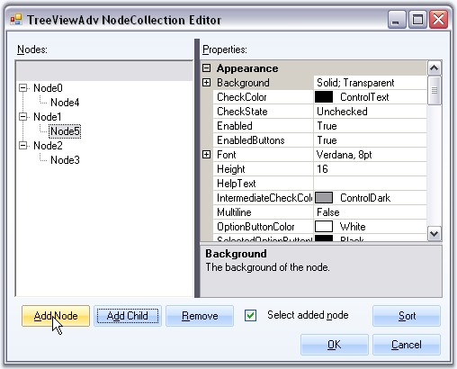
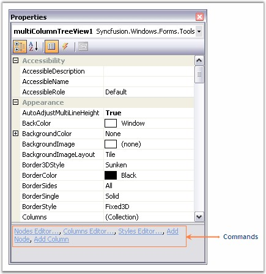
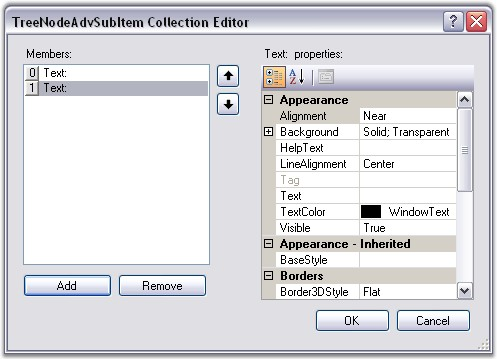

::: {style="DISPLAY: none"}
{#d2h_url_template}{#d2h_package_url style="WIDTH: 0px; DISPLAY: none; HEIGHT: 0px"}
:::

::: {.d2h_secondary_topic style="PADDING-BOTTOM: 10pt; MARGIN: 0pt; PADDING-LEFT: 0pt; PADDING-RIGHT: 0pt; PADDING-TOP: 0pt"}
##### Editors for the MultiColumnTreeView {#editors-for-the-multicolumntreeview style="MARGIN-LEFT: 18pt; tab-stops: 18.0pt"}

[]{style="COLOR: #15428b"} 

The following Editors are available for changing the appearance and behavior of the MultiColumnTreeView control.

 

 

**TreeViewAdv NodeCollection Editor**

 

This editor lets you add nodes, SubItems for the nodes and customize them using various property settings.\
\

{border="0"}

[]{style="COLOR: #15428b"} 

Figure 1186: TreeViewAdv NodeCollection Editor

[]{style="COLOR: #15428b"} 

This editor can be accessed using the below options.

[]{style="COLOR: #15428b"} 

[·      ]{style="FONT-FAMILY: Symbol; COLOR: #15428b"}Through the[ ]{style="COLOR: #15428b"}[[Context Menu of the control during designtime]{.UGHyperlink}](../../../../../../../../Documents%20and%20Settings/sylviap/Desktop/Tools%20-%20Part%202.docx#_Context_Menu_at)[.]{.UGHyperlink}[]{style="COLOR: #15428b"}

[[·      ]{style="FONT-FAMILY: Symbol; TEXT-DECORATION: none; text-underline: none"}]{.UGHyperlink}[[Tasks Windows.]{.UGHyperlink}](../../../../../../../../Documents%20and%20Settings/sylviap/Desktop/Tools%20-%20Part%202.docx#_DesignTime_Features)[]{.UGHyperlink}

[·      ]{style="FONT-FAMILY: Symbol"}Using **MultiColumnTreeView.Nodes** property in the property Grid.

[·      ]{style="FONT-FAMILY: Symbol"}Command at the bottom of the property grid.

[]{style="COLOR: #15428b"} 

{border="0"}

**[]{style="COLOR: #15428b"}** 

Figure 1187: Properties Grid Commands

**[]{style="COLOR: #15428b"}** 

Columns Editor

 

This lets you add columns and customize those columns appearance with [[style settings]{.UGHyperlink}](../../../../../../../../Documents%20and%20Settings/sylviap/Desktop/Tools%20-%20Part%202.docx#_Column_Styles)[.]{.UGHyperlink}

[]{style="COLOR: #15428b"} 

{border="0"}

***[]{style="COLOR: #15428b"}*** 

Figure 1188: Columns Editor

[]{style="COLOR: #15428b"} 

This editor can be accessed using the following options.

 

[·      ]{style="FONT-FAMILY: Symbol"}Through the [[Context Menu of the control during designtime]{.UGHyperlink}](../../../../../../../../Documents%20and%20Settings/sylviap/Desktop/Tools%20-%20Part%202.docx#_Context_Menu_at)[.]{.UGHyperlink}

[·      ]{style="FONT-FAMILY: Symbol"}Using **MultiColumnTreeView.Columns** property in the property Grid.

[·      ]{style="FONT-FAMILY: Symbol"}Command at the bottom of the property grid.

[]{style="COLOR: #15428b"} 

TreeNodeAdvSubItems Collection Editor

 

This editor lets you add subitems to the nodes and customize the subitems using the [[property settings]{.UGHyperlink}](../../../../../../../../Documents%20and%20Settings/sylviap/Desktop/Tools%20-%20Part%202.docx#_SubItem_Styles)[. ]{.UGHyperlink}It can be accessed through Node Collection Editor and selecting the SubItems Collection property.

[]{style="COLOR: #15428b"} 

{border="0"}

***[]{style="COLOR: #15428b"}*** 

Figure 1189: TreeNodeAdvSubItem Collection Editor

[]{style="COLOR: #15428b"} 

Styles Editor

 

This editor comes with default styles and also lets you add new style and apply to the nodes, subitems, and so on. The property settings are discussed in [[Styles Architecture]{.UGHyperlink}](../../../../../../../../Documents%20and%20Settings/sylviap/Desktop/Tools%20-%20Part%202.docx#_Styles_Architecture_1)[.]{.UGHyperlink}

[]{style="COLOR: #15428b"} 

{border="0"}

***[]{style="COLOR: #15428b"}*** 

Figure 1190: BaseStyles Collection Editor

[]{style="COLOR: #15428b"} 

This editor can be accessed using the below options.

[]{style="COLOR: #15428b"} 

[·      ]{style="FONT-FAMILY: Symbol; COLOR: #15428b"}Through the [[Context Menu of the control during designtime]{.UGHyperlink}](../../../../../../../../Documents%20and%20Settings/sylviap/Desktop/Tools%20-%20Part%202.docx#_Context_Menu_at)[.]{.UGHyperlink}[]{style="COLOR: #15428b"}

[·      ]{style="FONT-FAMILY: Symbol"}Using **MultiColumnTreeView.BaseStyles** property in the property Grid.

[·      ]{style="FONT-FAMILY: Symbol"}Command at the bottom of the property grid.

 

 

[]{#related-topics}
:::
