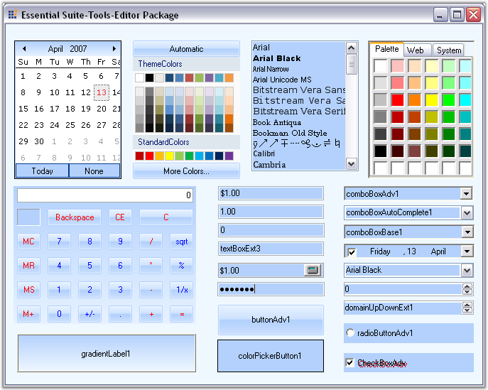
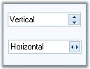
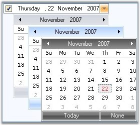

::: {style="DISPLAY: none"}
{#d2h_url_template}{#d2h_package_url style="WIDTH: 0px; DISPLAY: none; HEIGHT: 0px"}
:::

::::: {#nsbanner .d2h_main_nsbanner style="BORDER-BOTTOM: #999999 1px solid; POSITION: relative; PADDING-BOTTOM: 0px; BACKGROUND-COLOR: transparent; PADDING-LEFT: 0px; PADDING-RIGHT: 0px; DISPLAY: none; BORDER-TOP: #999999 1px solid; PADDING-TOP: 0px; LEFT: 0px"}
:::: {#TitleRow .d2h_main_titlerow style="PADDING-BOTTOM: 4px; BACKGROUND-COLOR: transparent; PADDING-LEFT: 22px; WIDTH: 100%; PADDING-RIGHT: 10px; DISPLAY: none; PADDING-TOP: 4px"}
::: {#ienav .d2h_main_ienav style="DISPLAY: none"}
{#D2HPrevious .D2HPreviousEnabled}  {#D2HNext .D2HNextEnabled}
:::
::::
:::::

:::: {#nstext .d2h_main_nstext style="PADDING-BOTTOM: 10px; BACKGROUND-COLOR: transparent; PADDING-LEFT: 22px; PADDING-RIGHT: 10px; HEIGHT: 100%; OVERFLOW: auto; PADDING-TOP: 5px" hasuserbackground="true" valign="bottom"}
::: {#d2h_breadcrumbs .d2h_breadcrumbs}
[Essential Studio User Guide Documentation](ms-xhelp:///?Id=12457748-09e3-4d74-a240-8e049cedf030){.d2h_breadcrumbsNormal}[ \> ]{.d2h_breadcrumbsLinkSeparator}[User Interface Edition](ms-xhelp:///?Id=c29296b7-531c-413b-a0ec-488ca1f7f669){.d2h_breadcrumbsNormal}[ \> ]{.d2h_breadcrumbsLinkSeparator}[Essential Windows](ms-xhelp:///?Id=e60759d8-47a4-4570-9d7a-16a68d63f2ea){.d2h_breadcrumbsNormal}[ \> ]{.d2h_breadcrumbsLinkSeparator}[Essential Tools]{.d2h_breadcrumbsContentsOnly}[ \> ]{.d2h_breadcrumbsLinkSeparator}[Tools Controls](ms-xhelp:///?Id=13c3c4f4-9d16-4b69-93f2-7e98eec67452){.d2h_breadcrumbsNormal}
:::

## Editors Package {#editors-package style="tab-stops: 0pt"}

 

[]{#p159}The Editors package is a comprehensive collection of controls most commonly used in creating data entry forms. All the editor controls architectures with a view to providing simple and powerful means for capturing data input, validating the data and displaying the data with the appropriate formatting. They also offer complete support for data binding, inter nationalization and localization.

{border="0"}[]{style="COLOR: #15428b"}

Figure 107: Editors Package

The Editors Package provides several controls that can be used in displaying, collecting and validating user input. The different controls that are included in the Editors Package have been listed and discussed below:

[]{style="COLOR: #15428b"} 

AutoAppend

[]{style="COLOR: #15428b"} 

It provides auto persisting of previously entered items in a Windows Forms combo box based on a category keyword and also populates the combo box control\'s items collection with the persisted list.

[]{style="COLOR: #15428b"} 

Features

**[]{style="COLOR: #15428b"}** 

[·      ]{style="FONT-FAMILY: Symbol"}A simple procedure is implemented to bind a combo box to an AutoAppend control.

[·      ]{style="FONT-FAMILY: Symbol"}Persistence and re initialization based on a category keyword. This enables multiple combo box controls to be bound to the same AutoAppend control.

[·      ]{style="FONT-FAMILY: Symbol"}Makes use of the **registry** for storing the list.

[·      ]{style="FONT-FAMILY: Symbol"}No need to write any additional code by the developer.

[·      ]{style="FONT-FAMILY: Symbol"}Automatically adds new items to the list when the validated event of the control gets fired.

AutoComplete

**[]{style="COLOR: #15428b"}** 

It expands strings that have been partially entered in an edit control, into complete strings based on a list of previously specified strings.

**[]{style="COLOR: #15428b"}** 

Features

**[]{style="COLOR: #15428b"}** 

[·      ]{style="FONT-FAMILY: Symbol"}Provides auto completion for text box and combo box controls by setting a few properties.

[·      ]{style="FONT-FAMILY: Symbol"}Supports AutoAppend and AutoSuggest modes of operation.

[·      ]{style="FONT-FAMILY: Symbol"}Displays multiple columns of information with optional image column and headers in AutoSuggest mode.

[·      ]{style="FONT-FAMILY: Symbol"}Allows data for auto completion to be managed by the AutoComplete control or by a datasource.

[·      ]{style="FONT-FAMILY: Symbol"}Provides auto completion to multiple text box and combo box controls on the same form.

[·      ]{style="FONT-FAMILY: Symbol"}Persists the size of the dropdown even after the application is closed.

[]{style="COLOR: #15428b"} 

AutoLabel

[]{style="COLOR: #15428b"} 

It helps to label other controls.

[]{style="COLOR: #15428b"} 

Features

[]{style="COLOR: #15428b"} 

[·      ]{style="FONT-FAMILY: Symbol"}We can specify where the label should appear.

[·      ]{style="FONT-FAMILY: Symbol"}It updates the position of label according to the labeled control.

[]{style="COLOR: black"} 

ButtonAdv

[]{style="COLOR: #15428b"} 

ButtonAdv is an extension to the Windows Forms Button control.

[]{style="COLOR: #15428b"} 

Features

[]{style="COLOR: #15428b"} 

[·      ]{style="FONT-FAMILY: Symbol"}Easily change the button type to browse, calculator etc.

[·      ]{style="FONT-FAMILY: Symbol"}Supports PushButton behavior.

[·      ]{style="FONT-FAMILY: Symbol"}Supports the disabling of the dotted rectangle by using the KeepFocusRectangle property when the button is in focus.

[·      ]{style="FONT-FAMILY: Symbol"}Supports BorderStyles.

[·      ]{style="FONT-FAMILY: Symbol"}Supports XP, Office 2003 and Office 2007 Visual Styles.

ButtonEdit

[]{style="COLOR: #15428b"} 

 It provides an easy way to create controls with an edit control and any number of associated buttons.

[]{style="COLOR: #15428b"} 

Features

**[]{style="COLOR: #15428b"}** 

[·      ]{style="FONT-FAMILY: Symbol"}Buttons can be added at design-time and their properties can be set through the designer.

[·      ]{style="FONT-FAMILY: Symbol"}Buttons\' widths can be custom specified.

[·      ]{style="FONT-FAMILY: Symbol"}Buttons can be left or right-aligned with respect to the text box.

[·      ]{style="FONT-FAMILY: Symbol"}Button events can be handled to provide desired functionality.

[·      ]{style="FONT-FAMILY: Symbol"}Supports XP, Office 2003 and Office 2007 Visual Styles.

 

Calculator Control

**[]{style="COLOR: #15428b"}** 

It provides an easy way to implement a complete calculator in your application.

[]{style="COLOR: #15428b"} 

Features

**[]{style="COLOR: #15428b"}** 

[·      ]{style="FONT-FAMILY: Symbol"}Implements all common arithmetic functions.

[·      ]{style="FONT-FAMILY: Symbol"}Supports keyboard input.

[·      ]{style="FONT-FAMILY: Symbol"}Can be displayed on a form or as a popup.

[·      ]{style="FONT-FAMILY: Symbol"}Can be displayed in the Windows Standard or financial layout.

[·      ]{style="FONT-FAMILY: Symbol"}Complete designer support.

[·      ]{style="FONT-FAMILY: Symbol"}Supports the customization of the font and color of the Calculator buttons.

[·      ]{style="FONT-FAMILY: Symbol"}Allows you to change the spacing between buttons, that are arranged in rows and columns, by using the VerticalSpacing and HorizontalSpacing properties.

[·      ]{style="FONT-FAMILY: Symbol"}Supports XP, Office 2003 and Office 2007 Visual Styles.

 

CheckBoxAdv

[]{style="COLOR: #15428b"} 

It is an advanced check box control. It is capable of displaying several backgrounds such as gradients and images.

[]{style="COLOR: #15428b"} 

Features

**[]{style="COLOR: #15428b"}** 

[·      ]{style="FONT-FAMILY: Symbol"}Support for gradient backgrounds.

[·      ]{style="FONT-FAMILY: Symbol"}Supports different images and checked graphics.

[·      ]{style="FONT-FAMILY: Symbol"}Can specify larger images for the ImageCheckBox.

[·      ]{style="FONT-FAMILY: Symbol"}Complete designer support.

[·      ]{style="FONT-FAMILY: Symbol"}Supports the CheckAlign property.

[·      ]{style="FONT-FAMILY: Symbol"}Supports images for the items listed.

[]{style="COLOR: #15428b"} 

ColorPickerButton

**[]{style="COLOR: #15428b"}** 

It allows **.NET** developers to provide a standard user interface similar to the Visual Studio .NET color picker dropdown, for selecting colors in Windows Forms applications. The ColorPickerButton displays the **ColorUIControl** as a drop-down in combination with a button.

[]{style="COLOR: #15428b"} 

Features

**[]{style="COLOR: #15428b"}** 

[·      ]{style="FONT-FAMILY: Symbol"}Palette, Web and System colors panels.

[·      ]{style="FONT-FAMILY: Symbol"}Selective inclusion of panels.

[·      ]{style="FONT-FAMILY: Symbol"}Complete designer support.

[]{style="COLOR: #15428b"} 

ColorUIControl

[]{style="COLOR: #15428b"} 

It allows **.NET** developers to provide a standard user-interface, similar to the Visual Studio .NET color picker drop-down, for selecting colors in their Windows Forms applications. The ColorUIControl implements a palette type visual interface comprising of the System, Standard and the Custom color groups.

[]{style="COLOR: #15428b"} 

Features

**[]{style="COLOR: #15428b"}** 

[·      ]{style="FONT-FAMILY: Symbol"}Palette, Web and System colors panels.

[·      ]{style="FONT-FAMILY: Symbol"}Selective inclusion of panels.

[·      ]{style="FONT-FAMILY: Symbol"}Complete designer support.

[·      ]{style="FONT-FAMILY: Symbol"}Can be attached to any other control.

[·      ]{style="FONT-FAMILY: Symbol"}The customization of color cells in the ColorUI can be done in a new palette named UserColors where different shades of user defined Colors can be set and the Color cells can be re sized.

[]{style="COLOR: #15428b"} 

ColorPickerUIAdv

**[]{style="COLOR: #15428b"}** 

The Essential Tools **ColorPickerUIAdv** allows **.NET** developers to provide Microsoft Word 2007 ColorCells for selecting colors in their applications. The ColorPickerUIAdv comprises of a panel displaying colors with themes and standard colors.

[]{style="COLOR: #15428b"} 

Features

**[]{style="COLOR: #15428b"}** 

[·      ]{style="FONT-FAMILY: Symbol"}ColorPickerUIAdv can be created programmatically.

[·      ]{style="FONT-FAMILY: Symbol"}The ColorPickerUIAdv allows us to set the ColorGroups from which the color can be selected.

[·      ]{style="FONT-FAMILY: Symbol"}The selected color of ColorPickerUIAdv can be applied to any control or text.

[]{style="COLOR: #15428b"} 

ComboBoxAdv

[]{style="COLOR: #15428b"} 

The ComboBoxAdv pre-binds a list box in its drop-down area and includes some additional API to provide a framework combo box-like object-model and data binding support.

[]{style="COLOR: #15428b"} 

Features

**[]{style="COLOR: #15428b"}** 

[·      ]{style="FONT-FAMILY: Symbol"}3D border styles and flat styles can be applied for the control.

[·      ]{style="FONT-FAMILY: Symbol"}Images can be included for the ComboBoxAdv Items.

[·      ]{style="FONT-FAMILY: Symbol"}AutoComplete functionality can be integrated.

[·      ]{style="FONT-FAMILY: Symbol"}Can be bound to any external datasource.

[·      ]{style="FONT-FAMILY: Symbol"}Supports XP, Office 2003 and Office 2007 Visual Styles.

[]{style="COLOR: #15428b"} 

ComboBoxAutoComplete

[]{style="COLOR: #15428b"} 

It combines a combo box control with an AutoComplete control to provide auto completion for that instance of the combo box.

[]{style="COLOR: #15428b"} 

Features

**[]{style="COLOR: #15428b"}** 

[·      ]{style="FONT-FAMILY: Symbol"}Provides easy auto completion for a combo box control.

[·      ]{style="FONT-FAMILY: Symbol"}Supports **AutoAppend** and **AutoSuggest** modes of operation.

[·      ]{style="FONT-FAMILY: Symbol"}Displays multiple columns of information with optional image column and headers in AutoSuggest mode.

[·      ]{style="FONT-FAMILY: Symbol"}Allows data for auto completion to be managed by the AutoComplete control or by a datasource.

[]{style="COLOR: #15428b"} 

ComboBoxBase

[]{style="COLOR: #15428b"} 

It is an alternative to the standard combo box control. It separates the edit portion from the drop-down list portion thereby making this architecture powerful and flexible.

[]{style="COLOR: #15428b"} 

Features

**[]{style="COLOR: #15428b"}** 

[·      ]{style="FONT-FAMILY: Symbol"}Ability to plug-in any ListControl Derived Class, to provide the list for the combobox base.

[·      ]{style="FONT-FAMILY: Symbol"}Customization Support for everything in the combo box, from the text box to the drop-down window.

[·      ]{style="FONT-FAMILY: Symbol"}Advanced border drawing features.

[·      ]{style="FONT-FAMILY: Symbol"}Themes support

[·      ]{style="FONT-FAMILY: Symbol"}Extensibility

[·      ]{style="FONT-FAMILY: Symbol"}AutoAppending

[]{style="COLOR: #15428b"} 

Combo Drop-Down

[]{style="COLOR: #15428b"} 

This flexible combo box control provides a standard combo box look-and-feel with the ability to host any control in the drop-down.

[]{style="COLOR: #15428b"} 

Features

**[]{style="COLOR: #15428b"}** 

[·      ]{style="FONT-FAMILY: Symbol"}Any control can be easily associated and displayed in the combo drop-down.

[·      ]{style="FONT-FAMILY: Symbol"}Advanced border styles.

[·      ]{style="FONT-FAMILY: Symbol"}Supports XP, Office 2003 and Office 2007 Visual Styles.

[]{style="COLOR: #15428b"} 

Currency Edit

[]{style="COLOR: #15428b"} 

It embeds a **CurrencyTextBox control** and a button that can display a PopupCalculator when clicked.

[]{style="COLOR: #15428b"} 

Features

**[]{style="COLOR: #15428b"}** 

[·      ]{style="FONT-FAMILY: Symbol"}Easily perform calculations with contents of CurrencyTextBox

[·      ]{style="FONT-FAMILY: Symbol"}Globalization support

[·      ]{style="FONT-FAMILY: Symbol"}Databinding support

[·      ]{style="FONT-FAMILY: Symbol"}Full designer support

[]{style="COLOR: #15428b"} 

Currency Text-Box

**[]{style="COLOR: #15428b"}** 

It provides currency specific behavior in edit controls. It implements all the functionality needed for formatting currency input and validation.

[]{style="COLOR: #15428b"} 

Features

**[]{style="COLOR: #15428b"}** 

[·      ]{style="FONT-FAMILY: Symbol"}Keyboard input validation

[·      ]{style="FONT-FAMILY: Symbol"}Globalization support

[·      ]{style="FONT-FAMILY: Symbol"}Databinding support

[·      ]{style="FONT-FAMILY: Symbol"}Full designer support

**[]{style="COLOR: #15428b"}** 

DateTimePickerAdv

**[]{style="COLOR: #15428b"}** 

It provides an easy way to implement a culture-based DateTimePicker in an application.

[]{style="COLOR: #15428b"} 

Features

**[]{style="COLOR: #15428b"}** 

[·      ]{style="FONT-FAMILY: Symbol"}Inter nationalization.

[·      ]{style="FONT-FAMILY: Symbol"}Databinding Support.

[·      ]{style="FONT-FAMILY: Symbol"}Supports setting and displaying NULL values.

[·      ]{style="FONT-FAMILY: Symbol"}The DateTimePickerAdv can display a custom drop-down calendar.

[·      ]{style="FONT-FAMILY: Symbol"}The DateTimePickerAdv control supports XP Themes when applicable.

[·      ]{style="FONT-FAMILY: Symbol"}Supports displaying the UpDown button only when the control has focus.

[·      ]{style="FONT-FAMILY: Symbol"}Supports XP, Office 2003 and Office 2007 Visual Styles.

[]{style="COLOR: #15428b"} 

DomainUpDownExt

[]{style="COLOR: #15428b"} 

DomainUpDownExt is an advanced version of the standard windows DomainUpDown control.

[]{style="COLOR: #15428b"} 

Features

[]{style="COLOR: #15428b"} 

[·      ]{style="FONT-FAMILY: Symbol"}Themes support

[·      ]{style="FONT-FAMILY: Symbol"}Flexible in providing increment and decrement values.

[·      ]{style="FONT-FAMILY: Symbol"}**DomainUpDownExt SpinOrientation** - Added ability to show spin buttons using vertical (up and down buttons) or horizontal (left and right buttons) orientations with [SpinOrientation]{style="COLOR: blue; TEXT-DECORATION: none; text-underline: none"} property.

[]{style="COLOR: #15428b"} 

[]{style="COLOR: #15428b"} 

{border="0"}

Figure 108: Spin Orientation options for the DomainUpDownExt Control

[]{style="COLOR: #15428b"} 

[·      ]{style="FONT-FAMILY: Symbol"}**Office2007Style** - Added ability to set all the three color schemes, Blue, Silver and Black for Office2007 style.

[]{style="COLOR: #15428b"} 

{border="0"}

***[]{style="COLOR: #15428b"}*** 

Figure 109: DomainUpDownExt control with Blue, Silver and Black Office 2007 Visual Styles

[]{style="COLOR: #15428b"} 

Double TextBox

[]{style="COLOR: #15428b"} 

It is a text box-derived control that can display double data type values.

**[]{style="COLOR: #15428b"}** 

Features

**[]{style="COLOR: #15428b"}** 

[·      ]{style="FONT-FAMILY: Symbol"}Supports display of double values.

[·      ]{style="FONT-FAMILY: Symbol"}Supports values with a precision of 15 characters. The maximum and minimum values supported are by default the minimum and maximum values for the double data type.

[·      ]{style="FONT-FAMILY: Symbol"}Supports displaying negative values in a different color and also using different negative formats.

[·      ]{style="FONT-FAMILY: Symbol"}Handles user keyboard input and double formatting.

[·      ]{style="FONT-FAMILY: Symbol"}Themes support.

[·      ]{style="FONT-FAMILY: Symbol"}Uses the globalization features of the **.NET** platform to provide locale specific formatting.

 

Editable List

[]{style="COLOR: #15428b"} 

It provides an editable Windows Forms list box with a Windows Forms text box and button on the current row to facilitate in-place editing.

[]{style="COLOR: #15428b"} 

Features

**[]{style="COLOR: #15428b"}** 

[·      ]{style="FONT-FAMILY: Symbol"}Offers in place editing.

[·      ]{style="FONT-FAMILY: Symbol"}Supports auto completion from the list.

[]{style="COLOR: #15428b"} 

Folder Browser

[]{style="COLOR: #15428b"} 

FolderBrowser component provides a convenient and easy to use object oriented wrapper for the **Win32 Shell folder browser API**.

[]{style="COLOR: #15428b"} 

Features

**[]{style="COLOR: #15428b"}** 

[·      ]{style="FONT-FAMILY: Symbol"}Includes textbox with Auto Completion support.

[·      ]{style="FONT-FAMILY: Symbol"}Templates Support

[·      ]{style="FONT-FAMILY: Symbol"}Supports the property that allows the specification of Custom Start Location.

[]{style="COLOR: #15428b"} 

FontListBox

**[]{style="COLOR: #15428b"}** 

FontListBox is the list box derived controls that are automatically populated with the fonts installed in the user\'s system.

[]{style="COLOR: #15428b"} 

Features

[]{style="COLOR: #15428b"} 

[·      ]{style="FONT-FAMILY: Symbol"}Supports AutoComplete behavior.

[·      ]{style="FONT-FAMILY: Symbol"}Offers Single - Select and Multi- Select options.

[]{style="COLOR: #15428b"} 

Font ComboBox

**[]{style="COLOR: #15428b"}** 

FontComboBox is the Combobox derived controls that are automatically populated with the fonts installed in the user\'s system.

**[]{style="COLOR: #15428b"}** 

Features

**[]{style="COLOR: #15428b"}** 

[·      ]{style="FONT-FAMILY: Symbol"}Supports AutoComplete behavior.

[]{style="COLOR: #15428b"} 

GradientLabel

[]{style="COLOR: #15428b"} 

It provides a way for create visually appealing labels for Windows Forms Controls.

[]{style="COLOR: #15428b"} 

Features

**[]{style="COLOR: #15428b"}** 

[·      ]{style="FONT-FAMILY: Symbol"}Customizable background.

[·      ]{style="FONT-FAMILY: Symbol"}Support for different borders and patterns.

[]{style="COLOR: #15428b"} 

Integer TextBox

[]{style="COLOR: #15428b"} 

It is derived from a Windows Forms framework text box control and can display integer data type values.

[]{style="COLOR: #15428b"} 

Features

**[]{style="COLOR: #15428b"}** 

[·      ]{style="FONT-FAMILY: Symbol"}Displays Int64 values.

[·      ]{style="FONT-FAMILY: Symbol"}Default minimum and maximum values correspond to the Int64 data type values.

[·      ]{style="FONT-FAMILY: Symbol"}Displays negative values in a different color.

[·      ]{style="FONT-FAMILY: Symbol"}Uses different negative formats.

[·      ]{style="FONT-FAMILY: Symbol"}Handles user keyboard input and double formatting.

[·      ]{style="FONT-FAMILY: Symbol"}Uses the globalization features of the .NET platform to provide locale-specific formatting.

[·      ]{style="FONT-FAMILY: Symbol"}Themes Support.

[]{style="COLOR: #15428b"} 

Masked EditBox

**[]{style="COLOR: #15428b"}** 

It provides an easy and reliable way of collecting user input and displaying standard data in specific formats from any data source.

[]{style="COLOR: #15428b"} 

Features

**[]{style="COLOR: #15428b"}** 

[·      ]{style="FONT-FAMILY: Symbol"}Compatible with Windows Forms Textbox control.

[·      ]{style="FONT-FAMILY: Symbol"}Supports all the commonly used Mask Symbols.

[·      ]{style="FONT-FAMILY: Symbol"}Complete support for the common clipboard operations.

[]{style="COLOR: #15428b"} 

MonthCalendarAdv

**[]{style="COLOR: #15428b"}** 

It is an advanced calendar control that can display a full month of the year with the appropriate culture information for the months and days of the week.

[]{style="COLOR: #15428b"} 

Features

[]{style="COLOR: #15428b"} 

[·      ]{style="FONT-FAMILY: Symbol"}Supports the BorderStyles for the Calendar.

[·      ]{style="FONT-FAMILY: Symbol"}Supports a DoubleClick event.

[·      ]{style="FONT-FAMILY: Symbol"}Supports  images for the left scroll button and the right scroll button.

[·      ]{style="FONT-FAMILY: Symbol"}The images for the scroll buttons can be stretched or shrunk to fit the size of the scroll buttons.

[·      ]{style="FONT-FAMILY: Symbol"}Displays the week number along the left side of the month calendar.

[·      ]{style="FONT-FAMILY: Symbol"}Can set the WeekFont, WeekTextColor and WeekInterior.

[·      ]{style="FONT-FAMILY: Symbol"}Supports XP, Office 2003 and Office 2007 Visual Styles.

[]{style="COLOR: #15428b"} 

MultiColumnComboBox

**[]{style="COLOR: #15428b"}** 

It is an advanced combo box control that has the capability to show multiple columns in the drop-down list.

[]{style="COLOR: #15428b"} 

Features

**[]{style="COLOR: #15428b"}** 

[·      ]{style="FONT-FAMILY: Symbol"}Can be bound to very large datasources, instantaneously.

[·      ]{style="FONT-FAMILY: Symbol"}Supports XP, Office 2003 and Office 2007 Visual Styles.

 

NumericUpDownExt

**[]{style="COLOR: #15428b"}** 

It enables XP Themed look-and-feel for the UpDown controls that are missing in the corresponding **.NET** Control.

[]{style="COLOR: #15428b"} 

Features

**[]{style="COLOR: #15428b"}** 

[·      ]{style="FONT-FAMILY: Symbol"}XP Themed look and feel.

[·      ]{style="FONT-FAMILY: Symbol"}Support for displaying negative values in a different color.

[]{style="COLOR: #15428b"} 

Percent TextBox

**[]{style="COLOR: #15428b"}** 

It is a text box-derived control that can display double data type values in percentage format.

[]{style="COLOR: #15428b"} 

Features

**[]{style="COLOR: #15428b"}** 

[·      ]{style="FONT-FAMILY: Symbol"}Supports display of percent values in two modes - Percent and Double.

[·      ]{style="FONT-FAMILY: Symbol"}In PercentMode, the values are edited as percentage values itself.

[·      ]{style="FONT-FAMILY: Symbol"}In DoubleMode, the values are edited as double values and then displayed using percentage formatting.

[·      ]{style="FONT-FAMILY: Symbol"}Uses the globalization features of the .NET platform to provide locale-specific formatting.

[]{style="COLOR: #15428b"} 

PopupControlContainer

**[]{style="COLOR: #15428b"}** 

It is a panel-derived control that allows users to populate it with child controls in code or during design-time.

[]{style="COLOR: #15428b"} 

Features

**[]{style="COLOR: #15428b"}** 

[·      ]{style="FONT-FAMILY: Symbol"}Various User Interface child controls can be integrated in the PopupControlContainer.

[·      ]{style="FONT-FAMILY: Symbol"}Allows the user to populate the popup with the desired parent control.

 

RadioButtonAdv

[]{style="COLOR: #15428b"} 

RadioButtonAdv functions are similar to the standard windows RadioButton, with some additional enhancements.

[]{style="COLOR: #15428b"} 

Features

[]{style="COLOR: #15428b"} 

[·      ]{style="FONT-FAMILY: Symbol"}Supports visual themes.

[·      ]{style="FONT-FAMILY: Symbol"}Images can be displayed as the check.

 

TextBoxExt

[]{style="COLOR: #15428b"} 

It is a text box-derived control that can display different border colors and styles.

[]{style="COLOR: #15428b"} 

Features

**[]{style="COLOR: #15428b"}** 

[·      ]{style="FONT-FAMILY: Symbol"}The control provides different 2D and 3D border styles for a regular text box.

[·      ]{style="FONT-FAMILY: Symbol"}Offers Themes support and flow indicators.

[·      ]{style="FONT-FAMILY: Symbol"}Custom Colors can be applied for the following controls. ComboBoxAdv, ComboDropDown, ComboBoxAutoComplete and TextBoxExt. See Visual Styles topic.

[]{style="COLOR: #15428b"} 

More:

[ ]{#related-topics}

[{border="0" align="absMiddle"}AutoComplete Controls](ms-xhelp:///?Id=a8119811-9914-40fd-b1c7-3eac067b8283){style="TEXT-DECORATION: none"}

[{border="0" align="absMiddle"}Button Controls](ms-xhelp:///?Id=6fefc448-e18a-478f-ad3f-c62b52f5c4ff){style="TEXT-DECORATION: none"}

[{border="0" align="absMiddle"}CalendarDateTime Controls](ms-xhelp:///?Id=775b2369-64aa-48f6-aed1-d8f36225c600){style="TEXT-DECORATION: none"}

[{border="0" align="absMiddle"}ColorUI Controls](ms-xhelp:///?Id=e89ee0f3-a4a6-483e-8318-3360d0badef2){style="TEXT-DECORATION: none"}

[{border="0" align="absMiddle"}ComboBox Controls](ms-xhelp:///?Id=55bb0594-f931-43c7-814b-d6f9bdb90f40){style="TEXT-DECORATION: none"}

[{border="0" align="absMiddle"}Container Control](ms-xhelp:///?Id=e3fde6c4-d842-40fa-810a-0f9f1a403597){style="TEXT-DECORATION: none"}

[{border="0" align="absMiddle"}Dialog Control](ms-xhelp:///?Id=88cb6f22-0ac9-4a93-a4f2-8f23701bdb67){style="TEXT-DECORATION: none"}

[{border="0" align="absMiddle"}Editor Controls](ms-xhelp:///?Id=d82da28f-42fa-4790-b0ab-00cfe701dffb){style="TEXT-DECORATION: none"}

[{border="0" align="absMiddle"}Font Controls](ms-xhelp:///?Id=1f424d63-36df-4a5e-9c71-cb0050e794a1){style="TEXT-DECORATION: none"}

[{border="0" align="absMiddle"}Label Controls](ms-xhelp:///?Id=1a7474eb-6a4b-4ee1-bb36-1be4f81f1e70){style="TEXT-DECORATION: none"}

[{border="0" align="absMiddle"}Select Option Controls](ms-xhelp:///?Id=e0214cfe-8f51-4191-bbcf-9f2a8106c457){style="TEXT-DECORATION: none"}

[{border="0" align="absMiddle"}SpellChecker](ms-xhelp:///?Id=4d95cf41-2ac9-41f3-adcd-90ae33646dc8){style="TEXT-DECORATION: none"}
::::
