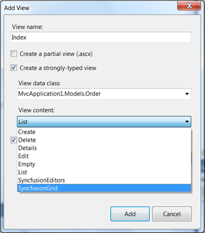
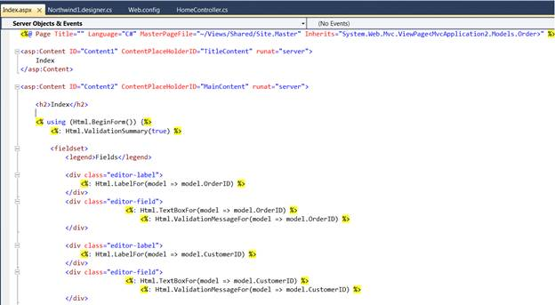
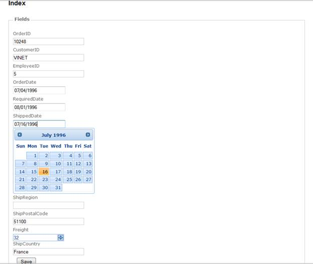

::: {style="DISPLAY: none"}
{#d2h_url_template}{#d2h_package_url style="WIDTH: 0px; DISPLAY: none; HEIGHT: 0px"}
:::

::: {.d2h_secondary_topic style="PADDING-BOTTOM: 10pt; MARGIN: 0pt; PADDING-LEFT: 0pt; PADDING-RIGHT: 0pt; PADDING-TOP: 0pt"}
#### Editors Template {#editors-template style="tab-stops: 0pt"}

To create an Editor template using custom Syncfusion T4 templates, follow the steps below.

 

1.   Open a new Tools MVC Project template which is fully configured for Tools for MVC controls. Refer to [[MVC Project Template]{style="COLOR: blue"}]{.underline} for additional information[.]{style="COLOR: black"}

2.   In your Visual Studio Project, right-click the **Home** folder and click **Add** followed by **View**. The following image illustrates this.

 

{border="0"}

Figure 27: Adding a View

 

 

3.   To use Editors templates in the **Add View** dialog, select **Editors Template** from the **View Content** drop-down list as shown below.

 

{border="0"}

Figure 28: Selecting Editors Template

*[]{style="FONT-SIZE: 9pt"}* 

4.   In the **Index.aspx** file, controls are decided according to the column types. They are:

 

[·      ]{style="FONT-FAMILY: Symbol"}Integer---Numeric TextBox

[·      ]{style="FONT-FAMILY: Symbol"}DateTime---DatePicker

[·      ]{style="FONT-FAMILY: Symbol"}String---TextBox

{border="0"}

Figure 29: Controls Bound to a Database

*[]{style="FONT-SIZE: 9pt"}* 

5.   Refer to the [[[Tools MVC UG]{style="COLOR: blue"}]{.underline}](http://help.syncfusion.com/ug_83/User%20Interface/ASP.NET%20MVC/Tools/index.htm) for further customization information.

[]{style="FONT-FAMILY: 'Myriad Pro','sans-serif'"} 

{border="0"}

Figure 30: Editor Controls Rendered in the Index Page

[]{style="FONT-FAMILY: 'Myriad Pro','sans-serif'"} 

[]{#_Template_Location}[]{#_Configuring_CellEditType}[]{style="COLOR: black"} 

[]{style="FONT-FAMILY: 'Times New Roman','serif'; FONT-SIZE: 12pt"} 

[]{style="FONT-FAMILY: 'Calibri','sans-serif'"} 

[]{style="FONT-FAMILY: 'Times New Roman','serif'; FONT-SIZE: 12pt"} 

[]{#related-topics}
:::
