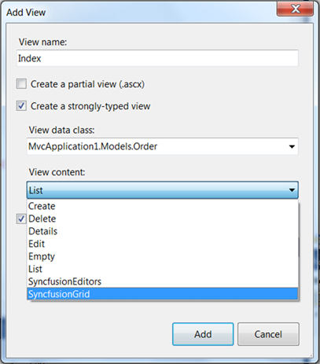
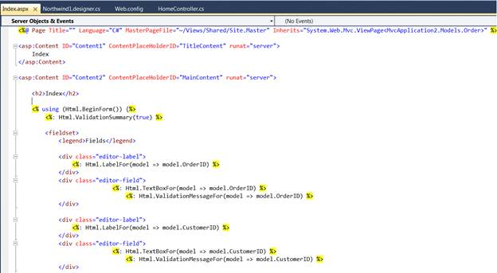
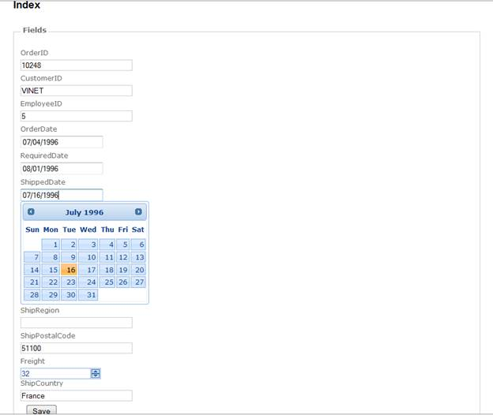

::: {style="DISPLAY: none"}
{#d2h_url_template}{#d2h_package_url style="WIDTH: 0px; DISPLAY: none; HEIGHT: 0px"}
:::

::: {.d2h_secondary_topic style="PADDING-BOTTOM: 10pt; MARGIN: 0pt; PADDING-LEFT: 0pt; PADDING-RIGHT: 0pt; PADDING-TOP: 0pt"}
#### Editors Template {#editors-template style="tab-stops: 0pt"}

To create an Editor Template using custom Syncfusion T4 Templates, follow the below steps.

 

16.  Open a new Tools MVC Project template which is fully configured for Tools MVC Controls. Refer [MVC Project Template]{.UGHyperlink}[.]{.UGHyperlink}

17.  Now, in VisualStudio Project right click **Home** folder and click **Add** followed by **View**. The below image illustrates this.

 

{border="0"}

Figure 25: Adding View

18.  To use Editors Template in AddView dialog, select **Editors Template** from **View Content** dropdown list as shown below.

 

{border="0"}

Figure 26: Selecting Editors Template

*[]{style="FONT-SIZE: 9pt"}* 

19.  In Index.aspx file, controls are decided according to the column types. They are:

 

[·      ]{style="FONT-FAMILY: Symbol"}Integer -- Numeric Textbox

[·      ]{style="FONT-FAMILY: Symbol"}DateTime -- DatePicker

[·      ]{style="FONT-FAMILY: Symbol"}String -- TextBox

{border="0"}

Figure 27: Controls are bounded to Database

*[]{style="FONT-SIZE: 9pt"}* 

20.  Refer [[Tools MVC UG]{.UGHyperlink}](http://help.syncfusion.com/ug_83/User%20Interface/ASP.NET%20MVC/Tools/index.htm), for further customization.

[]{style="FONT-FAMILY: 'Myriad Pro','sans-serif'"} 

{border="0"}

Figure 28: Editor Controls are rendered in Index page

[]{style="FONT-FAMILY: 'Calibri','sans-serif'"} 

[]{style="FONT-FAMILY: 'Calibri','sans-serif'"} 

[]{style="COLOR: black"} 

[]{#related-topics}
:::
