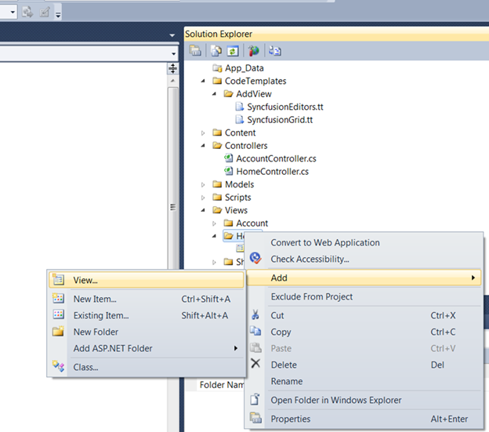

::: {style="DISPLAY: none"}
{#d2h_url_template} {#d2h_package_url style="WIDTH: 0px; DISPLAY: none; HEIGHT: 0px"}
:::

::: {.d2h_secondary_topic style="PADDING-BOTTOM: 10pt; MARGIN: 0pt; PADDING-LEFT: 0pt; PADDING-RIGHT: 0pt; PADDING-TOP: 0pt"}
#### Editors Template {#editors-template style="tab-stops: 0pt"}

To create an Editor Template using custom Syncfusion T4 Templates, follow the below steps.

 

[1.   ]{style="COLOR: black"}Open a new Tools MVC Project template which is fully configured for Tools MVC Controls. Refer [MVC Project Template]{style="COLOR: windowtext; TEXT-DECORATION: none; text-underline: none"}

2.   Now, in VisualStudio Project right click **Home** folder and click **Add** followed by **View**. The below image illustrates this.

[]{style="FONT-FAMILY: 'Arial','sans-serif'"} 

{border="0"}

Figure 26: Adding View

3.   To use Editors Template in AddView dialog, select **Editors Template** from **View Content** dropdownlist as shown below.

[]{style="FONT-FAMILY: 'Arial','sans-serif'"} 

{border="0"}

Figure 27: Selecting Editors Template

*[]{style="FONT-FAMILY: 'Arial','sans-serif'; FONT-SIZE: 9pt"}*  

4.   In Index.aspx file, controls are decided according to the column types. They are:

**[]{style="FONT-FAMILY: 'Arial','sans-serif'"}**  

[·      ]{style="FONT-FAMILY: Symbol"}Integer -- Numeric Textbox

[·      ]{style="FONT-FAMILY: Symbol"}DateTime -- DatePicker

[·      ]{style="FONT-FAMILY: Symbol"}String -- TextBox

{border="0"}

Figure 28: Controls are bounded to Database

*[]{style="FONT-FAMILY: 'Arial','sans-serif'; FONT-SIZE: 9pt"}*  

5.   Refer [[Tools MVC UG]{style="COLOR: windowtext; TEXT-DECORATION: none; text-underline: none"}](http://help.syncfusion.com/ug_83/User%20Interface/ASP.NET%20MVC/Tools/index.htm), for further customization.

[]{style="FONT-FAMILY: 'Myriad Pro','sans-serif'"} 

{border="0"}

Figure 29: Editor Controls are rendered in Index page

 

[]{#related-topics}
:::
