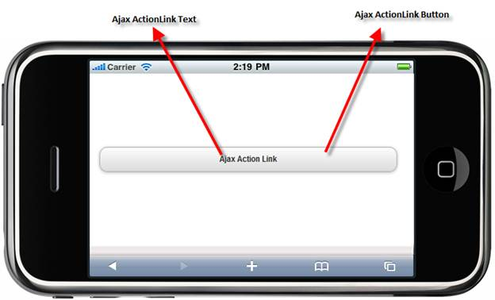

::: {style="DISPLAY: none"}
{#d2h_url_template} {#d2h_package_url style="WIDTH: 0px; DISPLAY: none; HEIGHT: 0px"}
:::

::: {.d2h_secondary_topic style="PADDING-BOTTOM: 10pt; MARGIN: 0pt; PADDING-LEFT: 0pt; PADDING-RIGHT: 0pt; PADDING-TOP: 0pt"}
#### Elaborate Structure of AjaxActionLink Button Control {#elaborate-structure-of-ajaxactionlink-button-control style="tab-stops: 0pt"}

The following image shows the AjaxActionLink Button control.[]{style="FONT-SIZE: 9pt"}

{border="0"}\
\

Figure225: Structure of AjaxActionLink Button Control

[]{#related-topics}
:::
