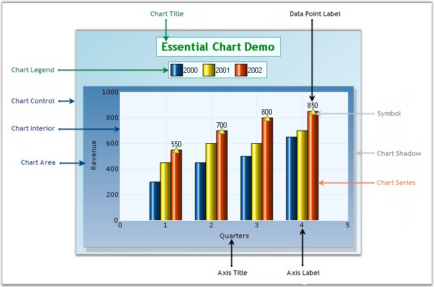

::: {style="DISPLAY: none"}
{#d2h_url_template}{#d2h_package_url style="WIDTH: 0px; DISPLAY: none; HEIGHT: 0px"}
:::

::::: {#nsbanner .d2h_main_nsbanner style="BORDER-BOTTOM: #999999 1px solid; POSITION: relative; PADDING-BOTTOM: 0px; BACKGROUND-COLOR: transparent; PADDING-LEFT: 0px; PADDING-RIGHT: 0px; DISPLAY: none; BORDER-TOP: #999999 1px solid; PADDING-TOP: 0px; LEFT: 0px"}
:::: {#TitleRow .d2h_main_titlerow style="PADDING-BOTTOM: 4px; BACKGROUND-COLOR: transparent; PADDING-LEFT: 22px; WIDTH: 100%; PADDING-RIGHT: 10px; DISPLAY: none; PADDING-TOP: 4px"}
::: {#ienav .d2h_main_ienav style="DISPLAY: none"}
{#D2HPrevious .D2HPreviousEnabled}  {#D2HNext .D2HNextEnabled}
:::
::::
:::::

:::: {#nstext .d2h_main_nstext style="PADDING-BOTTOM: 10px; BACKGROUND-COLOR: transparent; PADDING-LEFT: 22px; PADDING-RIGHT: 10px; HEIGHT: 100%; OVERFLOW: auto; PADDING-TOP: 5px" hasuserbackground="true" valign="bottom"}
::: {#d2h_breadcrumbs .d2h_breadcrumbs}
[Essential Studio User Guide Documentation](ms-xhelp:///?Id=12457748-09e3-4d74-a240-8e049cedf030){.d2h_breadcrumbsNormal}[ \> ]{.d2h_breadcrumbsLinkSeparator}[User Interface Edition](ms-xhelp:///?Id=c29296b7-531c-413b-a0ec-488ca1f7f669){.d2h_breadcrumbsNormal}[ \> ]{.d2h_breadcrumbsLinkSeparator}[Essential ASP.NET](ms-xhelp:///?Id=25c35330-c127-4dad-9a92-ed79dc7261a6){.d2h_breadcrumbsNormal}[ \> ]{.d2h_breadcrumbsLinkSeparator}[Essential Chart]{.d2h_breadcrumbsContentsOnly}[ \> ]{.d2h_breadcrumbsLinkSeparator}[Getting Started](ms-xhelp:///?Id=e6f85824-7e04-4dab-9e3f-effb3938f621){.d2h_breadcrumbsNormal}
:::

## Elaborate Structure of the Control {#elaborate-structure-of-the-control style="tab-stops: 0pt"}

[]{style="FONT-FAMILY: 'Trebuchet MS','sans-serif'; FONT-SIZE: 9pt"} 

This section gives you an idea of the different sections of a Chart Control. Below is the image that illustrates various sections of the control and their description in detail below.

[]{style="FONT-FAMILY: 'Trebuchet MS','sans-serif'; FONT-SIZE: 9pt"} 

{border="0"}

[]{style="FONT-FAMILY: 'Trebuchet MS','sans-serif'; FONT-SIZE: 9pt"} 

Figure 11: Structure of Chart Control

**[]{style="FONT-FAMILY: 'Trebuchet MS','sans-serif'; FONT-SIZE: 9pt"}** 

Elements and Features

**[]{style="FONT-FAMILY: 'Trebuchet MS','sans-serif'; FONT-SIZE: 9pt"}** 

[·      ]{style="FONT-FAMILY: Symbol"}**Chart Title**: The Chart title is the area at the top of the Chart control that displays the text of the ChartControl.

 

[·      ]{style="FONT-FAMILY: Symbol"}**Chart Legend**: The Chart legend is the portion of the display showing an entry for each of the data series added to the ChartControl. The Chart legend is positioned in line within the ChartControl (but outside the ChartArea) by default. However, if the chart legend is set to floating mode, the Chart legend can be positioned any where inside the Chart Control. The legend can also contain custom items with custom image and text.

 

[·      ]{style="FONT-FAMILY: Symbol"}**Chart Area**: This is the section that holds the plots / graphs that are defined in the Chart. The Chart Area also includes the Chart axes that are defined. A primary x-axis and primary y-axis are defined by default.

 

[·      ]{style="FONT-FAMILY: Symbol"}**Chart Control**: The Chart Control is the complete visible display for the Control. All other sections will be inside the ChartControl.

 

[·      ]{style="FONT-FAMILY: Symbol"}**Chart Series**: Chart Series are the elements present inside the chart area.

 

[·      ]{style="FONT-FAMILY: Symbol"}**Series Symbol**: Symbol that can be placed on the series points.

 

[·      ]{style="FONT-FAMILY: Symbol"}**Chart Shadow**: Chart Area Shadow indicates the shadow of the chart area.

 

[·      ]{style="FONT-FAMILY: Symbol"}**Chart Interior**: This section is the interior part of the chart control, within the chart area, which contains the data points plotted against X-axis and Y-axis.

 

[·      ]{style="FONT-FAMILY: Symbol"}**Chart Label**: Represents the label texts on the axes data points in a Chart.

 

[·      ]{style="FONT-FAMILY: Symbol"}**Axis Title**: Indicates the title for individual axis.

[]{style="FONT-FAMILY: 'Trebuchet MS','sans-serif'; FONT-SIZE: 9pt"} 

**[See Also]{style="FONT-FAMILY: 'Trebuchet MS','sans-serif'"}**

[]{style="FONT-FAMILY: 'Trebuchet MS','sans-serif'; FONT-SIZE: 9pt"} 

[[Text]{.UGHyperlink}](ms-xhelp:///?Id=fa89d936-9dc1-467f-9a42-3eed27d498e3)[, ]{.UGHyperlink}[[Chart Legend]{.UGHyperlink}](ms-xhelp:///?Id=8bb7aba3-785a-45c9-bc78-07b5f460ffba)[, ]{.UGHyperlink}[[Chart Series]{.UGHyperlink}](ms-xhelp:///?Id=7d640d4d-88ca-45b4-bdec-dea8eb32a2c4)[, ]{.UGHyperlink}[[Chart Area]{.UGHyperlink}](ms-xhelp:///?Id=3e84b3d6-73dd-4308-93d7-d887254f15c5)[, ]{.UGHyperlink}[[Axis Label Text Formatting]{.UGHyperlink}](ms-xhelp:///?Id=1227f833-c9a0-4862-ab58-fcd7ae3c42b7)[, ]{.UGHyperlink}[[Appearance and Positioning]{.UGHyperlink}](ms-xhelp:///?Id=da2915a1-4f35-4b69-a2e0-635a4e67a067)[, ]{.UGHyperlink}[[Customizing Label Text]{.UGHyperlink}](ms-xhelp:///?Id=62160e8d-0d86-4d86-8f31-2e95d2adc964)[, ]{.UGHyperlink}[[Intersecting Labels]{.UGHyperlink}](ms-xhelp:///?Id=d11d81c2-9e35-4d4d-849d-8d613dc4033c)[, ]{.UGHyperlink}[[Grouping Labels]{.UGHyperlink}](ms-xhelp:///?Id=7bd2db75-2fb1-4293-9633-b3926f79c0ae)[]{.UGHyperlink}

[]{#p15} 

[]{#related-topics}
::::
