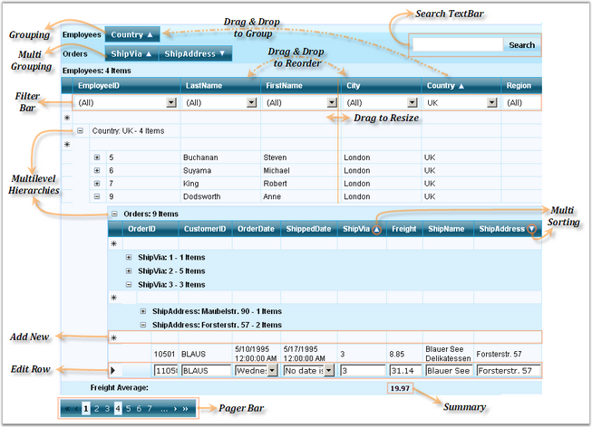

::: {style="DISPLAY: none"}
{#d2h_url_template}{#d2h_package_url style="WIDTH: 0px; DISPLAY: none; HEIGHT: 0px"}
:::

::::: {#nsbanner .d2h_main_nsbanner style="BORDER-BOTTOM: #999999 1px solid; POSITION: relative; PADDING-BOTTOM: 0px; BACKGROUND-COLOR: transparent; PADDING-LEFT: 0px; PADDING-RIGHT: 0px; DISPLAY: none; BORDER-TOP: #999999 1px solid; PADDING-TOP: 0px; LEFT: 0px"}
:::: {#TitleRow .d2h_main_titlerow style="PADDING-BOTTOM: 4px; BACKGROUND-COLOR: transparent; PADDING-LEFT: 22px; WIDTH: 100%; PADDING-RIGHT: 10px; DISPLAY: none; PADDING-TOP: 4px"}
::: {#ienav .d2h_main_ienav style="DISPLAY: none"}
{#D2HPrevious .D2HPreviousEnabled}  {#D2HNext .D2HNextEnabled}
:::
::::
:::::

:::: {#nstext .d2h_main_nstext style="PADDING-BOTTOM: 10px; BACKGROUND-COLOR: transparent; PADDING-LEFT: 22px; PADDING-RIGHT: 10px; HEIGHT: 100%; OVERFLOW: auto; PADDING-TOP: 5px" hasuserbackground="true" valign="bottom"}
::: {#d2h_breadcrumbs .d2h_breadcrumbs}
[Essential Studio User Guide Documentation](ms-xhelp:///?Id=12457748-09e3-4d74-a240-8e049cedf030){.d2h_breadcrumbsNormal}[ \> ]{.d2h_breadcrumbsLinkSeparator}[User Interface Edition](ms-xhelp:///?Id=c29296b7-531c-413b-a0ec-488ca1f7f669){.d2h_breadcrumbsNormal}[ \> ]{.d2h_breadcrumbsLinkSeparator}[Essential ASP.NET](ms-xhelp:///?Id=25c35330-c127-4dad-9a92-ed79dc7261a6){.d2h_breadcrumbsNormal}[ \> ]{.d2h_breadcrumbsLinkSeparator}[Essential Grid]{.d2h_breadcrumbsContentsOnly}[ \> ]{.d2h_breadcrumbsLinkSeparator}[Getting Started](ms-xhelp:///?Id=da2908d9-a1a0-42b2-b989-0222428e0694){.d2h_breadcrumbsNormal}
:::

## Elaborate Structure of the Control {#elaborate-structure-of-the-control style="tab-stops: 0pt"}

[]{style="FONT-FAMILY: 'Trebuchet MS','sans-serif'; COLOR: #15428b; FONT-SIZE: 9pt"} 

The following screen shot illustrates the structure of the GridGroupingControl.

[]{style="FONT-FAMILY: 'Trebuchet MS','sans-serif'; COLOR: #15428b; FONT-SIZE: 9pt"} 

{border="0"}

**[]{style="FONT-FAMILY: 'Trebuchet MS','sans-serif'; COLOR: #15428b; FONT-SIZE: 9pt"}** 

Figure 12: Structure of GridGroupingControl

**[]{style="FONT-FAMILY: 'Trebuchet MS','sans-serif'; COLOR: #15428b; FONT-SIZE: 9pt"}** 

Elements and Features

**[]{style="FONT-FAMILY: 'Trebuchet MS','sans-serif'; COLOR: #15428b; FONT-SIZE: 9pt"}** 

[·      ]{style="FONT-FAMILY: Symbol"}**Drag and Drop** to start using the controls: no coding required.

[·      ]{style="FONT-FAMILY: Symbol"}**Grouping**: GridGroupingControl allows you to group the data by just dragging the Header to the Group Drop area in the top of the Grid. Multilevel grouping is an added advantage.

[·      ]{style="FONT-FAMILY: Symbol"}**Sorting**[:]{style="FONT-FAMILY: 'Verdana','sans-serif'; COLOR: black; FONT-SIZE: 8pt"} you can programmatically sort by one or more columns and the users can also do the same during runtime.

[·      ]{style="FONT-FAMILY: Symbol"}**Filtering**: allows you to filter the data in the control using the Filter Bar.

[·      ]{style="FONT-FAMILY: Symbol"}**Paging**: GridGroupingControl provides built-in paging functionality. Also, it includes a Pager Bar that allows you to navigate between the various pages in the grid and a Paging control is available that can be used with the grid.

[·      ]{style="FONT-FAMILY: Symbol"}**Summaries**: you can easily create advanced summaries by adding SummaryRows and SummaryColumns through designer or code.

[·      ]{style="FONT-FAMILY: Symbol"}**Column Resizing**: GridGroupingControl supports convenient runtime resizing of the grid column.

[·      ]{style="FONT-FAMILY: Symbol"}**Column Reordering with Drag-and-Drop**: GridGroupingControl allows users to quickly reorder the columns by simply dragging their headers.

[·      ]{style="FONT-FAMILY: Symbol"}**Sizing**: you can specify a custom size for the columns, rows, group captions and so on. You can also specify a custom size for the grid and either let it scroll or shrink.

[·      ]{style="FONT-FAMILY: Symbol"}**Scrolling**: specify a Width and Height for the control and the grid will automatically show Scroll Bars if necessary.

[·      ]{style="FONT-FAMILY: Symbol"}**MultiLevel Hierarchy**: GridGroupingControl can generate a hierarchical presentation from the multiple source table with the relations defined which provides a treelist-like data presentation. GridGroupingControl allows presentation of related Data Sets as hierarchical structures of tables. Two or more tables can be related in a single grid, and the Data can be displayed in a Hierarchical Structure.

[·      ]{style="FONT-FAMILY: Symbol"}**MultiRowRecords**: there is built-in support for rendering a single record in multiple rows, in other words, wrapped rows.

[·      ]{style="FONT-FAMILY: Symbol"}**MultiRow Selection and Area Selection**: you can easily select multiple rows using \'Ctrl + Click\', or by simply dragging a range over the rows which you want to select.

[·      ]{style="FONT-FAMILY: Symbol"}Supports flexible Editing Functionality.

[]{#p19} 

[]{#related-topics}
::::
