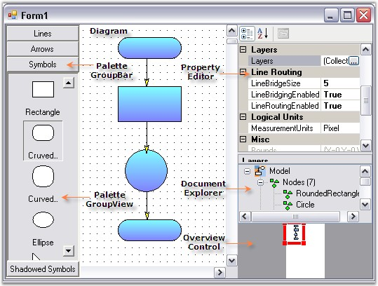

::: {style="DISPLAY: none"}
{#d2h_url_template}{#d2h_package_url style="WIDTH: 0px; DISPLAY: none; HEIGHT: 0px"}
:::

::::: {#nsbanner .d2h_main_nsbanner style="BORDER-BOTTOM: #999999 1px solid; POSITION: relative; PADDING-BOTTOM: 0px; BACKGROUND-COLOR: transparent; PADDING-LEFT: 0px; PADDING-RIGHT: 0px; DISPLAY: none; BORDER-TOP: #999999 1px solid; PADDING-TOP: 0px; LEFT: 0px"}
:::: {#TitleRow .d2h_main_titlerow style="PADDING-BOTTOM: 4px; BACKGROUND-COLOR: transparent; PADDING-LEFT: 22px; WIDTH: 100%; PADDING-RIGHT: 10px; DISPLAY: none; PADDING-TOP: 4px"}
::: {#ienav .d2h_main_ienav style="DISPLAY: none"}
{#D2HPrevious .D2HPreviousEnabled}  {#D2HNext .D2HNextEnabled}
:::
::::
:::::

::::: {#nstext .d2h_main_nstext style="PADDING-BOTTOM: 10px; BACKGROUND-COLOR: transparent; PADDING-LEFT: 22px; PADDING-RIGHT: 10px; HEIGHT: 100%; OVERFLOW: auto; PADDING-TOP: 5px" hasuserbackground="true" valign="bottom"}
::: {#d2h_breadcrumbs .d2h_breadcrumbs}
[Essential Studio User Guide Documentation](ms-xhelp:///?Id=12457748-09e3-4d74-a240-8e049cedf030){.d2h_breadcrumbsNormal}[ \> ]{.d2h_breadcrumbsLinkSeparator}[User Interface Edition](ms-xhelp:///?Id=c29296b7-531c-413b-a0ec-488ca1f7f669){.d2h_breadcrumbsNormal}[ \> ]{.d2h_breadcrumbsLinkSeparator}[Essential Windows](ms-xhelp:///?Id=e60759d8-47a4-4570-9d7a-16a68d63f2ea){.d2h_breadcrumbsNormal}[ \> ]{.d2h_breadcrumbsLinkSeparator}[Essential Diagram]{.d2h_breadcrumbsContentsOnly}[ \> ]{.d2h_breadcrumbsLinkSeparator}[Getting Started](ms-xhelp:///?Id=0f82ddb8-c181-4d28-96f7-38c40eef253f){.d2h_breadcrumbsNormal}
:::

## Elaborate Structure Of the Control {#elaborate-structure-of-the-control style="tab-stops: 0pt"}

[]{style="FONT-FAMILY: 'Trebuchet MS','sans-serif'; COLOR: #15428b; FONT-SIZE: 9pt"} 

The controls associated with the Essential Diagram are illustrated in the below image.

[]{style="FONT-FAMILY: 'Trebuchet MS','sans-serif'; COLOR: #15428b; FONT-SIZE: 9pt"} 

{border="0"}

[]{style="FONT-FAMILY: 'Trebuchet MS','sans-serif'; COLOR: #15428b; FONT-SIZE: 9pt"} 

Figure 5: Diagram Windows Controls

[]{style="FONT-FAMILY: 'Trebuchet MS','sans-serif'; COLOR: #15428b; FONT-SIZE: 9pt"} 

Document Explorer

[]{style="FONT-FAMILY: 'Trebuchet MS','sans-serif'; COLOR: #15428b; FONT-SIZE: 9pt"} 

Document Explorer control allows you to visualize the details of the various objects that are added onto the diagram control at run-time. The layers will be listed under the Layers node and other objects like shapes, links, lines and text editor will be listed under Nodes node.

[]{style="FONT-FAMILY: 'Trebuchet MS','sans-serif'; COLOR: #15428b; FONT-SIZE: 9pt"} 

Overview Control

[]{style="FONT-FAMILY: 'Trebuchet MS','sans-serif'; COLOR: #15428b; FONT-SIZE: 9pt"} 

Overview Control provides a perspective view of a diagram model, and allows users to dynamically pan and zoom diagrams. The Overview Control facilitates a perspective view of the diagram. The control features a viewport window that can be moved and / or resized using the mouse to modify the diagrams\' origin and magnification properties at run-time.

[]{style="COLOR: #4a5c8c; FONT-SIZE: 8pt"} 

The features of this control are demonstrated in one of our installation samples which is available in the following location.

[]{style="FONT-FAMILY: 'Trebuchet MS','sans-serif'; COLOR: #15428b; FONT-SIZE: 9pt"} 

**..\\My Documents\\Syncfusion\\EssentialStudio\\Version Number\\Windows\\Diagram.Windows\\Samples\\2.0\\Getting Started\\OverView**

[]{style="FONT-FAMILY: 'Trebuchet MS','sans-serif'; COLOR: #4a5c8c; FONT-SIZE: 9pt"} 

Property Editor

[]{style="FONT-FAMILY: 'Trebuchet MS','sans-serif'; COLOR: #15428b; FONT-SIZE: 9pt"} 

The Property Editor in Essential Diagram displays properties of the currently selected object or objects in the diagram. It is a Windows Forms control that can be added to the Visual Studio .NET Toolbox. It also allows users to set or modify the various properties of the objects or the model. The Property Editor provides an easy interface to set and view the various property settings.

[]{style="FONT-FAMILY: 'Trebuchet MS','sans-serif'; COLOR: #15428b; FONT-SIZE: 9pt"} 

Palette GroupBar and GroupView

[]{style="FONT-FAMILY: 'Trebuchet MS','sans-serif'; COLOR: #15428b; FONT-SIZE: 9pt"} 

The **PaletteGroupBar** control provides a way for users to drag and drop symbols onto a diagram. It is based on the Syncfusion Essential Tools GroupBar control. Each symbol palette loaded in the PaletteGroupBar occupies a panel that can be selected by a bar button. The bar button is labeled with the name of the symbol palette. The symbols in the palette are shown as icons that can be dragged and dropped onto the diagram. This control allows users to add symbols to a palette, and save or load the palette whenever necessary. It provides a way to classify and maintain symbols.

[]{style="FONT-FAMILY: 'Trebuchet MS','sans-serif'; COLOR: #15428b; FONT-SIZE: 9pt"} 

The **PaletteGroupView** control provides an easy way to serialize a symbol palette to and from the resource file of a form. At design-time, users can attach a symbol palette to a PaletteGroupView control in the form. Selecting the PaletteGroupView and clicking the **Palette** property in the Visual Studio .NET Properties window will open a standard Open File dialog, which allows the user to select a symbol palette file that has been created with the Symbol Designer.

[]{style="FONT-FAMILY: 'Trebuchet MS','sans-serif'; COLOR: #15428b; FONT-SIZE: 9pt"} 

::: {style="BORDER-BOTTOM: windowtext 1pt solid; BORDER-LEFT: medium none; PADDING-BOTTOM: 1pt; MARGIN-TOP: 9pt; PADDING-LEFT: 0pt; PADDING-RIGHT: 0pt; MARGIN-BOTTOM: 9pt; BORDER-TOP: windowtext 1pt solid; BORDER-RIGHT: medium none; PADDING-TOP: 1pt"}
{border="0"}[Note]{style="BACKGROUND: white"}[:]{style="BACKGROUND: white"}[ ]{style="COLOR: black; FONT-SIZE: 8pt"}The properties of these diagram controls are discussed in the Supported Controls topic.
:::

 

[]{#p12} 

[]{style="FONT-FAMILY: 'Trebuchet MS','sans-serif'; FONT-SIZE: 12pt"} 

[]{#related-topics}
:::::
