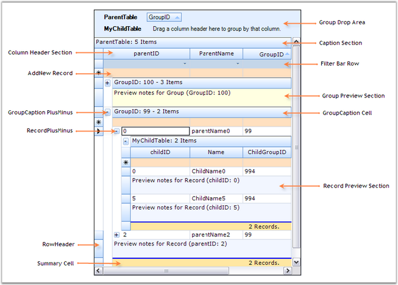

::: {style="DISPLAY: none"}
{#d2h_url_template}{#d2h_package_url style="WIDTH: 0px; DISPLAY: none; HEIGHT: 0px"}
:::

::::: {#nsbanner .d2h_main_nsbanner style="BORDER-BOTTOM: #999999 1px solid; POSITION: relative; PADDING-BOTTOM: 0px; BACKGROUND-COLOR: transparent; PADDING-LEFT: 0px; PADDING-RIGHT: 0px; DISPLAY: none; BORDER-TOP: #999999 1px solid; PADDING-TOP: 0px; LEFT: 0px"}
:::: {#TitleRow .d2h_main_titlerow style="PADDING-BOTTOM: 4px; BACKGROUND-COLOR: transparent; PADDING-LEFT: 22px; WIDTH: 100%; PADDING-RIGHT: 10px; DISPLAY: none; PADDING-TOP: 4px"}
::: {#ienav .d2h_main_ienav style="DISPLAY: none"}
{#D2HPrevious .D2HPreviousEnabled}  {#D2HNext .D2HNextEnabled}
:::
::::
:::::

:::: {#nstext .d2h_main_nstext style="PADDING-BOTTOM: 10px; BACKGROUND-COLOR: transparent; PADDING-LEFT: 22px; PADDING-RIGHT: 10px; HEIGHT: 100%; OVERFLOW: auto; PADDING-TOP: 5px" hasuserbackground="true" valign="bottom"}
::: {#d2h_breadcrumbs .d2h_breadcrumbs}
[Essential Studio User Guide Documentation](ms-xhelp:///?Id=12457748-09e3-4d74-a240-8e049cedf030){.d2h_breadcrumbsNormal}[ \> ]{.d2h_breadcrumbsLinkSeparator}[User Interface Edition](ms-xhelp:///?Id=c29296b7-531c-413b-a0ec-488ca1f7f669){.d2h_breadcrumbsNormal}[ \> ]{.d2h_breadcrumbsLinkSeparator}[Essential Windows](ms-xhelp:///?Id=e60759d8-47a4-4570-9d7a-16a68d63f2ea){.d2h_breadcrumbsNormal}[ \> ]{.d2h_breadcrumbsLinkSeparator}[Essential Grid]{.d2h_breadcrumbsContentsOnly}[ \> ]{.d2h_breadcrumbsLinkSeparator}[Grid Controls](ms-xhelp:///?Id=bf2d70d7-33dc-4c67-a55d-4fcf8d51dc2b){.d2h_breadcrumbsNormal}[ \> ]{.d2h_breadcrumbsLinkSeparator}[Grid Control](ms-xhelp:///?Id=ada2a727-2fb9-48d8-adef-54769621df7a){.d2h_breadcrumbsNormal}
:::

### Elaborate Structure of the Control {#elaborate-structure-of-the-control style="tab-stops: 0pt"}

[]{style="FONT-FAMILY: 'Trebuchet MS','sans-serif'; COLOR: #15428b; FONT-SIZE: 9pt"} 

This section lists the important elements which are used by the grouping grid to organize the data. These grid elements can have specific appearance and behavior. The following screen shot points out the various grid elements.

[]{style="FONT-FAMILY: 'Trebuchet MS','sans-serif'; COLOR: #15428b; FONT-SIZE: 9pt"} 

{border="0"}

[]{style="FONT-FAMILY: 'Trebuchet MS','sans-serif'; COLOR: #15428b; FONT-SIZE: 9pt"} 

Figure 72: Structure of Grid Control

[]{style="FONT-FAMILY: 'Trebuchet MS','sans-serif'; COLOR: #15428b; FONT-SIZE: 9pt"} 

Elements of Grid Control

[]{style="FONT-FAMILY: 'Trebuchet MS','sans-serif'; COLOR: #15428b; FONT-SIZE: 9pt"} 

[·      ]{style="FONT-FAMILY: Symbol"}**Caption Section**-This is the first section within a group which provides the caption bar above the column headers. If a caption should be displayed at the beginning of each group, then Caption Sections are created when the grouping for a table is initialized.

[·      ]{style="FONT-FAMILY: Symbol"}**Column Header Section**-This section will appear at the top of a table or a group, below the caption section. The Column Header Section is a place holder where the grouping grid displays the column headers.

[·      ]{style="FONT-FAMILY: Symbol"}**Filter Bar Row**-It displays the filter bar for the table data. You can enable the record filters for specific columns.

[·      ]{style="FONT-FAMILY: Symbol"}**Add New Record Section**-This is the section within a group that is shown above the table records and/or below the records for each group, and implements logic to add new records.

[·      ]{style="FONT-FAMILY: Symbol"}**Preview Section**-A Preview Section can be added under each group and record. It is a suitable place to display custom data for a given record or group.

[·      ]{style="FONT-FAMILY: Symbol"}**Summary Section**-This section is a collection of rows used to display brief information about the groups or specific columns of the table.

[·      ]{style="FONT-FAMILY: Symbol"}**Group Drop Area**-It lets the user to group the grid data. The data can be grouped by simply dragging the column headers into the group drop area.

 

[]{#p41} 

 

[]{#related-topics}
::::
