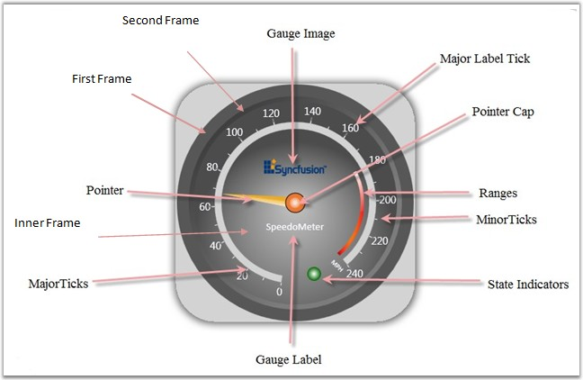

::: {style="DISPLAY: none"}
{#d2h_url_template}{#d2h_package_url style="WIDTH: 0px; DISPLAY: none; HEIGHT: 0px"}
:::

::::: {.d2h_secondary_topic style="PADDING-BOTTOM: 10pt; MARGIN: 0pt; PADDING-LEFT: 0pt; PADDING-RIGHT: 0pt; PADDING-TOP: 0pt"}
#### Elaborate Structure of the Control {#elaborate-structure-of-the-control style="tab-stops: 0pt"}

The Circular Gauge control is comprised of the following elements. All the elements are optional to display the empty gauge control. Gauge scales, Label, Ticks, Label Tick and Pointer elements are collection types. We can host any number of items in it. Apart from this, circular gauge contains **CenterFrameContent** property to host any kind of content in the circular area. This will helps to host custom geometry on a gauge control.

[]{style="FONT-FAMILY: 'Trebuchet MS','sans-serif'; COLOR: #15428b; FONT-SIZE: 9pt"} 

Table 5: Elements

::: {align="center"}
  ------------------ ----------------- ---------------------------------------------------------------------------------------------------------
  Element            Associated with   Description
  Scale              Gauge             The scale defines the total range of values against which specific values will be plotted in the gauge.
  Gauge Image        Gauge             An image can be displayed inside the gauge to customize the appearance of the gauge.
  Gauge Label        Gauge             Text describing the gauge.
  State Indicator    Gauge             Indicates the current state of the gauge. Can be customized based on requirements.
  Range              Scale             Marks a portion of the scale.
  Major Ticks        Scale             Primary scale indicators.
  Minor Ticks        Scale             Secondary scale indicators.
  Major Label Tick   Scale             Labels for the major markers on the scale.
  Pointer            Scale             Points to a specific value on the scale.
  Pointer Cap        Pointer           Anchors the pointer.
  ------------------ ----------------- ---------------------------------------------------------------------------------------------------------
:::

[]{style="FONT-FAMILY: 'Trebuchet MS','sans-serif'; COLOR: #15428b; FONT-SIZE: 9pt"} 

{border="0"}

Figure 16: Gauge Elements

**[]{style="FONT-FAMILY: 'Trebuchet MS','sans-serif'; COLOR: red; FONT-SIZE: 9pt"}** 

::: {style="BORDER-BOTTOM: windowtext 1pt solid; BORDER-LEFT: medium none; PADDING-BOTTOM: 1pt; MARGIN-TOP: 9pt; PADDING-LEFT: 0pt; PADDING-RIGHT: 0pt; MARGIN-BOTTOM: 9pt; BORDER-TOP: windowtext 1pt solid; BORDER-RIGHT: medium none; PADDING-TOP: 1pt"}
[{border="0"}]{style="COLOR: red"}Note: Essential gauge renders its element through a gauge adorner. So, you can expand/collapse the scale and other elements at the maximum limit, even outside the gauge control to provide facility to host the scale anywhere with any size. This mechanism provides the ability to apply custom templates to the gauge, in addition to the default visual appearance.
:::

 

[]{#p17} 

[]{#related-topics}
:::::
