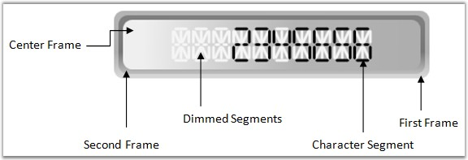

::: {style="DISPLAY: none"}
{#d2h_url_template}{#d2h_package_url style="WIDTH: 0px; DISPLAY: none; HEIGHT: 0px"}
:::

:::: {.d2h_secondary_topic style="PADDING-BOTTOM: 10pt; MARGIN: 0pt; PADDING-LEFT: 0pt; PADDING-RIGHT: 0pt; PADDING-TOP: 0pt"}
#### Elaborate Structure of the Control[]{style="FONT-SIZE: 10pt"} {#elaborate-structure-of-the-control style="tab-stops: 0pt"}

The Digital Gauge control is comprised of the character segments and frames. All the elements are optional to display the empty gauge control. Apart from this, digital gauge contains CenterFrameContent property to host any kind of content in the digital area. This helps to host custom geometry on a gauge control.

[]{style="FONT-FAMILY: 'Trebuchet MS','sans-serif'; COLOR: #15428b; FONT-SIZE: 9pt"} 

{border="0"}

Figure 43: Digital Gauge Elements

[]{style="FONT-FAMILY: 'Trebuchet MS','sans-serif'; COLOR: #15428b; FONT-SIZE: 9pt"} 

::: {style="BORDER-BOTTOM: windowtext 1pt solid; BORDER-LEFT: medium none; PADDING-BOTTOM: 1pt; MARGIN-TOP: 9pt; PADDING-LEFT: 0pt; PADDING-RIGHT: 0pt; MARGIN-BOTTOM: 9pt; BORDER-TOP: windowtext 1pt solid; BORDER-RIGHT: medium none; PADDING-TOP: 1pt"}
{border="0"}Note: Essential digital gauge rendering it\'s element through gauge adorner. So, gauge elements can be expandable at maximum level, even outside of the digital gauge frame to provide facility to host the scale anywhere with any size. This mechanism provides the ability to apply custom template without affecting its adorner. See essential digital gauge section to know more about digital gauge features.
:::

[]{#related-topics}
::::
