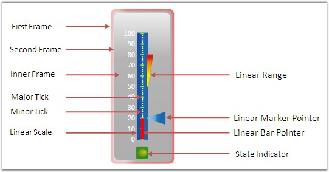

::: {style="DISPLAY: none"}
{#d2h_url_template}{#d2h_package_url style="WIDTH: 0px; DISPLAY: none; HEIGHT: 0px"}
:::

:::: {.d2h_secondary_topic style="PADDING-BOTTOM: 10pt; MARGIN: 0pt; PADDING-LEFT: 0pt; PADDING-RIGHT: 0pt; PADDING-TOP: 0pt"}
#### Elaborate Structure of the Control {#elaborate-structure-of-the-control style="tab-stops: 0pt"}

The Linear Gauge control is comprised of the following elements. All the elements are optional to display an empty gauge control. Gauge scales, Label, Ticks, Label Tick and Pointer elements are collection types. We can host any number of items in it. Apart from this, linear gauge contains CenterFrameContent property to host any kind of content in the digital area. This will helps to host custom geometry on gauge control.

[]{style="FONT-FAMILY: 'Trebuchet MS','sans-serif'; COLOR: #15428b; FONT-SIZE: 9pt"} 

{border="0"}

[]{style="FONT-FAMILY: 'Trebuchet MS','sans-serif'; COLOR: #15428b; FONT-SIZE: 9pt"} 

Figure 59: Linear Gauge Elements

[]{style="FONT-FAMILY: 'Trebuchet MS','sans-serif'; COLOR: #15428b; FONT-SIZE: 9pt"} 

::: {style="BORDER-BOTTOM: windowtext 1pt solid; BORDER-LEFT: medium none; PADDING-BOTTOM: 1pt; MARGIN-TOP: 9pt; PADDING-LEFT: 0pt; PADDING-RIGHT: 0pt; MARGIN-BOTTOM: 9pt; BORDER-TOP: windowtext 1pt solid; BORDER-RIGHT: medium none; PADDING-TOP: 1pt"}
{border="0"}Note: Linear gauge renders its element through a gauge adorner. So, you can expand the gauge elements to the maximum level, even outside of the gauge frame to provide facility to host the scale anywhere with any size. This mechanism provides ability to apply custom template without affecting its adorner. See the other section also to know more about Linear gauge features.
:::

 

[]{#related-topics}
::::
