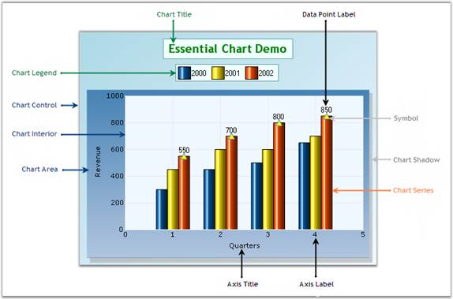

::: {style="DISPLAY: none"}
{#d2h_url_template}{#d2h_package_url style="WIDTH: 0px; DISPLAY: none; HEIGHT: 0px"}
:::

::::: {#nsbanner .d2h_main_nsbanner style="BORDER-BOTTOM: #999999 1px solid; POSITION: relative; PADDING-BOTTOM: 0px; BACKGROUND-COLOR: transparent; PADDING-LEFT: 0px; PADDING-RIGHT: 0px; DISPLAY: none; BORDER-TOP: #999999 1px solid; PADDING-TOP: 0px; LEFT: 0px"}
:::: {#TitleRow .d2h_main_titlerow style="PADDING-BOTTOM: 4px; BACKGROUND-COLOR: transparent; PADDING-LEFT: 22px; WIDTH: 100%; PADDING-RIGHT: 10px; DISPLAY: none; PADDING-TOP: 4px"}
::: {#ienav .d2h_main_ienav style="DISPLAY: none"}
{#D2HPrevious .D2HPreviousEnabled}  {#D2HNext .D2HNextEnabled}
:::
::::
:::::

:::: {#nstext .d2h_main_nstext style="PADDING-BOTTOM: 10px; BACKGROUND-COLOR: transparent; PADDING-LEFT: 22px; PADDING-RIGHT: 10px; HEIGHT: 100%; OVERFLOW: auto; PADDING-TOP: 5px" hasuserbackground="true" valign="bottom"}
::: {#d2h_breadcrumbs .d2h_breadcrumbs}
[Essential Studio User Guide Documentation](ms-xhelp:///?Id=12457748-09e3-4d74-a240-8e049cedf030){.d2h_breadcrumbsNormal}[ \> ]{.d2h_breadcrumbsLinkSeparator}[User Interface Edition](ms-xhelp:///?Id=c29296b7-531c-413b-a0ec-488ca1f7f669){.d2h_breadcrumbsNormal}[ \> ]{.d2h_breadcrumbsLinkSeparator}[Essential ASP.NET](ms-xhelp:///?Id=25c35330-c127-4dad-9a92-ed79dc7261a6){.d2h_breadcrumbsNormal}[ \> ]{.d2h_breadcrumbsLinkSeparator}[Essential Chart in HTML 5]{.d2h_breadcrumbsContentsOnly}[ \> ]{.d2h_breadcrumbsLinkSeparator}[Getting Started](ms-xhelp:///?Id=399f9d37-7432-43a6-8f61-85adf171b990){.d2h_breadcrumbsNormal}
:::

## Elaborate Structure of the Control {#elaborate-structure-of-the-control style="tab-stops: 0pt"}

This section gives you an idea of the different sections of the ChartAdv vontrol. The following image illustrates various sections of the control and their descriptions are detailed below.

 

{border="0"}

Figure 7: Structure of Chart Control

**Elements and Features**

• **Chart Title**: The chart title is the area at the top of the Chart control that displays text.

• **Chart Legend**: The chart legend is the portion of the display showing an entry for each of the data series added to the Chart control. The chart legend is positioned in-line within the Chart control (but outside the chart area) by default. However, if the chart legend is set to float mode, the chart legend can be positioned anywhere inside the Chart control. The legend can also contain custom items with custom images and text.

• **Chart Area**: This is the section that holds the plots and graphs that are defined in the chart. The chart area also includes the chart axes that are defined. A primary x-axis and primary y-axis are defined by default.

• **Chart Control**: The Chart control is the complete visible display of the control. All other sections will be inside the Chart control.

• **Chart Series**: Chart series are the elements present inside the chart area.

• **Series Symbol**: Symbols that can be placed on the series points.

• **Chart Shadow**: Chart area shadow indicates the shadow of the chart area.

• **Chart Interior**: This section is the interior part of the Chart control within the chart area that contains the data points plotted against the x-axis and y-axis.

• **Chart Label**: Represents the label text on the axes data points in a chart.

• **Axis Title**: Indicates the title for an individual axis.

[]{#related-topics}
::::
