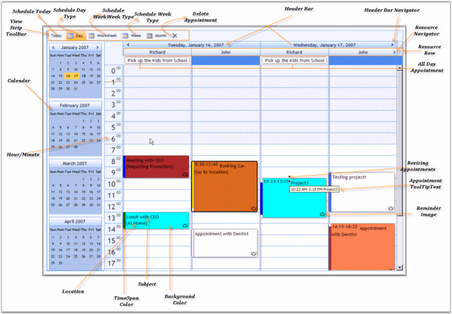

::: {style="DISPLAY: none"}
{#d2h_url_template}{#d2h_package_url style="WIDTH: 0px; DISPLAY: none; HEIGHT: 0px"}
:::

::::: {#nsbanner .d2h_main_nsbanner style="BORDER-BOTTOM: #999999 1px solid; POSITION: relative; PADDING-BOTTOM: 0px; BACKGROUND-COLOR: transparent; PADDING-LEFT: 0px; PADDING-RIGHT: 0px; DISPLAY: none; BORDER-TOP: #999999 1px solid; PADDING-TOP: 0px; LEFT: 0px"}
:::: {#TitleRow .d2h_main_titlerow style="PADDING-BOTTOM: 4px; BACKGROUND-COLOR: transparent; PADDING-LEFT: 22px; WIDTH: 100%; PADDING-RIGHT: 10px; DISPLAY: none; PADDING-TOP: 4px"}
::: {#ienav .d2h_main_ienav style="DISPLAY: none"}
{#D2HPrevious .D2HPreviousEnabled}  {#D2HNext .D2HNextEnabled}
:::
::::
:::::

:::: {#nstext .d2h_main_nstext style="PADDING-BOTTOM: 10px; BACKGROUND-COLOR: transparent; PADDING-LEFT: 22px; PADDING-RIGHT: 10px; HEIGHT: 100%; OVERFLOW: auto; PADDING-TOP: 5px" hasuserbackground="true" valign="bottom"}
::: {#d2h_breadcrumbs .d2h_breadcrumbs}
[Essential Studio User Guide Documentation](ms-xhelp:///?Id=12457748-09e3-4d74-a240-8e049cedf030){.d2h_breadcrumbsNormal}[ \> ]{.d2h_breadcrumbsLinkSeparator}[User Interface Edition](ms-xhelp:///?Id=c29296b7-531c-413b-a0ec-488ca1f7f669){.d2h_breadcrumbsNormal}[ \> ]{.d2h_breadcrumbsLinkSeparator}[Essential ASP.NET](ms-xhelp:///?Id=25c35330-c127-4dad-9a92-ed79dc7261a6){.d2h_breadcrumbsNormal}[ \> ]{.d2h_breadcrumbsLinkSeparator}[Essential Schedule]{.d2h_breadcrumbsContentsOnly}[ \> ]{.d2h_breadcrumbsLinkSeparator}[Getting Started](ms-xhelp:///?Id=db08ebda-40b3-4965-b3be-d17da194e2f1){.d2h_breadcrumbsNormal}
:::

## Elaborate Structure of the Control {#elaborate-structure-of-the-control style="tab-stops: 0pt"}

[]{style="FONT-FAMILY: 'Trebuchet MS','sans-serif'; COLOR: #15428b; FONT-SIZE: 9pt"} 

The following screen shot shows the structure of the Schedule control:

[]{style="FONT-FAMILY: 'Trebuchet MS','sans-serif'; COLOR: #15428b; FONT-SIZE: 9pt"} 

{border="0"}[]{style="FONT-SIZE: 12pt"}

***[]{style="FONT-FAMILY: 'Trebuchet MS','sans-serif'; COLOR: #15428b; FONT-SIZE: 9pt"}*** 

Figure 10: Structure of the Schedule Control

[]{style="FONT-FAMILY: 'Trebuchet MS','sans-serif'; COLOR: #15428b; FONT-SIZE: 9pt"} 

Elements and Features of the Control

[]{style="FONT-FAMILY: 'Trebuchet MS','sans-serif'; COLOR: #15428b; FONT-SIZE: 9pt"} 

[·      ]{style="FONT-FAMILY: Symbol"}**Resources**: Owners of the appointments are called [Resources]{.UGHyperlink}[.]{style="FONT-FAMILY: 'Verdana','sans-serif'; COLOR: black"} A resource can have multiple appointments.

[·      ]{style="FONT-FAMILY: Symbol"}**Appointments:** An end-user\'s specific time interval in the Schedule control refers to an appointment or event. An appointment may contain properties like Subject, Location, StartTime, EndTime, and so on. Normal, All Day, Recurring and Blocked are the types of the [Appointments]{.UGHyperlink} supported by the Schedule control.

[·      ]{style="FONT-FAMILY: Symbol; COLOR: black"}**Calendar in Schedule Control**: Just like Microsoft Outlook Calendar, the calendar in schedule control allows to select multiple dates to view appointments. Also, it allows to drag the appointments in the [calendar]{.UGHyperlink}[.]{style="FONT-FAMILY: 'Verdana','sans-serif'; COLOR: black"}

[·      ]{style="FONT-FAMILY: Symbol"}**Loading Indicator in Schedule Control**: The Schedule control now supports a loading indicator during [callback]{.UGHyperlink}. A transparent background and the loading image are used to provide feedback about the callback process.

[·      ]{style="FONT-FAMILY: Symbol"}**Tooltips** can be displayed for Schedule cells as well as for Schedule appointments. Also, custom tooltips can be set for Schedule appointments.

[·      ]{style="FONT-FAMILY: Symbol"}**ViewStrip in Schedule control**: [ViewStrip Toolbar]{.UGHyperlink} provides options to view the today\'s date, full work week, weekdays and to delete the appointments. In full week view, it displays all the weekdays in Schedule Control with all the appointments, enabling easy drag-and-drop of appointments.

[·      ]{style="FONT-FAMILY: Symbol"}**Header Bar**: displays the date and navigation buttons.

[]{#related-topics}
::::
