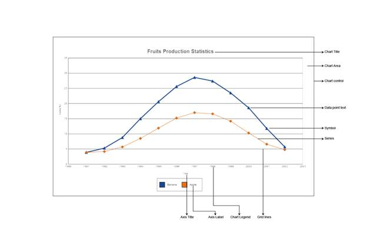

::: {style="DISPLAY: none"}
{#d2h_url_template} {#d2h_package_url style="WIDTH: 0px; DISPLAY: none; HEIGHT: 0px"}
:::

::::: {#nsbanner .d2h_main_nsbanner style="BORDER-BOTTOM: #999999 1px solid; POSITION: relative; PADDING-BOTTOM: 0px; BACKGROUND-COLOR: transparent; PADDING-LEFT: 0px; PADDING-RIGHT: 0px; DISPLAY: none; BORDER-TOP: #999999 1px solid; PADDING-TOP: 0px; LEFT: 0px"}
:::: {#TitleRow .d2h_main_titlerow style="PADDING-BOTTOM: 4px; BACKGROUND-COLOR: transparent; PADDING-LEFT: 22px; WIDTH: 100%; PADDING-RIGHT: 10px; DISPLAY: none; PADDING-TOP: 4px"}
::: {#ienav .d2h_main_ienav style="DISPLAY: none"}
{#D2HPrevious .D2HPreviousEnabled}  {#D2HNext .D2HNextEnabled}
:::
::::
:::::

:::: {#nstext .d2h_main_nstext style="PADDING-BOTTOM: 10px; BACKGROUND-COLOR: transparent; PADDING-LEFT: 22px; PADDING-RIGHT: 10px; HEIGHT: 100%; OVERFLOW: auto; PADDING-TOP: 5px" hasuserbackground="true" valign="bottom"}
::: {#d2h_breadcrumbs .d2h_breadcrumbs}
[Essential Studio User Guide Documentation](ms-xhelp:///?Id=12457748-09e3-4d74-a240-8e049cedf030){.d2h_breadcrumbsNormal} [ \> ]{.d2h_breadcrumbsLinkSeparator} [User Interface Edition](ms-xhelp:///?Id=c29296b7-531c-413b-a0ec-488ca1f7f669){.d2h_breadcrumbsNormal} [ \> ]{.d2h_breadcrumbsLinkSeparator} [Essential ASP.NET MVC](ms-xhelp:///?Id=4b14e7d1-65c4-4f67-b1aa-2c37709905a5){.d2h_breadcrumbsNormal} [ \> ]{.d2h_breadcrumbsLinkSeparator} [Essential Chart in HTML 5]{.d2h_breadcrumbsContentsOnly} [ \> ]{.d2h_breadcrumbsLinkSeparator} [Getting Started in ASP.NET MVC](ms-xhelp:///?Id=7be0cc3e-239f-44db-9c07-5f5ed873d123){.d2h_breadcrumbsNormal}
:::

## Elaborate Structure of the control {#elaborate-structure-of-the-control style="tab-stops: 0pt"}

The following illustration shows the structure of the Chart control:

[]{style="FONT-FAMILY: 'Calibri','sans-serif'"} 

{border="0"}

[]{style="FONT-FAMILY: 'Calibri','sans-serif'"} 

Figure 8: Structure of the Chart control

Elements and Features

[]{style="FONT-FAMILY: 'Calibri','sans-serif'"} 

**Chart Title:** [The Chart title is the area on the top of the Chart control that displays the text of the ChartControl.]{.BodyText1Char}

 

**Chart Legend:** [The Chart legend is the portion of the display showing an entry for each of the data series added to the ChartControl. The Chart legend is positioned in line within the ChartControl (but outside the ChartArea) by default. However, if the chart legend is set to the Floating mode, the Chart legend can be positioned anywhere inside the Chart Control. The legend can also contain custom items with custom image and text.]{.BodyText1Char}

 

**ChartArea:** This is the section that holds the plots/graphs that are defined in the chart. The ChartArea also includes the Chart axes that are defined. A primary x-axis and primary y-axis are defined by default.

 

**Chart Control:** The Chart Control is the complete visible display for the Control. All other sections will be inside the ChartControl.

 

**Chart Series:** Chart Series are the elements present inside the ChartArea.

 

**Series Symbol:** Symbol that can be placed on the series points.

 

**Chart Shadow:** ChartArea Shadow indicates the shadow of the ChartArea.

 

**Chart Interior:** This section is the interior part of the Chart control, within the ChartArea, which contains the data points plotted against X-axis and Y-axis.

 

**Chart Label:** Represents the label texts on the axes data points in a chart.

 

**Axis Title:** Indicates the title for individual axis.

 

[]{#related-topics}
::::
