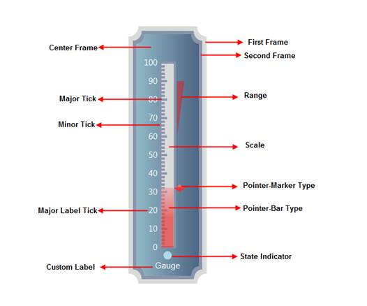

::: {style="DISPLAY: none"}
{#d2h_url_template}{#d2h_package_url style="WIDTH: 0px; DISPLAY: none; HEIGHT: 0px"}
:::

::::: {#nsbanner .d2h_main_nsbanner style="BORDER-BOTTOM: #999999 1px solid; POSITION: relative; PADDING-BOTTOM: 0px; BACKGROUND-COLOR: transparent; PADDING-LEFT: 0px; PADDING-RIGHT: 0px; DISPLAY: none; BORDER-TOP: #999999 1px solid; PADDING-TOP: 0px; LEFT: 0px"}
:::: {#TitleRow .d2h_main_titlerow style="PADDING-BOTTOM: 4px; BACKGROUND-COLOR: transparent; PADDING-LEFT: 22px; WIDTH: 100%; PADDING-RIGHT: 10px; DISPLAY: none; PADDING-TOP: 4px"}
::: {#ienav .d2h_main_ienav style="DISPLAY: none"}
{#D2HPrevious .D2HPreviousEnabled}  {#D2HNext .D2HNextEnabled}
:::
::::
:::::

:::: {#nstext .d2h_main_nstext style="PADDING-BOTTOM: 10px; BACKGROUND-COLOR: transparent; PADDING-LEFT: 22px; PADDING-RIGHT: 10px; HEIGHT: 100%; OVERFLOW: auto; PADDING-TOP: 5px" hasuserbackground="true" valign="bottom"}
::: {#d2h_breadcrumbs .d2h_breadcrumbs}
[Essential Studio User Guide Documentation](ms-xhelp:///?Id=12457748-09e3-4d74-a240-8e049cedf030){.d2h_breadcrumbsNormal}[ \> ]{.d2h_breadcrumbsLinkSeparator}[User Interface Edition](ms-xhelp:///?Id=c29296b7-531c-413b-a0ec-488ca1f7f669){.d2h_breadcrumbsNormal}[ \> ]{.d2h_breadcrumbsLinkSeparator}[Essential ASP.NET MVC](ms-xhelp:///?Id=4b14e7d1-65c4-4f67-b1aa-2c37709905a5){.d2h_breadcrumbsNormal}[ \> ]{.d2h_breadcrumbsLinkSeparator}[Essential Gauge]{.d2h_breadcrumbsContentsOnly}[ \> ]{.d2h_breadcrumbsLinkSeparator}[Essential Gauge MVC Controls](ms-xhelp:///?Id=40e49273-50bb-4d67-8631-7592d9b36828){.d2h_breadcrumbsNormal}[ \> ]{.d2h_breadcrumbsLinkSeparator}[Linear Gauge](ms-xhelp:///?Id=3bdc2c67-ec66-4b84-8ae1-db6b56ee3a29){.d2h_breadcrumbsNormal}
:::

### Elaborate Structure of the Control {#elaborate-structure-of-the-control style="tab-stops: 0pt"}

 

The Linear Gauge control is comprised of the following elements. All the elements are optional to display the empty gauge control. Gauge scales, Label, Ticks, Label Tick and Pointer elements are collection types. You can host any number of items in it.

[]{style="FONT-FAMILY: 'Calibri','sans-serif'"} 

{border="0"}

Figure 89: Structure of Linear Gauge**[]{style="FONT-FAMILY: 'Calibri','sans-serif'"}**

[]{style="FONT-FAMILY: 'Calibri','sans-serif'"} 

Elements and Features

Scales:

Scales are used to control the value ranges and also used as a basis for the placement of child elements, such as the tick marks. By default, the values start from the minimum value and move clock-wise to the maximum value. It is possible to reverse this direction by setting the **ScaleDirection** property to Anticlockwise.

Multiple scales can be added to linear gauge using its different parameters to present complex gauge.

The Orientation of the Linear Gauge can be customized. It can be Horizontal or Vertical.

 

Pointer:

Linear Pointers are scale indicator that points to a value along a scale. Linear Pointers are highly customizable. Linear Pointers can be added to the linear scale using different parameters to present the scales. Linear Bar and Marker pointers can be added at a time.

**[]{style="FONT-FAMILY: 'Calibri','sans-serif'"}** 

Range:

Ranges are objects that highlight a range of values.  Start Value and End value of the range can be specified using its **StartValue** and **Endvalue** properties. The Width of the range can be customized using its **StartWidth** and **EndWidth** properties.

You can set the location of the range based on the scale position using  **DistanceFromScale** property and the **RangePosition** property.

**[]{style="FONT-FAMILY: 'Calibri','sans-serif'"}** 

Major and Minor Ticks:

**Major Ticks** are the primary scale indicators.

**Minor Ticks** are the secondary scale indicators.

**TickStyle** property of the tick element specifies the number of value intervals along the entire length of the scale bar.

**[]{style="FONT-FAMILY: 'Calibri','sans-serif'"}** 

Label Tick:

Circular Label comprises numerous options to customize label display. Circular labels can be added to the circular scale using its different parameters to present the scales with meaningful labels.

You can set the location of the labels based on the scale position using the **DistanceFromScale** property and the **TickPlacement** property.  Labels can be shown for Major or Minor ticks. This can be set using the **TickStyle** property.

Logarithmic labels can be added. Labels can be displayed using formulas and also you can customize the label format.

 

Gauge Label:

Using the CustomLabel element of gauge, you can add custom text labels to the Essential Gauge. 

The label value can be set using its  **LabelValue**  property. Also you can customize the custom text, using its **FontSize** and **FontFamily** properties.

The location of the label can be customized using its **Location** property. The custom text angle can be set using its **TextAngle**  property.

[]{#related-topics}
::::
