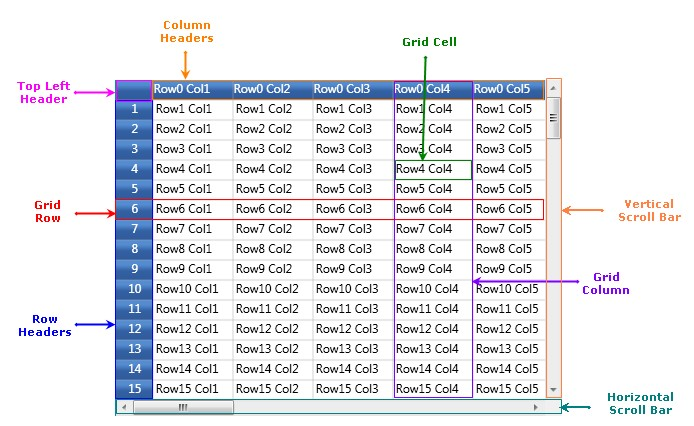
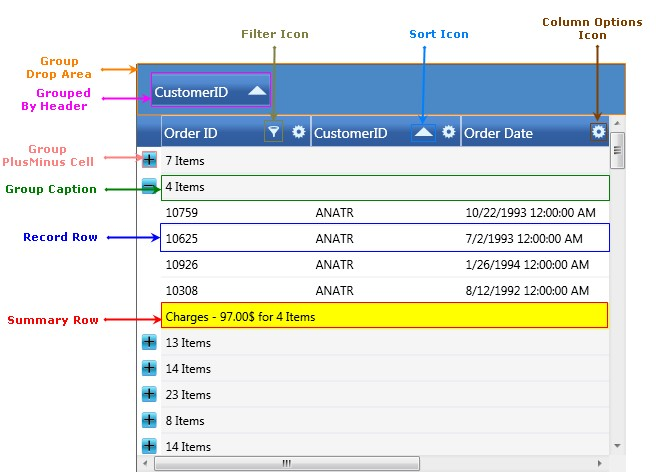
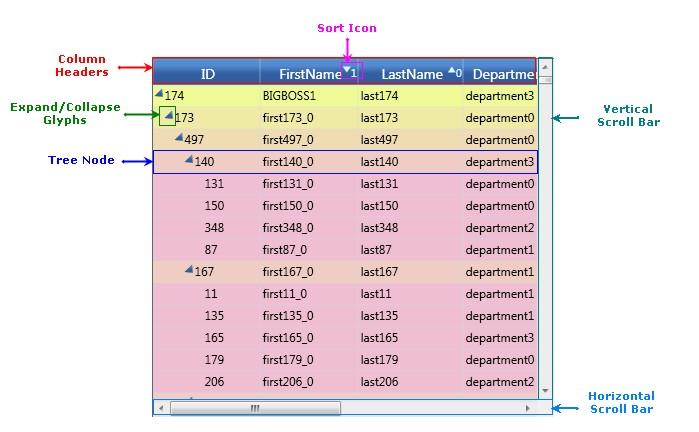

::: {style="DISPLAY: none"}
{#d2h_url_template}{#d2h_package_url style="WIDTH: 0px; DISPLAY: none; HEIGHT: 0px"}
:::

::::: {#nsbanner .d2h_main_nsbanner style="BORDER-BOTTOM: #999999 1px solid; POSITION: relative; PADDING-BOTTOM: 0px; BACKGROUND-COLOR: transparent; PADDING-LEFT: 0px; PADDING-RIGHT: 0px; DISPLAY: none; BORDER-TOP: #999999 1px solid; PADDING-TOP: 0px; LEFT: 0px"}
:::: {#TitleRow .d2h_main_titlerow style="PADDING-BOTTOM: 4px; BACKGROUND-COLOR: transparent; PADDING-LEFT: 22px; WIDTH: 100%; PADDING-RIGHT: 10px; DISPLAY: none; PADDING-TOP: 4px"}
::: {#ienav .d2h_main_ienav style="DISPLAY: none"}
{#D2HPrevious .D2HPreviousEnabled}  {#D2HNext .D2HNextEnabled}
:::
::::
:::::

:::: {#nstext .d2h_main_nstext style="PADDING-BOTTOM: 10px; BACKGROUND-COLOR: transparent; PADDING-LEFT: 22px; PADDING-RIGHT: 10px; HEIGHT: 100%; OVERFLOW: auto; PADDING-TOP: 5px" hasuserbackground="true" valign="bottom"}
::: {#d2h_breadcrumbs .d2h_breadcrumbs}
[Essential Studio User Guide Documentation](ms-xhelp:///?Id=12457748-09e3-4d74-a240-8e049cedf030){.d2h_breadcrumbsNormal}[ \> ]{.d2h_breadcrumbsLinkSeparator}[User Interface Edition](ms-xhelp:///?Id=c29296b7-531c-413b-a0ec-488ca1f7f669){.d2h_breadcrumbsNormal}[ \> ]{.d2h_breadcrumbsLinkSeparator}[Essential WPF](ms-xhelp:///?Id=7f4f82c5-151c-4262-94d0-75c4626c77bc){.d2h_breadcrumbsNormal}[ \> ]{.d2h_breadcrumbsLinkSeparator}[Essential Grid]{.d2h_breadcrumbsContentsOnly}[ \> ]{.d2h_breadcrumbsLinkSeparator}[Getting Started](ms-xhelp:///?Id=99894a49-7527-4c40-8048-00676aa25151){.d2h_breadcrumbsNormal}
:::

## Elaborate Structure of the Controls {#elaborate-structure-of-the-controls style="tab-stops: 0pt"}

[]{style="COLOR: #15428b"} 

Essential Grid for WPF is a package of powerful grid controls that provide cell-oriented features and acts as an efficient display engine for tabular data that can be customized down to the cell level. It also offers excellent performance characteristics, such as Virtual Mode and high frequency updates, which makes the grid suitable for real time applications.

 

Essential Grid package is comprised of following three types of grid controls:

**[]{style="COLOR: #15428b"}** 

[[·      ]{style="FONT-FAMILY: Symbol; COLOR: windowtext; TEXT-DECORATION: none; text-underline: none"}]{.UGHyperlink}[[Grid control]{.UGHyperlink}](ms-xhelp:///?Id=7f54d9b2-6e7d-4862-a1a5-7d33255c5716)[]{.UGHyperlink}

[[·      ]{style="FONT-FAMILY: Symbol; COLOR: windowtext; TEXT-DECORATION: none; text-underline: none"}]{.UGHyperlink}[[GridData control]{.UGHyperlink}](ms-xhelp:///?Id=30e03545-af78-4c8c-aadd-9753e3037808)[]{.UGHyperlink}

[[·      ]{style="FONT-FAMILY: Symbol; COLOR: windowtext; TEXT-DECORATION: none; text-underline: none"}]{.UGHyperlink}[[GridTree control]{.UGHyperlink}](ms-xhelp:///?Id=30e03545-af78-4c8c-aadd-9753e3037808)[]{.UGHyperlink}

**[]{style="COLOR: #15428b"}** 

Let us see the control structure of these individual controls.

 

Grid control

It is a general purpose grid that can be used in any form, either holding its own data or virtually bound to an external data source. It acts as a base grid for the other two grid types (Grid Data and Grid Tree). Most of the features are shared among the three grid types. In Grid control, each cell acts as single entity which is suitable for applications such as Excel simulator, where the data of the grid cells are not interrelated, and need to be maintained in the specific cells themselves. You can also operate this control in virtual mode where the data is not stored in the grid's internal data structure but it comes from an external source like data table (for example). In virtual mode, the data will be loaded into the grid dynamically, only on demand or when the user tries to view a data.

[]{style="COLOR: #15428b"} 

{border="0"}

Figure 11: Structure of Grid control

 

GridData control

The GridData control is designed to be bound with a data source. In the GridData control, each column behaves as a single entity. This grid is more column-centric and can be used to display tabular data which are interrelated. Unlike the base grid, this grid does not store the data values in its data structures; instead it gets connected to an external data source (for more detailed info about data source connection, refer Data binding section).

 

The following features are available for GDC which helps to organize the data:

**[]{style="COLOR: #15428b"}** 

[·      ]{style="FONT-FAMILY: Symbol"}Sorting

[·      ]{style="FONT-FAMILY: Symbol"}Grouping

[·      ]{style="FONT-FAMILY: Symbol"}Filtering

[·      ]{style="FONT-FAMILY: Symbol"}Summarizing

[]{style="COLOR: #15428b"} 

{border="0"}

Figure 12: Structure of GridData control

 

GridTree control

The GridTree control serves as a multi-column tree control that is optimized to display tens and thousands of items. This control uses a load-on-demand architecture and quickly generates the tree view. You can toggle the view of the underlying nodes by clicking the plus-minus glyphs of a root node. It provides complete customization options such as level styles, custom glyphs, node images, etc. It can be used in applications like Folder Browser.

**[]{style="COLOR: #15428b"}** 

{border="0"}

Figure 13:  Structure of GridTree control

 

 

[]{#related-topics}
::::
