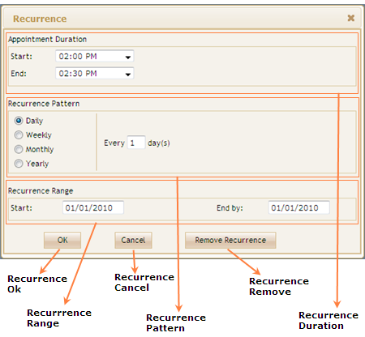

::: {style="DISPLAY: none"}
{#d2h_url_template}{#d2h_package_url style="WIDTH: 0px; DISPLAY: none; HEIGHT: 0px"}
:::

::::: {#nsbanner .d2h_main_nsbanner style="BORDER-BOTTOM: #999999 1px solid; POSITION: relative; PADDING-BOTTOM: 0px; BACKGROUND-COLOR: transparent; PADDING-LEFT: 0px; PADDING-RIGHT: 0px; DISPLAY: none; BORDER-TOP: #999999 1px solid; PADDING-TOP: 0px; LEFT: 0px"}
:::: {#TitleRow .d2h_main_titlerow style="PADDING-BOTTOM: 4px; BACKGROUND-COLOR: transparent; PADDING-LEFT: 22px; WIDTH: 100%; PADDING-RIGHT: 10px; DISPLAY: none; PADDING-TOP: 4px"}
::: {#ienav .d2h_main_ienav style="DISPLAY: none"}
{#D2HPrevious .D2HPreviousEnabled}  {#D2HNext .D2HNextEnabled}
:::
::::
:::::

:::: {#nstext .d2h_main_nstext style="PADDING-BOTTOM: 10px; BACKGROUND-COLOR: transparent; PADDING-LEFT: 22px; PADDING-RIGHT: 10px; HEIGHT: 100%; OVERFLOW: auto; PADDING-TOP: 5px" hasuserbackground="true" valign="bottom"}
::: {#d2h_breadcrumbs .d2h_breadcrumbs}
[Essential Studio User Guide Documentation](ms-xhelp:///?Id=12457748-09e3-4d74-a240-8e049cedf030){.d2h_breadcrumbsNormal}[ \> ]{.d2h_breadcrumbsLinkSeparator}[User Interface Edition](ms-xhelp:///?Id=c29296b7-531c-413b-a0ec-488ca1f7f669){.d2h_breadcrumbsNormal}[ \> ]{.d2h_breadcrumbsLinkSeparator}[Essential ASP.NET MVC](ms-xhelp:///?Id=4b14e7d1-65c4-4f67-b1aa-2c37709905a5){.d2h_breadcrumbsNormal}[ \> ]{.d2h_breadcrumbsLinkSeparator}[Essential Schedule]{.d2h_breadcrumbsContentsOnly}[ \> ]{.d2h_breadcrumbsLinkSeparator}[Getting Started](ms-xhelp:///?Id=b686dbe4-808e-405b-8e03-33b17be71f0d){.d2h_breadcrumbsNormal}[ \> ]{.d2h_breadcrumbsLinkSeparator}[Elaborate Structure of the Control](ms-xhelp:///?Id=6afcf846-bca2-452e-91c0-83cb3a34146a){.d2h_breadcrumbsNormal}
:::

### Elaborate Structure of the Recurrence Window {#elaborate-structure-of-the-recurrence-window style="tab-stops: 0pt"}

The following illustration shows the structure of the Recurrence Window:

 

{border="0"}

Figure 66: Structure of Recurrence Window

[]{style="FONT-FAMILY: 'Calibri','sans-serif'"} 

Elements and Features of the Recurrence Window

The elements and features of the Recurrence window are:

[·      ]{style="FONT-FAMILY: Symbol"}Recurrence OK: This button is used to apply the selected recurrence details for the appointment.

[·      ]{style="FONT-FAMILY: Symbol"}Recurrence Cancel: This button is used to close the recurrence window.

[·      ]{style="FONT-FAMILY: Symbol"}Remove Recurrence: This button is used to remove the recurrence option from an appointment.

[·      ]{style="FONT-FAMILY: Symbol"}Appointment Duration: This frame is used to get the recurrence appointment start time and end time duration.

[·      ]{style="FONT-FAMILY: Symbol"}Appointment Pattern: This frame used to get the recurrence frequency and recurrence interval.

[·      ]{style="FONT-FAMILY: Symbol"}Appointment Range: This frame is used to get the range of recurrence.

[]{style="FONT-FAMILY: 'Calibri','sans-serif'"} 

[]{#related-topics}
::::
