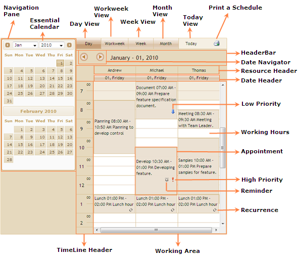

::: {style="DISPLAY: none"}
{#d2h_url_template}{#d2h_package_url style="WIDTH: 0px; DISPLAY: none; HEIGHT: 0px"}
:::

::::: {#nsbanner .d2h_main_nsbanner style="BORDER-BOTTOM: #999999 1px solid; POSITION: relative; PADDING-BOTTOM: 0px; BACKGROUND-COLOR: transparent; PADDING-LEFT: 0px; PADDING-RIGHT: 0px; DISPLAY: none; BORDER-TOP: #999999 1px solid; PADDING-TOP: 0px; LEFT: 0px"}
:::: {#TitleRow .d2h_main_titlerow style="PADDING-BOTTOM: 4px; BACKGROUND-COLOR: transparent; PADDING-LEFT: 22px; WIDTH: 100%; PADDING-RIGHT: 10px; DISPLAY: none; PADDING-TOP: 4px"}
::: {#ienav .d2h_main_ienav style="DISPLAY: none"}
{#D2HPrevious .D2HPreviousEnabled}  {#D2HNext .D2HNextEnabled}
:::
::::
:::::

:::: {#nstext .d2h_main_nstext style="PADDING-BOTTOM: 10px; BACKGROUND-COLOR: transparent; PADDING-LEFT: 22px; PADDING-RIGHT: 10px; HEIGHT: 100%; OVERFLOW: auto; PADDING-TOP: 5px" hasuserbackground="true" valign="bottom"}
::: {#d2h_breadcrumbs .d2h_breadcrumbs}
[Essential Studio User Guide Documentation](ms-xhelp:///?Id=12457748-09e3-4d74-a240-8e049cedf030){.d2h_breadcrumbsNormal}[ \> ]{.d2h_breadcrumbsLinkSeparator}[User Interface Edition](ms-xhelp:///?Id=c29296b7-531c-413b-a0ec-488ca1f7f669){.d2h_breadcrumbsNormal}[ \> ]{.d2h_breadcrumbsLinkSeparator}[Essential ASP.NET MVC](ms-xhelp:///?Id=4b14e7d1-65c4-4f67-b1aa-2c37709905a5){.d2h_breadcrumbsNormal}[ \> ]{.d2h_breadcrumbsLinkSeparator}[Essential Schedule]{.d2h_breadcrumbsContentsOnly}[ \> ]{.d2h_breadcrumbsLinkSeparator}[Getting Started](ms-xhelp:///?Id=b686dbe4-808e-405b-8e03-33b17be71f0d){.d2h_breadcrumbsNormal}[ \> ]{.d2h_breadcrumbsLinkSeparator}[Elaborate Structure of the Control](ms-xhelp:///?Id=6afcf846-bca2-452e-91c0-83cb3a34146a){.d2h_breadcrumbsNormal}
:::

### Elaborate Structure of the Schedule Control {#elaborate-structure-of-the-schedule-control style="tab-stops: 0pt"}

The following illustration shows the structure of the Schedule control:

 

{border="0"}

Figure 64: Structure of Schedule Control

 

Elements and Features of the Control

The elements and features of the control are:

[·      ]{style="FONT-FAMILY: Symbol"}Appointments: A specific time interval defined by the user in the Schedule control refers to an appointment or an event. An appointment may contain properties like Subject, Location, Description, StartTime, EndTime, and so on.

[·      ]{style="FONT-FAMILY: Symbol"}ViewStrip Toolbar: it provides options to view the day, work week, and month Schedule. It also provides options to move the day's Schedule and print a Schedule.

[·      ]{style="FONT-FAMILY: Symbol"}Header Bar: It displays the date/date range and also displays navigation buttons.

[·      ]{style="FONT-FAMILY: Symbol"}Date Header: It displays the date in the format of \"dd, ddd\".

[·      ]{style="FONT-FAMILY: Symbol"}Navigation Pane: Essential Calendar displays in the navigation pane.

[·      ]{style="FONT-FAMILY: Symbol"}Timeline Header: It displays the following time lines:

12 Hours Mode =\> 12 AM to 11.59 PM

24 hours Mode =\> 0 to 23.59

[·      ]{style="FONT-FAMILY: Symbol"}Priority: If the appointment has high/low priority, the priority image is displayed at the right corner of the appointment cell.

[·      ]{style="FONT-FAMILY: Symbol"}Reminder: If the appointment has a reminder value a bell shaped reminder image is displayed on the right corner of the appointment cell.

[·      ]{style="FONT-FAMILY: Symbol"}Recurrence: If the appointment is a recurring appointment then the recurrence image will be displayed in the right corner of the appointment cell.

[·      ]{style="FONT-FAMILY: Symbol"}Working Area: Working hours is highlighted in white color.

[]{style="FONT-FAMILY: 'Calibri','sans-serif'"} 

[]{#related-topics}
::::
