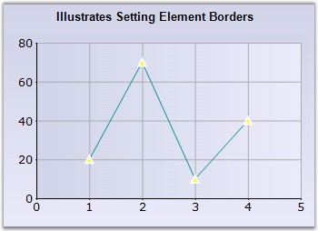

::: {style="DISPLAY: none"}
{#d2h_url_template}{#d2h_package_url style="WIDTH: 0px; DISPLAY: none; HEIGHT: 0px"}
:::

:::: {.d2h_secondary_topic style="PADDING-BOTTOM: 10pt; MARGIN: 0pt; PADDING-LEFT: 0pt; PADDING-RIGHT: 0pt; PADDING-TOP: 0pt"}
#### ElementBorders {#elementborders style="tab-stops: 0pt"}

[]{style="FONT-FAMILY: 'Trebuchet MS','sans-serif'; FONT-SIZE: 9pt"} 

Gets / sets the border settings for elements associated with the chart point. You can specify the inner and outer border. It is currently used only by symbols rendered by the ChartPoint (inherited from ChartStyleInfo).

[]{style="FONT-FAMILY: 'Trebuchet MS','sans-serif'; FONT-SIZE: 9pt"} 

::: {align="center"}
+---------------------------------------+-------------------------------------------------------------------------------------------------------------------------------------------------------------------------------------------------+
| **[]{style="FONT-FAMILY: 'Trebuchet MS','sans-serif'; FONT-SIZE: 9pt"}**                                                                                                                                                                |
|                                                                                                                                                                                                                                         |
| Details                                                                                                                                                                                                                                 |
+---------------------------------------+-------------------------------------------------------------------------------------------------------------------------------------------------------------------------------------------------+
| Possible Values                       | Border setting object                                                                                                                                                                           |
+---------------------------------------+-------------------------------------------------------------------------------------------------------------------------------------------------------------------------------------------------+
| Default Value                         | Weight is  Thin, Width value is 1, Style is Standard                                                                                                                                            |
+---------------------------------------+-------------------------------------------------------------------------------------------------------------------------------------------------------------------------------------------------+
| 2D / 3D Limitations                   | No                                                                                                                                                                                              |
+---------------------------------------+-------------------------------------------------------------------------------------------------------------------------------------------------------------------------------------------------+
| Applies to Chart Element              | All series and points                                                                                                                                                                           |
+---------------------------------------+-------------------------------------------------------------------------------------------------------------------------------------------------------------------------------------------------+
| Applies to Chart Types                | Area Charts, Bar Charts, Bubble Chart, Column Charts, Line  Charts, Candle Chart, Renko chart, Three Line Break Chart, Box and Whisker Chart, Gantt Chart, Tornado Chart, Polar and Radar Chart |
+---------------------------------------+-------------------------------------------------------------------------------------------------------------------------------------------------------------------------------------------------+
:::

**[]{style="FONT-FAMILY: 'Trebuchet MS','sans-serif'; FONT-SIZE: 9pt"}** 

Here is some sample code.

[]{style="FONT-FAMILY: 'Trebuchet MS','sans-serif'; FONT-SIZE: 9pt"} 

Series Wide Setting

[]{style="FONT-FAMILY: 'Trebuchet MS','sans-serif'; FONT-SIZE: 9pt"} 

+-----------------------------------------------------------------------------------------------------------------------------------------------------------------------------------------------------------+
| **[\[C#\]]{style="FONT-FAMILY: 'Courier New'; COLOR: black"}**                                                                                                                                            |
|                                                                                                                                                                                                           |
| **[]{style="FONT-FAMILY: 'Courier New'; COLOR: black"}**                                                                                                                                                  |
|                                                                                                                                                                                                           |
| [// Setting Symbol for the ChartSeries]{style="FONT-FAMILY: 'Courier New'; COLOR: green"}                                                                                                                 |
|                                                                                                                                                                                                           |
| [this]{style="FONT-FAMILY: 'Courier New'; COLOR: blue"}[.ChartWebControl1.Series\[0\].Style.Symbol.Color = [Color]{style="COLOR: teal"}.Yellow;]{style="FONT-FAMILY: 'Courier New'"}                      |
|                                                                                                                                                                                                           |
| [this]{style="FONT-FAMILY: 'Courier New'; COLOR: blue"}[.ChartWebControl1.Series\[0\].Style.Symbol.Shape = [ChartSymbolShape]{style="COLOR: teal"}.InvertedTriangle;]{style="FONT-FAMILY: 'Courier New'"} |
|                                                                                                                                                                                                           |
| [// Setting ElementBorder for a symbol]{style="FONT-FAMILY: 'Courier New'; COLOR: green"}                                                                                                                 |
|                                                                                                                                                                                                           |
| [ChartBordersInfo]{style="FONT-FAMILY: 'Courier New'; COLOR: teal"}[ cbi = [new]{style="COLOR: blue"} [ChartBordersInfo]{style="COLOR: teal"}();]{style="FONT-FAMILY: 'Courier New'"}                     |
|                                                                                                                                                                                                           |
| [cbi.Outer = [new]{style="COLOR: blue"} [ChartBorder]{style="COLOR: teal"}([ChartBorderStyle]{style="COLOR: teal"}.Solid, [Color]{style="COLOR: teal"}.White);]{style="FONT-FAMILY: 'Courier New'"}       |
|                                                                                                                                                                                                           |
| [cbi.Inner = [new]{style="COLOR: blue"} [ChartBorder]{style="COLOR: teal"}([ChartBorderStyle]{style="COLOR: teal"}.DashDot, [Color]{style="COLOR: teal"}.Cyan);]{style="FONT-FAMILY: 'Courier New'"}      |
|                                                                                                                                                                                                           |
| [this]{style="FONT-FAMILY: 'Courier New'; COLOR: blue"}[.ChartWebControl1.Series\[0\].Style.ElementBorders = cbi;]{style="FONT-FAMILY: 'Courier New'"}                                                    |
+-----------------------------------------------------------------------------------------------------------------------------------------------------------------------------------------------------------+

[]{style="FONT-FAMILY: 'Trebuchet MS','sans-serif'; FONT-SIZE: 9pt"} 

+------------------------------------------------------------------------------------------------------------------------------------------------------------------------------------------------------+
| **[\[VB.NET\]]{style="FONT-FAMILY: 'Courier New'; COLOR: black"}**                                                                                                                                   |
|                                                                                                                                                                                                      |
| []{style="FONT-FAMILY: 'Courier New'"}                                                                                                                                                               |
|                                                                                                                                                                                                      |
| [ \' Setting Symbol for the ChartSeries]{style="FONT-FAMILY: 'Courier New'; COLOR: green"}                                                                                                           |
|                                                                                                                                                                                                      |
| [Me]{style="FONT-FAMILY: 'Courier New'; COLOR: blue"}[.ChartWebControl1.Series(0).Style.Symbol.Color = [Color]{style="COLOR: teal"}.Yellow]{style="FONT-FAMILY: 'Courier New'"}                      |
|                                                                                                                                                                                                      |
| [Me]{style="FONT-FAMILY: 'Courier New'; COLOR: blue"}[.ChartWebControl1.Series(0).Style.Symbol.Shape = [ChartSymbolShape]{style="COLOR: teal"}.InvertedTriangle]{style="FONT-FAMILY: 'Courier New'"} |
|                                                                                                                                                                                                      |
| [ \' Setting ElementBorder for a symbol]{style="FONT-FAMILY: 'Courier New'; COLOR: green"}                                                                                                           |
|                                                                                                                                                                                                      |
| [cbi As [ChartBordersInfo]{style="COLOR: teal"} = New [ChartBordersInfo]{style="COLOR: teal"}()]{style="FONT-FAMILY: 'Courier New'"}                                                                 |
|                                                                                                                                                                                                      |
| [cbi.Outer = [New]{style="COLOR: blue"} [ChartBorder]{style="COLOR: teal"}([ChartBorderStyle]{style="COLOR: teal"}.Solid, Color.White)]{style="FONT-FAMILY: 'Courier New'"}                          |
|                                                                                                                                                                                                      |
| [cbi.Inner = [New]{style="COLOR: blue"} ChartBorder(ChartBorderStyle.DashDot, Color.Cyan)]{style="FONT-FAMILY: 'Courier New'"}                                                                       |
|                                                                                                                                                                                                      |
| [Me]{style="FONT-FAMILY: 'Courier New'; COLOR: blue"}[.ChartWebControl1.Series(0).Style.ElementBorders = cbi]{style="FONT-FAMILY: 'Courier New'"}                                                    |
+------------------------------------------------------------------------------------------------------------------------------------------------------------------------------------------------------+

**[]{style="FONT-FAMILY: 'Trebuchet MS','sans-serif'; FONT-SIZE: 9pt"}** 

{border="0"}   

**[]{style="COLOR: black; FONT-SIZE: 8pt"}** 

Figure 117: Column Chart with ElementBorder

**[]{style="FONT-FAMILY: 'Trebuchet MS','sans-serif'; FONT-SIZE: 9pt"}** 

Specific Data Point Setting

**[]{style="FONT-FAMILY: 'Trebuchet MS','sans-serif'"}** 

+--------------------------------------------------------------------------------------------------------------------------------------------------------------+
| **[\[C#\]]{style="FONT-FAMILY: 'Courier New'; COLOR: black"}**                                                                                               |
|                                                                                                                                                              |
| []{style="FONT-FAMILY: 'Courier New'"}                                                                                                                       |
|                                                                                                                                                              |
| [//Specifying element border for the first data point Styles(0), second data point Styles(1) and so on..]{style="FONT-FAMILY: 'Courier New'; COLOR: green"}  |
|                                                                                                                                                              |
| [this]{style="FONT-FAMILY: 'Courier New'; COLOR: blue"}[.ChartWebControl1.Series\[0\].Styles\[0\].ElementBorders = cbi;]{style="FONT-FAMILY: 'Courier New'"} |
+--------------------------------------------------------------------------------------------------------------------------------------------------------------+

[]{style="FONT-FAMILY: 'Trebuchet MS','sans-serif'; FONT-SIZE: 9pt"} 

+-------------------------------------------------------------------------------------------------------------------------------------------------------------+
| **[\[VB.NET\]]{style="FONT-FAMILY: 'Courier New'; COLOR: black"}**                                                                                          |
|                                                                                                                                                             |
| []{style="FONT-FAMILY: 'Courier New'"}                                                                                                                      |
|                                                                                                                                                             |
| [\'Specifying element border for the first data point Styles(0), second data point Styles(1) and so on..]{style="FONT-FAMILY: 'Courier New'; COLOR: green"} |
|                                                                                                                                                             |
| [this]{style="FONT-FAMILY: 'Courier New'; COLOR: blue"}[.ChartWebControl1.Series(0).Styles(0).ElementBorders = cbi]{style="FONT-FAMILY: 'Courier New'"}     |
+-------------------------------------------------------------------------------------------------------------------------------------------------------------+

**[]{style="FONT-FAMILY: 'Trebuchet MS','sans-serif'"}** 

See Also

[]{style="FONT-FAMILY: 'Trebuchet MS','sans-serif'; FONT-SIZE: 9pt"} 

[Line Charts]{.UGHyperlink}[, ]{.UGHyperlink}[Area Charts]{.UGHyperlink}[, ]{.UGHyperlink}[Bar Charts]{.UGHyperlink}[, ]{.UGHyperlink}[Bubble Chart]{.UGHyperlink}[, ]{.UGHyperlink}[Column Charts]{.UGHyperlink}[, ]{.UGHyperlink}[Candle Chart]{.UGHyperlink}[, ]{.UGHyperlink}[Renko chart]{.UGHyperlink}[, ]{.UGHyperlink}[Three Line Break Chart]{.UGHyperlink}[, ]{.UGHyperlink}

[Box and Whisker Chart]{.UGHyperlink}[, ]{.UGHyperlink}[Gantt Chart]{.UGHyperlink}[, ]{.UGHyperlink}[Tornado Chart]{.UGHyperlink}[, ]{.UGHyperlink}[Polar and Radar Chart]{.UGHyperlink}[ ]{.UGHyperlink}

[]{#p97} 

[]{#related-topics}
::::
