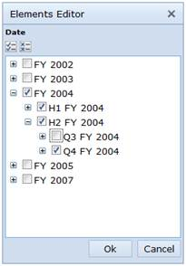
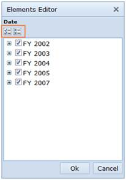
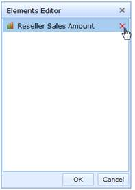

::: {style="DISPLAY: none"}
{#d2h_url_template}{#d2h_package_url style="WIDTH: 0px; DISPLAY: none; HEIGHT: 0px"}
:::

::::: {#nsbanner .d2h_main_nsbanner style="BORDER-BOTTOM: #999999 1px solid; POSITION: relative; PADDING-BOTTOM: 0px; BACKGROUND-COLOR: transparent; PADDING-LEFT: 0px; PADDING-RIGHT: 0px; DISPLAY: none; BORDER-TOP: #999999 1px solid; PADDING-TOP: 0px; LEFT: 0px"}
:::: {#TitleRow .d2h_main_titlerow style="PADDING-BOTTOM: 4px; BACKGROUND-COLOR: transparent; PADDING-LEFT: 22px; WIDTH: 100%; PADDING-RIGHT: 10px; DISPLAY: none; PADDING-TOP: 4px"}
::: {#ienav .d2h_main_ienav style="DISPLAY: none"}
{#D2HPrevious .D2HPreviousEnabled}  {#D2HNext .D2HNextEnabled}
:::
::::
:::::

:::: {#nstext .d2h_main_nstext style="PADDING-BOTTOM: 10px; BACKGROUND-COLOR: transparent; PADDING-LEFT: 22px; PADDING-RIGHT: 10px; HEIGHT: 100%; OVERFLOW: auto; PADDING-TOP: 5px" hasuserbackground="true" valign="bottom"}
::: {#d2h_breadcrumbs .d2h_breadcrumbs}
[Essential Studio User Guide Documentation](ms-xhelp:///?Id=12457748-09e3-4d74-a240-8e049cedf030){.d2h_breadcrumbsNormal}[ \> ]{.d2h_breadcrumbsLinkSeparator}[Business Intelligence Edition](ms-xhelp:///?Id=fdf33dd8-62b2-47b9-ad7b-fc50e590bca5){.d2h_breadcrumbsNormal}[ \> ]{.d2h_breadcrumbsLinkSeparator}[Essential BI ASP.NET](ms-xhelp:///?Id=99c6694e-59c3-4c59-abb5-ce9ce9a948bc){.d2h_breadcrumbsNormal}[ \> ]{.d2h_breadcrumbsLinkSeparator}[Essential BI Client]{.d2h_breadcrumbsContentsOnly}[ \> ]{.d2h_breadcrumbsLinkSeparator}[Getting Started](ms-xhelp:///?Id=d67227c0-bba2-4943-acc1-d5c64f70f90b){.d2h_breadcrumbsNormal}[ \> ]{.d2h_breadcrumbsLinkSeparator}[Appearance and Structure of the control](ms-xhelp:///?Id=5eefc693-d23d-481b-92b8-6a7d9ff5439b){.d2h_breadcrumbsNormal}
:::

### Elements Editor {#elements-editor style="tab-stops: 0pt"}

Check and uncheck nodes of a dimension in Elements Editor

The check option is provided in such a way that on selecting the parent node, its corresponding child nodes get automatically selected. If a leaf node is selected, it does not affect others since it is the end node on a tree.

The uncheck option is provided in such a way that on deselecting the parent node, its corresponding child nodes get automatically deselected and on deselecting all the child nodes, its corresponding parent node get automatically deselected.

{border="0"}

 

Figure 25: Elements Editor

 

Representing state of the nodes of a dimension

Nodes are represented in two states namely:

i)        Checked and

ii)       Unchecked

Check and uncheck all nodes of a dimension in Elements Editor

On selecting the check all/uncheck all buttons in the elements editor, the nodes are changed accordingly:

i)        When no child node is selected, the parent will be unselected.

ii)       When any child node is selected, the parent will get selected automatically.

 

{border="0"}

 

Figure 26: Check/Uncheck All in Elements Editor

[]{#_Measure_Editor} 

Removing a measure from Elements Editor

In order to remove the measure, place the mouse pointer over the corresponding measure and you can see a **remove** option at the right-hand side. Select the **remove** option to remove the measure from the list and in order to avoid the current selection, click **Cancel**.

{border="0"}

 

Figure 27: Removing element in Elements Editor

[]{#related-topics}
::::
