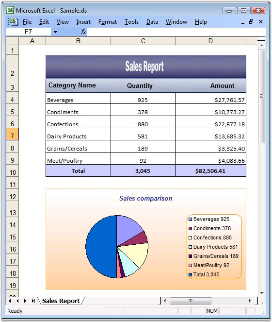

::: {style="DISPLAY: none"}
{#d2h_url_template}{#d2h_package_url style="WIDTH: 0px; DISPLAY: none; HEIGHT: 0px"}
:::

::: {.d2h_secondary_topic style="PADDING-BOTTOM: 10pt; MARGIN: 0pt; PADDING-LEFT: 0pt; PADDING-RIGHT: 0pt; PADDING-TOP: 0pt"}
#### Embedded Chart {#embedded-chart style="tab-stops: 0pt"}

**[]{style="FONT-FAMILY: 'Segoe UI','sans-serif'; COLOR: black"}** 

Essential XlsIO has APIs for creating an embedded chart. The **IChartShape** interface represents the embedded chart\'s in-memory, and this object can be used to format and modify the chart settings for chart area, plot area, and chart title area, with gradient, texture, patterns and pictures.

 

**IChartFrameFormat** can be used to change the format of the chart. **IChartSeries** is used to format the series. XlsIO provides options to enable/disable Legends and Data Tables by using the **HasLegend** and **HasDataTable** properties. You can also resize and position the embedded chart in a worksheet.

 

A chart in XlsIO can be created either through the Data Range of the chart, or by adding series one by one.

 

Following code example illustrates how to create a chart through the Data Range.

 

+---------------------------------------------------------------------------------------------------------------------------------------------------------------------------------+
| **[\[C#\]]{style="FONT-FAMILY: 'Courier New'"}**                                                                                                                                |
|                                                                                                                                                                                 |
| **[]{style="FONT-FAMILY: 'Courier New'"}**                                                                                                                                      |
|                                                                                                                                                                                 |
| [// Clustered Column Chart.]{style="FONT-FAMILY: 'Courier New'; COLOR: green"}                                                                                                  |
|                                                                                                                                                                                 |
| [IChartShape]{style="FONT-FAMILY: 'Courier New'; COLOR: #2b91af"}[ chart = sheet.Charts.Add();]{style="FONT-FAMILY: 'Courier New'"}                                             |
|                                                                                                                                                                                 |
| []{style="FONT-FAMILY: 'Courier New'"}                                                                                                                                          |
|                                                                                                                                                                                 |
| [// Set Chart Type.]{style="FONT-FAMILY: 'Courier New'; COLOR: green"}                                                                                                          |
|                                                                                                                                                                                 |
| [chart.ChartType = [ExcelChartType]{style="COLOR: #2b91af"}.Column_Clustered]{style="FONT-FAMILY: 'Courier New'"}                                                               |
|                                                                                                                                                                                 |
| []{style="FONT-FAMILY: 'Courier New'"}                                                                                                                                          |
|                                                                                                                                                                                 |
| [// Set Data Range.]{style="FONT-FAMILY: 'Courier New'; COLOR: green"}                                                                                                          |
|                                                                                                                                                                                 |
| [chart.DataRange = sheet.Range\[[\"A1:E5\"]{style="COLOR: #a31515"}\];]{style="FONT-FAMILY: 'Courier New'"}                                                                     |
|                                                                                                                                                                                 |
| []{style="FONT-FAMILY: 'Courier New'"}                                                                                                                                          |
|                                                                                                                                                                                 |
| [// Specify Series]{style="FONT-FAMILY: 'Courier New'; COLOR: green"}                                                                                                           |
|                                                                                                                                                                                 |
| [chart.IsSeriesInRows = [false]{style="COLOR: blue"};        ]{style="FONT-FAMILY: 'Courier New'"}                                                                              |
|                                                                                                                                                                                 |
| []{style="FONT-FAMILY: 'Courier New'"}                                                                                                                                          |
|                                                                                                                                                                                 |
| [// Chart Title]{style="FONT-FAMILY: 'Courier New'; COLOR: green"}                                                                                                              |
|                                                                                                                                                                                 |
| [chart.ChartTitle = [\"Sales comparison\"]{style="COLOR: #a31515"};]{style="FONT-FAMILY: 'Courier New'"}                                                                        |
|                                                                                                                                                                                 |
| [                        ]{style="FONT-FAMILY: 'Courier New'"}                                                                                                                  |
|                                                                                                                                                                                 |
| [// X-axis title]{style="FONT-FAMILY: 'Courier New'; COLOR: green"}                                                                                                             |
|                                                                                                                                                                                 |
| [chart.PrimaryCategoryAxis.Title = [\"Fruit Types\"]{style="COLOR: #a31515"};]{style="FONT-FAMILY: 'Courier New'"}                                                              |
|                                                                                                                                                                                 |
| []{style="FONT-FAMILY: 'Courier New'"}                                                                                                                                          |
|                                                                                                                                                                                 |
| [// Y-axis title]{style="FONT-FAMILY: 'Courier New'; COLOR: green"}                                                                                                             |
|                                                                                                                                                                                 |
| [chart.PrimaryValueAxis.Title = [\"Months\"]{style="COLOR: #a31515"};]{style="FONT-FAMILY: 'Courier New'"}                                                                      |
|                                                                                                                                                                                 |
| []{style="FONT-FAMILY: 'Courier New'"}                                                                                                                                          |
|                                                                                                                                                                                 |
| [// Show Data Table.]{style="FONT-FAMILY: 'Courier New'; COLOR: green"}                                                                                                         |
|                                                                                                                                                                                 |
| [chart.HasDataTable = [true]{style="COLOR: blue"};]{style="FONT-FAMILY: 'Courier New'"}                                                                                         |
|                                                                                                                                                                                 |
| []{style="FONT-FAMILY: 'Courier New'"}                                                                                                                                          |
|                                                                                                                                                                                 |
| [// Format Chart Area.]{style="FONT-FAMILY: 'Courier New'; COLOR: green"}                                                                                                       |
|                                                                                                                                                                                 |
| [IChartFrameFormat]{style="FONT-FAMILY: 'Courier New'; COLOR: #2b91af"}[ chartArea = chart.ChartArea;]{style="FONT-FAMILY: 'Courier New'"}                                      |
|                                                                                                                                                                                 |
| []{style="FONT-FAMILY: 'Courier New'"}                                                                                                                                          |
|                                                                                                                                                                                 |
| [// Border]{style="FONT-FAMILY: 'Courier New'; COLOR: green"}                                                                                                                   |
|                                                                                                                                                                                 |
| [        ]{style="FONT-FAMILY: 'Courier New'"}                                                                                                                                  |
|                                                                                                                                                                                 |
| [// Style]{style="FONT-FAMILY: 'Courier New'; COLOR: green"}                                                                                                                    |
|                                                                                                                                                                                 |
| [chartArea.Border.LinePattern = [ExcelChartLinePattern]{style="COLOR: #2b91af"}.Solid;]{style="FONT-FAMILY: 'Courier New'"}                                                     |
|                                                                                                                                                                                 |
| [                        ]{style="FONT-FAMILY: 'Courier New'"}                                                                                                                  |
|                                                                                                                                                                                 |
| [// Color]{style="FONT-FAMILY: 'Courier New'; COLOR: green"}                                                                                                                    |
|                                                                                                                                                                                 |
| [chartArea.Border.LineColor = [Color]{style="COLOR: #2b91af"}.Blue;                        ]{style="FONT-FAMILY: 'Courier New'"}                                                |
|                                                                                                                                                                                 |
| [                        ]{style="FONT-FAMILY: 'Courier New'"}                                                                                                                  |
|                                                                                                                                                                                 |
| [// Weight]{style="FONT-FAMILY: 'Courier New'; COLOR: green"}                                                                                                                   |
|                                                                                                                                                                                 |
| [chartArea.Border.LineWeight  = [ExcelChartLineWeight]{style="COLOR: #2b91af"}.Hairline;]{style="FONT-FAMILY: 'Courier New'"}                                                   |
|                                                                                                                                                                                 |
| []{style="FONT-FAMILY: 'Courier New'"}                                                                                                                                          |
|                                                                                                                                                                                 |
| [// Area]{style="FONT-FAMILY: 'Courier New'; COLOR: green"}                                                                                                                     |
|                                                                                                                                                                                 |
| [                       ]{style="FONT-FAMILY: 'Courier New'"}                                                                                                                   |
|                                                                                                                                                                                 |
| [// Fill Effects]{style="FONT-FAMILY: 'Courier New'; COLOR: green"}                                                                                                             |
|                                                                                                                                                                                 |
| [chartArea.Fill.FillType = [ExcelFillType]{style="COLOR: #2b91af"}.Gradient;]{style="FONT-FAMILY: 'Courier New'"}                                                               |
|                                                                                                                                                                                 |
| [                        ]{style="FONT-FAMILY: 'Courier New'"}                                                                                                                  |
|                                                                                                                                                                                 |
| [// Two Color]{style="FONT-FAMILY: 'Courier New'; COLOR: green"}                                                                                                                |
|                                                                                                                                                                                 |
| [chartArea.Fill.GradientColorType = [ExcelGradientColor]{style="COLOR: #2b91af"}.TwoColor;]{style="FONT-FAMILY: 'Courier New'"}                                                 |
|                                                                                                                                                                                 |
| [                        ]{style="FONT-FAMILY: 'Courier New'"}                                                                                                                  |
|                                                                                                                                                                                 |
| [// Set two colors.]{style="FONT-FAMILY: 'Courier New'; COLOR: green"}                                                                                                          |
|                                                                                                                                                                                 |
| [chartArea.Fill.BackColor = [Color]{style="COLOR: #2b91af"}.FromArgb(205,217,234);]{style="FONT-FAMILY: 'Courier New'"}                                                         |
|                                                                                                                                                                                 |
| [chartArea.Fill.ForeColor = [Color]{style="COLOR: #2b91af"}.White;]{style="FONT-FAMILY: 'Courier New'"}                                                                         |
|                                                                                                                                                                                 |
| []{style="FONT-FAMILY: 'Courier New'"}                                                                                                                                          |
|                                                                                                                                                                                 |
| [// Plot Area]{style="FONT-FAMILY: 'Courier New'; COLOR: green"}                                                                                                                |
|                                                                                                                                                                                 |
| [IChartFrameFormat]{style="FONT-FAMILY: 'Courier New'; COLOR: #2b91af"}[  chartPlotArea = chart.PlotArea;]{style="FONT-FAMILY: 'Courier New'"}                                  |
|                                                                                                                                                                                 |
| []{style="FONT-FAMILY: 'Courier New'"}                                                                                                                                          |
|                                                                                                                                                                                 |
| [// Border]{style="FONT-FAMILY: 'Courier New'; COLOR: green"}                                                                                                                   |
|                                                                                                                                                                                 |
| [                        ]{style="FONT-FAMILY: 'Courier New'"}                                                                                                                  |
|                                                                                                                                                                                 |
| [// Style]{style="FONT-FAMILY: 'Courier New'; COLOR: green"}                                                                                                                    |
|                                                                                                                                                                                 |
| [chartPlotArea.Border.LinePattern = [ExcelChartLinePattern]{style="COLOR: #2b91af"}.Solid;]{style="FONT-FAMILY: 'Courier New'"}                                                 |
|                                                                                                                                                                                 |
| [                        ]{style="FONT-FAMILY: 'Courier New'"}                                                                                                                  |
|                                                                                                                                                                                 |
| [// Color]{style="FONT-FAMILY: 'Courier New'; COLOR: green"}                                                                                                                    |
|                                                                                                                                                                                 |
| [chartPlotArea.Border.LineColor = [Color]{style="COLOR: #2b91af"}.Blue;                                        ]{style="FONT-FAMILY: 'Courier New'"}                            |
|                                                                                                                                                                                 |
| [                        ]{style="FONT-FAMILY: 'Courier New'"}                                                                                                                  |
|                                                                                                                                                                                 |
| [// Weight]{style="FONT-FAMILY: 'Courier New'; COLOR: green"}                                                                                                                   |
|                                                                                                                                                                                 |
| [chartPlotArea.Border.LineWeight  = [ExcelChartLineWeight]{style="COLOR: #2b91af"}.Hairline;]{style="FONT-FAMILY: 'Courier New'"}                                               |
|                                                                                                                                                                                 |
| []{style="FONT-FAMILY: 'Courier New'"}                                                                                                                                          |
|                                                                                                                                                                                 |
| [// Fill Effects]{style="FONT-FAMILY: 'Courier New'; COLOR: green"}                                                                                                             |
|                                                                                                                                                                                 |
| [chartPlotArea.Fill.FillType = [ExcelFillType]{style="COLOR: #2b91af"}.Gradient;]{style="FONT-FAMILY: 'Courier New'"}                                                           |
|                                                                                                                                                                                 |
| [                        ]{style="FONT-FAMILY: 'Courier New'"}                                                                                                                  |
|                                                                                                                                                                                 |
| [// Two Color]{style="FONT-FAMILY: 'Courier New'; COLOR: green"}                                                                                                                |
|                                                                                                                                                                                 |
| [chartPlotArea.Fill.GradientColorType = [ExcelGradientColor]{style="COLOR: #2b91af"}.TwoColor;]{style="FONT-FAMILY: 'Courier New'"}                                             |
|                                                                                                                                                                                 |
| [                        ]{style="FONT-FAMILY: 'Courier New'"}                                                                                                                  |
|                                                                                                                                                                                 |
| [// Set two colors.]{style="FONT-FAMILY: 'Courier New'; COLOR: green"}                                                                                                          |
|                                                                                                                                                                                 |
| [chartPlotArea.Fill.BackColor = [Color]{style="COLOR: #2b91af"}.FromArgb(205,217,234);]{style="FONT-FAMILY: 'Courier New'"}                                                     |
|                                                                                                                                                                                 |
| [chartPlotArea.Fill.ForeColor = [Color]{style="COLOR: #2b91af"}.White;]{style="FONT-FAMILY: 'Courier New'"}                                                                     |
|                                                                                                                                                                                 |
| []{style="FONT-FAMILY: 'Courier New'"}                                                                                                                                          |
|                                                                                                                                                                                 |
| [// Format Data Series.]{style="FONT-FAMILY: 'Courier New'; COLOR: green"}                                                                                                      |
|                                                                                                                                                                                 |
| [IChartSerie]{style="FONT-FAMILY: 'Courier New'; COLOR: #2b91af"}[ chartAppleSerie = chart.Series\[[\"Apples\"]{style="COLOR: #a31515"}\];]{style="FONT-FAMILY: 'Courier New'"} |
|                                                                                                                                                                                 |
| [                        ]{style="FONT-FAMILY: 'Courier New'"}                                                                                                                  |
|                                                                                                                                                                                 |
| [// Color of first serie.]{style="FONT-FAMILY: 'Courier New'; COLOR: green"}                                                                                                    |
|                                                                                                                                                                                 |
| [chartAppleSerie.SerieFormat.AreaProperties.ForegroundColor = [Color]{style="COLOR: #2b91af"}.Red;]{style="FONT-FAMILY: 'Courier New'"}                                         |
|                                                                                                                                                                                 |
| [chartAppleSerie = chart.Series\[[\"Oranges\"]{style="COLOR: #a31515"}\];]{style="FONT-FAMILY: 'Courier New'"}                                                                  |
|                                                                                                                                                                                 |
| [                        ]{style="FONT-FAMILY: 'Courier New'"}                                                                                                                  |
|                                                                                                                                                                                 |
| [// Color of second serie.]{style="FONT-FAMILY: 'Courier New'; COLOR: green"}                                                                                                   |
|                                                                                                                                                                                 |
| [chartAppleSerie.SerieFormat.AreaProperties.ForegroundColor = [Color]{style="COLOR: #2b91af"}.Orange;]{style="FONT-FAMILY: 'Courier New'"}                                      |
|                                                                                                                                                                                 |
| [chartAppleSerie = chart.Series\[[\"Grapes\"]{style="COLOR: #a31515"}\];]{style="FONT-FAMILY: 'Courier New'"}                                                                   |
|                                                                                                                                                                                 |
| [                        ]{style="FONT-FAMILY: 'Courier New'"}                                                                                                                  |
|                                                                                                                                                                                 |
| [// Color of third serie.]{style="FONT-FAMILY: 'Courier New'; COLOR: green"}                                                                                                    |
|                                                                                                                                                                                 |
| [chartAppleSerie.SerieFormat.AreaProperties.ForegroundColor = [Color]{style="COLOR: #2b91af"}.Purple;]{style="FONT-FAMILY: 'Courier New'"}                                      |
|                                                                                                                                                                                 |
| [chartAppleSerie = chart.Series\[[\"Banana\"]{style="COLOR: #a31515"}\];]{style="FONT-FAMILY: 'Courier New'"}                                                                   |
|                                                                                                                                                                                 |
| [                        ]{style="FONT-FAMILY: 'Courier New'"}                                                                                                                  |
|                                                                                                                                                                                 |
| [// Color of fourth serie.]{style="FONT-FAMILY: 'Courier New'; COLOR: green"}                                                                                                   |
|                                                                                                                                                                                 |
| [chartAppleSerie.SerieFormat.AreaProperties.ForegroundColor = [Color]{style="COLOR: #2b91af"}.Yellow;]{style="FONT-FAMILY: 'Courier New'"}                                      |
|                                                                                                                                                                                 |
| []{style="FONT-FAMILY: 'Courier New'"}                                                                                                                                          |
|                                                                                                                                                                                 |
| [// Embedded chart position.]{style="FONT-FAMILY: 'Courier New'; COLOR: green"}                                                                                                 |
|                                                                                                                                                                                 |
| [chart.TopRow = 10;]{style="FONT-FAMILY: 'Courier New'"}                                                                                                                        |
|                                                                                                                                                                                 |
| [chart.BottomRow = 40;]{style="FONT-FAMILY: 'Courier New'"}                                                                                                                     |
|                                                                                                                                                                                 |
| [chart.LeftColumn = 5;]{style="FONT-FAMILY: 'Courier New'"}                                                                                                                     |
|                                                                                                                                                                                 |
| [chart.RightColumn = 15; ]{style="FONT-FAMILY: 'Courier New'"}                                                                                                                  |
+---------------------------------------------------------------------------------------------------------------------------------------------------------------------------------+

[]{style="FONT-FAMILY: 'Trebuchet MS','sans-serif'; COLOR: #15428b; FONT-SIZE: 9pt"} 

+--------------------------------------------------------------------------------------------------------------------------------------------------------------------------------------------------------+
| **[\[VB.NET\]]{style="FONT-FAMILY: 'Courier New'"}**                                                                                                                                                   |
|                                                                                                                                                                                                        |
| **[]{style="FONT-FAMILY: 'Courier New'"}**                                                                                                                                                             |
|                                                                                                                                                                                                        |
| [\' Clustered Column Chart.]{style="FONT-FAMILY: 'Courier New'; COLOR: green"}                                                                                                                         |
|                                                                                                                                                                                                        |
| [Dim]{style="FONT-FAMILY: 'Courier New'; COLOR: blue"}[ chart [As]{style="COLOR: blue"} IChartShape = sheet.Charts.Add()]{style="FONT-FAMILY: 'Courier New'"}                                          |
|                                                                                                                                                                                                        |
| []{style="FONT-FAMILY: 'Courier New'"}                                                                                                                                                                 |
|                                                                                                                                                                                                        |
| [\' Set Chart Type.]{style="FONT-FAMILY: 'Courier New'; COLOR: green"}                                                                                                                                 |
|                                                                                                                                                                                                        |
| [chart.ChartType = ExcelChartType.Column_Clustered]{style="FONT-FAMILY: 'Courier New'"}                                                                                                                |
|                                                                                                                                                                                                        |
| []{style="FONT-FAMILY: 'Courier New'"}                                                                                                                                                                 |
|                                                                                                                                                                                                        |
| [\' Set Data Range.]{style="FONT-FAMILY: 'Courier New'; COLOR: green"}                                                                                                                                 |
|                                                                                                                                                                                                        |
| [chart.DataRange = sheet.Range([\"A1:E5\"]{style="COLOR: maroon"})]{style="FONT-FAMILY: 'Courier New'"}                                                                                                |
|                                                                                                                                                                                                        |
| []{style="FONT-FAMILY: 'Courier New'"}                                                                                                                                                                 |
|                                                                                                                                                                                                        |
| [\' Specify Series.]{style="FONT-FAMILY: 'Courier New'; COLOR: green"}                                                                                                                                 |
|                                                                                                                                                                                                        |
| [chart.IsSeriesInRows = [False]{style="COLOR: blue"}]{style="FONT-FAMILY: 'Courier New'"}                                                                                                              |
|                                                                                                                                                                                                        |
| []{style="FONT-FAMILY: 'Courier New'; COLOR: blue"}                                                                                                                                                    |
|                                                                                                                                                                                                        |
| [\' Chart Title]{style="FONT-FAMILY: 'Courier New'; COLOR: green"}                                                                                                                                     |
|                                                                                                                                                                                                        |
| [chart.ChartTitle = [\"Sales comparison\"]{style="COLOR: maroon"}]{style="FONT-FAMILY: 'Courier New'"}                                                                                                 |
|                                                                                                                                                                                                        |
| []{style="FONT-FAMILY: 'Courier New'; COLOR: maroon"}                                                                                                                                                  |
|                                                                                                                                                                                                        |
| [\' X-axis title]{style="FONT-FAMILY: 'Courier New'; COLOR: green"}                                                                                                                                    |
|                                                                                                                                                                                                        |
| [chart.PrimaryCategoryAxis.Title = [\"Fruit Types\"]{style="COLOR: maroon"}]{style="FONT-FAMILY: 'Courier New'"}                                                                                       |
|                                                                                                                                                                                                        |
| []{style="FONT-FAMILY: 'Courier New'; COLOR: maroon"}                                                                                                                                                  |
|                                                                                                                                                                                                        |
| [\' Y-axis title]{style="FONT-FAMILY: 'Courier New'; COLOR: green"}                                                                                                                                    |
|                                                                                                                                                                                                        |
| [chart.PrimaryValueAxis.Title = [\"Months\"]{style="COLOR: maroon"}]{style="FONT-FAMILY: 'Courier New'"}                                                                                               |
|                                                                                                                                                                                                        |
| []{style="FONT-FAMILY: 'Courier New'; COLOR: maroon"}                                                                                                                                                  |
|                                                                                                                                                                                                        |
| [\' Show Data Table.]{style="FONT-FAMILY: 'Courier New'; COLOR: green"}                                                                                                                                |
|                                                                                                                                                                                                        |
| [chart.HasDataTable = [True]{style="COLOR: blue"}]{style="FONT-FAMILY: 'Courier New'"}                                                                                                                 |
|                                                                                                                                                                                                        |
| []{style="FONT-FAMILY: 'Courier New'; COLOR: blue"}                                                                                                                                                    |
|                                                                                                                                                                                                        |
| [\' Format Chart Area.]{style="FONT-FAMILY: 'Courier New'; COLOR: green"}                                                                                                                              |
|                                                                                                                                                                                                        |
| [Dim]{style="FONT-FAMILY: 'Courier New'; COLOR: blue"}[ chartArea [As]{style="COLOR: blue"} IChartFrameFormat = chart.ChartArea]{style="FONT-FAMILY: 'Courier New'"}                                   |
|                                                                                                                                                                                                        |
| []{style="FONT-FAMILY: 'Courier New'"}                                                                                                                                                                 |
|                                                                                                                                                                                                        |
| [\' Border]{style="FONT-FAMILY: 'Courier New'; COLOR: green"}                                                                                                                                          |
|                                                                                                                                                                                                        |
| []{style="FONT-FAMILY: 'Courier New'; COLOR: green"}                                                                                                                                                   |
|                                                                                                                                                                                                        |
| [\' Style]{style="FONT-FAMILY: 'Courier New'; COLOR: green"}                                                                                                                                           |
|                                                                                                                                                                                                        |
| [chartArea.Border.LinePattern = ExcelChartLinePattern.Solid]{style="FONT-FAMILY: 'Courier New'"}                                                                                                       |
|                                                                                                                                                                                                        |
| []{style="FONT-FAMILY: 'Courier New'"}                                                                                                                                                                 |
|                                                                                                                                                                                                        |
| [\' Color]{style="FONT-FAMILY: 'Courier New'; COLOR: green"}                                                                                                                                           |
|                                                                                                                                                                                                        |
| [chartArea.Border.LineColor = Color.Blue]{style="FONT-FAMILY: 'Courier New'"}                                                                                                                          |
|                                                                                                                                                                                                        |
| []{style="FONT-FAMILY: 'Courier New'"}                                                                                                                                                                 |
|                                                                                                                                                                                                        |
| [\' Weight]{style="FONT-FAMILY: 'Courier New'; COLOR: green"}                                                                                                                                          |
|                                                                                                                                                                                                        |
| [chartArea.Border.LineWeight = ExcelChartLineWeight.Hairline]{style="FONT-FAMILY: 'Courier New'"}                                                                                                      |
|                                                                                                                                                                                                        |
| []{style="FONT-FAMILY: 'Courier New'"}                                                                                                                                                                 |
|                                                                                                                                                                                                        |
| [\' Area]{style="FONT-FAMILY: 'Courier New'; COLOR: green"}                                                                                                                                            |
|                                                                                                                                                                                                        |
| []{style="FONT-FAMILY: 'Courier New'; COLOR: green"}                                                                                                                                                   |
|                                                                                                                                                                                                        |
| [\' Fill Effects]{style="FONT-FAMILY: 'Courier New'; COLOR: green"}                                                                                                                                    |
|                                                                                                                                                                                                        |
| [chartArea.Fill.FillType = ExcelFillType.Gradient]{style="FONT-FAMILY: 'Courier New'"}                                                                                                                 |
|                                                                                                                                                                                                        |
| []{style="FONT-FAMILY: 'Courier New'"}                                                                                                                                                                 |
|                                                                                                                                                                                                        |
| [\' Two Color]{style="FONT-FAMILY: 'Courier New'; COLOR: green"}                                                                                                                                       |
|                                                                                                                                                                                                        |
| [chartArea.Fill.GradientColorType = ExcelGradientColor.TwoColor]{style="FONT-FAMILY: 'Courier New'"}                                                                                                   |
|                                                                                                                                                                                                        |
| []{style="FONT-FAMILY: 'Courier New'"}                                                                                                                                                                 |
|                                                                                                                                                                                                        |
| [\' Set two colors.]{style="FONT-FAMILY: 'Courier New'; COLOR: green"}                                                                                                                                 |
|                                                                                                                                                                                                        |
| [chartArea.Fill.BackColor = Color.FromArgb(205,217,234)]{style="FONT-FAMILY: 'Courier New'"}                                                                                                           |
|                                                                                                                                                                                                        |
| [chartArea.Fill.ForeColor = Color.White]{style="FONT-FAMILY: 'Courier New'"}                                                                                                                           |
|                                                                                                                                                                                                        |
| []{style="FONT-FAMILY: 'Courier New'"}                                                                                                                                                                 |
|                                                                                                                                                                                                        |
| [\' Plot Area]{style="FONT-FAMILY: 'Courier New'; COLOR: green"}                                                                                                                                       |
|                                                                                                                                                                                                        |
| [Dim]{style="FONT-FAMILY: 'Courier New'; COLOR: blue"}[ chartPlotArea [As]{style="COLOR: blue"} IChartFrameFormat = chart.PlotArea]{style="FONT-FAMILY: 'Courier New'"}                                |
|                                                                                                                                                                                                        |
| []{style="FONT-FAMILY: 'Courier New'"}                                                                                                                                                                 |
|                                                                                                                                                                                                        |
| [\' Border]{style="FONT-FAMILY: 'Courier New'; COLOR: green"}                                                                                                                                          |
|                                                                                                                                                                                                        |
| []{style="FONT-FAMILY: 'Courier New'; COLOR: green"}                                                                                                                                                   |
|                                                                                                                                                                                                        |
| [\' Style]{style="FONT-FAMILY: 'Courier New'; COLOR: green"}                                                                                                                                           |
|                                                                                                                                                                                                        |
| [chartPlotArea.Border.LinePattern = ExcelChartLinePattern.Solid]{style="FONT-FAMILY: 'Courier New'"}                                                                                                   |
|                                                                                                                                                                                                        |
| []{style="FONT-FAMILY: 'Courier New'"}                                                                                                                                                                 |
|                                                                                                                                                                                                        |
| [\' Color]{style="FONT-FAMILY: 'Courier New'; COLOR: green"}                                                                                                                                           |
|                                                                                                                                                                                                        |
| [chartPlotArea.Border.LineColor = Color.Blue]{style="FONT-FAMILY: 'Courier New'"}                                                                                                                      |
|                                                                                                                                                                                                        |
| []{style="FONT-FAMILY: 'Courier New'"}                                                                                                                                                                 |
|                                                                                                                                                                                                        |
| [\' Weight]{style="FONT-FAMILY: 'Courier New'; COLOR: green"}                                                                                                                                          |
|                                                                                                                                                                                                        |
| [chartPlotArea.Border.LineWeight = ExcelChartLineWeight.Hairline]{style="FONT-FAMILY: 'Courier New'"}                                                                                                  |
|                                                                                                                                                                                                        |
| []{style="FONT-FAMILY: 'Courier New'"}                                                                                                                                                                 |
|                                                                                                                                                                                                        |
| [\' Fill Effects]{style="FONT-FAMILY: 'Courier New'; COLOR: green"}                                                                                                                                    |
|                                                                                                                                                                                                        |
| [chartPlotArea.Fill.FillType = ExcelFillType.Gradient]{style="FONT-FAMILY: 'Courier New'"}                                                                                                             |
|                                                                                                                                                                                                        |
| []{style="FONT-FAMILY: 'Courier New'"}                                                                                                                                                                 |
|                                                                                                                                                                                                        |
| [\' Two Color]{style="FONT-FAMILY: 'Courier New'; COLOR: green"}                                                                                                                                       |
|                                                                                                                                                                                                        |
| [chartPlotArea.Fill.GradientColorType = ExcelGradientColor.TwoColor]{style="FONT-FAMILY: 'Courier New'"}                                                                                               |
|                                                                                                                                                                                                        |
| []{style="FONT-FAMILY: 'Courier New'"}                                                                                                                                                                 |
|                                                                                                                                                                                                        |
| [\' Set two colors.]{style="FONT-FAMILY: 'Courier New'; COLOR: green"}                                                                                                                                 |
|                                                                                                                                                                                                        |
| [chartPlotArea.Fill.BackColor = Color.FromArgb(205,217,234)]{style="FONT-FAMILY: 'Courier New'"}                                                                                                       |
|                                                                                                                                                                                                        |
| [chartPlotArea.Fill.ForeColor = Color.White]{style="FONT-FAMILY: 'Courier New'"}                                                                                                                       |
|                                                                                                                                                                                                        |
| []{style="FONT-FAMILY: 'Courier New'"}                                                                                                                                                                 |
|                                                                                                                                                                                                        |
| [\' Format Data Series.]{style="FONT-FAMILY: 'Courier New'; COLOR: green"}                                                                                                                             |
|                                                                                                                                                                                                        |
| [Dim]{style="FONT-FAMILY: 'Courier New'; COLOR: blue"}[ chartAppleSerie [As]{style="COLOR: blue"} IChartSerie = chart.Series([\"Apples\"]{style="COLOR: maroon"})]{style="FONT-FAMILY: 'Courier New'"} |
|                                                                                                                                                                                                        |
| []{style="FONT-FAMILY: 'Courier New'"}                                                                                                                                                                 |
|                                                                                                                                                                                                        |
| [\' Color of first serie.]{style="FONT-FAMILY: 'Courier New'; COLOR: green"}                                                                                                                           |
|                                                                                                                                                                                                        |
| [chartAppleSerie.SerieFormat.AreaProperties.ForegroundColor = Color.Red]{style="FONT-FAMILY: 'Courier New'"}                                                                                           |
|                                                                                                                                                                                                        |
| [chartAppleSerie = chart.Series([\"Oranges\"]{style="COLOR: maroon"})]{style="FONT-FAMILY: 'Courier New'"}                                                                                             |
|                                                                                                                                                                                                        |
| []{style="FONT-FAMILY: 'Courier New'"}                                                                                                                                                                 |
|                                                                                                                                                                                                        |
| [\' Color of second serie.]{style="FONT-FAMILY: 'Courier New'; COLOR: green"}                                                                                                                          |
|                                                                                                                                                                                                        |
| [chartAppleSerie.SerieFormat.AreaProperties.ForegroundColor = Color.Orange]{style="FONT-FAMILY: 'Courier New'"}                                                                                        |
|                                                                                                                                                                                                        |
| [chartAppleSerie = chart.Series([\"Grapes\"]{style="COLOR: maroon"})]{style="FONT-FAMILY: 'Courier New'"}                                                                                              |
|                                                                                                                                                                                                        |
| []{style="FONT-FAMILY: 'Courier New'"}                                                                                                                                                                 |
|                                                                                                                                                                                                        |
| [\' Color of third serie.]{style="FONT-FAMILY: 'Courier New'; COLOR: green"}                                                                                                                           |
|                                                                                                                                                                                                        |
| [chartAppleSerie.SerieFormat.AreaProperties.ForegroundColor = Color.Purple]{style="FONT-FAMILY: 'Courier New'"}                                                                                        |
|                                                                                                                                                                                                        |
| [chartAppleSerie = chart.Series([\"Banana\"]{style="COLOR: maroon"})]{style="FONT-FAMILY: 'Courier New'"}                                                                                              |
|                                                                                                                                                                                                        |
| []{style="FONT-FAMILY: 'Courier New'"}                                                                                                                                                                 |
|                                                                                                                                                                                                        |
| [\' Color of fourth serie.]{style="FONT-FAMILY: 'Courier New'; COLOR: green"}                                                                                                                          |
|                                                                                                                                                                                                        |
| [chartAppleSerie.SerieFormat.AreaProperties.ForegroundColor = Color.Yellow]{style="FONT-FAMILY: 'Courier New'"}                                                                                        |
|                                                                                                                                                                                                        |
| []{style="FONT-FAMILY: 'Courier New'"}                                                                                                                                                                 |
|                                                                                                                                                                                                        |
| [\' Embedded chart position.]{style="FONT-FAMILY: 'Courier New'; COLOR: green"}                                                                                                                        |
|                                                                                                                                                                                                        |
| [chart.TopRow = 10]{style="FONT-FAMILY: 'Courier New'"}                                                                                                                                                |
|                                                                                                                                                                                                        |
| [chart.BottomRow = 40]{style="FONT-FAMILY: 'Courier New'"}                                                                                                                                             |
|                                                                                                                                                                                                        |
| [chart.LeftColumn = 5]{style="FONT-FAMILY: 'Courier New'"}                                                                                                                                             |
|                                                                                                                                                                                                        |
| [chart.RightColumn = 15]{style="FONT-FAMILY: 'Courier New'"}                                                                                                                                           |
+--------------------------------------------------------------------------------------------------------------------------------------------------------------------------------------------------------+

 

Following code example illustrates how to create charts by adding Series.

 

+--------------------------------------------------------------------------------------------------------------------------------------------------------------------------------------------------------------------------------------+
| **[\[C#\]]{style="FONT-FAMILY: 'Courier New'; COLOR: black"}**                                                                                                                                                                       |
|                                                                                                                                                                                                                                      |
| **[]{style="FONT-FAMILY: 'Courier New'; COLOR: black"}**                                                                                                                                                                             |
|                                                                                                                                                                                                                                      |
| [// Inserting sample data for the chart.]{style="FONT-FAMILY: 'Courier New'; COLOR: green"}                                                                                                                                          |
|                                                                                                                                                                                                                                      |
| [sheet.Range\[\"A1\"\].Text = \"Month\";]{style="FONT-FAMILY: 'Courier New'; COLOR: black"}                                                                                                                                          |
|                                                                                                                                                                                                                                      |
| [sheet.Range\[\"B1\"\].Text = \"Product A\";]{style="FONT-FAMILY: 'Courier New'; COLOR: black"}                                                                                                                                      |
|                                                                                                                                                                                                                                      |
| [sheet.Range\[\"C1\"\].Text = \"Product B\";]{style="FONT-FAMILY: 'Courier New'; COLOR: black"}                                                                                                                                      |
|                                                                                                                                                                                                                                      |
| []{style="FONT-FAMILY: 'Courier New'"}                                                                                                                                                                                               |
|                                                                                                                                                                                                                                      |
| [// Months]{style="FONT-FAMILY: 'Courier New'; COLOR: green"}                                                                                                                                                                        |
|                                                                                                                                                                                                                                      |
| [sheet.Range\[\"A2\"\].Text = \"Jan\";]{style="FONT-FAMILY: 'Courier New'"}                                                                                                                                                          |
|                                                                                                                                                                                                                                      |
| [sheet.Range\[\"A3\"\].Text = \"Feb\";]{style="FONT-FAMILY: 'Courier New'; COLOR: black"}                                                                                                                                            |
|                                                                                                                                                                                                                                      |
| [sheet.Range\[\"A4\"\].Text = \"Mar\";]{style="FONT-FAMILY: 'Courier New'; COLOR: black"}                                                                                                                                            |
|                                                                                                                                                                                                                                      |
| [sheet.Range\[\"A5\"\].Text = \"Apr\";]{style="FONT-FAMILY: 'Courier New'; COLOR: black"}                                                                                                                                            |
|                                                                                                                                                                                                                                      |
| [sheet.Range\[\"A6\"\].Text = \"May\";]{style="FONT-FAMILY: 'Courier New'; COLOR: black"}                                                                                                                                            |
|                                                                                                                                                                                                                                      |
| []{style="FONT-FAMILY: 'Courier New'"}                                                                                                                                                                                               |
|                                                                                                                                                                                                                                      |
| [// Random Data.]{style="FONT-FAMILY: 'Courier New'; COLOR: green"}                                                                                                                                                                  |
|                                                                                                                                                                                                                                      |
| [Random r = ]{style="FONT-FAMILY: 'Courier New'; COLOR: black"}[new]{style="FONT-FAMILY: 'Courier New'; COLOR: blue"}[ Random();]{style="FONT-FAMILY: 'Courier New'; COLOR: black"}                                                  |
|                                                                                                                                                                                                                                      |
| [for]{style="FONT-FAMILY: 'Courier New'; COLOR: blue"}[(]{style="FONT-FAMILY: 'Courier New'; COLOR: black"}[int]{style="FONT-FAMILY: 'Courier New'; COLOR: blue"}[ i=2;i\<=6;i++)]{style="FONT-FAMILY: 'Courier New'; COLOR: black"} |
|                                                                                                                                                                                                                                      |
| [{]{style="FONT-FAMILY: 'Courier New'; COLOR: black"}                                                                                                                                                                                |
|                                                                                                                                                                                                                                      |
| [for]{style="FONT-FAMILY: 'Courier New'; COLOR: blue"}[(]{style="FONT-FAMILY: 'Courier New'; COLOR: black"}[int]{style="FONT-FAMILY: 'Courier New'; COLOR: blue"}[ j=2;j\<=3;j++)]{style="FONT-FAMILY: 'Courier New'; COLOR: black"} |
|                                                                                                                                                                                                                                      |
| [{]{style="FONT-FAMILY: 'Courier New'; COLOR: black"}                                                                                                                                                                                |
|                                                                                                                                                                                                                                      |
| [sheet.Range\[i,j\].Number = r.Next(0,500);]{style="FONT-FAMILY: 'Courier New'; COLOR: black"}                                                                                                                                       |
|                                                                                                                                                                                                                                      |
| [}]{style="FONT-FAMILY: 'Courier New'; COLOR: black"}                                                                                                                                                                                |
|                                                                                                                                                                                                                                      |
| [}        ]{style="FONT-FAMILY: 'Courier New'; COLOR: black"}                                                                                                                                                                        |
|                                                                                                                                                                                                                                      |
| []{style="FONT-FAMILY: 'Courier New'; COLOR: black"}                                                                                                                                                                                 |
|                                                                                                                                                                                                                                      |
| [// Embedded Chart.]{style="FONT-FAMILY: 'Courier New'; COLOR: green"}                                                                                                                                                               |
|                                                                                                                                                                                                                                      |
| [IChartShape chart = sheet.Charts.Add();]{style="FONT-FAMILY: 'Courier New'; COLOR: black"}                                                                                                                                          |
|                                                                                                                                                                                                                                      |
| []{style="FONT-FAMILY: 'Courier New'; COLOR: black"}                                                                                                                                                                                 |
|                                                                                                                                                                                                                                      |
| [// Setting chart type.]{style="FONT-FAMILY: 'Courier New'; COLOR: green"}                                                                                                                                                           |
|                                                                                                                                                                                                                                      |
| [chart.ChartType = ExcelChartType.Line;]{style="FONT-FAMILY: 'Courier New'; COLOR: black"}                                                                                                                                           |
|                                                                                                                                                                                                                                      |
| []{style="FONT-FAMILY: 'Courier New'; COLOR: black"}                                                                                                                                                                                 |
|                                                                                                                                                                                                                                      |
| [// Setting the Chart Title.]{style="FONT-FAMILY: 'Courier New'; COLOR: green"}                                                                                                                                                      |
|                                                                                                                                                                                                                                      |
| [chart.ChartTitle = \"Product Sales comparison\";]{style="FONT-FAMILY: 'Courier New'; COLOR: black"}                                                                                                                                 |
|                                                                                                                                                                                                                                      |
| []{style="FONT-FAMILY: 'Courier New'"}                                                                                                                                                                                               |
|                                                                                                                                                                                                                                      |
| [// Product A.]{style="FONT-FAMILY: 'Courier New'; COLOR: green"}                                                                                                                                                                    |
|                                                                                                                                                                                                                                      |
| [IChartSerie productA = chart.Series.Add(\"ProductA\");]{style="FONT-FAMILY: 'Courier New'; COLOR: black"}                                                                                                                           |
|                                                                                                                                                                                                                                      |
| [productA.Values = sheet.Range\[\"B2:B6\"\];]{style="FONT-FAMILY: 'Courier New'; COLOR: black"}                                                                                                                                      |
|                                                                                                                                                                                                                                      |
| [productA.CategoryLabels = sheet.Range\[\"A2:A6\"\];]{style="FONT-FAMILY: 'Courier New'; COLOR: black"}                                                                                                                              |
|                                                                                                                                                                                                                                      |
| []{style="FONT-FAMILY: 'Courier New'; COLOR: black"}                                                                                                                                                                                 |
|                                                                                                                                                                                                                                      |
| [// Product B.]{style="FONT-FAMILY: 'Courier New'; COLOR: green"}                                                                                                                                                                    |
|                                                                                                                                                                                                                                      |
| [IChartSerie productB = chart.Series.Add(\"ProductB\");]{style="FONT-FAMILY: 'Courier New'; COLOR: black"}                                                                                                                           |
|                                                                                                                                                                                                                                      |
| [productB.Values = sheet.Range\[\"C2:C6\"\];]{style="FONT-FAMILY: 'Courier New'; COLOR: black"}                                                                                                                                      |
|                                                                                                                                                                                                                                      |
| [productB.CategoryLabels = sheet.Range\[\"A2:A6\"\]; ]{style="FONT-FAMILY: 'Courier New'; COLOR: black"}                                                                                                                             |
+--------------------------------------------------------------------------------------------------------------------------------------------------------------------------------------------------------------------------------------+

[]{style="FONT-FAMILY: 'Trebuchet MS','sans-serif'; COLOR: #15428b; FONT-SIZE: 9pt"} 

+--------------------------------------------------------------------------------------------------------------------------------------------------------------------------------------------------------------------------------------------------------------------------------------------------------------------------------------------------------------------------------------------------------+
| **[\[VB.NET\]]{style="FONT-FAMILY: 'Courier New'; COLOR: black"}**                                                                                                                                                                                                                                                                                                                                     |
|                                                                                                                                                                                                                                                                                                                                                                                                        |
| **[]{style="FONT-FAMILY: 'Courier New'; COLOR: black"}**                                                                                                                                                                                                                                                                                                                                               |
|                                                                                                                                                                                                                                                                                                                                                                                                        |
| [\' Inserting sample data for the chart.]{style="FONT-FAMILY: 'Courier New'; COLOR: green"}                                                                                                                                                                                                                                                                                                            |
|                                                                                                                                                                                                                                                                                                                                                                                                        |
| [sheet.Range(\"A1\").Text = \"Month\"]{style="FONT-FAMILY: 'Courier New'; COLOR: black"}                                                                                                                                                                                                                                                                                                               |
|                                                                                                                                                                                                                                                                                                                                                                                                        |
| [sheet.Range(\"B1\").Text = \"Product A\"]{style="FONT-FAMILY: 'Courier New'; COLOR: black"}                                                                                                                                                                                                                                                                                                           |
|                                                                                                                                                                                                                                                                                                                                                                                                        |
| [sheet.Range(\"C1\").Text = \"Product B\"]{style="FONT-FAMILY: 'Courier New'; COLOR: black"}                                                                                                                                                                                                                                                                                                           |
|                                                                                                                                                                                                                                                                                                                                                                                                        |
| []{style="FONT-FAMILY: 'Courier New'"}                                                                                                                                                                                                                                                                                                                                                                 |
|                                                                                                                                                                                                                                                                                                                                                                                                        |
| [\' Months]{style="FONT-FAMILY: 'Courier New'; COLOR: green"}                                                                                                                                                                                                                                                                                                                                          |
|                                                                                                                                                                                                                                                                                                                                                                                                        |
| [sheet.Range(\"A2\").Text = \"Jan\"]{style="FONT-FAMILY: 'Courier New'; COLOR: black"}                                                                                                                                                                                                                                                                                                                 |
|                                                                                                                                                                                                                                                                                                                                                                                                        |
| [sheet.Range(\"A3\").Text = \"Feb\"]{style="FONT-FAMILY: 'Courier New'; COLOR: black"}                                                                                                                                                                                                                                                                                                                 |
|                                                                                                                                                                                                                                                                                                                                                                                                        |
| [sheet.Range(\"A4\").Text = \"Mar\"]{style="FONT-FAMILY: 'Courier New'; COLOR: black"}                                                                                                                                                                                                                                                                                                                 |
|                                                                                                                                                                                                                                                                                                                                                                                                        |
| [sheet.Range(\"A5\").Text = \"Apr\"]{style="FONT-FAMILY: 'Courier New'; COLOR: black"}                                                                                                                                                                                                                                                                                                                 |
|                                                                                                                                                                                                                                                                                                                                                                                                        |
| [sheet.Range(\"A6\").Text = \"May\"]{style="FONT-FAMILY: 'Courier New'; COLOR: black"}                                                                                                                                                                                                                                                                                                                 |
|                                                                                                                                                                                                                                                                                                                                                                                                        |
| []{style="FONT-FAMILY: 'Courier New'"}                                                                                                                                                                                                                                                                                                                                                                 |
|                                                                                                                                                                                                                                                                                                                                                                                                        |
| [\' Random Data.]{style="FONT-FAMILY: 'Courier New'; COLOR: green"}                                                                                                                                                                                                                                                                                                                                    |
|                                                                                                                                                                                                                                                                                                                                                                                                        |
| [Dim]{style="FONT-FAMILY: 'Courier New'; COLOR: blue"}[ r ]{style="FONT-FAMILY: 'Courier New'; COLOR: black"}[As]{style="FONT-FAMILY: 'Courier New'; COLOR: blue"}[ Random = ]{style="FONT-FAMILY: 'Courier New'; COLOR: black"}[New]{style="FONT-FAMILY: 'Courier New'; COLOR: blue"}[ Random]{style="FONT-FAMILY: 'Courier New'; COLOR: black"}                                                      |
|                                                                                                                                                                                                                                                                                                                                                                                                        |
| [For]{style="FONT-FAMILY: 'Courier New'; COLOR: blue"}[ i]{style="FONT-FAMILY: 'Courier New'; COLOR: black"}[ As Integer]{style="FONT-FAMILY: 'Courier New'; COLOR: blue"}[ = 2 ]{style="FONT-FAMILY: 'Courier New'; COLOR: black"}[To]{style="FONT-FAMILY: 'Courier New'; COLOR: blue"}[ 6]{style="FONT-FAMILY: 'Courier New'; COLOR: black"}                                                         |
|                                                                                                                                                                                                                                                                                                                                                                                                        |
| [    ]{style="FONT-FAMILY: 'Courier New'; COLOR: black"}[For]{style="FONT-FAMILY: 'Courier New'; COLOR: blue"}[ j ]{style="FONT-FAMILY: 'Courier New'; COLOR: black"}[As Integer]{style="FONT-FAMILY: 'Courier New'; COLOR: blue"}[ = 2 ]{style="FONT-FAMILY: 'Courier New'; COLOR: black"}[To]{style="FONT-FAMILY: 'Courier New'; COLOR: blue"}[ 3]{style="FONT-FAMILY: 'Courier New'; COLOR: black"} |
|                                                                                                                                                                                                                                                                                                                                                                                                        |
| [        sheet.Range(i, j).Number = r.]{style="FONT-FAMILY: 'Courier New'; COLOR: black"}[Next]{style="FONT-FAMILY: 'Courier New'; COLOR: blue"}[(0, 500)]{style="FONT-FAMILY: 'Courier New'; COLOR: black"}                                                                                                                                                                                           |
|                                                                                                                                                                                                                                                                                                                                                                                                        |
| [    ]{style="FONT-FAMILY: 'Courier New'; COLOR: black"}[Next]{style="FONT-FAMILY: 'Courier New'; COLOR: blue"}[ j]{style="FONT-FAMILY: 'Courier New'; COLOR: black"}                                                                                                                                                                                                                                  |
|                                                                                                                                                                                                                                                                                                                                                                                                        |
| [Next]{style="FONT-FAMILY: 'Courier New'; COLOR: blue"}[ i]{style="FONT-FAMILY: 'Courier New'; COLOR: black"}                                                                                                                                                                                                                                                                                          |
|                                                                                                                                                                                                                                                                                                                                                                                                        |
| []{style="FONT-FAMILY: 'Courier New'"}                                                                                                                                                                                                                                                                                                                                                                 |
|                                                                                                                                                                                                                                                                                                                                                                                                        |
| [\' Embedded Chart.]{style="FONT-FAMILY: 'Courier New'; COLOR: green"}                                                                                                                                                                                                                                                                                                                                 |
|                                                                                                                                                                                                                                                                                                                                                                                                        |
| [Dim]{style="FONT-FAMILY: 'Courier New'; COLOR: blue"}[ chart ]{style="FONT-FAMILY: 'Courier New'; COLOR: black"}[As]{style="FONT-FAMILY: 'Courier New'; COLOR: blue"}[ IChartShape = sheet.Charts.Add()]{style="FONT-FAMILY: 'Courier New'; COLOR: black"}                                                                                                                                            |
|                                                                                                                                                                                                                                                                                                                                                                                                        |
| []{style="FONT-FAMILY: 'Courier New'; COLOR: black"}                                                                                                                                                                                                                                                                                                                                                   |
|                                                                                                                                                                                                                                                                                                                                                                                                        |
| [\' Setting chart type.]{style="FONT-FAMILY: 'Courier New'; COLOR: green"}                                                                                                                                                                                                                                                                                                                             |
|                                                                                                                                                                                                                                                                                                                                                                                                        |
| [chart.ChartType = ExcelChartType.Line]{style="FONT-FAMILY: 'Courier New'; COLOR: black"}                                                                                                                                                                                                                                                                                                              |
|                                                                                                                                                                                                                                                                                                                                                                                                        |
| []{style="FONT-FAMILY: 'Courier New'; COLOR: black"}                                                                                                                                                                                                                                                                                                                                                   |
|                                                                                                                                                                                                                                                                                                                                                                                                        |
| [\' Setting Chart Title.]{style="FONT-FAMILY: 'Courier New'; COLOR: green"}                                                                                                                                                                                                                                                                                                                            |
|                                                                                                                                                                                                                                                                                                                                                                                                        |
| [chart.ChartTitle = \"Product Sales comparison\"]{style="FONT-FAMILY: 'Courier New'; COLOR: black"}                                                                                                                                                                                                                                                                                                    |
|                                                                                                                                                                                                                                                                                                                                                                                                        |
| []{style="FONT-FAMILY: 'Courier New'"}                                                                                                                                                                                                                                                                                                                                                                 |
|                                                                                                                                                                                                                                                                                                                                                                                                        |
| [\' Product A.]{style="FONT-FAMILY: 'Courier New'; COLOR: green"}                                                                                                                                                                                                                                                                                                                                      |
|                                                                                                                                                                                                                                                                                                                                                                                                        |
| [Dim]{style="FONT-FAMILY: 'Courier New'; COLOR: blue"}[ productA ]{style="FONT-FAMILY: 'Courier New'; COLOR: black"}[As]{style="FONT-FAMILY: 'Courier New'; COLOR: blue"}[ IChartSerie = chart.Series.Add(\"ProductA\")]{style="FONT-FAMILY: 'Courier New'; COLOR: black"}                                                                                                                             |
|                                                                                                                                                                                                                                                                                                                                                                                                        |
| [productA.Values = sheet.Range(\"B2:B6\")]{style="FONT-FAMILY: 'Courier New'; COLOR: black"}                                                                                                                                                                                                                                                                                                           |
|                                                                                                                                                                                                                                                                                                                                                                                                        |
| [productA.CategoryLabels = sheet.Range(\"A2:A6\")]{style="FONT-FAMILY: 'Courier New'; COLOR: black"}                                                                                                                                                                                                                                                                                                   |
|                                                                                                                                                                                                                                                                                                                                                                                                        |
| []{style="FONT-FAMILY: 'Courier New'"}                                                                                                                                                                                                                                                                                                                                                                 |
|                                                                                                                                                                                                                                                                                                                                                                                                        |
| [\' Product B.]{style="FONT-FAMILY: 'Courier New'; COLOR: green"}                                                                                                                                                                                                                                                                                                                                      |
|                                                                                                                                                                                                                                                                                                                                                                                                        |
| [Dim]{style="FONT-FAMILY: 'Courier New'; COLOR: blue"}[ productB ]{style="FONT-FAMILY: 'Courier New'; COLOR: black"}[As]{style="FONT-FAMILY: 'Courier New'; COLOR: blue"}[ IChartSerie = chart.Series.Add(\"ProductB\")]{style="FONT-FAMILY: 'Courier New'; COLOR: black"}                                                                                                                             |
|                                                                                                                                                                                                                                                                                                                                                                                                        |
| [productB.Values = sheet.Range(\"C2:C6\")]{style="FONT-FAMILY: 'Courier New'; COLOR: black"}                                                                                                                                                                                                                                                                                                           |
|                                                                                                                                                                                                                                                                                                                                                                                                        |
| [productB.CategoryLabels = sheet.Range(\"A2:A6\") ]{style="FONT-FAMILY: 'Courier New'; COLOR: black"}                                                                                                                                                                                                                                                                                                  |
+--------------------------------------------------------------------------------------------------------------------------------------------------------------------------------------------------------------------------------------------------------------------------------------------------------------------------------------------------------------------------------------------------------+

[]{style="FONT-FAMILY: 'Trebuchet MS','sans-serif'; COLOR: #15428b; FONT-SIZE: 9pt"} 

{border="0"}

Figure 76: XlsIO with Embedded Chart

[]{style="FONT-FAMILY: 'Trebuchet MS','sans-serif'; COLOR: #15428b; FONT-SIZE: 9pt"} 

 

[]{#related-topics}
:::
