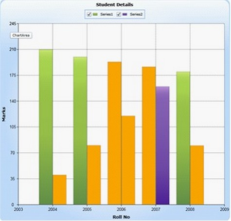

::: {style="DISPLAY: none"}
{#d2h_url_template}{#d2h_package_url style="WIDTH: 0px; DISPLAY: none; HEIGHT: 0px"}
:::

::::: {#nsbanner .d2h_main_nsbanner style="BORDER-BOTTOM: #999999 1px solid; POSITION: relative; PADDING-BOTTOM: 0px; BACKGROUND-COLOR: transparent; PADDING-LEFT: 0px; PADDING-RIGHT: 0px; DISPLAY: none; BORDER-TOP: #999999 1px solid; PADDING-TOP: 0px; LEFT: 0px"}
:::: {#TitleRow .d2h_main_titlerow style="PADDING-BOTTOM: 4px; BACKGROUND-COLOR: transparent; PADDING-LEFT: 22px; WIDTH: 100%; PADDING-RIGHT: 10px; DISPLAY: none; PADDING-TOP: 4px"}
::: {#ienav .d2h_main_ienav style="DISPLAY: none"}
{#D2HPrevious .D2HPreviousEnabled}  {#D2HNext .D2HNextEnabled}
:::
::::
:::::

::::: {#nstext .d2h_main_nstext style="PADDING-BOTTOM: 10px; BACKGROUND-COLOR: transparent; PADDING-LEFT: 22px; PADDING-RIGHT: 10px; HEIGHT: 100%; OVERFLOW: auto; PADDING-TOP: 5px" hasuserbackground="true" valign="bottom"}
::: {#d2h_breadcrumbs .d2h_breadcrumbs}
[Essential Studio User Guide Documentation](ms-xhelp:///?Id=12457748-09e3-4d74-a240-8e049cedf030){.d2h_breadcrumbsNormal}[ \> ]{.d2h_breadcrumbsLinkSeparator}[User Interface Edition](ms-xhelp:///?Id=c29296b7-531c-413b-a0ec-488ca1f7f669){.d2h_breadcrumbsNormal}[ \> ]{.d2h_breadcrumbsLinkSeparator}[Essential Silverlight](ms-xhelp:///?Id=66221bd1-ba2e-43c2-94a7-618f50e01d24){.d2h_breadcrumbsNormal}[ \> ]{.d2h_breadcrumbsLinkSeparator}[Essential Chart]{.d2h_breadcrumbsContentsOnly}[ \> ]{.d2h_breadcrumbsLinkSeparator}[Concepts and Features](ms-xhelp:///?Id=0f820843-9cdd-4436-8cae-3dc5a65fd5cd){.d2h_breadcrumbsNormal}[ \> ]{.d2h_breadcrumbsLinkSeparator}[Chart Series](ms-xhelp:///?Id=89819a94-ebab-4148-9acc-042438f9054b){.d2h_breadcrumbsNormal}
:::

### Empty Point support for Basic Chart Types {#empty-point-support-for-basic-chart-types style="tab-stops: 0pt"}

[]{#p78} 

Essential chart Silverlight is now supports Empty point.

The data collection that is passed to the chart may have NaN values, this is an empty points.

You can also turn on or off empty point's visibility.

Basic chart types such as (Column Type, Bar Type, Line Type, Scatter Type, Bubble Type and Stacking Column Type) are now enhanced with this support.

[]{style="FONT-FAMILY: 'Times New Roman','serif'; COLOR: black"} 

If data points bounded with chart does not give any value then chart renders empty points in chart series.

[]{style="FONT-FAMILY: 'Times New Roman','serif'; COLOR: black"} 

This feature is useful when you are not able to get exact value for a particular data.

e.g.  In population analysis if you do not get the result for previous years then we can use Empty data value.

**[]{style="COLOR: #15428b"}** 

List of Property

The Following table consists of the Property details.

[]{style="COLOR: #15428b"} 

::: {align="center"}
+----------------------+---------------------------------------------------------+-----------------------------+------------------+
| Name of the Property | Description                                             | Type Of Property            | Value It Accepts |
+----------------------+---------------------------------------------------------+-----------------------------+------------------+
| ShowEmptyPoints      | Enable/Disable Empty points feature.                    |                             | Bool             |
+----------------------+---------------------------------------------------------+-----------------------------+------------------+
| EmptyPointInterior   | Specifies the color for empty points.                   |                             | Brushes          |
+----------------------+---------------------------------------------------------+-----------------------------+------------------+
| EmptyPointStyle      |  Specify the style for Empty point.                     | []{style="COLOR: #15428b"}  | EmptyPointStyle  |
|                      |                                                         |                             |                  |
|                      | There are options:                                      |                             |                  |
|                      |                                                         |                             |                  |
|                      | [·      ]{style="FONT-FAMILY: Symbol"}Symbol            |                             |                  |
|                      |                                                         |                             |                  |
|                      | [·      ]{style="FONT-FAMILY: Symbol"}Interior          |                             |                  |
|                      |                                                         |                             |                  |
|                      | [·      ]{style="FONT-FAMILY: Symbol"}SymbolandInterior |                             |                  |
+----------------------+---------------------------------------------------------+-----------------------------+------------------+
:::

[]{style="COLOR: #15428b"} 

**[]{style="FONT-FAMILY: 'Times New Roman','serif'; COLOR: black"}** 

Customizing EmptyPointStyle

EmptyPointStyle has the following three options during the initialization.

1.   Symbol - The color of empty points is considered as a series color and draws a symbol shape.

2.   Interior - The segment rendering color is initialized in the EmptyPointInterior property.

3.   Symbol and Interior - Draw a symbol shape with color as initialized in EmptyPointInterior property.

[]{style="FONT-FAMILY: 'Times New Roman','serif'"} 

The following code illustrates how to add Empty Point to basic chart.

+---------------------------------------------------------------------------------------------------------------------------------------------------------------------------------------------------------------------------------------------------------------------------------------------------------------------------------------------------------------------------------------------------------------------------------------------------------------------------------------------------------------------------------------------------------------------------------------------------------------------------------------------------------------------------------------------------------------------------------------------------------------------------------------------------------------------------------------------------------------+
| [\[Xaml\]]{style="FONT-FAMILY: 'Courier New'"}                                                                                                                                                                                                                                                                                                                                                                                                                                                                                                                                                                                                                                                                                                                                                                                                                |
|                                                                                                                                                                                                                                                                                                                                                                                                                                                                                                                                                                                                                                                                                                                                                                                                                                                               |
| []{style="FONT-FAMILY: 'Courier New'; COLOR: black"}                                                                                                                                                                                                                                                                                                                                                                                                                                                                                                                                                                                                                                                                                                                                                                                                          |
|                                                                                                                                                                                                                                                                                                                                                                                                                                                                                                                                                                                                                                                                                                                                                                                                                                                               |
| [\<]{style="FONT-FAMILY: 'Courier New'; COLOR: blue"}[syncfusion]{style="FONT-FAMILY: 'Courier New'; COLOR: #a31515"}[:]{style="FONT-FAMILY: 'Courier New'; COLOR: blue"}[ChartSeries]{style="FONT-FAMILY: 'Courier New'; COLOR: #a31515"}[ x]{style="FONT-FAMILY: 'Courier New'; COLOR: red"}[:]{style="FONT-FAMILY: 'Courier New'; COLOR: blue"}[Name]{style="FONT-FAMILY: 'Courier New'; COLOR: red"}[=\"series\"]{style="FONT-FAMILY: 'Courier New'; COLOR: blue"}[ Label]{style="FONT-FAMILY: 'Courier New'; COLOR: red"}[=\"Series1\"]{style="FONT-FAMILY: 'Courier New'; COLOR: blue"}[ ShowEmptyPoints]{style="FONT-FAMILY: 'Courier New'; COLOR: red"}[=\"True\"]{style="FONT-FAMILY: 'Courier New'; COLOR: blue"}[ EmptyPointStyle]{style="FONT-FAMILY: 'Courier New'; COLOR: red"}[=\"Interior\"]{style="FONT-FAMILY: 'Courier New'; COLOR: blue"} |
|                                                                                                                                                                                                                                                                                                                                                                                                                                                                                                                                                                                                                                                                                                                                                                                                                                                               |
| [      EmptyPointInterior]{style="FONT-FAMILY: 'Courier New'; COLOR: red"}[=\"Orange\"]{style="FONT-FAMILY: 'Courier New'; COLOR: blue"}[ Type]{style="FONT-FAMILY: 'Courier New'; COLOR: red"}[=\"Line\"\>]{style="FONT-FAMILY: 'Courier New'; COLOR: blue"}                                                                                                                                                                                                                                                                                                                                                                                                                                                                                                                                                                                                 |
|                                                                                                                                                                                                                                                                                                                                                                                                                                                                                                                                                                                                                                                                                                                                                                                                                                                               |
| [ ]{style="FONT-FAMILY: 'Courier New'; COLOR: #a31515"}[\</]{style="FONT-FAMILY: 'Courier New'; COLOR: blue"}[syncfusion]{style="FONT-FAMILY: 'Courier New'; COLOR: #a31515"}[:]{style="FONT-FAMILY: 'Courier New'; COLOR: blue"}[ChartSeries]{style="FONT-FAMILY: 'Courier New'; COLOR: #a31515"}[\>]{style="FONT-FAMILY: 'Courier New'; COLOR: blue"}                                                                                                                                                                                                                                                                                                                                                                                                                                                                                                       |
+---------------------------------------------------------------------------------------------------------------------------------------------------------------------------------------------------------------------------------------------------------------------------------------------------------------------------------------------------------------------------------------------------------------------------------------------------------------------------------------------------------------------------------------------------------------------------------------------------------------------------------------------------------------------------------------------------------------------------------------------------------------------------------------------------------------------------------------------------------------+

[]{style="FONT-FAMILY: 'Times New Roman','serif'"} 

+----------------------------------------------------------------------------------------------------------------------------------------------------------------------------------------------------------------------------------------------------------------------------------------------+
| [\[C#\] ]{style="FONT-FAMILY: 'Courier New'"}                                                                                                                                                                                                                                                |
|                                                                                                                                                                                                                                                                                              |
| **[]{style="FONT-FAMILY: 'Courier New'"}**                                                                                                                                                                                                                                                   |
|                                                                                                                                                                                                                                                                                              |
| [chart.Areas\[0\].Series\[0\].ShowEmptyPoints = ]{style="FONT-FAMILY: 'Courier New'; COLOR: black"}[true]{style="FONT-FAMILY: 'Courier New'; COLOR: blue"}[;]{style="FONT-FAMILY: 'Courier New'"}                                                                                            |
|                                                                                                                                                                                                                                                                                              |
| [      ]{style="FONT-FAMILY: 'Courier New'; COLOR: black"}[chart.Areas\[0\].Series\[0\].EmptyPointStyle = [EmptyPointStyle]{style="COLOR: #2b91af"}.Interior;]{style="FONT-FAMILY: 'Courier New'"}                                                                                           |
|                                                                                                                                                                                                                                                                                              |
| [      chart.Areas\[0\].Series\[0\].EmptyPointInterior = ]{style="FONT-FAMILY: 'Courier New'; COLOR: black"}[new]{style="FONT-FAMILY: 'Courier New'; COLOR: blue"}[ [SolidColorBrush]{style="COLOR: #2b91af"}([Colors]{style="COLOR: #2b91af"}.Orange);]{style="FONT-FAMILY: 'Courier New'"} |
+----------------------------------------------------------------------------------------------------------------------------------------------------------------------------------------------------------------------------------------------------------------------------------------------+

[]{style="FONT-FAMILY: 'Times New Roman','serif'; COLOR: blue"} 

[]{style="FONT-FAMILY: 'Times New Roman','serif'; FONT-SIZE: 12pt"} 

[]{style="FONT-FAMILY: 'Times New Roman','serif'"} 

{border="0"}

Figure 73: EmptyPointStyle As Interior

[]{#related-topics}
:::::
