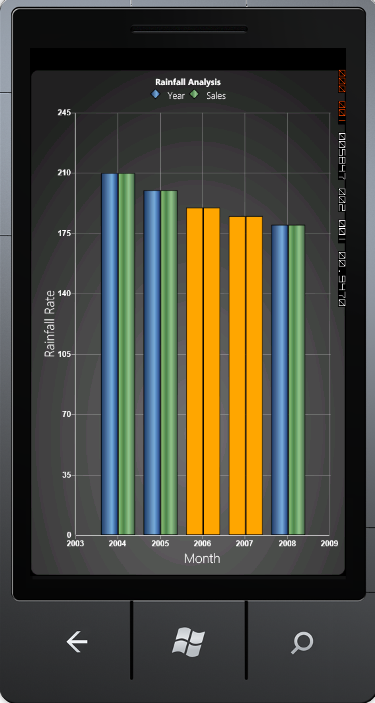

::: {style="DISPLAY: none"}
{#d2h_url_template}{#d2h_package_url style="WIDTH: 0px; DISPLAY: none; HEIGHT: 0px"}
:::

::::: {#nsbanner .d2h_main_nsbanner style="BORDER-BOTTOM: #999999 1px solid; POSITION: relative; PADDING-BOTTOM: 0px; BACKGROUND-COLOR: transparent; PADDING-LEFT: 0px; PADDING-RIGHT: 0px; DISPLAY: none; BORDER-TOP: #999999 1px solid; PADDING-TOP: 0px; LEFT: 0px"}
:::: {#TitleRow .d2h_main_titlerow style="PADDING-BOTTOM: 4px; BACKGROUND-COLOR: transparent; PADDING-LEFT: 22px; WIDTH: 100%; PADDING-RIGHT: 10px; DISPLAY: none; PADDING-TOP: 4px"}
::: {#ienav .d2h_main_ienav style="DISPLAY: none"}
{#D2HPrevious .D2HPreviousEnabled}  {#D2HNext .D2HNextEnabled}
:::
::::
:::::

::::: {#nstext .d2h_main_nstext style="PADDING-BOTTOM: 10px; BACKGROUND-COLOR: transparent; PADDING-LEFT: 22px; PADDING-RIGHT: 10px; HEIGHT: 100%; OVERFLOW: auto; PADDING-TOP: 5px" hasuserbackground="true" valign="bottom"}
::: {#d2h_breadcrumbs .d2h_breadcrumbs}
[Essential Studio User Guide Documentation](ms-xhelp:///?Id=12457748-09e3-4d74-a240-8e049cedf030){.d2h_breadcrumbsNormal}[ \> ]{.d2h_breadcrumbsLinkSeparator}[User Interface Edition](ms-xhelp:///?Id=c29296b7-531c-413b-a0ec-488ca1f7f669){.d2h_breadcrumbsNormal}[ \> ]{.d2h_breadcrumbsLinkSeparator}[Essential Windows Phone](ms-xhelp:///?Id=5ea1999c-4eff-4775-b84e-407dc825f555){.d2h_breadcrumbsNormal}[ \> ]{.d2h_breadcrumbsLinkSeparator}[Essential Chart]{.d2h_breadcrumbsContentsOnly}[ \> ]{.d2h_breadcrumbsLinkSeparator}[Concepts and Features](ms-xhelp:///?Id=080edead-2400-410b-a7ad-9155e5f1ae92){.d2h_breadcrumbsNormal}[ \> ]{.d2h_breadcrumbsLinkSeparator}[Chart Series](ms-xhelp:///?Id=479bb507-816a-459e-9a2e-ebd945c8ffe1){.d2h_breadcrumbsNormal}
:::

### Empty Point Support for Basic Chart Types {#empty-point-support-for-basic-chart-types style="tab-stops: 0pt"}

[]{#p78} 

Essential chart Windows Phone supports Empty point.

The data collection that is passed to the chart may have Not-A-Number (NaN) values, this is empty points.

You can also turn on or off empty point's visibility.

Basic chart types such as Column Type, Bar Type, Line Type, Scatter Type and Stacking Column Type are now enhanced with this support.

[]{style="FONT-FAMILY: 'Times New Roman','serif'; COLOR: black"} 

If data points bounded with chart does not give any value, then chart renders empty points in chart series.

This feature is useful when you are not able to get the exact value for a particular data.

e.g.  In population analysis, if you do not get the result for the previous years, then we can use Empty data value.

**[]{style="COLOR: #15428b"}** 

List of Property

The following table consists of the Property details.

[]{style="COLOR: #15428b"} 

::: {align="center"}
+----------------------+---------------------------------------+------------------+------------------+
| Name of the Property | Description                           | Type Of Property | Value It Accepts |
+----------------------+---------------------------------------+------------------+------------------+
| ShowEmptyPoints      | Enable/Disable Empty points feature.  |                  | Bool             |
+----------------------+---------------------------------------+------------------+------------------+
| EmptyPointInterior   | Specifies the color for empty points. |                  | Brushes          |
+----------------------+---------------------------------------+------------------+------------------+
| EmptyPointStyle      | Specify the style for Empty point.    |                  | EmptyPointStyle  |
|                      |                                       |                  |                  |
|                      | There are options:                    |                  |                  |
|                      |                                       |                  |                  |
|                      |  Symbol                               |                  |                  |
|                      |                                       |                  |                  |
|                      |  Interior                             |                  |                  |
|                      |                                       |                  |                  |
|                      |  SymbolandInterior                    |                  |                  |
+----------------------+---------------------------------------+------------------+------------------+
:::

[]{style="COLOR: #15428b"} 

**[]{style="FONT-FAMILY: 'Times New Roman','serif'; COLOR: black"}** 

Customizing EmptyPointStyle

EmptyPointStyle has the following three options during initialization:

[·      ]{style="FONT-FAMILY: Symbol"}Symbol - The color of empty points is considered as a series color and draws a symbol shape.

[·      ]{style="FONT-FAMILY: Symbol"}Interior - The segment rendering color is initialized in the EmptyPointInterior property.

[·      ]{style="FONT-FAMILY: Symbol"}Symbol and Interior - Draw a symbol shape with color, as initialized in EmptyPointInterior property.

[]{style="FONT-FAMILY: 'Times New Roman','serif'"} 

The following code illustrates how to add Empty Point to basic chart.

+---------------------------------------------------------------------------------------------------------------------------------------------------------------------------------------------------------------------------------------------------------------------------------------------------------------------------------------------------------------------------------------------------------------------------------------------------------------------------------------------------------------------------------------------------------------------------------------------------------------------------------------------------------------------------------------------------------------------------------------------------------------------------------------------------------------------------------------------------------------------------------------------------------------------------------------------------------------------------------------------+
| [\[Xaml\]]{style="FONT-FAMILY: 'Times New Roman','serif'; FONT-SIZE: 12pt"}                                                                                                                                                                                                                                                                                                                                                                                                                                                                                                                                                                                                                                                                                                                                                                                                                                                                                                                 |
|                                                                                                                                                                                                                                                                                                                                                                                                                                                                                                                                                                                                                                                                                                                                                                                                                                                                                                                                                                                             |
| []{style="FONT-FAMILY: 'Calibri','sans-serif'; COLOR: black; FONT-SIZE: 12pt"}                                                                                                                                                                                                                                                                                                                                                                                                                                                                                                                                                                                                                                                                                                                                                                                                                                                                                                              |
|                                                                                                                                                                                                                                                                                                                                                                                                                                                                                                                                                                                                                                                                                                                                                                                                                                                                                                                                                                                             |
| [\<]{style="FONT-FAMILY: 'Calibri','sans-serif'; COLOR: blue"}[syncfusion]{style="FONT-FAMILY: 'Calibri','sans-serif'; COLOR: #a31515"}[:]{style="FONT-FAMILY: 'Calibri','sans-serif'; COLOR: blue"}[ChartSeries]{style="FONT-FAMILY: 'Calibri','sans-serif'; COLOR: #a31515"}[ x]{style="FONT-FAMILY: 'Calibri','sans-serif'; COLOR: red"}[:]{style="FONT-FAMILY: 'Calibri','sans-serif'; COLOR: blue"}[Name]{style="FONT-FAMILY: 'Calibri','sans-serif'; COLOR: red"}[=\"series\"]{style="FONT-FAMILY: 'Calibri','sans-serif'; COLOR: blue"}[ Label]{style="FONT-FAMILY: 'Calibri','sans-serif'; COLOR: red"}[=\"Series1\"]{style="FONT-FAMILY: 'Calibri','sans-serif'; COLOR: blue"}[ ShowEmptyPoints]{style="FONT-FAMILY: 'Calibri','sans-serif'; COLOR: red"}[=\"True\"]{style="FONT-FAMILY: 'Calibri','sans-serif'; COLOR: blue"}[ EmptyPointStyle]{style="FONT-FAMILY: 'Calibri','sans-serif'; COLOR: red"}[=\"Interior\"]{style="FONT-FAMILY: 'Calibri','sans-serif'; COLOR: blue"} |
|                                                                                                                                                                                                                                                                                                                                                                                                                                                                                                                                                                                                                                                                                                                                                                                                                                                                                                                                                                                             |
| [                EmptyPointInterior]{style="FONT-FAMILY: 'Calibri','sans-serif'; COLOR: red"}[=\"Orange\"]{style="FONT-FAMILY: 'Calibri','sans-serif'; COLOR: blue"}[ Type]{style="FONT-FAMILY: 'Calibri','sans-serif'; COLOR: red"}[=\"Line\"\>]{style="FONT-FAMILY: 'Calibri','sans-serif'; COLOR: blue"}                                                                                                                                                                                                                                                                                                                                                                                                                                                                                                                                                                                                                                                                                 |
|                                                                                                                                                                                                                                                                                                                                                                                                                                                                                                                                                                                                                                                                                                                                                                                                                                                                                                                                                                                             |
| [ ]{style="FONT-FAMILY: 'Calibri','sans-serif'; COLOR: #a31515"}[\</]{style="FONT-FAMILY: 'Calibri','sans-serif'; COLOR: blue"}[syncfusion]{style="FONT-FAMILY: 'Calibri','sans-serif'; COLOR: #a31515"}[:]{style="FONT-FAMILY: 'Calibri','sans-serif'; COLOR: blue"}[ChartSeries]{style="FONT-FAMILY: 'Calibri','sans-serif'; COLOR: #a31515"}[\>]{style="FONT-FAMILY: 'Calibri','sans-serif'; COLOR: blue"}                                                                                                                                                                                                                                                                                                                                                                                                                                                                                                                                                                               |
+---------------------------------------------------------------------------------------------------------------------------------------------------------------------------------------------------------------------------------------------------------------------------------------------------------------------------------------------------------------------------------------------------------------------------------------------------------------------------------------------------------------------------------------------------------------------------------------------------------------------------------------------------------------------------------------------------------------------------------------------------------------------------------------------------------------------------------------------------------------------------------------------------------------------------------------------------------------------------------------------+

[]{style="FONT-FAMILY: 'Times New Roman','serif'"} 

+---------------------------------------------------------------------------------------------------------------------------------------------------------------------------------------------------------------------------------------------------------------------------------------------------------------------------------------------------------------------------------------------------+
| [\[C#\] ]{style="FONT-FAMILY: 'Times New Roman','serif'; FONT-SIZE: 12pt"}                                                                                                                                                                                                                                                                                                                        |
|                                                                                                                                                                                                                                                                                                                                                                                                   |
| **[]{style="FONT-FAMILY: 'Times New Roman','serif'"}**                                                                                                                                                                                                                                                                                                                                            |
|                                                                                                                                                                                                                                                                                                                                                                                                   |
| [chart.Areas\[0\].Series\[0\].ShowEmptyPoints = ]{style="FONT-FAMILY: 'Calibri','sans-serif'; COLOR: black"}[true]{style="FONT-FAMILY: 'Calibri','sans-serif'; COLOR: blue"}[;]{style="FONT-FAMILY: 'Calibri','sans-serif'"}                                                                                                                                                                      |
|                                                                                                                                                                                                                                                                                                                                                                                                   |
| [                ]{style="FONT-FAMILY: 'Times New Roman','serif'; COLOR: black"}[chart.Areas\[0\].Series\[0\].EmptyPointStyle = [EmptyPointStyle]{style="COLOR: #2b91af"}.Interior;]{style="FONT-FAMILY: 'Calibri','sans-serif'"}                                                                                                                                                                 |
|                                                                                                                                                                                                                                                                                                                                                                                                   |
| [                ]{style="FONT-FAMILY: 'Times New Roman','serif'; COLOR: black"}[chart.Areas\[0\].Series\[0\].EmptyPointInterior = ]{style="FONT-FAMILY: 'Calibri','sans-serif'; COLOR: black"}[new]{style="FONT-FAMILY: 'Calibri','sans-serif'; COLOR: blue"}[ [SolidColorBrush]{style="COLOR: #2b91af"}([Colors]{style="COLOR: #2b91af"}.Orange);]{style="FONT-FAMILY: 'Calibri','sans-serif'"} |
+---------------------------------------------------------------------------------------------------------------------------------------------------------------------------------------------------------------------------------------------------------------------------------------------------------------------------------------------------------------------------------------------------+

[]{style="FONT-FAMILY: 'Times New Roman','serif'"} 

{border="0"}

 

Figure 72 : EmptyPointStyle As Interior[]{style="FONT-FAMILY: 'Times New Roman','serif'"}

 

[                                            ]{style="FONT-FAMILY: 'Times New Roman','serif'; COLOR: #a31515"}

The code illustrates how to add customizable Tooltip for chart in C#.

[]{style="COLOR: #15428b"} 

[]{style="COLOR: #15428b"} 

[]{#related-topics}
:::::
