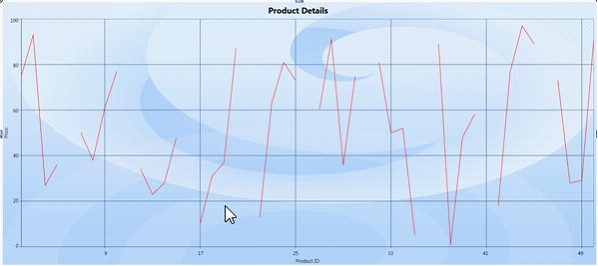

::: {style="DISPLAY: none"}
{#d2h_url_template}{#d2h_package_url style="WIDTH: 0px; DISPLAY: none; HEIGHT: 0px"}
:::

::: {.d2h_secondary_topic style="PADDING-BOTTOM: 10pt; MARGIN: 0pt; PADDING-LEFT: 0pt; PADDING-RIGHT: 0pt; PADDING-TOP: 0pt"}
##### Empty point support for FastLine Chart type {#empty-point-support-for-fastline-chart-type style="tab-stops: 0pt"}

Essential chart WPF is now supports Empty point for  Fast Line Chart type.

The data collection that is passed to the chart may have **NaN** values, this is an empty points.

If data points bounded with chart does not give any value then chart renders empty points in chart series.

[]{style="FONT-FAMILY: 'Calibri','sans-serif'; COLOR: black"} 

This feature is useful when you are not able to get exact value for a particular data.

e.g.  In population analysis if you do not get the result for previous years then we can use Empty data value.

**[]{style="FONT-FAMILY: 'Calibri','sans-serif'; COLOR: red"}** 

Adding Empty Point

Add Empty Point to the Chart, by using the following code.

Set **ShowEmptyPoints** to **True** to enable Empty Point.

[]{style="FONT-FAMILY: 'Courier New'; COLOR: #15428b"} 

+--------------------------------------------------------------------------------------------------------------------------------------------------------------------------------------------------------------------------------------------------------------------------------------------------------------------------------------------------------------------------------------------------------------------------------------------------------------------------------------------------------------------------------------------------------------------------------------------------------------+
| **[\[Xaml\]]{style="FONT-FAMILY: 'Courier New'"}**                                                                                                                                                                                                                                                                                                                                                                                                                                                                                                                                                           |
|                                                                                                                                                                                                                                                                                                                                                                                                                                                                                                                                                                                                              |
| []{style="FONT-FAMILY: 'Courier New'"}                                                                                                                                                                                                                                                                                                                                                                                                                                                                                                                                                                       |
|                                                                                                                                                                                                                                                                                                                                                                                                                                                                                                                                                                                                              |
| [  ]{style="FONT-FAMILY: 'Courier New'; COLOR: #a31515"}[\<]{style="FONT-FAMILY: 'Courier New'; COLOR: blue"}[syncfusion]{style="FONT-FAMILY: 'Courier New'; COLOR: #a31515"}[:]{style="FONT-FAMILY: 'Courier New'; COLOR: blue"}[ChartSeries]{style="FONT-FAMILY: 'Courier New'; COLOR: #a31515"}[ Name]{style="FONT-FAMILY: 'Courier New'; COLOR: red"}[=\"series1\"]{style="FONT-FAMILY: 'Courier New'; COLOR: blue"}[ ShowEmptyPoints]{style="FONT-FAMILY: 'Courier New'; COLOR: red"}[=\"True\"]{style="FONT-FAMILY: 'Courier New'; COLOR: blue"}[ ]{style="FONT-FAMILY: 'Courier New'; COLOR: red"}    |
|                                                                                                                                                                                                                                                                                                                                                                                                                                                                                                                                                                                                              |
| [Type]{style="FONT-FAMILY: 'Courier New'; COLOR: red"}[=\"FastLine\"]{style="FONT-FAMILY: 'Courier New'; COLOR: blue"}[ Interior]{style="FONT-FAMILY: 'Courier New'; COLOR: red"}[=\"Red\"]{style="FONT-FAMILY: 'Courier New'; COLOR: blue"}[ Stroke]{style="FONT-FAMILY: 'Courier New'; COLOR: red"}[=\"Black\"]{style="FONT-FAMILY: 'Courier New'; COLOR: blue"}[ DataSource]{style="FONT-FAMILY: 'Courier New'; COLOR: red"}[=\"{]{style="FONT-FAMILY: 'Courier New'; COLOR: blue"}[Binding]{style="FONT-FAMILY: 'Courier New'; COLOR: #a31515"}[}\"/\>]{style="FONT-FAMILY: 'Courier New'; COLOR: blue"} |
+--------------------------------------------------------------------------------------------------------------------------------------------------------------------------------------------------------------------------------------------------------------------------------------------------------------------------------------------------------------------------------------------------------------------------------------------------------------------------------------------------------------------------------------------------------------------------------------------------------------+

[]{style="FONT-FAMILY: 'Courier New'; COLOR: #15428b"} 

+----------------------------------------------------------------------------------------------+
| **[\[C#\] ]{style="FONT-FAMILY: 'Courier New'"}**                                            |
|                                                                                              |
| **[]{style="FONT-FAMILY: 'Courier New'"}**                                                   |
|                                                                                              |
| [Series1.ShowEmptyPoints = [true]{style="COLOR: blue"};]{style="FONT-FAMILY: 'Courier New'"} |
+----------------------------------------------------------------------------------------------+

[]{style="FONT-FAMILY: 'Courier New'"} 

[]{style="FONT-FAMILY: 'Calibri','sans-serif'"} 

{border="0"}

Figure 109: Empty Point[]{#p69}

[]{#related-topics}
:::
