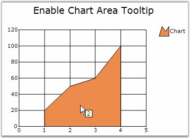

::: {style="DISPLAY: none"}
{#d2h_url_template}{#d2h_package_url style="WIDTH: 0px; DISPLAY: none; HEIGHT: 0px"}
:::

::: {.d2h_secondary_topic style="PADDING-BOTTOM: 10pt; MARGIN: 0pt; PADDING-LEFT: 0pt; PADDING-RIGHT: 0pt; PADDING-TOP: 0pt"}
#### EnableAreaToolTip {#enableareatooltip style="tab-stops: 0pt"}

 

To display proper tooltip for the Area charts, use the **Series.EnableAreaToolTip** property. When this property is enabled, the series index and the point index will be returned, which will be suitable for the various [PointsToolTipFormats]{style="COLOR: black"} also.

 

This splits up the region between two points into two parts while hovering the mouse on the region and displays the tooltip with respect to the nearby chart point.

 

+--------------------------------------------------------------------------------------------------------------------------------------------------------------------------------------------------------------------------+
| **[\[C#\]]{style="FONT-FAMILY: 'Courier New'; COLOR: black"}**                                                                                                                                                           |
|                                                                                                                                                                                                                          |
| **[]{style="FONT-FAMILY: 'Courier New'; COLOR: black; FONT-SIZE: 8pt"}**                                                                                                                                                 |
|                                                                                                                                                                                                                          |
| [this]{style="FONT-FAMILY: 'Courier New'; COLOR: blue"}[.chartControl1[.Series\[0\].EnableAreaToolTip = ]{style="COLOR: black"}[true]{style="COLOR: blue"}[;]{style="COLOR: black"}]{style="FONT-FAMILY: 'Courier New'"} |
+--------------------------------------------------------------------------------------------------------------------------------------------------------------------------------------------------------------------------+

\`

+---------------------------------------------------------------------------------------------------------------------------------------------------------------------------------------------+
| **[\[VB.NET\]]{style="FONT-FAMILY: 'Courier New'; COLOR: black"}**                                                                                                                          |
|                                                                                                                                                                                             |
| **[]{style="FONT-FAMILY: 'Courier New'; COLOR: black"}**                                                                                                                                    |
|                                                                                                                                                                                             |
| [Me]{style="FONT-FAMILY: 'Courier New'; COLOR: blue"}[.chartControl1.Series(0).[EnableAreaToolTip]{style="COLOR: black"} = [True]{style="COLOR: blue"}]{style="FONT-FAMILY: 'Courier New'"} |
+---------------------------------------------------------------------------------------------------------------------------------------------------------------------------------------------+

 

{border="0"}

 

Figure 123: EnableAreaToolTip = \"True\"

[]{#p97} 

[]{#related-topics}
:::
