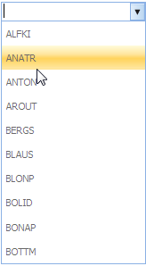

::: {style="DISPLAY: none"}
{#d2h_url_template}{#d2h_package_url style="WIDTH: 0px; DISPLAY: none; HEIGHT: 0px"}
:::

::: {.d2h_secondary_topic style="PADDING-BOTTOM: 10pt; MARGIN: 0pt; PADDING-LEFT: 0pt; PADDING-RIGHT: 0pt; PADDING-TOP: 0pt"}
#### Enabling Caching {#enabling-caching style="tab-stops: 0pt"}

Auto-complete textbox supports caching. Cache is a temporary storage area, which stores frequently accessed data. It provides rapid access to data by retrieving the cached copy rather than re-fetching it from the main data source every time, thereby reducing time and load. It can be used with Autocomplete TextBox in web browsers to access frequently used websites.

 

Properties

+-------------+-------------------------------------------------------------------------------------------------------------------------+----------------------+------------------+-------------------------------+
| Name        | Description                                                                                                             | Type of the property | Value it accepts | Dependecy                     |
+-------------+-------------------------------------------------------------------------------------------------------------------------+----------------------+------------------+-------------------------------+
| DropDown    | When set, renders a drop-down button, which when clicked, renders the un-filtered list.                                 | bool                 | true/false       | NA                            |
|             |                                                                                                                         |                      |                  |                               |
|             |                                                                                                                         |                      |                  |                               |
+-------------+-------------------------------------------------------------------------------------------------------------------------+----------------------+------------------+-------------------------------+
| AllowCache  | When set, allows cache therebypreventing further requests (after the first request) to the server on *drop-down* click. | bool                 | true/false       | Requires DropDown set to true |
|             |                                                                                                                         |                      |                  |                               |
|             |                                                                                                                         |                      |                  |                               |
+-------------+-------------------------------------------------------------------------------------------------------------------------+----------------------+------------------+-------------------------------+

*[[]{style="TEXT-DECORATION: none"}]{.underline}* 

Using Builder

The following steps explain enabling caching for an auto-complete textbox using builder.

1.   In **View**, invoke the auto-complete textbox helper with the control id as the first argument, followed by the **DropDown** and **AllowCache** methods with arguments set to 'true'.

 

[]{style="FONT-FAMILY: 'Calibri','sans-serif'"} 

+--------------------------------------------------------------------------------------------------------------------------------------------------------------------------------------------------------------------------------------------+
| **[View\[aspx\]]{style="FONT-FAMILY: 'Courier New'"}**                                                                                                                                                                                     |
|                                                                                                                                                                                                                                            |
| **[]{style="FONT-FAMILY: 'Courier New'"}**                                                                                                                                                                                                 |
|                                                                                                                                                                                                                                            |
| [\<%]{style="FONT-FAMILY: 'Courier New'; BACKGROUND: yellow"}[=]{style="FONT-FAMILY: 'Courier New'; COLOR: blue"}[Html.Syncfusion().AutocompleteTextBox([\"myAutocomplete\"]{style="COLOR: #a31515"})]{style="FONT-FAMILY: 'Courier New'"} |
|                                                                                                                                                                                                                                            |
| [.RequestMapper([\"Home/GetData\"]{style="COLOR: #a31515"})]{style="FONT-FAMILY: 'Courier New'"}                                                                                                                                           |
|                                                                                                                                                                                                                                            |
| **[.DropDown([true]{style="COLOR: blue"})]{style="FONT-FAMILY: 'Courier New'"}**                                                                                                                                                           |
|                                                                                                                                                                                                                                            |
| **[.AllowCache([true]{style="COLOR: blue"})]{style="FONT-FAMILY: 'Courier New'"}**                                                                                                                                                         |
|                                                                                                                                                                                                                                            |
| **[%\>]{style="FONT-FAMILY: 'Courier New'; BACKGROUND: yellow"}**[]{style="FONT-FAMILY: 'Courier New'; BACKGROUND: yellow"}                                                                                                                |
+--------------------------------------------------------------------------------------------------------------------------------------------------------------------------------------------------------------------------------------------+

**[]{style="FONT-FAMILY: Consolas; BACKGROUND: yellow; FONT-SIZE: 9.5pt"}** 

[]{style="FONT-FAMILY: 'Calibri','sans-serif'"} 

+--------------------------------------------------------------------------------------------------------------------------------------------------------------------------------------------------------------------------------------------+
| **[View\[cshtml\]]{style="FONT-FAMILY: 'Courier New'"}**                                                                                                                                                                                   |
|                                                                                                                                                                                                                                            |
| **[]{style="FONT-FAMILY: 'Courier New'"}**                                                                                                                                                                                                 |
|                                                                                                                                                                                                                                            |
| [\@{]{style="FONT-FAMILY: 'Courier New'; BACKGROUND: yellow"}[ ]{style="FONT-FAMILY: 'Courier New'; COLOR: blue"}[Html.Syncfusion().AutocompleteTextBox([\"myAutocomplete\"]{style="COLOR: #a31515"})]{style="FONT-FAMILY: 'Courier New'"} |
|                                                                                                                                                                                                                                            |
| [.RequestMapper([\"Home/GetData\"]{style="COLOR: #a31515"})]{style="FONT-FAMILY: 'Courier New'"}                                                                                                                                           |
|                                                                                                                                                                                                                                            |
| **[.DropDown([true]{style="COLOR: blue"})]{style="FONT-FAMILY: 'Courier New'"}**                                                                                                                                                           |
|                                                                                                                                                                                                                                            |
| **[.AllowCache([true]{style="COLOR: blue"}).Render();]{style="FONT-FAMILY: 'Courier New'"}**                                                                                                                                               |
|                                                                                                                                                                                                                                            |
| **[}]{style="FONT-FAMILY: 'Courier New'; BACKGROUND: yellow"}**[]{style="FONT-FAMILY: 'Courier New'; BACKGROUND: yellow"}                                                                                                                  |
+--------------------------------------------------------------------------------------------------------------------------------------------------------------------------------------------------------------------------------------------+

**[]{style="FONT-FAMILY: Consolas; BACKGROUND: yellow; FONT-SIZE: 9.5pt"}** 

[]{style="FONT-FAMILY: 'Calibri','sans-serif'"} 

**[]{style="FONT-FAMILY: Consolas; BACKGROUND: yellow; FONT-SIZE: 9.5pt"}** 

2.   In the Controller, define the post action from which the auto-complete textbox requests the data source.

 

+------------------------------------------------------------------------------------------------------------------------------------------------------------------------------+
| **[\[Controller\]]{style="FONT-FAMILY: 'Courier New'"}**                                                                                                                     |
|                                                                                                                                                                              |
| [\[[AcceptVerbs]{style="COLOR: #2b91af"}([HttpVerbs]{style="COLOR: #2b91af"}.Post)\]]{style="FONT-FAMILY: 'Courier New'"}                                                    |
|                                                                                                                                                                              |
| [        [public]{style="COLOR: blue"} [ActionResult]{style="COLOR: #2b91af"} GetData([string]{style="COLOR: blue"} QueryString)]{style="FONT-FAMILY: 'Courier New'"}        |
|                                                                                                                                                                              |
| [        {]{style="FONT-FAMILY: 'Courier New'"}                                                                                                                              |
|                                                                                                                                                                              |
| [            [Northwind]{style="COLOR: #2b91af"} context = SqlCE;]{style="FONT-FAMILY: 'Courier New'"}                                                                       |
|                                                                                                                                                                              |
| [            [//Get the data source]{style="COLOR: green"}]{style="FONT-FAMILY: 'Courier New'"}                                                                              |
|                                                                                                                                                                              |
| [            [var]{style="COLOR: blue"} dataSource = [from]{style="COLOR: blue"} suggestion [in]{style="COLOR: blue"} context.Customers]{style="FONT-FAMILY: 'Courier New'"} |
|                                                                                                                                                                              |
| [                             [select]{style="COLOR: blue"} suggestion.CustomerID;]{style="FONT-FAMILY: 'Courier New'"}                                                      |
|                                                                                                                                                                              |
| []{style="FONT-FAMILY: 'Courier New'"}                                                                                                                                       |
|                                                                                                                                                                              |
| [            [//invoke the AutoCompleteActionResut]{style="COLOR: green"}]{style="FONT-FAMILY: 'Courier New'"}                                                               |
|                                                                                                                                                                              |
| [            [return]{style="COLOR: blue"} dataSource.AutocompleteActionResult();]{style="FONT-FAMILY: 'Courier New'"}                                                       |
|                                                                                                                                                                              |
| [        }\                                                                                                                                                                  |
| \                                                                                                                                                                            |
| []{style="BACKGROUND: yellow"}]{style="FONT-FAMILY: 'Courier New'"}                                                                                                          |
+------------------------------------------------------------------------------------------------------------------------------------------------------------------------------+

\
\

[]{style="FONT-FAMILY: Consolas; FONT-SIZE: 9.5pt"} 

3.   Build and run the application

**[]{style="FONT-FAMILY: 'Calibri','sans-serif'"}** 

[]{style="FONT-FAMILY: Consolas; FONT-SIZE: 9.5pt"} 

Using Properties Model

The following steps explain you how to configure the filtering conditions for an auto-complete textbox through properties model.

*[[[]{style="TEXT-DECORATION: none"}]{style="FONT-FAMILY: 'Calibri','sans-serif'"}]{.underline}* 

1.   In the Controller, create an instance of **AutoCompleteTextBoxModel**, set the **DropDown** and **AllowCache** properties and pass the instance through view specific data to the view as below.

 

+-------------------------------------------------------------------------------------------------------------------------------------------------------------------------------------------------+
| **[\[Controller\]]{style="FONT-FAMILY: 'Courier New'"}**                                                                                                                                        |
|                                                                                                                                                                                                 |
| [public]{style="FONT-FAMILY: 'Courier New'; COLOR: blue"}[ [ActionResult]{style="COLOR: #2b91af"} Index()]{style="FONT-FAMILY: 'Courier New'"}                                                  |
|                                                                                                                                                                                                 |
| [        {]{style="FONT-FAMILY: 'Courier New'"}                                                                                                                                                 |
|                                                                                                                                                                                                 |
| [            [//create and instance of AutocompleteTextBoxModel]{style="COLOR: green"}]{style="FONT-FAMILY: 'Courier New'"}                                                                     |
|                                                                                                                                                                                                 |
| [            [AutocompleteTextBoxModel]{style="COLOR: #2b91af"} myModel = [new]{style="COLOR: blue"} [AutocompleteTextBoxModel]{style="COLOR: #2b91af"}();]{style="FONT-FAMILY: 'Courier New'"} |
|                                                                                                                                                                                                 |
| [            myModel.RequestMapper = [\"Home/GetData\"]{style="COLOR: #a31515"};]{style="FONT-FAMILY: 'Courier New'"}                                                                           |
|                                                                                                                                                                                                 |
| [            **myModel.DropDown = [true]{style="COLOR: blue"};**]{style="FONT-FAMILY: 'Courier New'"}                                                                                           |
|                                                                                                                                                                                                 |
| **[            myModel.AllowCache = [true]{style="COLOR: blue"};]{style="FONT-FAMILY: 'Courier New'"}**                                                                                         |
|                                                                                                                                                                                                 |
| []{style="FONT-FAMILY: 'Courier New'"}                                                                                                                                                          |
|                                                                                                                                                                                                 |
| [            [//pass the instance through view data to the view]{style="COLOR: green"}]{style="FONT-FAMILY: 'Courier New'"}                                                                     |
|                                                                                                                                                                                                 |
| [            ViewData\[[\"myAutocomplete\"]{style="COLOR: #a31515"}\] = myModel;]{style="FONT-FAMILY: 'Courier New'"}                                                                           |
|                                                                                                                                                                                                 |
| [            [return]{style="COLOR: blue"} View();]{style="FONT-FAMILY: 'Courier New'"}                                                                                                         |
|                                                                                                                                                                                                 |
| [        }]{style="FONT-FAMILY: 'Courier New'"}                                                                                                                                                 |
|                                                                                                                                                                                                 |
| []{style="FONT-FAMILY: 'Courier New'; BACKGROUND: yellow"}                                                                                                                                      |
+-------------------------------------------------------------------------------------------------------------------------------------------------------------------------------------------------+

 

**[]{style="FONT-FAMILY: 'Calibri','sans-serif'"}** 

[]{style="FONT-FAMILY: Consolas; FONT-SIZE: 9.5pt"} 

2.   In the **View**, invoke the auto-complete textbox helper with the view data key as the control id.

 

**[]{style="FONT-FAMILY: 'Calibri','sans-serif'"}** 

**[]{style="FONT-FAMILY: 'Courier New'"}** 

+-----------------------------------------------------------------------------------------------------------------------------------------------------------------------------------------------------------------------------------------------------------------------------+
| **[View\[aspx\]]{style="FONT-FAMILY: 'Courier New'"}**                                                                                                                                                                                                                      |
|                                                                                                                                                                                                                                                                             |
| **[]{style="FONT-FAMILY: 'Courier New'"}**                                                                                                                                                                                                                                  |
|                                                                                                                                                                                                                                                                             |
| [\<%]{style="FONT-FAMILY: 'Courier New'; BACKGROUND: yellow"}[=]{style="FONT-FAMILY: 'Courier New'; COLOR: blue"}[Html.Syncfusion().AutocompleteTextBox([\"myAutocomplete\"]{style="COLOR: #a31515"})[%\>]{style="BACKGROUND: yellow"}]{style="FONT-FAMILY: 'Courier New'"} |
|                                                                                                                                                                                                                                                                             |
| []{style="FONT-FAMILY: 'Courier New'; BACKGROUND: yellow"}                                                                                                                                                                                                                  |
+-----------------------------------------------------------------------------------------------------------------------------------------------------------------------------------------------------------------------------------------------------------------------------+

 

**[]{style="FONT-FAMILY: 'Calibri','sans-serif'"}** 

+-------------------------------------------------------------------------------------------------------------------------------------------------------------------------------------------------------------------------------------------------------------------------------------+
| **[View\[cshtml\]]{style="FONT-FAMILY: 'Courier New'"}**                                                                                                                                                                                                                            |
|                                                                                                                                                                                                                                                                                     |
| **[]{style="FONT-FAMILY: 'Courier New'"}**                                                                                                                                                                                                                                          |
|                                                                                                                                                                                                                                                                                     |
| [\@{]{style="FONT-FAMILY: 'Courier New'; BACKGROUND: yellow"}[ ]{style="FONT-FAMILY: 'Courier New'; COLOR: blue"}[Html.Syncfusion().AutocompleteTextBox([\"myAutocomplete\"]{style="COLOR: #a31515"}).Render();[}]{style="BACKGROUND: yellow"}]{style="FONT-FAMILY: 'Courier New'"} |
|                                                                                                                                                                                                                                                                                     |
| []{style="FONT-FAMILY: 'Courier New'; BACKGROUND: yellow"}                                                                                                                                                                                                                          |
+-------------------------------------------------------------------------------------------------------------------------------------------------------------------------------------------------------------------------------------------------------------------------------------+

 

3.   In the Controller, define the post action to which the auto-complete textbox requests the data source.

 

 

+------------------------------------------------------------------------------------------------------------------------------------------------------------------------------+
| **[\[Controller\]]{style="FONT-FAMILY: 'Courier New'"}**                                                                                                                     |
|                                                                                                                                                                              |
| **[]{style="FONT-FAMILY: 'Courier New'"}**                                                                                                                                   |
|                                                                                                                                                                              |
| [\[[AcceptVerbs]{style="COLOR: #2b91af"}([HttpVerbs]{style="COLOR: #2b91af"}.Post)\]]{style="FONT-FAMILY: 'Courier New'"}                                                    |
|                                                                                                                                                                              |
| [        [public]{style="COLOR: blue"} [ActionResult]{style="COLOR: #2b91af"} GetData([string]{style="COLOR: blue"} QueryString)]{style="FONT-FAMILY: 'Courier New'"}        |
|                                                                                                                                                                              |
| [        {]{style="FONT-FAMILY: 'Courier New'"}                                                                                                                              |
|                                                                                                                                                                              |
| [            [Northwind]{style="COLOR: #2b91af"} context = SqlCE;]{style="FONT-FAMILY: 'Courier New'"}                                                                       |
|                                                                                                                                                                              |
| [            [//Get the data source]{style="COLOR: green"}]{style="FONT-FAMILY: 'Courier New'"}                                                                              |
|                                                                                                                                                                              |
| [            [var]{style="COLOR: blue"} dataSource = [from]{style="COLOR: blue"} suggestion [in]{style="COLOR: blue"} context.Customers]{style="FONT-FAMILY: 'Courier New'"} |
|                                                                                                                                                                              |
| [                             [select]{style="COLOR: blue"} suggestion.CustomerID;]{style="FONT-FAMILY: 'Courier New'"}                                                      |
|                                                                                                                                                                              |
| []{style="FONT-FAMILY: 'Courier New'"}                                                                                                                                       |
|                                                                                                                                                                              |
| [            [//invoke the AutoCompleteActionResut]{style="COLOR: green"}]{style="FONT-FAMILY: 'Courier New'"}                                                               |
|                                                                                                                                                                              |
| [            [return]{style="COLOR: blue"} dataSource.AutocompleteActionResult();]{style="FONT-FAMILY: 'Courier New'"}                                                       |
|                                                                                                                                                                              |
| [        }]{style="FONT-FAMILY: 'Courier New'"}                                                                                                                              |
|                                                                                                                                                                              |
| []{style="FONT-FAMILY: 'Courier New'; BACKGROUND: yellow"}                                                                                                                   |
+------------------------------------------------------------------------------------------------------------------------------------------------------------------------------+

 

**[]{style="FONT-FAMILY: 'Calibri','sans-serif'"}** 

[]{style="FONT-FAMILY: Consolas; FONT-SIZE: 9.5pt"} 

4.   Build and run the application.

The output is shown in the following screen shot.

{border="0"}

Figure 76: Auto-complete with drop-down

[]{style="FONT-FAMILY: 'Calibri','sans-serif'"} 

[]{#related-topics}
:::
