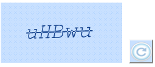

::: {style="DISPLAY: none"}
{#d2h_url_template}{#d2h_package_url style="WIDTH: 0px; DISPLAY: none; HEIGHT: 0px"}
:::

::: {.d2h_secondary_topic style="PADDING-BOTTOM: 10pt; MARGIN: 0pt; PADDING-LEFT: 0pt; PADDING-RIGHT: 0pt; PADDING-TOP: 0pt"}
##### Enabling Captcha Refresh {#enabling-captcha-refresh style="tab-stops: 0pt"}

[The Captcha refresh feature provides the ability to refresh the Captcha image. You can refresh the Captcha image by using the **EnableRefreshImage** property. It updates the Captcha with a new image on every post. ]{style="COLOR: black"}

 

5.4.3.6.1.1 Use Case Scenarios

[Captcha ]{style="BACKGROUND: white; COLOR: black"}[r]{style="BACKGROUND: white; COLOR: black"}[efresh is used to enable users to regenerate]{style="BACKGROUND: white; COLOR: black"}[ C]{style="BACKGROUND: white; COLOR: black"}[aptcha images in ]{style="BACKGROUND: white; COLOR: black"}[the ]{style="BACKGROUND: white; COLOR: black"}[case]{style="BACKGROUND: white; COLOR: black"}[ of]{style="BACKGROUND: white; COLOR: black"}[ ]{style="BACKGROUND: white; COLOR: black"}[a Captcha image]{style="BACKGROUND: white; COLOR: black"}[ being ]{style="BACKGROUND: white; COLOR: black"}[too difficult to read.]{style="BACKGROUND: white; COLOR: black"}

Properties

  ---------------------------------------------------------------------- -------------------------------------------------------------------------------- ------------------------------------- --------------------------------
  **Property**                                                           **Description**                                                                  **Type**                              **Data Type**
  [EnableRefreshImage]{style="COLOR: black"}[]{style="COLOR: #c00000"}   [Enables or disables EnableRefreshImage in the Captcha.]{style="COLOR: black"}   [Server side]{style="COLOR: black"}   [bool]{style="COLOR: black"}
  RequestMapper                                                          [Gets or sets the name for the post action function.]{style="COLOR: black"}      [Server side]{style="COLOR: black"}   [String]{style="COLOR: black"}
  ---------------------------------------------------------------------- -------------------------------------------------------------------------------- ------------------------------------- --------------------------------

[]{style="FONT-FAMILY: 'Calibri','sans-serif'; COLOR: black"} 

Methods

  **[Method ]{style="COLOR: black"}**[]{style="COLOR: black"}   **[Description ]{style="COLOR: black"}**[]{style="COLOR: black"}                           **[Parameters ]{style="COLOR: black"}**[]{style="COLOR: black"}   **[Type ]{style="COLOR: black"}**[]{style="COLOR: black"}   **[Return Type ]{style="COLOR: black"}**[]{style="COLOR: black"}
  ------------------------------------------------------------- ------------------------------------------------------------------------------------------ ----------------------------------------------------------------- ----------------------------------------------------------- ------------------------------------------------------------------
  [Refresh ]{style="COLOR: black"}                              [Call this method wherever you want to refresh the Captcha image.]{style="COLOR: black"}   [        -]{style="COLOR: black"}                                 [Client-side ]{style="COLOR: black"}                        [       - ]{style="COLOR: black"}

[]{style="FONT-FAMILY: 'Calibri','sans-serif'; COLOR: black"} 

[]{style="COLOR: #c00000"} 

Sample Link

[1.   Open the Essential Tools sample browser from the dashboard. Refer to the ]{style="COLOR: black"}[[Samples and Location]{style="COLOR: black"}](http://help.syncfusion.com/ug_94/User%20Interface/ASP.NET%20MVC/Tools/Documents/sampleandlocation.htm)[ chapter.]{style="COLOR: black"}

[2.   ]{style="COLOR: #c00000"}[Navigate to **Tools.MVC** \> **Captcha** \> **Captcha Refresh**]{style="COLOR: black"}[]{style="COLOR: #c00000"}

[]{style="COLOR: #c00000"} 

Adding Captcha Refresh to an Application

The Captcha refresh feature can be customized in two ways, namely:

[·      ]{style="FONT-FAMILY: Symbol"}CaptchaBuilder

[·      ]{style="FONT-FAMILY: Symbol"}CaptchaModel

 

Using Builder

The following steps explain enabling Captcha Image Refresh of Captcha using Builder.

1.  In the **view**, invoke the **Captcha** helper with the control ID as its argument followed by the **EnablerefreshImage** and **RequestMapper** methods as arguments.

[]{style="FONT-FAMILY: 'Times New Roman','serif'; FONT-SIZE: 12pt"} 

+------------------------------------------------------------------------------------------------------------------------------------------------------------------------------------------------------------------------------------------------------------------------------------+
| **[View \[ASPX\]]{style="FONT-FAMILY: 'Courier New'"}**[ ]{style="FONT-FAMILY: 'Times New Roman','serif'"}                                                                                                                                                                         |
|                                                                                                                                                                                                                                                                                    |
| [\<%]{style="FONT-FAMILY: 'Courier New'; BACKGROUND: yellow"}[=]{style="FONT-FAMILY: 'Courier New'; COLOR: blue"}[Html.Syncfusion().CaptchaControl([\"myCaptcha\"]{style="COLOR: #a31515"})]{style="FONT-FAMILY: 'Courier New'"}[]{style="FONT-FAMILY: 'Times New Roman','serif'"} |
|                                                                                                                                                                                                                                                                                    |
| **[.EnableRefreshImage(]{style="FONT-FAMILY: 'Courier New'"}**[true]{style="FONT-FAMILY: 'Courier New'; COLOR: blue; FONT-SIZE: 8pt"}**[)]{style="FONT-FAMILY: 'Courier New'"}**[]{style="FONT-FAMILY: 'Times New Roman','serif'"}                                                 |
|                                                                                                                                                                                                                                                                                    |
| **[.RequestMapper(]{style="FONT-FAMILY: 'Courier New'"}**[\"RefreshCaptcha\"]{style="FONT-FAMILY: 'Courier New'; COLOR: #a31515"}**[)[%\>]{style="BACKGROUND: yellow"}]{style="FONT-FAMILY: 'Courier New'"}**[]{style="FONT-FAMILY: 'Times New Roman','serif'"}                    |
|                                                                                                                                                                                                                                                                                    |
| []{style="FONT-FAMILY: 'Times New Roman','serif'; FONT-SIZE: 12pt"}                                                                                                                                                                                                                |
+------------------------------------------------------------------------------------------------------------------------------------------------------------------------------------------------------------------------------------------------------------------------------------+

[]{style="FONT-FAMILY: 'Times New Roman','serif'; FONT-SIZE: 12pt"} 

+------------------------------------------------------------------------------------------------------------------------------------------------------------------------------------------------------------------------------------------------------------------------------------+
| **[View \[cshtml\]]{style="FONT-FAMILY: 'Courier New'"}**[ ]{style="FONT-FAMILY: 'Times New Roman','serif'"}                                                                                                                                                                       |
|                                                                                                                                                                                                                                                                                    |
| [\@{]{style="FONT-FAMILY: 'Courier New'; BACKGROUND: yellow"}[ ]{style="FONT-FAMILY: 'Courier New'; COLOR: blue"}[Html.Syncfusion().CaptchaControl([\"myCaptcha\"]{style="COLOR: #a31515"})]{style="FONT-FAMILY: 'Courier New'"}[]{style="FONT-FAMILY: 'Times New Roman','serif'"} |
|                                                                                                                                                                                                                                                                                    |
| **[.EnableRefreshImage(]{style="FONT-FAMILY: 'Courier New'"}**[true]{style="FONT-FAMILY: 'Courier New'; COLOR: blue; FONT-SIZE: 8pt"}**[)]{style="FONT-FAMILY: 'Courier New'"}**[]{style="FONT-FAMILY: 'Times New Roman','serif'"}                                                 |
|                                                                                                                                                                                                                                                                                    |
| **[.RequestMapper(]{style="FONT-FAMILY: 'Courier New'"}**[\"RefreshCaptcha\"]{style="FONT-FAMILY: 'Courier New'; COLOR: #a31515"}**[)[%\>]{style="BACKGROUND: yellow"}]{style="FONT-FAMILY: 'Courier New'"}**[]{style="FONT-FAMILY: 'Times New Roman','serif'"}                    |
|                                                                                                                                                                                                                                                                                    |
| [.Render();]{style="FONT-FAMILY: 'Courier New'"}[]{style="FONT-FAMILY: 'Times New Roman','serif'"}                                                                                                                                                                                 |
|                                                                                                                                                                                                                                                                                    |
| **[}]{style="FONT-FAMILY: 'Courier New'; BACKGROUND: yellow"}**[]{style="FONT-FAMILY: 'Times New Roman','serif'; FONT-SIZE: 12pt"}                                                                                                                                                 |
+------------------------------------------------------------------------------------------------------------------------------------------------------------------------------------------------------------------------------------------------------------------------------------+

[]{style="FONT-FAMILY: 'Times New Roman','serif'; FONT-SIZE: 12pt"} 

2.  In the **controller**, define the post action to which the Captcha invokes the **CaptchaActionResult**.

+-------------------------------------------------------------------------------------------------------------------------------------------------------------------------------------------------------------------------------------------------------------------------------------------------------------------------------------------------------------------------------------------------+
| **[Controller]{style="FONT-FAMILY: 'Courier New'"}**[]{style="FONT-FAMILY: 'Times New Roman','serif'"}                                                                                                                                                                                                                                                                                          |
|                                                                                                                                                                                                                                                                                                                                                                                                 |
| [\[[AcceptVerbs]{style="COLOR: #2b91af"}([HttpVerbs]{style="COLOR: #2b91af"}.Post)\]]{style="FONT-FAMILY: 'Courier New'"}[]{style="FONT-FAMILY: 'Times New Roman','serif'"}                                                                                                                                                                                                                     |
|                                                                                                                                                                                                                                                                                                                                                                                                 |
| [        [public]{style="COLOR: blue"} [ActionResult]{style="COLOR: #2b91af"} RefreshCaptcha(]{style="FONT-FAMILY: 'Courier New'"}[CaptchaParams]{style="FONT-FAMILY: 'Courier New'; COLOR: #2b91af"}[ ]{style="FONT-FAMILY: Consolas; FONT-SIZE: 8pt"}[parameters]{style="FONT-FAMILY: 'Courier New'"}[)]{style="FONT-FAMILY: 'Courier New'"}[]{style="FONT-FAMILY: Consolas; FONT-SIZE: 8pt"} |
|                                                                                                                                                                                                                                                                                                                                                                                                 |
| [        {]{style="FONT-FAMILY: 'Courier New'"}                                                                                                                                                                                                                                                                                                                                                 |
|                                                                                                                                                                                                                                                                                                                                                                                                 |
| [               //]{style="FONT-FAMILY: 'Courier New'; COLOR: green; FONT-SIZE: 8pt"}[invoke the CaptchaActionResut]{style="FONT-FAMILY: 'Courier New'; COLOR: green"}[]{style="FONT-FAMILY: 'Times New Roman','serif'"}                                                                                                                                                                        |
|                                                                                                                                                                                                                                                                                                                                                                                                 |
| [            [return]{style="COLOR: blue"} parameters.CaptchaActions();]{style="FONT-FAMILY: 'Courier New'"}[]{style="FONT-FAMILY: 'Times New Roman','serif'"}                                                                                                                                                                                                                                  |
|                                                                                                                                                                                                                                                                                                                                                                                                 |
| [        }]{style="FONT-FAMILY: 'Courier New'"}[]{style="FONT-FAMILY: 'Times New Roman','serif'"}                                                                                                                                                                                                                                                                                               |
|                                                                                                                                                                                                                                                                                                                                                                                                 |
| []{style="FONT-FAMILY: 'Times New Roman','serif'"}[]{style="FONT-FAMILY: 'Times New Roman','serif'; FONT-SIZE: 9pt"}                                                                                                                                                                                                                                                                            |
|                                                                                                                                                                                                                                                                                                                                                                                                 |
| []{style="FONT-FAMILY: 'Times New Roman','serif'; FONT-SIZE: 12pt"}                                                                                                                                                                                                                                                                                                                             |
+-------------------------------------------------------------------------------------------------------------------------------------------------------------------------------------------------------------------------------------------------------------------------------------------------------------------------------------------------------------------------------------------------+

[]{style="FONT-FAMILY: 'Times New Roman','serif'; FONT-SIZE: 12pt"} 

3.  Build and run the application.

**Using Properties Model**

The following steps explain enabling the Captcha image refresh feature using the properties model.

1.   In the **controller**, create an instance of **CaptchaModel**, define the **EnableRefreshImage** and **RequestMapper** properties, and pass the instance through **view specific data** to the **view** as shown below.

+----------------------------------------------------------------------------------------------------------------------------------------------------------------------------------------------------------------------------------------------------------------------+
| **[Controller]{style="FONT-FAMILY: 'Courier New'"}**[]{style="FONT-FAMILY: 'Times New Roman','serif'"}                                                                                                                                                               |
|                                                                                                                                                                                                                                                                      |
| [ ]{style="FONT-FAMILY: 'Times New Roman','serif'; FONT-SIZE: 12pt"}[public]{style="FONT-FAMILY: 'Courier New'; COLOR: blue"}[ [ActionResult]{style="COLOR: #2b91af"} Index()]{style="FONT-FAMILY: 'Courier New'"}[]{style="FONT-FAMILY: 'Times New Roman','serif'"} |
|                                                                                                                                                                                                                                                                      |
| [        {]{style="FONT-FAMILY: 'Courier New'"}[]{style="FONT-FAMILY: 'Times New Roman','serif'"}                                                                                                                                                                    |
|                                                                                                                                                                                                                                                                      |
| [            [//create instance of CaptchaModel]{style="COLOR: green"}]{style="FONT-FAMILY: 'Courier New'"}[]{style="FONT-FAMILY: 'Times New Roman','serif'"}                                                                                                        |
|                                                                                                                                                                                                                                                                      |
| [            [CaptchaModel]{style="COLOR: #2b91af"} myModel = [new]{style="COLOR: blue"} [CaptchaModel]{style="COLOR: #2b91af"}();]{style="FONT-FAMILY: 'Courier New'"}[]{style="FONT-FAMILY: 'Times New Roman','serif'"}                                            |
|                                                                                                                                                                                                                                                                      |
| [            myModel.EnableRefreshImage = true;]{style="FONT-FAMILY: 'Courier New'"}[]{style="FONT-FAMILY: 'Times New Roman','serif'"}                                                                                                                               |
|                                                                                                                                                                                                                                                                      |
| [            myModel.RequestMapper = [\"RefreshCaptcha\";]{style="COLOR: #a31515"}]{style="FONT-FAMILY: 'Courier New'"}[ ]{style="FONT-FAMILY: 'Times New Roman','serif'"}                                                                                           |
|                                                                                                                                                                                                                                                                      |
| [           [//pass the instance through view data to view]{style="COLOR: green"}]{style="FONT-FAMILY: 'Courier New'"}[]{style="FONT-FAMILY: 'Times New Roman','serif'"}                                                                                             |
|                                                                                                                                                                                                                                                                      |
| [            ViewData\[[\"myModel\"]{style="COLOR: #a31515"}\] = myModel;]{style="FONT-FAMILY: 'Courier New'"}[]{style="FONT-FAMILY: 'Times New Roman','serif'"}                                                                                                     |
|                                                                                                                                                                                                                                                                      |
| [            [return]{style="COLOR: blue"} View();]{style="FONT-FAMILY: 'Courier New'"}[]{style="FONT-FAMILY: 'Times New Roman','serif'"}                                                                                                                            |
|                                                                                                                                                                                                                                                                      |
| [        }]{style="FONT-FAMILY: 'Courier New'"}[]{style="FONT-FAMILY: 'Times New Roman','serif'; FONT-SIZE: 12pt"}                                                                                                                                                   |
+----------------------------------------------------------------------------------------------------------------------------------------------------------------------------------------------------------------------------------------------------------------------+

[]{style="FONT-FAMILY: 'Times New Roman','serif'; FONT-SIZE: 12pt"} 

2.   In the **controller**, define the post action to which the Captcha invokes the **CaptchaActionResult**.

[]{style="FONT-FAMILY: 'Times New Roman','serif'; FONT-SIZE: 12pt"} 

+-------------------------------------------------------------------------------------------------------------------------------------------------------------------------------------------------------------------------------------------------------------------------------------------------------------------------------------------------------------------------------------------------+
| **[Controller]{style="FONT-FAMILY: 'Courier New'"}**[]{style="FONT-FAMILY: 'Times New Roman','serif'"}                                                                                                                                                                                                                                                                                          |
|                                                                                                                                                                                                                                                                                                                                                                                                 |
| [\[[AcceptVerbs]{style="COLOR: #2b91af"}([HttpVerbs]{style="COLOR: #2b91af"}.Post)\]]{style="FONT-FAMILY: 'Courier New'"}[]{style="FONT-FAMILY: 'Times New Roman','serif'"}                                                                                                                                                                                                                     |
|                                                                                                                                                                                                                                                                                                                                                                                                 |
| [        [public]{style="COLOR: blue"} [ActionResult]{style="COLOR: #2b91af"} RefreshCaptcha(]{style="FONT-FAMILY: 'Courier New'"}[CaptchaParams]{style="FONT-FAMILY: 'Courier New'; COLOR: #2b91af"}[ ]{style="FONT-FAMILY: Consolas; FONT-SIZE: 8pt"}[parameters]{style="FONT-FAMILY: 'Courier New'"}[)]{style="FONT-FAMILY: 'Courier New'"}[]{style="FONT-FAMILY: Consolas; FONT-SIZE: 8pt"} |
|                                                                                                                                                                                                                                                                                                                                                                                                 |
| [        {]{style="FONT-FAMILY: 'Courier New'"}                                                                                                                                                                                                                                                                                                                                                 |
|                                                                                                                                                                                                                                                                                                                                                                                                 |
| [               //]{style="FONT-FAMILY: 'Courier New'; COLOR: green; FONT-SIZE: 8pt"}[invoke the CaptchaActionResut]{style="FONT-FAMILY: 'Courier New'; COLOR: green"}[]{style="FONT-FAMILY: 'Times New Roman','serif'"}                                                                                                                                                                        |
|                                                                                                                                                                                                                                                                                                                                                                                                 |
| [            [return]{style="COLOR: blue"} parameters.CaptchaActions();]{style="FONT-FAMILY: 'Courier New'"}[]{style="FONT-FAMILY: 'Times New Roman','serif'"}                                                                                                                                                                                                                                  |
|                                                                                                                                                                                                                                                                                                                                                                                                 |
| [        }]{style="FONT-FAMILY: 'Courier New'"}[]{style="FONT-FAMILY: 'Times New Roman','serif'"}                                                                                                                                                                                                                                                                                               |
|                                                                                                                                                                                                                                                                                                                                                                                                 |
| [  ]{style="FONT-FAMILY: 'Times New Roman','serif'; FONT-SIZE: 12pt"}                                                                                                                                                                                                                                                                                                                           |
+-------------------------------------------------------------------------------------------------------------------------------------------------------------------------------------------------------------------------------------------------------------------------------------------------------------------------------------------------------------------------------------------------+

[]{style="FONT-FAMILY: 'Times New Roman','serif'; FONT-SIZE: 12pt"} 

3.   In the **view**, invoke the **Captcha** helper with the **View Data Key** as the control ID.

[]{style="FONT-FAMILY: 'Times New Roman','serif'; FONT-SIZE: 12pt"} 

+-----------------------------------------------------------------------------------------------------------------------------------------------------------------------------------------------------------------------------------------------------------------------------------------------------------------------------------------------------------------------------------------------------------------------------------------------------------------------------------------------------+
| **[View \[ASPX\]]{style="FONT-FAMILY: 'Courier New'"}**[ ]{style="FONT-FAMILY: 'Times New Roman','serif'"}                                                                                                                                                                                                                                                                                                                                                                                          |
|                                                                                                                                                                                                                                                                                                                                                                                                                                                                                                     |
| [\<%]{style="FONT-FAMILY: 'Courier New'; BACKGROUND: yellow"}[=]{style="FONT-FAMILY: 'Courier New'; COLOR: blue"}[Html.Syncfusion().CaptchaControl([\"myCaptcha\"]{style="COLOR: #a31515"}]{style="FONT-FAMILY: 'Courier New'"}[, ]{style="FONT-FAMILY: Consolas; FONT-SIZE: 8pt"}[ViewData\[[\"myModel\"]{style="COLOR: #a31515"}\]]{style="FONT-FAMILY: 'Courier New'"}[)[%\>]{style="BACKGROUND: yellow"}]{style="FONT-FAMILY: 'Courier New'"}[]{style="FONT-FAMILY: 'Times New Roman','serif'"} |
|                                                                                                                                                                                                                                                                                                                                                                                                                                                                                                     |
| []{style="FONT-FAMILY: 'Times New Roman','serif'; FONT-SIZE: 12pt"}                                                                                                                                                                                                                                                                                                                                                                                                                                 |
+-----------------------------------------------------------------------------------------------------------------------------------------------------------------------------------------------------------------------------------------------------------------------------------------------------------------------------------------------------------------------------------------------------------------------------------------------------------------------------------------------------+

[]{style="FONT-FAMILY: 'Times New Roman','serif'; FONT-SIZE: 12pt"} 

+--------------------------------------------------------------------------------------------------------------------------------------------------------------------------------------------------------------------------------------------------------------------------------------------------------------------------------------------------------------------------+
| **[View \[cshtml\]]{style="FONT-FAMILY: 'Courier New'"}**[]{style="FONT-FAMILY: 'Times New Roman','serif'"}                                                                                                                                                                                                                                                              |
|                                                                                                                                                                                                                                                                                                                                                                          |
| [\@{]{style="FONT-FAMILY: 'Courier New'; BACKGROUND: yellow"}[ ]{style="FONT-FAMILY: 'Courier New'; COLOR: blue"}[Html.Syncfusion().CaptchaControl([\"myCaptcha\"]{style="COLOR: #a31515"}]{style="FONT-FAMILY: 'Courier New'"}[,ViewData\[[\"myModel\"]{style="COLOR: #a31515"}\]]{style="FONT-FAMILY: 'Courier New'"}[).Render();]{style="FONT-FAMILY: 'Courier New'"} |
|                                                                                                                                                                                                                                                                                                                                                                          |
| [}]{style="FONT-FAMILY: 'Courier New'; BACKGROUND: yellow"}                                                                                                                                                                                                                                                                                                              |
|                                                                                                                                                                                                                                                                                                                                                                          |
| []{style="FONT-FAMILY: 'Times New Roman','serif'; FONT-SIZE: 12pt"}                                                                                                                                                                                                                                                                                                      |
+--------------------------------------------------------------------------------------------------------------------------------------------------------------------------------------------------------------------------------------------------------------------------------------------------------------------------------------------------------------------------+

[]{style="FONT-FAMILY: 'Times New Roman','serif'; FONT-SIZE: 12pt"} 

4.   Build and run the application.

[]{style="FONT-FAMILY: 'Times New Roman','serif'; FONT-SIZE: 12pt"} 

The following screenshot illustrates the output.

 

{border="0"}

Figure 100: Captcha with Refresh Image Option

 

 

[]{#related-topics}
:::
