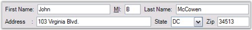
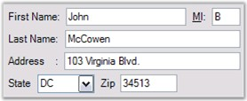
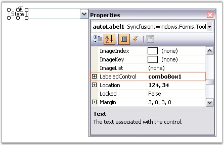

::: {style="DISPLAY: none"}
{#d2h_url_template}{#d2h_package_url style="WIDTH: 0px; DISPLAY: none; HEIGHT: 0px"}
:::

:::::: {.d2h_secondary_topic style="PADDING-BOTTOM: 10pt; MARGIN: 0pt; PADDING-LEFT: 0pt; PADDING-RIGHT: 0pt; PADDING-TOP: 0pt"}
##### Enabling Constrained FlowLayout on a Container[]{#p827} {#enabling-constrained-flowlayout-on-a-container style="tab-stops: 0pt"}

[]{style="COLOR: #15428b"} 

This section will illustrate how Constrained FlowLayout can be used to implement complex form layout logic.

 

For example, create a \'User Info entry\' panel with autolabels, textboxes and comboboxes to allow the user to enter personal information. This Container panel should also be capable of handling different widths by repositioning and resizing the Child controls appropriately.

 

Steps to achieve the above layout and behavior are described below.

 

3.   Place five textboxes and one combobox to represent the different data input controls in the panel.

[]{style="COLOR: #15428b"} 

+----------------------------------------------------------------------------------------------------------------------------------------------------------------------------------------------+
| **[\[C#\]]{style="FONT-FAMILY: 'Courier New'; COLOR: black"}**                                                                                                                               |
|                                                                                                                                                                                              |
| []{style="COLOR: black"}                                                                                                                                                                     |
|                                                                                                                                                                                              |
| [// Declare the textboxes, combobox and panel controls.]{style="FONT-FAMILY: 'Courier New'; COLOR: green"}                                                                                   |
|                                                                                                                                                                                              |
| [private]{style="FONT-FAMILY: 'Courier New'; COLOR: blue"}[ System.Windows.Forms.[TextBox]{style="COLOR: teal"} textBox5;]{style="FONT-FAMILY: 'Courier New'"}                               |
|                                                                                                                                                                                              |
| [private]{style="FONT-FAMILY: 'Courier New'; COLOR: blue"}[ System.Windows.Forms.[TextBox]{style="COLOR: teal"} textBox4;]{style="FONT-FAMILY: 'Courier New'"}                               |
|                                                                                                                                                                                              |
| [private]{style="FONT-FAMILY: 'Courier New'; COLOR: blue"}[ System.Windows.Forms.[TextBox]{style="COLOR: teal"} textBox3;]{style="FONT-FAMILY: 'Courier New'"}                               |
|                                                                                                                                                                                              |
| [private]{style="FONT-FAMILY: 'Courier New'; COLOR: blue"}[ System.Windows.Forms.[TextBox]{style="COLOR: teal"} textBox2;]{style="FONT-FAMILY: 'Courier New'"}                               |
|                                                                                                                                                                                              |
| [private]{style="FONT-FAMILY: 'Courier New'; COLOR: blue"}[ System.Windows.Forms.[TextBox]{style="COLOR: teal"} textBox1;]{style="FONT-FAMILY: 'Courier New'"}                               |
|                                                                                                                                                                                              |
| [private]{style="FONT-FAMILY: 'Courier New'; COLOR: blue"}[ System.Windows.Forms.[ComboBox]{style="COLOR: teal"} comboBox1;]{style="FONT-FAMILY: 'Courier New'"}                             |
|                                                                                                                                                                                              |
| [private]{style="FONT-FAMILY: 'Courier New'; COLOR: blue"}[ System.Windows.Forms.[Panel]{style="COLOR: teal"} panel1;]{style="FONT-FAMILY: 'Courier New'"}                                   |
|                                                                                                                                                                                              |
| []{style="FONT-FAMILY: 'Courier New'"}                                                                                                                                                       |
|                                                                                                                                                                                              |
| [// Initialize the controls.]{style="FONT-FAMILY: 'Courier New'; COLOR: green"}                                                                                                              |
|                                                                                                                                                                                              |
| [this]{style="FONT-FAMILY: 'Courier New'; COLOR: blue"}[.textBox1 = [new]{style="COLOR: blue"} System.Windows.Forms.[TextBox]{style="COLOR: teal"}();]{style="FONT-FAMILY: 'Courier New'"}   |
|                                                                                                                                                                                              |
| [this]{style="FONT-FAMILY: 'Courier New'; COLOR: blue"}[.textBox2 = [new]{style="COLOR: blue"} System.Windows.Forms.[TextBox]{style="COLOR: teal"}();]{style="FONT-FAMILY: 'Courier New'"}   |
|                                                                                                                                                                                              |
| [this]{style="FONT-FAMILY: 'Courier New'; COLOR: blue"}[.textBox3 = [new]{style="COLOR: blue"} System.Windows.Forms.[TextBox]{style="COLOR: teal"}();]{style="FONT-FAMILY: 'Courier New'"}   |
|                                                                                                                                                                                              |
| [this]{style="FONT-FAMILY: 'Courier New'; COLOR: blue"}[.textBox4 = [new]{style="COLOR: blue"} System.Windows.Forms.[TextBox]{style="COLOR: teal"}();]{style="FONT-FAMILY: 'Courier New'"}   |
|                                                                                                                                                                                              |
| [this]{style="FONT-FAMILY: 'Courier New'; COLOR: blue"}[.textBox5 = [new]{style="COLOR: blue"} System.Windows.Forms.[TextBox]{style="COLOR: teal"}();]{style="FONT-FAMILY: 'Courier New'"}   |
|                                                                                                                                                                                              |
| [this]{style="FONT-FAMILY: 'Courier New'; COLOR: blue"}[.comboBox1 = [new]{style="COLOR: blue"} System.Windows.Forms.[ComboBox]{style="COLOR: teal"}();]{style="FONT-FAMILY: 'Courier New'"} |
|                                                                                                                                                                                              |
| [this]{style="FONT-FAMILY: 'Courier New'; COLOR: blue"}[.panel1 = [new]{style="COLOR: blue"} System.Windows.Forms.[Panel]{style="COLOR: teal"}();]{style="FONT-FAMILY: 'Courier New'"}       |
|                                                                                                                                                                                              |
| []{style="FONT-FAMILY: 'Courier New'"}                                                                                                                                                       |
|                                                                                                                                                                                              |
| [// Add the controls to the panel control.]{style="FONT-FAMILY: 'Courier New'; COLOR: green"}                                                                                                |
|                                                                                                                                                                                              |
| [this]{style="FONT-FAMILY: 'Courier New'; COLOR: blue"}[.panel1.Controls.Add([this]{style="COLOR: blue"}.textBox1);]{style="FONT-FAMILY: 'Courier New'"}                                     |
|                                                                                                                                                                                              |
| [this]{style="FONT-FAMILY: 'Courier New'; COLOR: blue"}[.panel1.Controls.Add([this]{style="COLOR: blue"}.textBox2);]{style="FONT-FAMILY: 'Courier New'"}                                     |
|                                                                                                                                                                                              |
| [this]{style="FONT-FAMILY: 'Courier New'; COLOR: blue"}[.panel1.Controls.Add([this]{style="COLOR: blue"}.textBox3);]{style="FONT-FAMILY: 'Courier New'"}                                     |
|                                                                                                                                                                                              |
| [this]{style="FONT-FAMILY: 'Courier New'; COLOR: blue"}[.panel1.Controls.Add([this]{style="COLOR: blue"}.textBox4);]{style="FONT-FAMILY: 'Courier New'"}                                     |
|                                                                                                                                                                                              |
| [this]{style="FONT-FAMILY: 'Courier New'; COLOR: blue"}[.panel1.Controls.Add([this]{style="COLOR: blue"}.textBox5);]{style="FONT-FAMILY: 'Courier New'"}                                     |
|                                                                                                                                                                                              |
| [this]{style="FONT-FAMILY: 'Courier New'; COLOR: blue"}[.panel1.Controls.Add([this]{style="COLOR: blue"}.comboBox1);]{style="FONT-FAMILY: 'Courier New'"}                                    |
+----------------------------------------------------------------------------------------------------------------------------------------------------------------------------------------------+

[]{style="COLOR: #15428b"} 

+--------------------------------------------------------------------------------------------------------------------------------------------------------------------+
| **[\[VB.NET\]]{style="FONT-FAMILY: 'Courier New'; COLOR: black"}**                                                                                                 |
|                                                                                                                                                                    |
| []{style="COLOR: black"}                                                                                                                                           |
|                                                                                                                                                                    |
| [\' Declare the textboxes, combobox and panel controls.]{style="FONT-FAMILY: 'Courier New'; COLOR: green"}                                                         |
|                                                                                                                                                                    |
| [Private]{style="FONT-FAMILY: 'Courier New'; COLOR: blue"}[ textBox5 [As]{style="COLOR: blue"} System.Windows.Forms.TextBox]{style="FONT-FAMILY: 'Courier New'"}   |
|                                                                                                                                                                    |
| [Private]{style="FONT-FAMILY: 'Courier New'; COLOR: blue"}[ textBox4 [As]{style="COLOR: blue"} System.Windows.Forms.TextBox]{style="FONT-FAMILY: 'Courier New'"}   |
|                                                                                                                                                                    |
| [Private]{style="FONT-FAMILY: 'Courier New'; COLOR: blue"}[ textBox3 [As]{style="COLOR: blue"} System.Windows.Forms.TextBox]{style="FONT-FAMILY: 'Courier New'"}   |
|                                                                                                                                                                    |
| [Private]{style="FONT-FAMILY: 'Courier New'; COLOR: blue"}[ textBox2 [As]{style="COLOR: blue"} System.Windows.Forms.TextBox]{style="FONT-FAMILY: 'Courier New'"}   |
|                                                                                                                                                                    |
| [Private]{style="FONT-FAMILY: 'Courier New'; COLOR: blue"}[ textBox1 [As]{style="COLOR: blue"} System.Windows.Forms.TextBox]{style="FONT-FAMILY: 'Courier New'"}   |
|                                                                                                                                                                    |
| [Private]{style="FONT-FAMILY: 'Courier New'; COLOR: blue"}[ comboBox1 [As]{style="COLOR: blue"} System.Windows.Forms.ComboBox]{style="FONT-FAMILY: 'Courier New'"} |
|                                                                                                                                                                    |
| [Private]{style="FONT-FAMILY: 'Courier New'; COLOR: blue"}[ panel1 [As]{style="COLOR: blue"} System.Windows.Forms.Panel]{style="FONT-FAMILY: 'Courier New'"}       |
|                                                                                                                                                                    |
| []{style="FONT-FAMILY: 'Courier New'"}                                                                                                                             |
|                                                                                                                                                                    |
| [\' Initialize the controls.]{style="FONT-FAMILY: 'Courier New'; COLOR: green"}                                                                                    |
|                                                                                                                                                                    |
| [Me]{style="FONT-FAMILY: 'Courier New'; COLOR: blue"}[.textBox1 = [New]{style="COLOR: blue"} System.Windows.Forms.TextBox()]{style="FONT-FAMILY: 'Courier New'"}   |
|                                                                                                                                                                    |
| [Me]{style="FONT-FAMILY: 'Courier New'; COLOR: blue"}[.textBox2 = [New]{style="COLOR: blue"} System.Windows.Forms.TextBox()]{style="FONT-FAMILY: 'Courier New'"}   |
|                                                                                                                                                                    |
| [Me]{style="FONT-FAMILY: 'Courier New'; COLOR: blue"}[.textBox3 = [New]{style="COLOR: blue"} System.Windows.Forms.TextBox()]{style="FONT-FAMILY: 'Courier New'"}   |
|                                                                                                                                                                    |
| [Me]{style="FONT-FAMILY: 'Courier New'; COLOR: blue"}[.textBox4 = [New]{style="COLOR: blue"} System.Windows.Forms.TextBox()]{style="FONT-FAMILY: 'Courier New'"}   |
|                                                                                                                                                                    |
| [Me]{style="FONT-FAMILY: 'Courier New'; COLOR: blue"}[.textBox5 = [New]{style="COLOR: blue"} System.Windows.Forms.TextBox()]{style="FONT-FAMILY: 'Courier New'"}   |
|                                                                                                                                                                    |
| [Me]{style="FONT-FAMILY: 'Courier New'; COLOR: blue"}[.comboBox1 = [New]{style="COLOR: blue"} System.Windows.Forms.ComboBox()]{style="FONT-FAMILY: 'Courier New'"} |
|                                                                                                                                                                    |
| [Me]{style="FONT-FAMILY: 'Courier New'; COLOR: blue"}[.panel1 = [New]{style="COLOR: blue"} System.Windows.Forms.Panel()]{style="FONT-FAMILY: 'Courier New'"}       |
|                                                                                                                                                                    |
| []{style="FONT-FAMILY: 'Courier New'"}                                                                                                                             |
|                                                                                                                                                                    |
| [\' Add the controls to the panel control.]{style="FONT-FAMILY: 'Courier New'; COLOR: green"}                                                                      |
|                                                                                                                                                                    |
| [Me]{style="FONT-FAMILY: 'Courier New'; COLOR: blue"}[.panel1.Controls.Add([Me]{style="COLOR: blue"}.textBox1)]{style="FONT-FAMILY: 'Courier New'"}                |
|                                                                                                                                                                    |
| [Me]{style="FONT-FAMILY: 'Courier New'; COLOR: blue"}[.panel1.Controls.Add([Me]{style="COLOR: blue"}.textBox2)]{style="FONT-FAMILY: 'Courier New'"}                |
|                                                                                                                                                                    |
| [Me]{style="FONT-FAMILY: 'Courier New'; COLOR: blue"}[.panel1.Controls.Add([Me]{style="COLOR: blue"}.textBox3)]{style="FONT-FAMILY: 'Courier New'"}                |
|                                                                                                                                                                    |
| [Me]{style="FONT-FAMILY: 'Courier New'; COLOR: blue"}[.panel1.Controls.Add([Me]{style="COLOR: blue"}.textBox4)]{style="FONT-FAMILY: 'Courier New'"}                |
|                                                                                                                                                                    |
| [Me]{style="FONT-FAMILY: 'Courier New'; COLOR: blue"}[.panel1.Controls.Add([Me]{style="COLOR: blue"}.textBox5)]{style="FONT-FAMILY: 'Courier New'"}                |
|                                                                                                                                                                    |
| [Me]{style="FONT-FAMILY: 'Courier New'; COLOR: blue"}[.panel1.Controls.Add([Me]{style="COLOR: blue"}.comboBox1)]{style="FONT-FAMILY: 'Courier New'"}               |
+--------------------------------------------------------------------------------------------------------------------------------------------------------------------+

[]{style="COLOR: #15428b"} 

4.   Add one autolabel for each control and set the autolabel\'s **LabeledControl** property to the corresponding control. Also, change the **Text** property of the autolabel control appropriately and set the **AutoSize** property to \'True\'.

[]{style="COLOR: #15428b"} 

+----------------------------------------------------------------------------------------------------------------------------------------------------------------------------------------------------------+
| **[\[C#\]]{style="FONT-FAMILY: 'Courier New'; COLOR: black"}**                                                                                                                                           |
|                                                                                                                                                                                                          |
| []{style="COLOR: black"}                                                                                                                                                                                 |
|                                                                                                                                                                                                          |
| [// Declare the autolabel controls.]{style="FONT-FAMILY: 'Courier New'; COLOR: green"}                                                                                                                   |
|                                                                                                                                                                                                          |
| [private]{style="FONT-FAMILY: 'Courier New'; COLOR: blue"}[ Syncfusion.Windows.Forms.Tools.[AutoLabel]{style="COLOR: teal"} autoLabel1;]{style="FONT-FAMILY: 'Courier New'"}                             |
|                                                                                                                                                                                                          |
| [private]{style="FONT-FAMILY: 'Courier New'; COLOR: blue"}[ Syncfusion.Windows.Forms.Tools.[AutoLabel]{style="COLOR: teal"} autoLabel2;]{style="FONT-FAMILY: 'Courier New'"}                             |
|                                                                                                                                                                                                          |
| [private]{style="FONT-FAMILY: 'Courier New'; COLOR: blue"}[ Syncfusion.Windows.Forms.Tools.[AutoLabel]{style="COLOR: teal"} autoLabel3;]{style="FONT-FAMILY: 'Courier New'"}                             |
|                                                                                                                                                                                                          |
| [private]{style="FONT-FAMILY: 'Courier New'; COLOR: blue"}[ Syncfusion.Windows.Forms.Tools.[AutoLabel]{style="COLOR: teal"} autoLabel4;]{style="FONT-FAMILY: 'Courier New'"}                             |
|                                                                                                                                                                                                          |
| [private]{style="FONT-FAMILY: 'Courier New'; COLOR: blue"}[ Syncfusion.Windows.Forms.Tools.[AutoLabel]{style="COLOR: teal"} autoLabel5;]{style="FONT-FAMILY: 'Courier New'"}                             |
|                                                                                                                                                                                                          |
| [private]{style="FONT-FAMILY: 'Courier New'; COLOR: blue"}[ Syncfusion.Windows.Forms.Tools.[AutoLabel]{style="COLOR: teal"} autoLabel6;]{style="FONT-FAMILY: 'Courier New'"}                             |
|                                                                                                                                                                                                          |
| []{style="FONT-FAMILY: 'Courier New'"}                                                                                                                                                                   |
|                                                                                                                                                                                                          |
| [// Initialize the controls.]{style="FONT-FAMILY: 'Courier New'; COLOR: green"}                                                                                                                          |
|                                                                                                                                                                                                          |
| [this]{style="FONT-FAMILY: 'Courier New'; COLOR: blue"}[.autoLabel1 = [new]{style="COLOR: blue"} Syncfusion.Windows.Forms.Tools.[AutoLabel]{style="COLOR: teal"}();]{style="FONT-FAMILY: 'Courier New'"} |
|                                                                                                                                                                                                          |
| [this]{style="FONT-FAMILY: 'Courier New'; COLOR: blue"}[.autoLabel2 = [new]{style="COLOR: blue"} Syncfusion.Windows.Forms.Tools.[AutoLabel]{style="COLOR: teal"}();]{style="FONT-FAMILY: 'Courier New'"} |
|                                                                                                                                                                                                          |
| [this]{style="FONT-FAMILY: 'Courier New'; COLOR: blue"}[.autoLabel3 = [new]{style="COLOR: blue"} Syncfusion.Windows.Forms.Tools.[AutoLabel]{style="COLOR: teal"}();]{style="FONT-FAMILY: 'Courier New'"} |
|                                                                                                                                                                                                          |
| [this]{style="FONT-FAMILY: 'Courier New'; COLOR: blue"}[.autoLabel4 = [new]{style="COLOR: blue"} Syncfusion.Windows.Forms.Tools.[AutoLabel]{style="COLOR: teal"}();]{style="FONT-FAMILY: 'Courier New'"} |
|                                                                                                                                                                                                          |
| [this]{style="FONT-FAMILY: 'Courier New'; COLOR: blue"}[.autoLabel5 = [new]{style="COLOR: blue"} Syncfusion.Windows.Forms.Tools.[AutoLabel]{style="COLOR: teal"}();]{style="FONT-FAMILY: 'Courier New'"} |
|                                                                                                                                                                                                          |
| [this]{style="FONT-FAMILY: 'Courier New'; COLOR: blue"}[.autoLabel6 = [new]{style="COLOR: blue"} Syncfusion.Windows.Forms.Tools.[AutoLabel]{style="COLOR: teal"}();]{style="FONT-FAMILY: 'Courier New'"} |
|                                                                                                                                                                                                          |
| []{style="COLOR: black"}                                                                                                                                                                                 |
|                                                                                                                                                                                                          |
| [// Set their properties.]{style="FONT-FAMILY: 'Courier New'; COLOR: green"}                                                                                                                             |
|                                                                                                                                                                                                          |
| [this]{style="FONT-FAMILY: 'Courier New'; COLOR: blue"}[.autoLabel1.AutoSize = [true]{style="COLOR: blue"};]{style="FONT-FAMILY: 'Courier New'"}                                                         |
|                                                                                                                                                                                                          |
| [this]{style="FONT-FAMILY: 'Courier New'; COLOR: blue"}[.autoLabel1.LabeledControl = [this]{style="COLOR: blue"}.textBox1;]{style="FONT-FAMILY: 'Courier New'"}                                          |
|                                                                                                                                                                                                          |
| [this]{style="FONT-FAMILY: 'Courier New'; COLOR: blue"}[.autoLabel1.Text = [\"First Name:\"]{style="COLOR: maroon"};]{style="FONT-FAMILY: 'Courier New'"}                                                |
|                                                                                                                                                                                                          |
| []{style="FONT-FAMILY: 'Courier New'"}                                                                                                                                                                   |
|                                                                                                                                                                                                          |
| [this]{style="FONT-FAMILY: 'Courier New'; COLOR: blue"}[.autoLabel2.AutoSize = [true]{style="COLOR: blue"};]{style="FONT-FAMILY: 'Courier New'"}                                                         |
|                                                                                                                                                                                                          |
| [this]{style="FONT-FAMILY: 'Courier New'; COLOR: blue"}[.autoLabel2.LabeledControl = [this]{style="COLOR: blue"}.textBox2;]{style="FONT-FAMILY: 'Courier New'"}                                          |
|                                                                                                                                                                                                          |
| [this]{style="FONT-FAMILY: 'Courier New'; COLOR: blue"}[.autoLabel2.Text = [\"MI:\"]{style="COLOR: maroon"};]{style="FONT-FAMILY: 'Courier New'"}                                                        |
|                                                                                                                                                                                                          |
| []{style="FONT-FAMILY: 'Courier New'"}                                                                                                                                                                   |
|                                                                                                                                                                                                          |
| [this]{style="FONT-FAMILY: 'Courier New'; COLOR: blue"}[.autoLabel3.AutoSize = [true]{style="COLOR: blue"};]{style="FONT-FAMILY: 'Courier New'"}                                                         |
|                                                                                                                                                                                                          |
| [this]{style="FONT-FAMILY: 'Courier New'; COLOR: blue"}[.autoLabel3.LabeledControl = [this]{style="COLOR: blue"}.textBox3;]{style="FONT-FAMILY: 'Courier New'"}                                          |
|                                                                                                                                                                                                          |
| [this]{style="FONT-FAMILY: 'Courier New'; COLOR: blue"}[.autoLabel3.Text = [\"Last Name:\"]{style="COLOR: maroon"};]{style="FONT-FAMILY: 'Courier New'"}                                                 |
|                                                                                                                                                                                                          |
| []{style="FONT-FAMILY: 'Courier New'"}                                                                                                                                                                   |
|                                                                                                                                                                                                          |
| [this]{style="FONT-FAMILY: 'Courier New'; COLOR: blue"}[.autoLabel4.AutoSize = [true]{style="COLOR: blue"};]{style="FONT-FAMILY: 'Courier New'"}                                                         |
|                                                                                                                                                                                                          |
| [this]{style="FONT-FAMILY: 'Courier New'; COLOR: blue"}[.autoLabel4.LabeledControl = [this]{style="COLOR: blue"}.textBox4;]{style="FONT-FAMILY: 'Courier New'"}                                          |
|                                                                                                                                                                                                          |
| [this]{style="FONT-FAMILY: 'Courier New'; COLOR: blue"}[.autoLabel4.Text = [\"Address:\"]{style="COLOR: maroon"};]{style="FONT-FAMILY: 'Courier New'"}                                                   |
|                                                                                                                                                                                                          |
| []{style="FONT-FAMILY: 'Courier New'"}                                                                                                                                                                   |
|                                                                                                                                                                                                          |
| [this]{style="FONT-FAMILY: 'Courier New'; COLOR: blue"}[.autoLabel5.AutoSize = [true]{style="COLOR: blue"};]{style="FONT-FAMILY: 'Courier New'"}                                                         |
|                                                                                                                                                                                                          |
| [this]{style="FONT-FAMILY: 'Courier New'; COLOR: blue"}[.autoLabel5.LabeledControl = [this]{style="COLOR: blue"}.textBox5;]{style="FONT-FAMILY: 'Courier New'"}                                          |
|                                                                                                                                                                                                          |
| [this]{style="FONT-FAMILY: 'Courier New'; COLOR: blue"}[.autoLabel5.Text = [\"State\"]{style="COLOR: maroon"};]{style="FONT-FAMILY: 'Courier New'"}                                                      |
|                                                                                                                                                                                                          |
| []{style="FONT-FAMILY: 'Courier New'"}                                                                                                                                                                   |
|                                                                                                                                                                                                          |
| [this]{style="FONT-FAMILY: 'Courier New'; COLOR: blue"}[.autoLabel6.AutoSize = [true]{style="COLOR: blue"};]{style="FONT-FAMILY: 'Courier New'"}                                                         |
|                                                                                                                                                                                                          |
| [this]{style="FONT-FAMILY: 'Courier New'; COLOR: blue"}[.autoLabel6.LabeledControl = [this]{style="COLOR: blue"}.comboBox1;]{style="FONT-FAMILY: 'Courier New'"}                                         |
|                                                                                                                                                                                                          |
| [this]{style="FONT-FAMILY: 'Courier New'; COLOR: blue"}[.autoLabel6.Text = [\"Zip\"]{style="COLOR: maroon"};]{style="FONT-FAMILY: 'Courier New'"}                                                        |
+----------------------------------------------------------------------------------------------------------------------------------------------------------------------------------------------------------+

[]{style="COLOR: #15428b"} 

+--------------------------------------------------------------------------------------------------------------------------------------------------------------------------------+
| **[\[VB.NET\]]{style="FONT-FAMILY: 'Courier New'; COLOR: black"}**                                                                                                             |
|                                                                                                                                                                                |
| []{style="COLOR: black"}                                                                                                                                                       |
|                                                                                                                                                                                |
| [\' Declare the autolabel controls.]{style="FONT-FAMILY: 'Courier New'; COLOR: green"}                                                                                         |
|                                                                                                                                                                                |
| [Private]{style="FONT-FAMILY: 'Courier New'; COLOR: blue"}[ autoLabel1 [As]{style="COLOR: blue"} Syncfusion.Windows.Forms.Tools.AutoLabel]{style="FONT-FAMILY: 'Courier New'"} |
|                                                                                                                                                                                |
| [Private]{style="FONT-FAMILY: 'Courier New'; COLOR: blue"}[ autoLabel2 [As]{style="COLOR: blue"} Syncfusion.Windows.Forms.Tools.AutoLabel]{style="FONT-FAMILY: 'Courier New'"} |
|                                                                                                                                                                                |
| [Private]{style="FONT-FAMILY: 'Courier New'; COLOR: blue"}[ autoLabel3 [As]{style="COLOR: blue"} Syncfusion.Windows.Forms.Tools.AutoLabel]{style="FONT-FAMILY: 'Courier New'"} |
|                                                                                                                                                                                |
| [Private]{style="FONT-FAMILY: 'Courier New'; COLOR: blue"}[ autoLabel4 [As]{style="COLOR: blue"} Syncfusion.Windows.Forms.Tools.AutoLabel]{style="FONT-FAMILY: 'Courier New'"} |
|                                                                                                                                                                                |
| [Private]{style="FONT-FAMILY: 'Courier New'; COLOR: blue"}[ autoLabel5 [As]{style="COLOR: blue"} Syncfusion.Windows.Forms.Tools.AutoLabel]{style="FONT-FAMILY: 'Courier New'"} |
|                                                                                                                                                                                |
| [Private]{style="FONT-FAMILY: 'Courier New'; COLOR: blue"}[ autoLabel6 [As]{style="COLOR: blue"} Syncfusion.Windows.Forms.Tools.AutoLabel]{style="FONT-FAMILY: 'Courier New'"} |
|                                                                                                                                                                                |
| []{style="FONT-FAMILY: 'Courier New'"}                                                                                                                                         |
|                                                                                                                                                                                |
| [\' Initialize the controls.]{style="FONT-FAMILY: 'Courier New'; COLOR: green"}                                                                                                |
|                                                                                                                                                                                |
| [Me]{style="FONT-FAMILY: 'Courier New'; COLOR: blue"}[.autoLabel1 = [New]{style="COLOR: blue"} Syncfusion.Windows.Forms.Tools.AutoLabel()]{style="FONT-FAMILY: 'Courier New'"} |
|                                                                                                                                                                                |
| [Me]{style="FONT-FAMILY: 'Courier New'; COLOR: blue"}[.autoLabel2 = [New]{style="COLOR: blue"} Syncfusion.Windows.Forms.Tools.AutoLabel()]{style="FONT-FAMILY: 'Courier New'"} |
|                                                                                                                                                                                |
| [Me]{style="FONT-FAMILY: 'Courier New'; COLOR: blue"}[.autoLabel3 = [New]{style="COLOR: blue"} Syncfusion.Windows.Forms.Tools.AutoLabel()]{style="FONT-FAMILY: 'Courier New'"} |
|                                                                                                                                                                                |
| [Me]{style="FONT-FAMILY: 'Courier New'; COLOR: blue"}[.autoLabel4 = [New]{style="COLOR: blue"} Syncfusion.Windows.Forms.Tools.AutoLabel()]{style="FONT-FAMILY: 'Courier New'"} |
|                                                                                                                                                                                |
| [Me]{style="FONT-FAMILY: 'Courier New'; COLOR: blue"}[.autoLabel5 = [New]{style="COLOR: blue"} Syncfusion.Windows.Forms.Tools.AutoLabel()]{style="FONT-FAMILY: 'Courier New'"} |
|                                                                                                                                                                                |
| [Me]{style="FONT-FAMILY: 'Courier New'; COLOR: blue"}[.autoLabel6 = [New]{style="COLOR: blue"} Syncfusion.Windows.Forms.Tools.AutoLabel()]{style="FONT-FAMILY: 'Courier New'"} |
|                                                                                                                                                                                |
| []{style="COLOR: black"}                                                                                                                                                       |
|                                                                                                                                                                                |
| [\' Set their properties.]{style="FONT-FAMILY: 'Courier New'; COLOR: green"}                                                                                                   |
|                                                                                                                                                                                |
| [Me]{style="FONT-FAMILY: 'Courier New'; COLOR: blue"}[.autoLabel1.LabeledControl = [Me]{style="COLOR: blue"}.textBox1]{style="FONT-FAMILY: 'Courier New'"}                     |
|                                                                                                                                                                                |
| [Me]{style="FONT-FAMILY: 'Courier New'; COLOR: blue"}[.autoLabel1.Text = [\"First Name:\"]{style="COLOR: maroon"}]{style="FONT-FAMILY: 'Courier New'"}                         |
|                                                                                                                                                                                |
| []{style="FONT-FAMILY: 'Courier New'; COLOR: maroon"}                                                                                                                          |
|                                                                                                                                                                                |
| [Me]{style="FONT-FAMILY: 'Courier New'; COLOR: blue"}[.autoLabel2.LabeledControl = [Me]{style="COLOR: blue"}.textBox2]{style="FONT-FAMILY: 'Courier New'"}                     |
|                                                                                                                                                                                |
| [Me]{style="FONT-FAMILY: 'Courier New'; COLOR: blue"}[.autoLabel2.Text = [\"MI:\"]{style="COLOR: maroon"}]{style="FONT-FAMILY: 'Courier New'"}                                 |
|                                                                                                                                                                                |
| []{style="FONT-FAMILY: 'Courier New'; COLOR: maroon"}                                                                                                                          |
|                                                                                                                                                                                |
| [Me]{style="FONT-FAMILY: 'Courier New'; COLOR: blue"}[.autoLabel3.LabeledControl = [Me]{style="COLOR: blue"}.textBox3]{style="FONT-FAMILY: 'Courier New'"}                     |
|                                                                                                                                                                                |
| [Me]{style="FONT-FAMILY: 'Courier New'; COLOR: blue"}[.autoLabel3.Text = [\"Last Name:\"]{style="COLOR: maroon"}]{style="FONT-FAMILY: 'Courier New'"}                          |
|                                                                                                                                                                                |
| []{style="FONT-FAMILY: 'Courier New'; COLOR: maroon"}                                                                                                                          |
|                                                                                                                                                                                |
| [Me]{style="FONT-FAMILY: 'Courier New'; COLOR: blue"}[.autoLabel4.LabeledControl = [Me]{style="COLOR: blue"}.textBox4]{style="FONT-FAMILY: 'Courier New'"}                     |
|                                                                                                                                                                                |
| [Me]{style="FONT-FAMILY: 'Courier New'; COLOR: blue"}[.autoLabel4.Text = [\"Address:\"]{style="COLOR: maroon"}]{style="FONT-FAMILY: 'Courier New'"}                            |
|                                                                                                                                                                                |
| []{style="FONT-FAMILY: 'Courier New'; COLOR: maroon"}                                                                                                                          |
|                                                                                                                                                                                |
| [Me]{style="FONT-FAMILY: 'Courier New'; COLOR: blue"}[.autoLabel5.LabeledControl = [Me]{style="COLOR: blue"}.textBox5]{style="FONT-FAMILY: 'Courier New'"}                     |
|                                                                                                                                                                                |
| [Me]{style="FONT-FAMILY: 'Courier New'; COLOR: blue"}[.autoLabel5.Text = [\"State\"]{style="COLOR: maroon"}]{style="FONT-FAMILY: 'Courier New'"}                               |
|                                                                                                                                                                                |
| []{style="FONT-FAMILY: 'Courier New'; COLOR: maroon"}                                                                                                                          |
|                                                                                                                                                                                |
| [Me]{style="FONT-FAMILY: 'Courier New'; COLOR: blue"}[.autoLabel6.LabeledControl = [Me]{style="COLOR: blue"}.comboBox1]{style="FONT-FAMILY: 'Courier New'"}                    |
|                                                                                                                                                                                |
| [Me]{style="FONT-FAMILY: 'Courier New'; COLOR: blue"}[.autoLabel6.Text = [\"Zip\"]{style="COLOR: maroon"}]{style="FONT-FAMILY: 'Courier New'"}                                 |
+--------------------------------------------------------------------------------------------------------------------------------------------------------------------------------+

[]{style="COLOR: #15428b"} 

5.   Now add the FlowLayout component and set the panel to be its Container control. The FlowLayout will layout the controls in the order in which they were added to the panel. Use the **Bring To Front** and **Send To Back** design time verbs to move the controls to the front or back of the layout order.

[]{style="COLOR: #15428b"} 

::: {style="BORDER-BOTTOM: windowtext 1pt solid; BORDER-LEFT: medium none; PADDING-BOTTOM: 1pt; MARGIN-TOP: 9pt; PADDING-LEFT: 0pt; PADDING-RIGHT: 0pt; MARGIN-BOTTOM: 9pt; BORDER-TOP: windowtext 1pt solid; BORDER-RIGHT: medium none; PADDING-TOP: 1pt"}
{border="0"} Note: The FlowLayout will treat each control and it\'s autolabel pair as a single unit during layout.
:::

[]{style="COLOR: #15428b"} 

+--------------------------------------------------------------------------------------------------------------------------------------------------------------------------------------------------------------------------------------------------+
| **[\[C#\]]{style="FONT-FAMILY: 'Courier New'; COLOR: black"}**                                                                                                                                                                                   |
|                                                                                                                                                                                                                                                  |
| []{style="COLOR: black"}                                                                                                                                                                                                                         |
|                                                                                                                                                                                                                                                  |
| [// Declare the FlowLayout.]{style="FONT-FAMILY: 'Courier New'; COLOR: green"}                                                                                                                                                                   |
|                                                                                                                                                                                                                                                  |
| [private]{style="FONT-FAMILY: 'Courier New'; COLOR: blue"}[ Syncfusion.Windows.Forms.Tools.[FlowLayout]{style="COLOR: teal"} flowLayout1;]{style="FONT-FAMILY: 'Courier New'"}                                                                   |
|                                                                                                                                                                                                                                                  |
| []{style="FONT-FAMILY: 'Courier New'"}                                                                                                                                                                                                           |
|                                                                                                                                                                                                                                                  |
| [// Initialize the Flowlayout and set the panel control as it\'s Container control.]{style="FONT-FAMILY: 'Courier New'; COLOR: green"}                                                                                                           |
|                                                                                                                                                                                                                                                  |
| [this]{style="FONT-FAMILY: 'Courier New'; COLOR: blue"}[.flowLayout1 = [new]{style="COLOR: blue"} Syncfusion.Windows.Forms.Tools.[FlowLayout]{style="COLOR: teal"}([this]{style="COLOR: blue"}.components);]{style="FONT-FAMILY: 'Courier New'"} |
|                                                                                                                                                                                                                                                  |
| [this]{style="FONT-FAMILY: 'Courier New'; COLOR: blue"}[.flowLayout1.ContainerControl = [this]{style="COLOR: blue"}.panel1;]{style="FONT-FAMILY: 'Courier New'"}                                                                                 |
+--------------------------------------------------------------------------------------------------------------------------------------------------------------------------------------------------------------------------------------------------+

[]{style="COLOR: #15428b"} 

+----------------------------------------------------------------------------------------------------------------------------------------------------------------------------------------------------------------------+
| **[\[VB.NET\]]{style="FONT-FAMILY: 'Courier New'; COLOR: black"}**                                                                                                                                                   |
|                                                                                                                                                                                                                      |
| []{style="COLOR: #15428b"}                                                                                                                                                                                           |
|                                                                                                                                                                                                                      |
| [\' Declare the FlowLayout.]{style="FONT-FAMILY: 'Courier New'; COLOR: green"}                                                                                                                                       |
|                                                                                                                                                                                                                      |
| [Private]{style="FONT-FAMILY: 'Courier New'; COLOR: blue"}[ flowLayout1 [As]{style="COLOR: blue"} Syncfusion.Windows.Forms.Tools.FlowLayout]{style="FONT-FAMILY: 'Courier New'"}                                     |
|                                                                                                                                                                                                                      |
| []{style="FONT-FAMILY: 'Courier New'"}                                                                                                                                                                               |
|                                                                                                                                                                                                                      |
| [\' Initialize the Flowlayout and set the panel control as it\'s Container control.]{style="FONT-FAMILY: 'Courier New'; COLOR: green"}                                                                               |
|                                                                                                                                                                                                                      |
| [Me]{style="FONT-FAMILY: 'Courier New'; COLOR: blue"}[.flowLayout1 = [New]{style="COLOR: blue"} Syncfusion.Windows.Forms.Tools.FlowLayout([Me]{style="COLOR: blue"}.components)]{style="FONT-FAMILY: 'Courier New'"} |
|                                                                                                                                                                                                                      |
| [Me]{style="FONT-FAMILY: 'Courier New'; COLOR: blue"}[.flowLayout1.ContainerControl = [Me]{style="COLOR: blue"}.panel1]{style="FONT-FAMILY: 'Courier New'"}                                                          |
+----------------------------------------------------------------------------------------------------------------------------------------------------------------------------------------------------------------------+

[]{style="COLOR: #15428b"} 

6.   Now set some appropriate constraints on the input controls as follows.

[]{style="COLOR: #15428b"} 

[·      ]{style="FONT-FAMILY: Symbol"}Select the **First Name** textbox and browse to the extended **Constraints on flowLayout** property. Set the **HAlign** property to \'Justify\', so that this control\'s width will be resized to fit any available empty horizontal space in the row. This also requires that you specify an appropriate preferred size for the control, such as (100, 20).

[·      ]{style="FONT-FAMILY: Symbol"}The **Middle Initial** textbox needs to be left aligned and not justified. This is the default constraint setting, so we don\'t need to make any changes to it\'s constraints.

[·      ]{style="FONT-FAMILY: Symbol"}Select the **Last Name** textbox and specify the same constraints as the \'First Name\' textbox.

[·      ]{style="FONT-FAMILY: Symbol"}The **Address** textbox should always begin in a new row, so set the **NewLine** property to \'True\' in it\'s constraints. Also, set the **HAlign** property to \'Justify\' and also provide a preferred size.

[·      ]{style="FONT-FAMILY: Symbol"}The **State** combobox and **Zip** textbox controls can also be left with the default constraints.

[]{style="COLOR: #15428b"} 

+---------------------------------------------------------------------------------------------------------------------------------------------------------------------------------------------------------------------------------------------------------------------------------------------------------------------------------------------------------------------------------------------------------------------------------------------------------------------------------------------------------------------------------------------------------+
| **[\[C#\]]{style="FONT-FAMILY: 'Courier New'; COLOR: black"}**                                                                                                                                                                                                                                                                                                                                                                                                                                                                                          |
|                                                                                                                                                                                                                                                                                                                                                                                                                                                                                                                                                         |
| []{style="COLOR: black"}                                                                                                                                                                                                                                                                                                                                                                                                                                                                                                                                |
|                                                                                                                                                                                                                                                                                                                                                                                                                                                                                                                                                         |
| [// Set the constraints for the textboxes.]{style="FONT-FAMILY: 'Courier New'; COLOR: green"}                                                                                                                                                                                                                                                                                                                                                                                                                                                           |
|                                                                                                                                                                                                                                                                                                                                                                                                                                                                                                                                                         |
| [this]{style="FONT-FAMILY: 'Courier New'; COLOR: blue"}[.flowLayout1.SetConstraints([this]{style="COLOR: blue"}.textBox1, [new]{style="COLOR: blue"} Syncfusion.Windows.Forms.Tools.[FlowLayoutConstraints]{style="COLOR: teal"}([true]{style="COLOR: blue"}, Syncfusion.Windows.Forms.Tools.[HorzFlowAlign]{style="COLOR: teal"}.Justify, Syncfusion.Windows.Forms.Tools.[VertFlowAlign]{style="COLOR: teal"}.Center, [false]{style="COLOR: blue"}, [false]{style="COLOR: blue"}, [false]{style="COLOR: blue"}));]{style="FONT-FAMILY: 'Courier New'"} |
|                                                                                                                                                                                                                                                                                                                                                                                                                                                                                                                                                         |
| [this]{style="FONT-FAMILY: 'Courier New'; COLOR: blue"}[.flowLayout1.SetPreferredSize([this]{style="COLOR: blue"}.textBox1, [new]{style="COLOR: blue"} System.Drawing.[Size]{style="COLOR: teal"}(100, 20));]{style="FONT-FAMILY: 'Courier New'"}                                                                                                                                                                                                                                                                                                       |
|                                                                                                                                                                                                                                                                                                                                                                                                                                                                                                                                                         |
| []{style="FONT-FAMILY: 'Courier New'"}                                                                                                                                                                                                                                                                                                                                                                                                                                                                                                                  |
|                                                                                                                                                                                                                                                                                                                                                                                                                                                                                                                                                         |
| [this]{style="FONT-FAMILY: 'Courier New'; COLOR: blue"}[.flowLayout1.SetConstraints([this]{style="COLOR: blue"}.textBox3, [new]{style="COLOR: blue"} Syncfusion.Windows.Forms.Tools.[FlowLayoutConstraints]{style="COLOR: teal"}([true]{style="COLOR: blue"}, Syncfusion.Windows.Forms.Tools.[HorzFlowAlign]{style="COLOR: teal"}.Justify, Syncfusion.Windows.Forms.Tools.[VertFlowAlign]{style="COLOR: teal"}.Center, [false]{style="COLOR: blue"}, [false]{style="COLOR: blue"}, [false]{style="COLOR: blue"}));]{style="FONT-FAMILY: 'Courier New'"} |
|                                                                                                                                                                                                                                                                                                                                                                                                                                                                                                                                                         |
| [this]{style="FONT-FAMILY: 'Courier New'; COLOR: blue"}[.flowLayout1.SetPreferredSize([this]{style="COLOR: blue"}.textBox3, [new]{style="COLOR: blue"} System.Drawing.[Size]{style="COLOR: teal"}(100, 20));]{style="FONT-FAMILY: 'Courier New'"}                                                                                                                                                                                                                                                                                                       |
|                                                                                                                                                                                                                                                                                                                                                                                                                                                                                                                                                         |
| []{style="FONT-FAMILY: 'Courier New'"}                                                                                                                                                                                                                                                                                                                                                                                                                                                                                                                  |
|                                                                                                                                                                                                                                                                                                                                                                                                                                                                                                                                                         |
| [this]{style="FONT-FAMILY: 'Courier New'; COLOR: blue"}[.flowLayout1.SetConstraints([this]{style="COLOR: blue"}.textBox4, [new]{style="COLOR: blue"} Syncfusion.Windows.Forms.Tools.[FlowLayoutConstraints]{style="COLOR: teal"}([true]{style="COLOR: blue"}, Syncfusion.Windows.Forms.Tools.[HorzFlowAlign]{style="COLOR: teal"}.Justify, Syncfusion.Windows.Forms.Tools.[VertFlowAlign]{style="COLOR: teal"}.Center, [true]{style="COLOR: blue"}, [false]{style="COLOR: blue"}, [false]{style="COLOR: blue"}));]{style="FONT-FAMILY: 'Courier New'"}  |
|                                                                                                                                                                                                                                                                                                                                                                                                                                                                                                                                                         |
| [this]{style="FONT-FAMILY: 'Courier New'; COLOR: blue"}[.flowLayout1.SetPreferredSize([this]{style="COLOR: blue"}.textBox4, [new]{style="COLOR: blue"} System.Drawing.[Size]{style="COLOR: teal"}(100, 20));.Center, [false]{style="COLOR: blue"}, [false]{style="COLOR: blue"}, [true]{style="COLOR: blue"}));]{style="FONT-FAMILY: 'Courier New'"}                                                                                                                                                                                                    |
+---------------------------------------------------------------------------------------------------------------------------------------------------------------------------------------------------------------------------------------------------------------------------------------------------------------------------------------------------------------------------------------------------------------------------------------------------------------------------------------------------------------------------------------------------------+

[]{style="COLOR: #15428b"} 

+-------------------------------------------------------------------------------------------------------------------------------------------------------------------------------------------------------------------------------------------------------------------------------------------------------------------------------------------------------------------------------------------------------------------------------------------------------------------------------+
| **[\[VB.NET\]]{style="FONT-FAMILY: 'Courier New'; COLOR: black"}**                                                                                                                                                                                                                                                                                                                                                                                                            |
|                                                                                                                                                                                                                                                                                                                                                                                                                                                                               |
| []{style="COLOR: black"}                                                                                                                                                                                                                                                                                                                                                                                                                                                      |
|                                                                                                                                                                                                                                                                                                                                                                                                                                                                               |
| [\' Set the constraints for the textboxes.]{style="FONT-FAMILY: 'Courier New'; COLOR: green"}                                                                                                                                                                                                                                                                                                                                                                                 |
|                                                                                                                                                                                                                                                                                                                                                                                                                                                                               |
| [Me]{style="FONT-FAMILY: 'Courier New'; COLOR: blue"}[.flowLayout1.SetConstraints([Me]{style="COLOR: blue"}.textBox1, [New]{style="COLOR: blue"} Syncfusion.Windows.Forms.Tools.FlowLayoutConstraints([True]{style="COLOR: blue"}, Syncfusion.Windows.Forms.Tools.HorzFlowAlign.Justify, Syncfusion.Windows.Forms.Tools.VertFlowAlign.Center, [False]{style="COLOR: blue"}, [False]{style="COLOR: blue"}, [False]{style="COLOR: blue"}))]{style="FONT-FAMILY: 'Courier New'"} |
|                                                                                                                                                                                                                                                                                                                                                                                                                                                                               |
| [Me]{style="FONT-FAMILY: 'Courier New'; COLOR: blue"}[.flowLayout1.SetPreferredSize([Me]{style="COLOR: blue"}.textBox1, [New]{style="COLOR: blue"} System.Drawing.Size(100, 20))]{style="FONT-FAMILY: 'Courier New'"}                                                                                                                                                                                                                                                         |
|                                                                                                                                                                                                                                                                                                                                                                                                                                                                               |
| []{style="FONT-FAMILY: 'Courier New'"}                                                                                                                                                                                                                                                                                                                                                                                                                                        |
|                                                                                                                                                                                                                                                                                                                                                                                                                                                                               |
| [Me]{style="FONT-FAMILY: 'Courier New'; COLOR: blue"}[.flowLayout1.SetConstraints([Me]{style="COLOR: blue"}.textBox3, [New]{style="COLOR: blue"} Syncfusion.Windows.Forms.Tools.FlowLayoutConstraints([True]{style="COLOR: blue"}, Syncfusion.Windows.Forms.Tools.HorzFlowAlign.Justify, Syncfusion.Windows.Forms.Tools.VertFlowAlign.Center, [False]{style="COLOR: blue"}, [False]{style="COLOR: blue"}, [False]{style="COLOR: blue"}))]{style="FONT-FAMILY: 'Courier New'"} |
|                                                                                                                                                                                                                                                                                                                                                                                                                                                                               |
| [Me]{style="FONT-FAMILY: 'Courier New'; COLOR: blue"}[.flowLayout1.SetPreferredSize([Me]{style="COLOR: blue"}.textBox3, [New]{style="COLOR: blue"} System.Drawing.Size(100, 20))]{style="FONT-FAMILY: 'Courier New'"}                                                                                                                                                                                                                                                         |
|                                                                                                                                                                                                                                                                                                                                                                                                                                                                               |
| []{style="FONT-FAMILY: 'Courier New'"}                                                                                                                                                                                                                                                                                                                                                                                                                                        |
|                                                                                                                                                                                                                                                                                                                                                                                                                                                                               |
| [Me]{style="FONT-FAMILY: 'Courier New'; COLOR: blue"}[.flowLayout1.SetConstraints([Me]{style="COLOR: blue"}.textBox4, [New]{style="COLOR: blue"} Syncfusion.Windows.Forms.Tools.FlowLayoutConstraints([True]{style="COLOR: blue"}, Syncfusion.Windows.Forms.Tools.HorzFlowAlign.Justify, Syncfusion.Windows.Forms.Tools.VertFlowAlign.Center, [True]{style="COLOR: blue"}, [False]{style="COLOR: blue"}, [False]{style="COLOR: blue"}))]{style="FONT-FAMILY: 'Courier New'"}  |
|                                                                                                                                                                                                                                                                                                                                                                                                                                                                               |
| [Me]{style="FONT-FAMILY: 'Courier New'; COLOR: blue"}[.flowLayout1.SetPreferredSize([Me]{style="COLOR: blue"}.textBox4, [New]{style="COLOR: blue"} System.Drawing.Size(100, 20))]{style="FONT-FAMILY: 'Courier New'"}                                                                                                                                                                                                                                                         |
+-------------------------------------------------------------------------------------------------------------------------------------------------------------------------------------------------------------------------------------------------------------------------------------------------------------------------------------------------------------------------------------------------------------------------------------------------------------------------------+

[]{style="COLOR: #15428b"} 

7.   The panel itself should increase or decrease in width when the number of rows in the layout increases or decreases. To get this behavior, set the FlowLayout\'s **AutoHeight** property to \'True\'.

[]{style="COLOR: #15428b"} 

+-----------------------------------------------------------------------------------------------------------------------------------------------------+
| **[\[C#\]]{style="FONT-FAMILY: 'Courier New'; COLOR: black"}**                                                                                      |
|                                                                                                                                                     |
| []{style="COLOR: black"}                                                                                                                            |
|                                                                                                                                                     |
| [// Set the AutoHeight property of FlowLayout.]{style="FONT-FAMILY: 'Courier New'; COLOR: green"}                                                   |
|                                                                                                                                                     |
| [this]{style="FONT-FAMILY: 'Courier New'; COLOR: blue"}[.flowLayout1.AutoHeight = [true]{style="COLOR: blue"};]{style="FONT-FAMILY: 'Courier New'"} |
+-----------------------------------------------------------------------------------------------------------------------------------------------------+

[]{style="COLOR: #15428b"} 

+--------------------------------------------------------------------------------------------------------------------------------------------------+
| **[\[VB.NET\]]{style="FONT-FAMILY: 'Courier New'; COLOR: black"}**                                                                               |
|                                                                                                                                                  |
| []{style="COLOR: black"}                                                                                                                         |
|                                                                                                                                                  |
| [\' Set the AutoHeight property of FlowLayout.]{style="FONT-FAMILY: 'Courier New'; COLOR: green"}                                                |
|                                                                                                                                                  |
| [Me]{style="FONT-FAMILY: 'Courier New'; COLOR: blue"}[.flowLayout1.AutoHeight = [True]{style="COLOR: blue"}]{style="FONT-FAMILY: 'Courier New'"} |
+--------------------------------------------------------------------------------------------------------------------------------------------------+

[]{style="COLOR: #15428b"} 

::: {style="BORDER-BOTTOM: windowtext 1pt solid; BORDER-LEFT: medium none; PADDING-BOTTOM: 1pt; MARGIN-TOP: 9pt; PADDING-LEFT: 0pt; PADDING-RIGHT: 0pt; MARGIN-BOTTOM: 9pt; BORDER-TOP: windowtext 1pt solid; BORDER-RIGHT: medium none; PADDING-TOP: 1pt"}
{border="0"} Note: During run time, the input controls get resized and repositioned appropriately based on the constraints provided.
:::

[]{style="COLOR: #15428b"} 

{border="0"}

[]{style="COLOR: #15428b"} 

Figure 678: User Info Panel with a Larger Width

[]{style="COLOR: #15428b"} 

{border="0"}

**[]{style="COLOR: #15428b"}** 

Figure 679: User Info Panel with a Smaller Width

[]{style="COLOR: #15428b"} 

AutoLabel Control

[]{style="COLOR: #15428b"} 

The AutoLabel control is a label-derived control that lets you pair a label with any other control. Once paired, the AutoLabel will be automatically repositioned as the labeled control\'s position changes.

[]{style="COLOR: #15428b"} 

{border="0"}

**[]{style="COLOR: #15428b"}** 

Figure 680: AutoLabel Labeling a ComboBox in the Designer

[]{style="FONT-SIZE: 8pt"} 

The AutoLabel control can be positioned relative to the top, left, bottom or right of the labeled control. It can also be positioned at a custom distance from the labeled control specified via its DX and DY properties. When using relative positioning, you can also specify the gap between the label and the control.

 

The FlowLayout will always treat the \'AutoLabel-LabeledControl\' pair as a unit. You can use AutoLabels and FlowLayout together to implement complex and powerful form layouts.

[]{style="COLOR: #333399; FONT-SIZE: 8pt"} 

::: {style="BORDER-BOTTOM: windowtext 1pt solid; BORDER-LEFT: medium none; PADDING-BOTTOM: 1pt; MARGIN-TOP: 9pt; PADDING-LEFT: 0pt; PADDING-RIGHT: 0pt; MARGIN-BOTTOM: 9pt; BORDER-TOP: windowtext 1pt solid; BORDER-RIGHT: medium none; PADDING-TOP: 1pt"}
[{border="0"}]{style="COLOR: #333399; FONT-SIZE: 8pt"} Note: Refer to AutoLabel under Editors Package for more details.
:::

[]{style="COLOR: #4a5c8c; FONT-SIZE: 8pt"} 

See Also

[]{style="COLOR: #333399"} 

[Configuring FlowLayout]{.UGHyperlink}[, ]{.UGHyperlink}[FlowLayout - Configuring Child Controls]{.UGHyperlink}[, ]{.UGHyperlink}[Centering the Child Controls Horizontally and Vertically]{.UGHyperlink}[ ]{.UGHyperlink}

[]{#related-topics}
::::::
