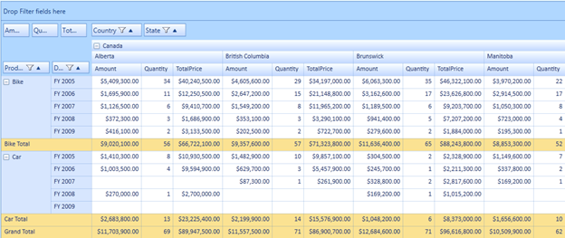
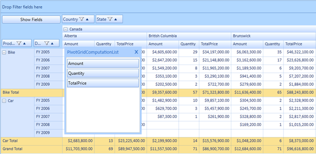

::: {style="DISPLAY: none"}
{#d2h_url_template} {#d2h_package_url style="WIDTH: 0px; DISPLAY: none; HEIGHT: 0px"}
:::

::: {.d2h_secondary_topic style="PADDING-BOTTOM: 10pt; MARGIN: 0pt; PADDING-LEFT: 0pt; PADDING-RIGHT: 0pt; PADDING-TOP: 0pt"}
##### Enabling Resizing Pivot Grid {#enabling-resizing-pivot-grid style="tab-stops: 0pt"}

Users can enable or disable this feature by using the **AllowRowHeaderAreaAutoSizing***[]{style="FONT-FAMILY: Consolas; FONT-SIZE: 9.5pt"}*property. To show the **Computation** button (**Show Fields** button) and to restrict the row header items from being stretched when more items are added to the computation area, set this property to **false**. To hide the **Computation** button (**Show Fields** Button) and to allow the row header items to stretch when more items are added to the computation area, set this property to **true**. By default the property is set to **true**.

 

The following code illustrates how to restrict the items from stretching and how to show the **Computation List** window through **Computation** button click:

+---------------------------------------------------------------------------------------------------------------------------------------------------------------------------------------------------------------------------------+
| **[\[C#\]]{style="FONT-FAMILY: 'Courier New'"}**                                                                                                                                                                                |
|                                                                                                                                                                                                                                 |
| [this]{style="FONT-FAMILY: 'Courier New'; COLOR: blue"} [.pivotGrid1.AllowRowHeaderAreaAutoSizing =[ false]{style="COLOR: blue"};]{style="FONT-FAMILY: 'Courier New'"} []{style="FONT-FAMILY: 'Courier New'; FONT-SIZE: 9.5pt"} |
+---------------------------------------------------------------------------------------------------------------------------------------------------------------------------------------------------------------------------------+

 

+------------------------------------------------------------------------------------------------------------------------------------------------------------------------------------------------------------------------------+
| **[\[VB\]]{style="FONT-FAMILY: 'Courier New'"}**                                                                                                                                                                             |
|                                                                                                                                                                                                                              |
| [Me]{style="FONT-FAMILY: 'Courier New'; COLOR: blue"} [.pivotGrid1.AllowRowHeaderAreaAutoSizing = [False]{style="COLOR: blue"}]{style="FONT-FAMILY: 'Courier New'"} []{style="FONT-FAMILY: 'Courier New'; FONT-SIZE: 9.5pt"} |
+------------------------------------------------------------------------------------------------------------------------------------------------------------------------------------------------------------------------------+

 

{border="0"}

Figure 28: ComputationButton, ComputationList Shown, and RowHeader Item displayed with fixed size

 

The following code illustrates how to allow the items to stretch and how to hide the **Computation** button:

 

+--------------------------------------------------------------------------------------------------------------------------------------------------------------------------------------------------------------------------------+
| **[\[C#\]]{style="FONT-FAMILY: 'Courier New'"}**                                                                                                                                                                               |
|                                                                                                                                                                                                                                |
| [this]{style="FONT-FAMILY: 'Courier New'; COLOR: blue"} [.pivotGrid1.AllowRowHeaderAreaAutoSizing = [true]{style="COLOR: blue"};]{style="FONT-FAMILY: 'Courier New'"} []{style="FONT-FAMILY: 'Courier New'; FONT-SIZE: 9.5pt"} |
+--------------------------------------------------------------------------------------------------------------------------------------------------------------------------------------------------------------------------------+

 

+------------------------------------------------------------------------------------------------------------------------------------------------------------------------------------------------------------------------------------------------------+
| **[\[VB\]]{style="FONT-FAMILY: 'Courier New'"}**                                                                                                                                                                                                     |
|                                                                                                                                                                                                                                                      |
| [Me]{style="FONT-FAMILY: 'Courier New'; COLOR: blue"} [.pivotGrid1.AllowRowHeaderAreaAutoSizing = [True]{style="COLOR: blue"}]{style="FONT-FAMILY: 'Courier New'"} [ []{style="COLOR: blue"} ]{style="FONT-FAMILY: 'Courier New'; FONT-SIZE: 9.5pt"} |
+------------------------------------------------------------------------------------------------------------------------------------------------------------------------------------------------------------------------------------------------------+

 

{border="0"}

Figure 29: ComputationButton Hidden and RowHeader Item stretched

 

 

[]{#related-topics}
:::
