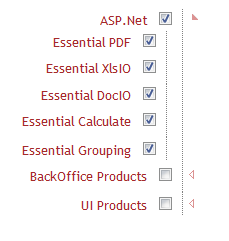

::: {style="DISPLAY: none"}
{#d2h_url_template}{#d2h_package_url style="WIDTH: 0px; DISPLAY: none; HEIGHT: 0px"}
:::

::: {.d2h_secondary_topic style="PADDING-BOTTOM: 10pt; MARGIN: 0pt; PADDING-LEFT: 0pt; PADDING-RIGHT: 0pt; PADDING-TOP: 0pt"}
##### Enabling RTL in TreeView {#enabling-rtl-in-treeview style="tab-stops: 0pt"}

The **RightToLeft** (RTL) property in the TreeView controlgives the possibility to render the control from right to left.

Properties

  --------------------------------------- ---------------------------------------------------------------------------------------------- ------------------------------------- ------------------------------
  **Property**                            **Description**                                                                                **Type**                              **Data Type**
  RightToLeft[]{style="COLOR: #c00000"}   [Enables or disables the RightToLeft feature in the TreeView control.]{style="COLOR: black"}   [Server side]{style="COLOR: black"}   [bool]{style="COLOR: black"}
  --------------------------------------- ---------------------------------------------------------------------------------------------- ------------------------------------- ------------------------------

 

Sample Link

[1.   Open the Essential Tools sample browser from the dashboard. (Refer to the ]{style="COLOR: black"}[[Samples and Location]{style="COLOR: black"}](http://help.syncfusion.com/ug_94/User%20Interface/ASP.NET%20MVC/Tools/Documents/sampleandlocation.htm)[ chapter)]{style="COLOR: black"}

[2.   ]{style="COLOR: #c00000"}[Navigate to **Tools.Mvc** \> **TreeView** \> **RightToLeft**]{style="COLOR: black"}[]{style="COLOR: #c00000"}

###### 5.28.3.11.1.1      Adding RTL to an Application {#adding-rtl-to-an-application style="TEXT-JUSTIFY: inter-ideograph; TEXT-ALIGN: justify; tab-stops: 0pt"}

RTL support can be added to the control in two ways:

[·      ]{style="FONT-FAMILY: Symbol"}TreeViewBuilder

[·      ]{style="FONT-FAMILY: Symbol"}TreeViewModel

 

Using Builder

The following steps are used for adding RTL feature to a TreeView control using the builder.

In the **view**, invoke the **TreeView** helper with the control ID as an argument followed by the   **RightToLeft** method as an argument[.]{style="FONT-FAMILY: 'Times New Roman','serif'; FONT-SIZE: 12pt"}

+--------------------------------------------------------------------------------------------------------------------------------------------------------------------------------------------------------------------------------------------------------------------------------------------------------------------------------------------------------------------------------------------------------+
| [ ]{style="FONT-FAMILY: 'Times New Roman','serif'; FONT-SIZE: 12pt"}**[\[ASPX\]]{style="FONT-FAMILY: 'Courier New'"}**                                                                                                                                                                                                                                                                                 |
|                                                                                                                                                                                                                                                                                                                                                                                                        |
| **[]{style="FONT-FAMILY: 'Courier New'"}**                                                                                                                                                                                                                                                                                                                                                             |
|                                                                                                                                                                                                                                                                                                                                                                                                        |
| [\<%]{style="FONT-FAMILY: Consolas; BACKGROUND: yellow; FONT-SIZE: 9.5pt"}[=]{style="FONT-FAMILY: Consolas; COLOR: blue; FONT-SIZE: 9.5pt"}[Html.Syncfusion().TreeView([\"myTreeView\"]{style="COLOR: #a31515"}, [\"treeviewContents\"]{style="COLOR: #a31515"}).RightToLeft([true]{style="COLOR: blue"}) .ShowCheckbox([true]{style="COLOR: blue"})]{style="FONT-FAMILY: Consolas; FONT-SIZE: 9.5pt"} |
|                                                                                                                                                                                                                                                                                                                                                                                                        |
| []{style="FONT-FAMILY: Consolas; FONT-SIZE: 9.5pt"}                                                                                                                                                                                                                                                                                                                                                    |
|                                                                                                                                                                                                                                                                                                                                                                                                        |
| [    [%\>]{style="BACKGROUND: yellow"}]{style="FONT-FAMILY: Consolas; FONT-SIZE: 9.5pt"}                                                                                                                                                                                                                                                                                                               |
|                                                                                                                                                                                                                                                                                                                                                                                                        |
| []{style="FONT-FAMILY: 'Courier New'"}                                                                                                                                                                                                                                                                                                                                                                 |
+--------------------------------------------------------------------------------------------------------------------------------------------------------------------------------------------------------------------------------------------------------------------------------------------------------------------------------------------------------------------------------------------------------+

 

+-------------------------------------------------------------------------------------------------------------------------------------------------------------------------------------------------------------------------------------------------------------------------------------------------------------------------------------+
| **[\[Razor\]]{style="FONT-FAMILY: 'Courier New'"}**                                                                                                                                                                                                                                                                                 |
|                                                                                                                                                                                                                                                                                                                                     |
| **[]{style="FONT-FAMILY: 'Courier New'"}**                                                                                                                                                                                                                                                                                          |
|                                                                                                                                                                                                                                                                                                                                     |
| [@]{style="FONT-FAMILY: Consolas; BACKGROUND: yellow; FONT-SIZE: 9.5pt"}[Html.Syncfusion().TreeView([\"myTreeView\"]{style="COLOR: #a31515"}, [\"treeviewContents\"]{style="COLOR: #a31515"}).RightToLeft([true]{style="COLOR: blue"}) .ShowCheckbox([true]{style="COLOR: blue"})]{style="FONT-FAMILY: Consolas; FONT-SIZE: 9.5pt"} |
|                                                                                                                                                                                                                                                                                                                                     |
| []{style="FONT-FAMILY: Consolas; FONT-SIZE: 9.5pt"}                                                                                                                                                                                                                                                                                 |
|                                                                                                                                                                                                                                                                                                                                     |
| **[]{style="FONT-FAMILY: 'Courier New'"}**                                                                                                                                                                                                                                                                                          |
|                                                                                                                                                                                                                                                                                                                                     |
| **[]{style="FONT-FAMILY: 'Courier New'"}**                                                                                                                                                                                                                                                                                          |
+-------------------------------------------------------------------------------------------------------------------------------------------------------------------------------------------------------------------------------------------------------------------------------------------------------------------------------------+

2.   Build and run the application.

Using Model

The following steps are used for adding the RTL feature to a TreeView control through the Model.

1.   Create an instance of **TreeViewModel** in the controller.[]{style="FONT-FAMILY: 'Times New Roman','serif'; FONT-SIZE: 12pt"}

+----------------------------------------------------------------------------------------------------------------------------------------------------------------------+
| **[Controller]{style="FONT-FAMILY: 'Courier New'"}**[]{style="FONT-FAMILY: 'Times New Roman','serif'"}                                                               |
|                                                                                                                                                                      |
| [public]{style="FONT-FAMILY: Consolas; COLOR: blue"}[ [ActionResult]{style="COLOR: #2b91af"} Index()]{style="FONT-FAMILY: Consolas"}                                 |
|                                                                                                                                                                      |
| [        {]{style="FONT-FAMILY: Consolas"}                                                                                                                           |
|                                                                                                                                                                      |
| [            [//create instance of TreeViewModel]{style="COLOR: green"}]{style="FONT-FAMILY: Consolas"}                                                              |
|                                                                                                                                                                      |
| [            [TreeViewModel]{style="COLOR: #2b91af"} myModel = [new]{style="COLOR: blue"} [TreeViewModel]{style="COLOR: #2b91af"}();]{style="FONT-FAMILY: Consolas"} |
|                                                                                                                                                                      |
| [            myModel.RightToLeft = true;]{style="FONT-FAMILY: Consolas"}                                                                                             |
|                                                                                                                                                                      |
| [            myModel]{style="FONT-FAMILY: Consolas"}[.ShowCheckbox = true;]{style="FONT-FAMILY: Consolas; FONT-SIZE: 9.5pt"}                                         |
|                                                                                                                                                                      |
| [            ViewData\[[\"myTreeView\"]{style="COLOR: #a31515"}\] = myModel;]{style="FONT-FAMILY: Consolas"}                                                         |
|                                                                                                                                                                      |
| [            [return]{style="COLOR: blue"} View();]{style="FONT-FAMILY: Consolas"}                                                                                   |
|                                                                                                                                                                      |
| [        }]{style="FONT-FAMILY: Consolas"}                                                                                                                           |
|                                                                                                                                                                      |
| []{style="FONT-FAMILY: 'Times New Roman','serif'; FONT-SIZE: 12pt"}                                                                                                  |
|                                                                                                                                                                      |
| []{style="FONT-FAMILY: 'Times New Roman','serif'; FONT-SIZE: 12pt"}                                                                                                  |
|                                                                                                                                                                      |
| []{style="FONT-FAMILY: 'Times New Roman','serif'; FONT-SIZE: 12pt"}                                                                                                  |
+----------------------------------------------------------------------------------------------------------------------------------------------------------------------+

[ ]{style="FONT-FAMILY: 'Times New Roman','serif'; FONT-SIZE: 12pt"}2.   In the **view**, invoke the **TreeView** helper with the **View Data Key** as the control ID.

+------------------------------------------------------------------------------------------------------------------------------------------------------------------------------------------------------------------------------------------------------------------+
| **[View \[ASPX\]]{style="FONT-FAMILY: 'Courier New'"}**[]{style="FONT-FAMILY: 'Times New Roman','serif'"}                                                                                                                                                        |
|                                                                                                                                                                                                                                                                  |
| []{style="FONT-FAMILY: Consolas"}                                                                                                                                                                                                                                |
|                                                                                                                                                                                                                                                                  |
| [\<%]{style="FONT-FAMILY: Consolas; BACKGROUND: yellow"}[=]{style="FONT-FAMILY: Consolas; COLOR: blue"}[Html.Syncfusion().TreeView([\"myTreeView\","treeviewContents"]{style="COLOR: #a31515"})[%\>]{style="BACKGROUND: yellow"}]{style="FONT-FAMILY: Consolas"} |
|                                                                                                                                                                                                                                                                  |
| []{style="FONT-FAMILY: 'Times New Roman','serif'; FONT-SIZE: 12pt"}                                                                                                                                                                                              |
+------------------------------------------------------------------------------------------------------------------------------------------------------------------------------------------------------------------------------------------------------------------+

[]{style="FONT-FAMILY: 'Times New Roman','serif'; FONT-SIZE: 12pt"} 

+------------------------------------------------------------------------------------------------------------------------------------------------------------------------------------------------------------------------------------------------------------------------------------------------------------------------------------------------------------------------------------------------------------------------------------------------------------+
| **[View \[cshtml\]]{style="FONT-FAMILY: 'Courier New'"}**[]{style="FONT-FAMILY: 'Times New Roman','serif'"}                                                                                                                                                                                                                                                                                                                                                |
|                                                                                                                                                                                                                                                                                                                                                                                                                                                            |
| [@]{style="FONT-FAMILY: Consolas; BACKGROUND: yellow; FONT-SIZE: 9.5pt"}[Html.Syncfusion().TreeView([\"myTreeView\"]{style="COLOR: #a31515"}, [\"treeviewContents\"]{style="COLOR: #a31515"}).RightToLeft([true]{style="COLOR: blue"}) .ShowCheckbox([true]{style="COLOR: blue"})]{style="FONT-FAMILY: Consolas; FONT-SIZE: 9.5pt"}[ ]{style="FONT-FAMILY: 'Times New Roman','serif'; FONT-SIZE: 12pt"}[]{style="FONT-FAMILY: Consolas; FONT-SIZE: 9.5pt"} |
+------------------------------------------------------------------------------------------------------------------------------------------------------------------------------------------------------------------------------------------------------------------------------------------------------------------------------------------------------------------------------------------------------------------------------------------------------------+

 

3.   Build and run the application.

 The following screenshot illustrates the output.

 

{border="0"}{border="0"}

{border="0"}

            Figure 328: TreeView with RTL

 

[]{#related-topics}
:::
