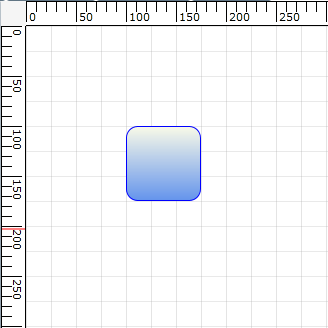

::: {style="DISPLAY: none"}
{#d2h_url_template}{#d2h_package_url style="WIDTH: 0px; DISPLAY: none; HEIGHT: 0px"}
:::

::: {.d2h_secondary_topic style="PADDING-BOTTOM: 10pt; MARGIN: 0pt; PADDING-LEFT: 0pt; PADDING-RIGHT: 0pt; PADDING-TOP: 0pt"}
#### Enabling Snap to Grid {#enabling-snap-to-grid style="tab-stops: 0pt"}

The Snap to Grid feature for nodes and connectors can be enabled by setting DiagramView's SnapToHorizontalGrid and SnapToVerticalGrid properties to "True", as shown in the following code snippets.

In the following code snippets, diagramView is an instance of DiagramView.

[]{style="FONT-FAMILY: 'Trebuchet MS','sans-serif'; COLOR: #15428b; FONT-SIZE: 9pt"} 

+-----------------------------------------------------------------------------------------------------------------------------------------------------------------------------------------------------------------------------------------------------------------------------------------------------------------------------------------------------------------------------------------------------------------------------------------------------------------------------------------------------------------------------------------------------------+
| **[\[XAML\]]{style="FONT-FAMILY: 'Courier New'; COLOR: black"}**                                                                                                                                                                                                                                                                                                                                                                                                                                                                                          |
|                                                                                                                                                                                                                                                                                                                                                                                                                                                                                                                                                           |
| [\<]{style="FONT-FAMILY: 'Courier New'; COLOR: blue"}[syncfusion]{style="FONT-FAMILY: 'Courier New'; COLOR: #a31515"}[:]{style="FONT-FAMILY: 'Courier New'; COLOR: blue"}[DiagramView]{style="FONT-FAMILY: 'Courier New'; COLOR: #a31515"}[ [ x]{style="COLOR: red"}[:]{style="COLOR: blue"}[Name]{style="COLOR: red"}[=\"diagramView\"]{style="COLOR: blue"}[ SnapToHorizontalGrid]{style="COLOR: red"}[=\"True\"]{style="COLOR: blue"}[ SnapToVerticalGrid]{style="COLOR: red"}[=\"True\" \>]{style="COLOR: blue"}]{style="FONT-FAMILY: 'Courier New'"} |
|                                                                                                                                                                                                                                                                                                                                                                                                                                                                                                                                                           |
| [\</]{style="FONT-FAMILY: 'Courier New'; COLOR: blue"}[syncfusion]{style="FONT-FAMILY: 'Courier New'; COLOR: #a31515"}[:]{style="FONT-FAMILY: 'Courier New'; COLOR: blue"}[DiagramView]{style="FONT-FAMILY: 'Courier New'; COLOR: #a31515"}[\>]{style="FONT-FAMILY: 'Courier New'; COLOR: blue"}[]{style="FONT-FAMILY: 'Courier New'"}                                                                                                                                                                                                                    |
+-----------------------------------------------------------------------------------------------------------------------------------------------------------------------------------------------------------------------------------------------------------------------------------------------------------------------------------------------------------------------------------------------------------------------------------------------------------------------------------------------------------------------------------------------------------+

[]{style="FONT-FAMILY: 'Trebuchet MS','sans-serif'; COLOR: #15428b; FONT-SIZE: 9pt"} 

[]{style="FONT-FAMILY: 'Trebuchet MS','sans-serif'; COLOR: #15428b; FONT-SIZE: 9pt"} 

+---------------------------------------------------------------------------------------------------------------------------------------------+
| **[\[C#\]]{style="FONT-FAMILY: 'Courier New'; COLOR: black"}**                                                                              |
|                                                                                                                                             |
| [// Enable snap to vertical grid.]{style="FONT-FAMILY: 'Courier New'; COLOR: green"}[]{style="FONT-FAMILY: 'Courier New'"}                  |
|                                                                                                                                             |
| [diagramView.SnapToVerticalGrid = [true]{style="COLOR: blue"};]{style="FONT-FAMILY: 'Courier New'"}                                         |
|                                                                                                                                             |
| [// Enable snap to horizontal grid.]{style="FONT-FAMILY: 'Courier New'; COLOR: green"}[]{style="FONT-FAMILY: 'Courier New'"}                |
|                                                                                                                                             |
| [diagramView.SnapToHorizontalGrid = [true]{style="COLOR: blue"};]{style="FONT-FAMILY: 'Courier New'"}[]{style="FONT-FAMILY: 'Courier New'"} |
+---------------------------------------------------------------------------------------------------------------------------------------------+

 

+--------------------------------------------------------------------------------------------------------------------------------------------+
| **[\[VB\]]{style="FONT-FAMILY: 'Courier New'; COLOR: black"}**                                                                             |
|                                                                                                                                            |
| [\'Enable snap to vertical grid.]{style="FONT-FAMILY: 'Courier New'; COLOR: green"}[]{style="FONT-FAMILY: 'Courier New'"}                  |
|                                                                                                                                            |
| [diagramView.SnapToVerticalGrid = [True]{style="COLOR: blue"}]{style="FONT-FAMILY: 'Courier New'"}                                         |
|                                                                                                                                            |
| [\'Enable snap to horizontal grid.]{style="FONT-FAMILY: 'Courier New'; COLOR: green"}[]{style="FONT-FAMILY: 'Courier New'"}                |
|                                                                                                                                            |
| [diagramView.SnapToHorizontalGrid = [True]{style="COLOR: blue"}]{style="FONT-FAMILY: 'Courier New'"}[]{style="FONT-FAMILY: 'Courier New'"} |
+--------------------------------------------------------------------------------------------------------------------------------------------+

 

{border="0"}

Figure 116: Snap to Grid Enabled

 

**[]{style="FONT-FAMILY: 'Trebuchet MS','sans-serif'; COLOR: #1f497d; FONT-SIZE: 14pt"}** 

**[Customizing Snap to Grid Offset Values]{style="FONT-FAMILY: 'Trebuchet MS','sans-serif'; COLOR: #1f497d; FONT-SIZE: 14pt"}**

By default, the SnapOffsetX and SnapOffsetY values are set to 25 pixels. However, these values can be changed so that objects will snap to the horizontal grid by using SnapOffsetX and snap to the vertical grid by using SnapOffsetY, as shown in the following code snippets.

In the following code snippets, diagramView is an instance of DiagramView.

[]{style="FONT-FAMILY: 'Trebuchet MS','sans-serif'; COLOR: #15428b; FONT-SIZE: 9pt"} 

+----------------------------------------------------------------------------------------------------------------------------------------------------------------------------------------------------------------------------------------------------------------------------------------------------------------------------------------------------------------------------------------------------------------------------------------------------------------------------------------------------------------------------------------+
| **[\[XAML\]]{style="FONT-FAMILY: 'Courier New'; COLOR: black"}**                                                                                                                                                                                                                                                                                                                                                                                                                                                                       |
|                                                                                                                                                                                                                                                                                                                                                                                                                                                                                                                                        |
| [\<]{style="FONT-FAMILY: 'Courier New'; COLOR: blue"}[syncfusion]{style="FONT-FAMILY: 'Courier New'; COLOR: #a31515"}[:]{style="FONT-FAMILY: 'Courier New'; COLOR: blue"}[DiagramView]{style="FONT-FAMILY: 'Courier New'; COLOR: #a31515"}[ [ x]{style="COLOR: red"}[:]{style="COLOR: blue"}[Name]{style="COLOR: red"}[=\"diagramView\"]{style="COLOR: blue"}[ SnapOffsetX ]{style="COLOR: red"}[=\"50\"]{style="COLOR: blue"}[ SnapOffsetY ]{style="COLOR: red"}[=\"50\"\>]{style="COLOR: blue"}]{style="FONT-FAMILY: 'Courier New'"} |
|                                                                                                                                                                                                                                                                                                                                                                                                                                                                                                                                        |
| [\</]{style="FONT-FAMILY: 'Courier New'; COLOR: blue"}[syncfusion]{style="FONT-FAMILY: 'Courier New'; COLOR: #a31515"}[:]{style="FONT-FAMILY: 'Courier New'; COLOR: blue"}[DiagramView]{style="FONT-FAMILY: 'Courier New'; COLOR: #a31515"}[\>]{style="FONT-FAMILY: 'Courier New'; COLOR: blue"}[]{style="FONT-FAMILY: 'Courier New'"}                                                                                                                                                                                                 |
+----------------------------------------------------------------------------------------------------------------------------------------------------------------------------------------------------------------------------------------------------------------------------------------------------------------------------------------------------------------------------------------------------------------------------------------------------------------------------------------------------------------------------------------+

[]{style="FONT-FAMILY: 'Trebuchet MS','sans-serif'; COLOR: #15428b; FONT-SIZE: 9pt"} 

+-----------------------------------------------------------------------------------------------------------+
| **[\[C#\]]{style="FONT-FAMILY: 'Courier New'; COLOR: black"}**                                            |
|                                                                                                           |
| [diagramView.SnapOffsetX = 50;]{style="FONT-FAMILY: 'Courier New'"}                                       |
|                                                                                                           |
| [diagramView.SnapOffsetY = 50;]{style="FONT-FAMILY: 'Courier New'"}[]{style="FONT-FAMILY: 'Courier New'"} |
+-----------------------------------------------------------------------------------------------------------+

[]{style="FONT-FAMILY: 'Courier New'"} 

+----------------------------------------------------------------------------------------------------------+
| **[\[VB\]]{style="FONT-FAMILY: 'Courier New'; COLOR: black"}**                                           |
|                                                                                                          |
| [diagramView.SnapOffsetX = 50]{style="FONT-FAMILY: 'Courier New'"}                                       |
|                                                                                                          |
| [diagramView.SnapOffsetY = 50]{style="FONT-FAMILY: 'Courier New'"}[]{style="FONT-FAMILY: 'Courier New'"} |
+----------------------------------------------------------------------------------------------------------+

 

Note:

SnapToGrid will snap objects based on the offset values specified in DiagramView's SnapOffsetX and SnapOffsetY values and it works independently from grid lines. However, to snap objects along with the grid lines, specify the same offset values for grid lines and snap offset.

 

Also, snapping of objects will occur only when the objects are dragged during runtime. Even after snapping is enabled, users can specify their own offset values in code behind.

Properties

The properties of the Snap to Grid feature are described in the following tabulation:

Table 6: Properties Table

+----------------------+----------------------------------------------+---------------------+------------------+-----------------+
| Property             | Description                                  | Type                | Data Type        | Reference links |
+----------------------+----------------------------------------------+---------------------+------------------+-----------------+
| SnapOffsetX          | Snaps to the horizontal offset value.        | Dependency property | double           | Not applicable  |
+----------------------+----------------------------------------------+---------------------+------------------+-----------------+
| SnapOffsetY          | Snaps to the vertical offset value.          | Dependency property | double           | Not applicable  |
+----------------------+----------------------------------------------+---------------------+------------------+-----------------+
| SnapToHorizontalGrid | Enables or disables snap to horizontal grid. | Dependency property | bool, true/false |  Not applicable |
|                      |                                              |                     |                  |                 |
|                      |                                              |                     |                  |                 |
+----------------------+----------------------------------------------+---------------------+------------------+-----------------+
| SnapToVerticalGrid   | Enables or disables snap to vertical grid.   | Dependency property | bool, true/false |  Not applicable |
|                      |                                              |                     |                  |                 |
|                      |                                              |                     |                  |                 |
+======================+==============================================+=====================+==================+=================+

[]{style="FONT-FAMILY: 'Calibri','sans-serif'; COLOR: black"} 

Sample Link

To view a sample:

1.   Open the Diagram Sample Browser from the dashboard. (Refer to the [Samples and Location]{style="FONT-FAMILY: 'Trebuchet MS','sans-serif'; COLOR: #1f497d; FONT-SIZE: 9pt"} chapter.)

2.   Navigate to Editable Diagram -\> SnapToGrid Demo.

[]{style="FONT-FAMILY: 'Trebuchet MS','sans-serif'; COLOR: #1f497d; FONT-SIZE: 9pt"} 

[]{#related-topics}
:::
