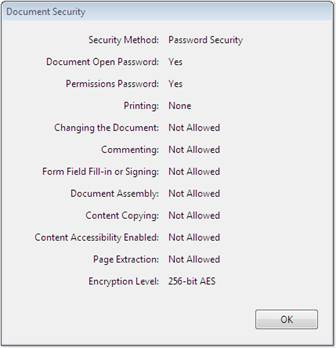
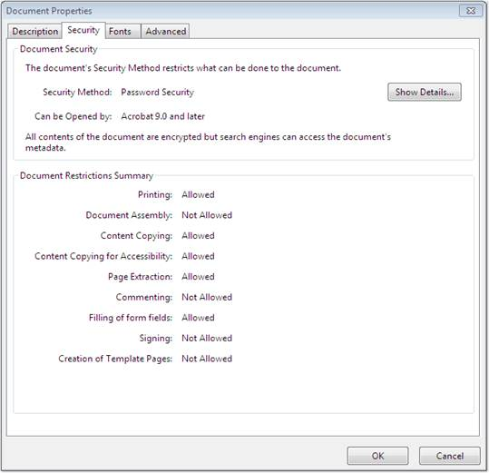

::: {style="DISPLAY: none"}
{#d2h_url_template}{#d2h_package_url style="WIDTH: 0px; DISPLAY: none; HEIGHT: 0px"}
:::

::: {.d2h_secondary_topic style="PADDING-BOTTOM: 10pt; MARGIN: 0pt; PADDING-LEFT: 0pt; PADDING-RIGHT: 0pt; PADDING-TOP: 0pt"}
#### Encryption {#encryption style="tab-stops: 0pt"}

 

The PDF document can be encrypted with 40, 128 and 256 bit key to protect its contents from unauthorized access. Document permissions are managed with owner and user passwords and access rights of the document.

 

{border="0"}

Figure 30: Encryption Level

 

**PdfSecurity**

 

PdfSecurity is a class that enables to manage security properties.

 

**Owner Password**

 

Opening the document with the correct owner password (assuming it is not the same as the user password), allows full access to the document. This unlimited access includes the ability to change the document\'s passwords and access permissions.

 

**User Password**

 

Opening the document with the correct user password (or opening a document that does not have a user password), allows additional operations to be performed according to the user access permissions, specified in the document\'s permissions.

 

Permissions

 

Essential PDF provides support to set restricted document operations on the generated PDF document. This ensures that the end-user is granted restricted permission to interact with the generated PDF document. This includes:

 

[·      ]{style="FONT-FAMILY: Symbol"}Modifying the document\'s contents.

[·      ]{style="FONT-FAMILY: Symbol"}Copying or otherwise extracting text and graphics from the document, including extraction for accessibility purposes.

[·      ]{style="FONT-FAMILY: Symbol"}Adding or modifying text annotations and interactive form fields.

[·      ]{style="FONT-FAMILY: Symbol"}Printing the document.

[]{style="FONT-FAMILY: 'Trebuchet MS','sans-serif'; COLOR: #15428b; FONT-SIZE: 9pt"} 

{border="0"}

Figure 31: Restricted Access

 

[]{#related-topics}
:::
