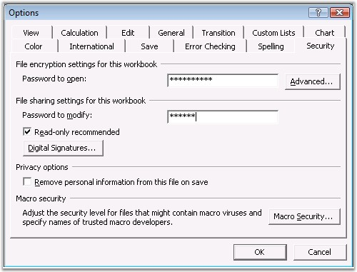
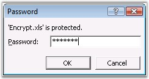
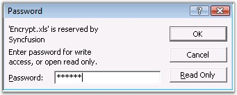
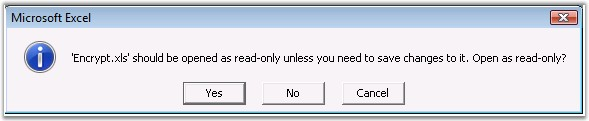
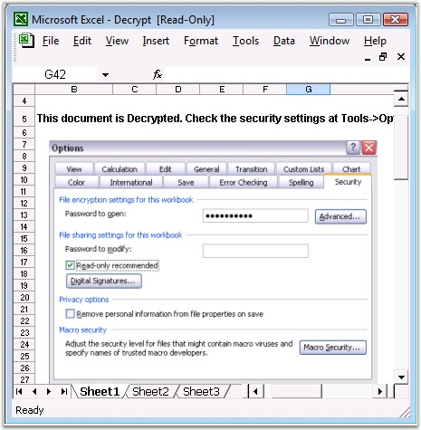

::: {style="DISPLAY: none"}
{#d2h_url_template}{#d2h_package_url style="WIDTH: 0px; DISPLAY: none; HEIGHT: 0px"}
:::

::::: {#nsbanner .d2h_main_nsbanner style="BORDER-BOTTOM: #999999 1px solid; POSITION: relative; PADDING-BOTTOM: 0px; BACKGROUND-COLOR: transparent; PADDING-LEFT: 0px; PADDING-RIGHT: 0px; DISPLAY: none; BORDER-TOP: #999999 1px solid; PADDING-TOP: 0px; LEFT: 0px"}
:::: {#TitleRow .d2h_main_titlerow style="PADDING-BOTTOM: 4px; BACKGROUND-COLOR: transparent; PADDING-LEFT: 22px; WIDTH: 100%; PADDING-RIGHT: 10px; DISPLAY: none; PADDING-TOP: 4px"}
::: {#ienav .d2h_main_ienav style="DISPLAY: none"}
{#D2HPrevious .D2HPreviousEnabled}  {#D2HNext .D2HNextEnabled}
:::
::::
:::::

:::::: {#nstext .d2h_main_nstext style="PADDING-BOTTOM: 10px; BACKGROUND-COLOR: transparent; PADDING-LEFT: 22px; PADDING-RIGHT: 10px; HEIGHT: 100%; OVERFLOW: auto; PADDING-TOP: 5px" hasuserbackground="true" valign="bottom"}
::: {#d2h_breadcrumbs .d2h_breadcrumbs}
[Essential Studio User Guide Documentation](ms-xhelp:///?Id=12457748-09e3-4d74-a240-8e049cedf030){.d2h_breadcrumbsNormal}[ \> ]{.d2h_breadcrumbsLinkSeparator}[Reporting Edition](ms-xhelp:///?Id=027aa5b6-6676-4f93-ad23-c20e8c45792e){.d2h_breadcrumbsNormal}[ \> ]{.d2h_breadcrumbsLinkSeparator}[Essential XlsIO](ms-xhelp:///?Id=b01a1b50-1d7d-40c0-bc83-af67e57c9005){.d2h_breadcrumbsNormal}[ \> ]{.d2h_breadcrumbsLinkSeparator}[Concepts and Features](ms-xhelp:///?Id=21b26556-5905-4ad9-90b4-40320db25faf){.d2h_breadcrumbsNormal}[ \> ]{.d2h_breadcrumbsLinkSeparator}[Prepare](ms-xhelp:///?Id=4e8e7026-9449-4e3b-907a-f10090d1e212){.d2h_breadcrumbsNormal}
:::

### Encryption and Decryption {#encryption-and-decryption style="tab-stops: 0pt"}

 

This section illustrates encryption and decryption in XlsIO.

 

Encryption

 

Encryption is a method for protecting the workbook data, based on a password, which converts it into the form that cannot be understood, and restricts anonymous users from accessing the data in the document.

 

A password for encrypting the workbook can be set in MS Excel through the **Security** tab of the **Options** dialog box (Tools menu, Options command).

 

{border="0"}

Figure 154: Options Dialog Box - Security

[]{style="FONT-FAMILY: 'Trebuchet MS','sans-serif'; COLOR: #15428b; FONT-SIZE: 9pt"} 

There are two separate passwords that the users must type to encrypt the document.

 

1.   **Password To Open-**This password is encrypted to help protect your data from unauthorized access.

[]{style="FONT-FAMILY: 'Trebuchet MS','sans-serif'; COLOR: #15428b; FONT-SIZE: 9pt"} 

{border="0"}

Figure 155: Entering Password to Open[]{style="FONT-FAMILY: 'Trebuchet MS','sans-serif'; COLOR: #15428b"}

[]{style="FONT-FAMILY: 'Trebuchet MS','sans-serif'; COLOR: #15428b; FONT-SIZE: 9pt"} 

[]{style="FONT-FAMILY: 'Trebuchet MS','sans-serif'; COLOR: #15428b; FONT-SIZE: 9pt"} 

2.   **Password To Modify-**This password is not encrypted, and is only meant to give specific users permission to edit workbook data and save changes to the file.

[]{style="FONT-FAMILY: 'Trebuchet MS','sans-serif'; COLOR: #15428b; FONT-SIZE: 9pt"} 

{border="0"}

Figure 156: Entering Password to Modify[]{style="FONT-FAMILY: 'Trebuchet MS','sans-serif'; COLOR: #15428b"}

[]{style="FONT-FAMILY: 'Trebuchet MS','sans-serif'; COLOR: #15428b; FONT-SIZE: 9pt"} 

::: {style="BORDER-BOTTOM: windowtext 1pt solid; BORDER-LEFT: medium none; PADDING-BOTTOM: 1pt; MARGIN-TOP: 9pt; PADDING-LEFT: 0pt; PADDING-RIGHT: 0pt; MARGIN-BOTTOM: 9pt; BORDER-TOP: windowtext 1pt solid; BORDER-RIGHT: medium none; PADDING-TOP: 1pt"}
{border="0"}Note: Password protection of a workbook file is different from the workbook structure and window protection that you can set in the Protect Workbook dialog box.
:::

[]{style="FONT-FAMILY: 'Trebuchet MS','sans-serif'; COLOR: #15428b; FONT-SIZE: 9pt"} 

**Read-Only Recommended -** This option will prompt read-only recommendation, when users open the file, and remind them that the data is important and should not be changed. This can be set with or without requiring a password to open the file.

[]{style="FONT-FAMILY: 'Trebuchet MS','sans-serif'; COLOR: #15428b; FONT-SIZE: 9pt"} 

{border="0"}

Figure 157: Prompting for Read-Only[]{style="FONT-FAMILY: 'Trebuchet MS','sans-serif'; COLOR: #15428b"}

[]{style="FONT-FAMILY: 'Trebuchet MS','sans-serif'; COLOR: #15428b; FONT-SIZE: 9pt"} 

[]{style="FONT-FAMILY: 'Trebuchet MS','sans-serif'; COLOR: #15428b; FONT-SIZE: 9pt"} 

XlsIO allows to set encryption with all the above options through the **IWorkbook** interface. You can set the password for encryption through the **PasswordToOpen** property.

 

Following code example illustrates how to encrypt an Excel workbook with password to open, modify, and set the read-only option.

[]{style="FONT-FAMILY: 'Trebuchet MS','sans-serif'; COLOR: #15428b; FONT-SIZE: 9pt"} 

+--------------------------------------------------------------------------------------------------------------------------------------------------------------------------------------------------------------------------------------------------------------------------------------------------------------+
| **[\[C#\]]{style="FONT-FAMILY: 'Courier New'"}**                                                                                                                                                                                                                                                             |
|                                                                                                                                                                                                                                                                                                              |
| []{style="FONT-FAMILY: 'Courier New'"}                                                                                                                                                                                                                                                                       |
|                                                                                                                                                                                                                                                                                                              |
| [// Encryption:]{style="FONT-FAMILY: 'Courier New'; COLOR: green"}                                                                                                                                                                                                                                           |
|                                                                                                                                                                                                                                                                                                              |
| [// Encrypt the workbook with password.]{style="FONT-FAMILY: 'Courier New'; COLOR: green"}                                                                                                                                                                                                                   |
|                                                                                                                                                                                                                                                                                                              |
| [workbook.PasswordToOpen = [\"syncfusion\"]{style="COLOR: maroon"};]{style="FONT-FAMILY: 'Courier New'"}                                                                                                                                                                                                     |
|                                                                                                                                                                                                                                                                                                              |
| []{style="FONT-FAMILY: 'Courier New'"}                                                                                                                                                                                                                                                                       |
|                                                                                                                                                                                                                                                                                                              |
| [// Set the password to modify the workbook.]{style="FONT-FAMILY: 'Courier New'; COLOR: green"}                                                                                                                                                                                                              |
|                                                                                                                                                                                                                                                                                                              |
| [workbook.SetWriteProtectionPassword([\"modify\"]{style="COLOR: maroon"});]{style="FONT-FAMILY: 'Courier New'"}                                                                                                                                                                                              |
|                                                                                                                                                                                                                                                                                                              |
| []{style="FONT-FAMILY: 'Courier New'"}                                                                                                                                                                                                                                                                       |
|                                                                                                                                                                                                                                                                                                              |
| [// Set the workbook as read-only.]{style="FONT-FAMILY: 'Courier New'; COLOR: green"}                                                                                                                                                                                                                        |
|                                                                                                                                                                                                                                                                                                              |
| [workbook.ReadOnlyRecommended = [true]{style="COLOR: blue"};]{style="FONT-FAMILY: 'Courier New'"}                                                                                                                                                                                                            |
|                                                                                                                                                                                                                                                                                                              |
| []{style="FONT-FAMILY: 'Courier New'"}                                                                                                                                                                                                                                                                       |
|                                                                                                                                                                                                                                                                                                              |
| [// Decryption:]{style="FONT-FAMILY: 'Courier New'; COLOR: green"}                                                                                                                                                                                                                                           |
|                                                                                                                                                                                                                                                                                                              |
| [// Opening the encrypted workbook.]{style="FONT-FAMILY: 'Courier New'; COLOR: green"}                                                                                                                                                                                                                       |
|                                                                                                                                                                                                                                                                                                              |
| [IWorkbook]{style="FONT-FAMILY: 'Courier New'; COLOR: teal"}[ workbook = application.Workbooks.Open([\"FileName.xls\"]{style="COLOR: maroon"}, [ExcelParseOptions]{style="COLOR: teal"}.Default, [true]{style="COLOR: blue"}, [\"syncfusion\"]{style="COLOR: maroon"});]{style="FONT-FAMILY: 'Courier New'"} |
+--------------------------------------------------------------------------------------------------------------------------------------------------------------------------------------------------------------------------------------------------------------------------------------------------------------+

[]{style="FONT-FAMILY: 'Trebuchet MS','sans-serif'; COLOR: #15428b; FONT-SIZE: 9pt"} 

+-------------------------------------------------------------------------------------------------------------------------------------------------------------------------------------------------------------------------------------------------------------------------------------------------------------------------------------+
| **[\[VB.NET\]]{style="FONT-FAMILY: 'Courier New'"}**                                                                                                                                                                                                                                                                                |
|                                                                                                                                                                                                                                                                                                                                     |
| []{style="FONT-FAMILY: 'Courier New'"}                                                                                                                                                                                                                                                                                              |
|                                                                                                                                                                                                                                                                                                                                     |
| [\' Encryption:]{style="FONT-FAMILY: 'Courier New'; COLOR: green"}                                                                                                                                                                                                                                                                  |
|                                                                                                                                                                                                                                                                                                                                     |
| [\' Encrypt the workbook with password.]{style="FONT-FAMILY: 'Courier New'; COLOR: green"}                                                                                                                                                                                                                                          |
|                                                                                                                                                                                                                                                                                                                                     |
| [workbook.PasswordToOpen = [\"syncfusion\"]{style="COLOR: maroon"}]{style="FONT-FAMILY: 'Courier New'"}                                                                                                                                                                                                                             |
|                                                                                                                                                                                                                                                                                                                                     |
| []{style="FONT-FAMILY: 'Courier New'; COLOR: maroon"}                                                                                                                                                                                                                                                                               |
|                                                                                                                                                                                                                                                                                                                                     |
| [\' Set the password to modify the workbook.]{style="FONT-FAMILY: 'Courier New'; COLOR: green"}                                                                                                                                                                                                                                     |
|                                                                                                                                                                                                                                                                                                                                     |
| [workbook.SetWriteProtectionPassword([\"modify\"]{style="COLOR: maroon"})]{style="FONT-FAMILY: 'Courier New'"}                                                                                                                                                                                                                      |
|                                                                                                                                                                                                                                                                                                                                     |
| []{style="FONT-FAMILY: 'Courier New'"}                                                                                                                                                                                                                                                                                              |
|                                                                                                                                                                                                                                                                                                                                     |
| [\' Set the workbook as read-only.]{style="FONT-FAMILY: 'Courier New'; COLOR: green"}                                                                                                                                                                                                                                               |
|                                                                                                                                                                                                                                                                                                                                     |
| [workbook.ReadOnlyRecommended= [true]{style="COLOR: blue"}]{style="FONT-FAMILY: 'Courier New'"}                                                                                                                                                                                                                                     |
|                                                                                                                                                                                                                                                                                                                                     |
| []{style="FONT-FAMILY: 'Courier New'; COLOR: blue"}                                                                                                                                                                                                                                                                                 |
|                                                                                                                                                                                                                                                                                                                                     |
| [\' Decryption:]{style="FONT-FAMILY: 'Courier New'; COLOR: green"}                                                                                                                                                                                                                                                                  |
|                                                                                                                                                                                                                                                                                                                                     |
| [\' Opening the encrypted workbook.]{style="FONT-FAMILY: 'Courier New'; COLOR: green"}                                                                                                                                                                                                                                              |
|                                                                                                                                                                                                                                                                                                                                     |
| [Dim]{style="FONT-FAMILY: 'Courier New'; COLOR: blue"}[ workbook [As]{style="COLOR: blue"} Syncfusion.XlsIO.IWorkbook = Application.Workbooks.Open([\"FileName.xls\"]{style="COLOR: maroon"}, ExcelParseOptions.Default, [True]{style="COLOR: blue"}, [\"syncfusion\"]{style="COLOR: maroon"})]{style="FONT-FAMILY: 'Courier New'"} |
+-------------------------------------------------------------------------------------------------------------------------------------------------------------------------------------------------------------------------------------------------------------------------------------------------------------------------------------+

[]{style="FONT-FAMILY: 'Trebuchet MS','sans-serif'; COLOR: #15428b; FONT-SIZE: 9pt"} 

::: {style="BORDER-BOTTOM: windowtext 1pt solid; BORDER-LEFT: medium none; PADDING-BOTTOM: 1pt; MARGIN-TOP: 9pt; PADDING-LEFT: 0pt; PADDING-RIGHT: 0pt; MARGIN-BOTTOM: 9pt; BORDER-TOP: windowtext 1pt solid; BORDER-RIGHT: medium none; PADDING-TOP: 1pt"}
{border="0"}Note: Essential XlsIO supports default encryption of the type \"Office97-2000 compatible\", and does not support weak and strong encryption types.
:::

[]{style="FONT-FAMILY: 'Trebuchet MS','sans-serif'; COLOR: #15428b; FONT-SIZE: 9pt"} 

Decryption

[]{style="FONT-FAMILY: 'Trebuchet MS','sans-serif'; COLOR: #15428b; FONT-SIZE: 9pt"} 

Decryption is the process of converting encrypted data back into its original form, so that the data can be read from the workbook. You can decrypt the workbook with the encrypted password. Note that XlsIO cannot open workbooks without knowing the password.

[]{style="FONT-FAMILY: 'Trebuchet MS','sans-serif'; COLOR: #15428b; FONT-SIZE: 9pt"} 

+---------------------------------------------------------------------------------------------------------------------------------------------------------------------------------------------------------------------------------------------------------------------------------------------------------------------------------------------------------------------------+
| **[\[C#\]]{style="FONT-FAMILY: 'Courier New'"}**                                                                                                                                                                                                                                                                                                                          |
|                                                                                                                                                                                                                                                                                                                                                                           |
| []{style="FONT-FAMILY: 'Courier New'"}                                                                                                                                                                                                                                                                                                                                    |
|                                                                                                                                                                                                                                                                                                                                                                           |
| [// Decryption:]{style="FONT-FAMILY: 'Courier New'; COLOR: green"}                                                                                                                                                                                                                                                                                                        |
|                                                                                                                                                                                                                                                                                                                                                                           |
| [// Opening the encrypted workbook.]{style="FONT-FAMILY: 'Courier New'; COLOR: green"}                                                                                                                                                                                                                                                                                    |
|                                                                                                                                                                                                                                                                                                                                                                           |
| [IWorkbook]{style="FONT-FAMILY: 'Courier New'; COLOR: teal"}[ workbook = application.Workbooks.Open([\"FileName.xls\"]{style="COLOR: maroon"}, [ExcelParseOptions]{style="COLOR: teal"}.Default, [true]{style="COLOR: blue"}, [\"password\"]{style="COLOR: maroon"});   ]{style="FONT-FAMILY: 'Courier New'"}[      ]{style="FONT-FAMILY: 'Courier New'; COLOR: #15428b"} |
+---------------------------------------------------------------------------------------------------------------------------------------------------------------------------------------------------------------------------------------------------------------------------------------------------------------------------------------------------------------------------+

[]{style="FONT-FAMILY: 'Trebuchet MS','sans-serif'; COLOR: #15428b; FONT-SIZE: 9pt"} 

+-----------------------------------------------------------------------------------------------------------------------------------------------------------------------------------------------------------------------------------------------------------------------------------------------------------------------------------+
| **[\[VB.NET\]]{style="FONT-FAMILY: 'Courier New'"}**                                                                                                                                                                                                                                                                              |
|                                                                                                                                                                                                                                                                                                                                   |
| []{style="FONT-FAMILY: 'Courier New'"}                                                                                                                                                                                                                                                                                            |
|                                                                                                                                                                                                                                                                                                                                   |
| [\' Decryption:]{style="FONT-FAMILY: 'Courier New'; COLOR: green"}                                                                                                                                                                                                                                                                |
|                                                                                                                                                                                                                                                                                                                                   |
| [\' Opening the encrypted workbook.]{style="FONT-FAMILY: 'Courier New'; COLOR: green"}                                                                                                                                                                                                                                            |
|                                                                                                                                                                                                                                                                                                                                   |
| [Dim]{style="FONT-FAMILY: 'Courier New'; COLOR: blue"}[ workbook [As]{style="COLOR: blue"} Syncfusion.XlsIO.IWorkbook = Application.Workbooks.Open([\"FileName.xls\"]{style="COLOR: maroon"}, ExcelParseOptions.Default, [True]{style="COLOR: blue"}, [\"password\"]{style="COLOR: maroon"})]{style="FONT-FAMILY: 'Courier New'"} |
+-----------------------------------------------------------------------------------------------------------------------------------------------------------------------------------------------------------------------------------------------------------------------------------------------------------------------------------+

[]{style="FONT-FAMILY: 'Trebuchet MS','sans-serif'; COLOR: #15428b; FONT-SIZE: 9pt"} 

{border="0"}

Figure 158: Decrypting the Document[]{style="FONT-FAMILY: 'Trebuchet MS','sans-serif'; COLOR: #15428b"}

**[]{style="FONT-FAMILY: 'Trebuchet MS','sans-serif'; COLOR: #15428b; FONT-SIZE: 9pt"}** 

More:

[ ]{#related-topics}

[{border="0" align="absMiddle"}Encryption and Decryption for Excel 2010](ms-xhelp:///?Id=a0d360e6-6790-423c-95d3-939f66832989){style="TEXT-DECORATION: none"}
::::::
