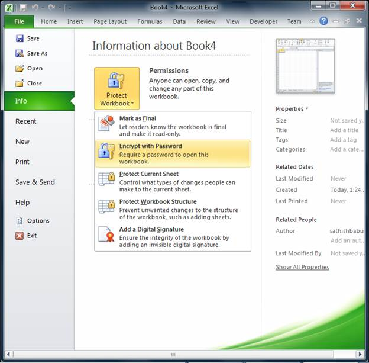
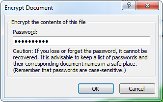

::: {style="DISPLAY: none"}
{#d2h_url_template}{#d2h_package_url style="WIDTH: 0px; DISPLAY: none; HEIGHT: 0px"}
:::

::::: {.d2h_secondary_topic style="PADDING-BOTTOM: 10pt; MARGIN: 0pt; PADDING-LEFT: 0pt; PADDING-RIGHT: 0pt; PADDING-TOP: 0pt"}
#### Encryption and Decryption for Excel 2010 {#encryption-and-decryption-for-excel-2010 style="tab-stops: 0pt"}

Now, support is provided for parsing and serializing the encrypted files in Excel 2010, with passwords. The type of encryption used in Excel 2010 is Agile encryption and MS Excel 2007 with SP2, can open MS Excel 2010 encrypted files.

::: {style="BORDER-BOTTOM: windowtext 1pt solid; BORDER-LEFT: medium none; PADDING-BOTTOM: 1pt; MARGIN-TOP: 9pt; PADDING-LEFT: 0pt; PADDING-RIGHT: 0pt; MARGIN-BOTTOM: 9pt; BORDER-TOP: windowtext 1pt solid; BORDER-RIGHT: medium none; PADDING-TOP: 1pt"}
 

{border="0"}Note: There will be no change in API, as Excel 2007 encrypted files are already supported.
:::

{border="0"}

 

Figure 159: Encrypting a file in MS Excel 2010

 

{border="0"}

Figure 160: Encrypting a file with password in MS Excel 2010

::: {style="BORDER-BOTTOM: windowtext 1pt solid; BORDER-LEFT: medium none; PADDING-BOTTOM: 1pt; MARGIN-TOP: 9pt; PADDING-LEFT: 0pt; PADDING-RIGHT: 0pt; MARGIN-BOTTOM: 9pt; BORDER-TOP: windowtext 1pt solid; BORDER-RIGHT: medium none; PADDING-TOP: 1pt"}
 
:::

[]{#related-topics}
:::::
