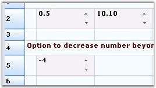

::: {style="DISPLAY: none"}
{#d2h_url_template}{#d2h_package_url style="WIDTH: 0px; DISPLAY: none; HEIGHT: 0px"}
:::

:::: {.d2h_secondary_topic style="PADDING-BOTTOM: 10pt; MARGIN: 0pt; PADDING-LEFT: 0pt; PADDING-RIGHT: 0pt; PADDING-TOP: 0pt"}
##### Enhanced Numeric Up Down {#enhanced-numeric-up-down style="tab-stops: 0pt"}

[]{style="FONT-FAMILY: 'Trebuchet MS','sans-serif'; COLOR: #15428b; FONT-SIZE: 9pt"} 

The Numeric Up Down cell type has been enhanced to provide more styles and properties that can be added to the numeric up down control by using the **FloatNumericUpDownStyleProperties** class. It enables you to set the limitations of the numeric values and several other properties.

[]{style="FONT-FAMILY: 'Trebuchet MS','sans-serif'; COLOR: #15428b; FONT-SIZE: 9pt"} 

::: {align="center"}
  -------------------------------------- --------------------------------------------------------------------
  Float Numeric Up Down Style Property   Description
  BackColor                              Specifies the back color of the container.
  Maximum                                Indicates the maximum value that the cell can have.
  StartValue                             The starting value of the embedded cell.
  Step                                   The value that has to be incremented for each click of the button.
  WrapValue                              The bool value that will allow to wrap the text.
  DecimalPlaces                          The decimal values after the decimal point.
  Orientation                            Orientation of the cell container on NumericUpDown.
  InterceptArrowkeys                     Allows to change the value by using ARROW keys from keyboard.
  ThousandsSeparator                     The bool value which allows to separate the thousand basis.
  -------------------------------------- --------------------------------------------------------------------
:::

[]{style="FONT-FAMILY: 'Trebuchet MS','sans-serif'; COLOR: #15428b; FONT-SIZE: 9pt"} 

The following code examples illustrate how to set the cell type to FNumericUpDown.

[]{style="FONT-FAMILY: 'Trebuchet MS','sans-serif'; COLOR: #15428b; FONT-SIZE: 9pt"} 

1.   Using C#

[]{style="FONT-FAMILY: 'Trebuchet MS','sans-serif'; COLOR: #15428b; FONT-SIZE: 9pt"} 

+-----------------------------------------------------------------------------------------------------------------------------------------------------------------------------------------------------------------------------------+
| **[\[C#\]]{style="FONT-FAMILY: 'Courier New'; COLOR: black"}**                                                                                                                                                                    |
|                                                                                                                                                                                                                                   |
| []{style="FONT-FAMILY: 'Courier New'; COLOR: black"}                                                                                                                                                                              |
|                                                                                                                                                                                                                                   |
| [RegisterCellModel]{style="FONT-FAMILY: 'Courier New'; COLOR: #2b91af"}[.GridCellType([this]{style="COLOR: blue"}.gridControl1, [CustomCellTypes]{style="COLOR: #2b91af"}.FNumericUpDown);]{style="FONT-FAMILY: 'Courier New'"}   |
|                                                                                                                                                                                                                                   |
| [GridStyleInfo]{style="FONT-FAMILY: 'Courier New'; COLOR: #2b91af"}[ style = [this]{style="COLOR: blue"}.gridControl1\[1, 1\];]{style="FONT-FAMILY: 'Courier New'"}                                                               |
|                                                                                                                                                                                                                                   |
| [style.Text = [\"Allow Decimal Increment and Decrement(step by 0.2,0.01,0.001)\"]{style="COLOR: #a31515"};]{style="FONT-FAMILY: 'Courier New'"}                                                                                   |
|                                                                                                                                                                                                                                   |
| [style.TextColor = [Color]{style="COLOR: #2b91af"}.MidnightBlue;]{style="FONT-FAMILY: 'Courier New'"}                                                                                                                             |
|                                                                                                                                                                                                                                   |
| []{style="FONT-FAMILY: 'Courier New'"}                                                                                                                                                                                            |
|                                                                                                                                                                                                                                   |
| [// Set up FNumericUpDown Cell.]{style="FONT-FAMILY: 'Courier New'; COLOR: green"}                                                                                                                                                |
|                                                                                                                                                                                                                                   |
| [style = gridControl1\[2, 2\];]{style="FONT-FAMILY: 'Courier New'"}                                                                                                                                                               |
|                                                                                                                                                                                                                                   |
| [style.CellType = [CustomCellTypes]{style="COLOR: #2b91af"}.FNumericUpDown.ToString();]{style="FONT-FAMILY: 'Courier New'"}                                                                                                       |
|                                                                                                                                                                                                                                   |
| [style.Text = [\"0.5\"]{style="COLOR: #a31515"};]{style="FONT-FAMILY: 'Courier New'"}                                                                                                                                             |
|                                                                                                                                                                                                                                   |
| []{style="FONT-FAMILY: 'Courier New'"}                                                                                                                                                                                            |
|                                                                                                                                                                                                                                   |
| [// Assign the Style Properties of Up Down Control.]{style="FONT-FAMILY: 'Courier New'; COLOR: green"}                                                                                                                            |
|                                                                                                                                                                                                                                   |
| [FloatNumericUpDownStyleProperties]{style="FONT-FAMILY: 'Courier New'; COLOR: #2b91af"}[ sp = [new]{style="COLOR: blue"} [FloatNumericUpDownStyleProperties]{style="COLOR: #2b91af"}(style);]{style="FONT-FAMILY: 'Courier New'"} |
|                                                                                                                                                                                                                                   |
| [sp.StyleInfo.BackColor = [SystemColors]{style="COLOR: #2b91af"}.Window;]{style="FONT-FAMILY: 'Courier New'"}                                                                                                                     |
|                                                                                                                                                                                                                                   |
| [sp.FloatNumericUpDownProperties.Maximum = 15.0;]{style="FONT-FAMILY: 'Courier New'"}                                                                                                                                             |
|                                                                                                                                                                                                                                   |
| [sp.FloatNumericUpDownProperties.Minimum = 0.0;]{style="FONT-FAMILY: 'Courier New'"}                                                                                                                                              |
|                                                                                                                                                                                                                                   |
| [sp.FloatNumericUpDownProperties.StartValue = 0.5;]{style="FONT-FAMILY: 'Courier New'"}                                                                                                                                           |
|                                                                                                                                                                                                                                   |
| [sp.FloatNumericUpDownProperties.Step = 0.2;]{style="FONT-FAMILY: 'Courier New'"}                                                                                                                                                 |
|                                                                                                                                                                                                                                   |
| [sp.FloatNumericUpDownProperties.WrapValue = [true]{style="COLOR: blue"};]{style="FONT-FAMILY: 'Courier New'"}                                                                                                                    |
|                                                                                                                                                                                                                                   |
| [sp.FloatNumericUpDownProperties.DecimalPlaces = 1;]{style="FONT-FAMILY: 'Courier New'"}                                                                                                                                          |
+-----------------------------------------------------------------------------------------------------------------------------------------------------------------------------------------------------------------------------------+

[]{style="FONT-FAMILY: 'Trebuchet MS','sans-serif'; COLOR: #15428b; FONT-SIZE: 9pt"} 

2.   Using VB.NET

[]{style="FONT-FAMILY: 'Trebuchet MS','sans-serif'; COLOR: #15428b; FONT-SIZE: 9pt"} 

+-----------------------------------------------------------------------------------------------------------------------------------------------------------------------------------------------------------------------------------+
| **[\[VB.NET\]]{style="FONT-FAMILY: 'Courier New'; COLOR: black"}**                                                                                                                                                                |
|                                                                                                                                                                                                                                   |
| []{style="FONT-FAMILY: 'Courier New'; COLOR: black"}                                                                                                                                                                              |
|                                                                                                                                                                                                                                   |
| [RegisterCellModel.GridCellType(gridControl1, CustomCellTypes.FNumericUpDown)]{style="FONT-FAMILY: 'Courier New'"}                                                                                                                |
|                                                                                                                                                                                                                                   |
| [Dim]{style="FONT-FAMILY: 'Courier New'; COLOR: blue"}[ style [As]{style="COLOR: blue"} GridStyleInfo = [Me]{style="COLOR: blue"}.gridControl1(1, 1)]{style="FONT-FAMILY: 'Courier New'"}                                         |
|                                                                                                                                                                                                                                   |
| [style.Text = [\"Allow Decimal Increment and Decrement(step by 0.2,0.01,0.001)\"]{style="COLOR: #a31515"}]{style="FONT-FAMILY: 'Courier New'"}                                                                                    |
|                                                                                                                                                                                                                                   |
| [style.TextColor = Color.MidnightBlue]{style="FONT-FAMILY: 'Courier New'"}                                                                                                                                                        |
|                                                                                                                                                                                                                                   |
| []{style="FONT-FAMILY: 'Courier New'"}                                                                                                                                                                                            |
|                                                                                                                                                                                                                                   |
| [\' Set up FNumericUpDown Cell.]{style="FONT-FAMILY: 'Courier New'; COLOR: green"}                                                                                                                                                |
|                                                                                                                                                                                                                                   |
| [style = gridControl1(2, 2)]{style="FONT-FAMILY: 'Courier New'"}                                                                                                                                                                  |
|                                                                                                                                                                                                                                   |
| [style.CellType = CustomCellTypes.FNumericUpDown.ToString()]{style="FONT-FAMILY: 'Courier New'"}                                                                                                                                  |
|                                                                                                                                                                                                                                   |
| [style.Text = [\"0.5\"]{style="COLOR: #a31515"}]{style="FONT-FAMILY: 'Courier New'"}                                                                                                                                              |
|                                                                                                                                                                                                                                   |
| []{style="FONT-FAMILY: 'Courier New'; COLOR: #a31515"}                                                                                                                                                                            |
|                                                                                                                                                                                                                                   |
| [\' Assign the Style Properties of Up Down Control.]{style="FONT-FAMILY: 'Courier New'; COLOR: green"}                                                                                                                            |
|                                                                                                                                                                                                                                   |
| [Dim]{style="FONT-FAMILY: 'Courier New'; COLOR: blue"}[ sp [As]{style="COLOR: blue"} FloatNumericUpDownStyleProperties = [New]{style="COLOR: blue"} FloatNumericUpDownStyleProperties(style)]{style="FONT-FAMILY: 'Courier New'"} |
|                                                                                                                                                                                                                                   |
| [sp.StyleInfo.BackColor = SystemColors.Window]{style="FONT-FAMILY: 'Courier New'"}                                                                                                                                                |
|                                                                                                                                                                                                                                   |
| [sp.FloatNumericUpDownProperties.Maximum = 15.0]{style="FONT-FAMILY: 'Courier New'"}                                                                                                                                              |
|                                                                                                                                                                                                                                   |
| [sp.FloatNumericUpDownProperties.Minimum = 0.0]{style="FONT-FAMILY: 'Courier New'"}                                                                                                                                               |
|                                                                                                                                                                                                                                   |
| [sp.FloatNumericUpDownProperties.StartValue = 0.5]{style="FONT-FAMILY: 'Courier New'"}                                                                                                                                            |
|                                                                                                                                                                                                                                   |
| [sp.FloatNumericUpDownProperties.Step = 0.2]{style="FONT-FAMILY: 'Courier New'"}                                                                                                                                                  |
|                                                                                                                                                                                                                                   |
| [sp.FloatNumericUpDownProperties.WrapValue = [True]{style="COLOR: blue"}]{style="FONT-FAMILY: 'Courier New'"}                                                                                                                     |
|                                                                                                                                                                                                                                   |
| [sp.FloatNumericUpDownProperties.DecimalPlaces = 1]{style="FONT-FAMILY: 'Courier New'"}                                                                                                                                           |
+-----------------------------------------------------------------------------------------------------------------------------------------------------------------------------------------------------------------------------------+

[]{style="FONT-FAMILY: 'Trebuchet MS','sans-serif'; COLOR: #15428b; FONT-SIZE: 9pt"} 

{border="0"}

[]{style="FONT-FAMILY: 'Trebuchet MS','sans-serif'; COLOR: #15428b; FONT-SIZE: 9pt"} 

*[Figure ]{style="FONT-SIZE: 9pt"}[109]{style="FONT-SIZE: 9pt"}[: Enhanced Numeric Up Down Cells]{style="FONT-SIZE: 9pt"}*

 

[]{#p98} 

 

[]{#related-topics}
::::
