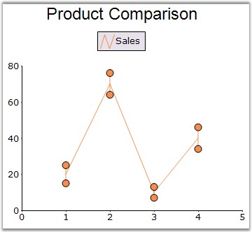

::: {style="DISPLAY: none"}
{#d2h_url_template}{#d2h_package_url style="WIDTH: 0px; DISPLAY: none; HEIGHT: 0px"}
:::

:::: {.d2h_secondary_topic style="PADDING-BOTTOM: 10pt; MARGIN: 0pt; PADDING-LEFT: 0pt; PADDING-RIGHT: 0pt; PADDING-TOP: 0pt"}
#### ErrorBarsSymbolShape {#errorbarssymbolshape style="tab-stops: 0pt"}

[]{style="FONT-SIZE: 8pt"} 

This property determines the shape of the error bar symbol when [DrawErrorBars]{style="COLOR: black"} is **true**.

 

::: {align="center"}
+-------------------------------------+----------------------------------------------------------------------------------------------------------+
| Details                                                                                                                                        |
+-------------------------------------+----------------------------------------------------------------------------------------------------------+
| **Possible Values**                 | [·      ]{style="FONT-FAMILY: Symbol"}None - No marker will be shown.                                    |
|                                     |                                                                                                          |
|                                     | [·      ]{style="FONT-FAMILY: Symbol"}Line - A Line will be drawn as the marker.                         |
|                                     |                                                                                                          |
|                                     | [·      ]{style="FONT-FAMILY: Symbol"}Square - A Square will be drawn as the marker.                     |
|                                     |                                                                                                          |
|                                     | [·      ]{style="FONT-FAMILY: Symbol"}Circle - A Circle will be drawn as the marker.                     |
|                                     |                                                                                                          |
|                                     | [·      ]{style="FONT-FAMILY: Symbol"}Diamond - A Diamond will be drawn as the marker.                   |
|                                     |                                                                                                          |
|                                     | [·      ]{style="FONT-FAMILY: Symbol"}Triangle - A Triangle will be drawn as the marker.                 |
|                                     |                                                                                                          |
|                                     | [·      ]{style="FONT-FAMILY: Symbol"}VertLine - A VerticalLine will be drawn as the marker.             |
|                                     |                                                                                                          |
|                                     | [·      ]{style="FONT-FAMILY: Symbol"}Cross - A Cross will be drawn as the marker.                       |
|                                     |                                                                                                          |
|                                     | [·      ]{style="FONT-FAMILY: Symbol"}Hexagon - An Hexagon will be drawn as the marker.                  |
|                                     |                                                                                                          |
|                                     | [·      ]{style="FONT-FAMILY: Symbol"}HorizLine - An Horizontal Line will be drawn as the marker.        |
|                                     |                                                                                                          |
|                                     | [·      ]{style="FONT-FAMILY: Symbol"}Image - An Image will be drawn as the marker.                      |
|                                     |                                                                                                          |
|                                     | [·      ]{style="FONT-FAMILY: Symbol"}InvertedTriangle - A InvertedTriangle will be drawn as the marker. |
|                                     |                                                                                                          |
|                                     | [·      ]{style="FONT-FAMILY: Symbol"}Pentagon - A Pentagon will be drawn as the marker.                 |
|                                     |                                                                                                          |
|                                     | [·      ]{style="FONT-FAMILY: Symbol"}Star - A Star will be drawn as the marker.                         |
+-------------------------------------+----------------------------------------------------------------------------------------------------------+
| **Default Value    **               | **Diamond**                                                                                              |
+-------------------------------------+----------------------------------------------------------------------------------------------------------+
| **2D / 3D Limitations**             | No                                                                                                       |
+-------------------------------------+----------------------------------------------------------------------------------------------------------+
| **Applies to Chart Element**        | All Series                                                                                               |
+-------------------------------------+----------------------------------------------------------------------------------------------------------+
| **Applies to Chart Types**          | Line Chart                                                                                               |
+-------------------------------------+----------------------------------------------------------------------------------------------------------+
:::

 

Here is some sample code.

 

+------------------------------------------------------------------------------------------------------------------------------------------------------------------------------------------------+
| **[\[C#\]]{style="FONT-FAMILY: 'Courier New'; COLOR: black"}**                                                                                                                                 |
|                                                                                                                                                                                                |
| []{style="FONT-FAMILY: 'Courier New'"}                                                                                                                                                         |
|                                                                                                                                                                                                |
| [this.]{style="FONT-FAMILY: 'Courier New'; COLOR: blue"}[chartControl1.Series\[0\].DrawErrorBars =[ true]{style="COLOR: blue"};]{style="FONT-FAMILY: 'Courier New'"}                           |
|                                                                                                                                                                                                |
| [this]{style="FONT-FAMILY: 'Courier New'; COLOR: blue"}[.chartControl1.Series\[0\].ErrorBarsSymbolShape = [ChartSymbolShape]{style="COLOR: teal"}.Circle;]{style="FONT-FAMILY: 'Courier New'"} |
+------------------------------------------------------------------------------------------------------------------------------------------------------------------------------------------------+

 

+-------------------------------------------------------------------------------------------------------------------------------------------------------------------------------------------+
| **[\[VB.NET\]]{style="FONT-FAMILY: 'Courier New'; COLOR: black"}**                                                                                                                        |
|                                                                                                                                                                                           |
| []{style="FONT-FAMILY: 'Courier New'"}                                                                                                                                                    |
|                                                                                                                                                                                           |
| [Me]{style="FONT-FAMILY: 'Courier New'; COLOR: blue"}[.chartControl1.Series(0).DrawErrorBars = [true]{style="COLOR: blue"}]{style="FONT-FAMILY: 'Courier New'"}                           |
|                                                                                                                                                                                           |
| [Me]{style="FONT-FAMILY: 'Courier New'; COLOR: blue"}[.chartControl1.Series(0).ErrorBarsSymbolShape = [ChartSymbolShape]{style="COLOR: teal"}.Circle]{style="FONT-FAMILY: 'Courier New'"} |
+-------------------------------------------------------------------------------------------------------------------------------------------------------------------------------------------+

 

{border="0"}

 

Figure 124: Line Chart with ErrorBarSymbol set to \"Circle\"

**[]{style="FONT-FAMILY: 'Courier New'; COLOR: black"}** 

See Also

 

[Line Chart]{.UGHyperlink}, [DrawErrorBars]{.UGHyperlink}[]{style="COLOR: black"}

 

[]{#p98} 

[]{#related-topics}
::::
