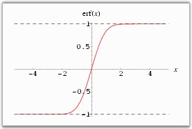

::: {style="DISPLAY: none"}
{#d2h_url_template}{#d2h_package_url style="WIDTH: 0px; DISPLAY: none; HEIGHT: 0px"}
:::

:::: {.d2h_secondary_topic style="PADDING-BOTTOM: 10pt; MARGIN: 0pt; PADDING-LEFT: 0pt; PADDING-RIGHT: 0pt; PADDING-TOP: 0pt"}
#### Error Function {#error-function style="tab-stops: 0pt"}

 

The Error function, denoted as Erf(x), gives the probability that a measurement under the influence of accidental errors has a distance less than x from the average value at the center. It is the integral of Gauss curve, that is usually normalized to one with a factor of 2/Öp. It is otherwise called as integrated Gauss function or Gauss Error function.\
\
[]{style="FONT-FAMILY: 'Verdana','sans-serif'; FONT-SIZE: 8pt"}

{border="0"}

 

 

Here is the plot of error function.

[]{style="FONT-FAMILY: 'Verdana','sans-serif'; COLOR: black"} 

{border="0"}

Figure 344: Error Function

 

 

Using the formula

[]{style="COLOR: #4a5c8c; FONT-SIZE: 8pt"} 

The **Erf** method of the **UtilityFunctions** class returns integral of the Gauss curve for x \> 0.

 

::: {align="center"}
  ------------- ------------------------------- ----------------------------------------------
  Method Name   Parameters                      Return Value
  Erf           x: must be greater than zero.   A double that represents the Gauss integral.
  ------------- ------------------------------- ----------------------------------------------
:::

 

Example

 

Here is a code snippet that shows a sample usage.

 

+----------------------------------------------------------------------------------------------------------------------------------------------+
| **[\[C#\]]{style="FONT-FAMILY: 'Courier New'; COLOR: black"}**                                                                               |
|                                                                                                                                              |
| **[]{style="FONT-FAMILY: 'Courier New'; COLOR: black"}**                                                                                     |
|                                                                                                                                              |
| [using Syncfusion.Windows.Forms.Chart.Statistics;]{style="FONT-FAMILY: 'Courier New'; COLOR: black"}                                         |
|                                                                                                                                              |
| [int]{style="FONT-FAMILY: 'Courier New'; COLOR: blue"}[ double = UtilityFunctions.Erf(x);]{style="FONT-FAMILY: 'Courier New'; COLOR: black"} |
+----------------------------------------------------------------------------------------------------------------------------------------------+

 

+--------------------------------------------------------------------------------------------------------------------------------------------------------------------------------------------------------------------------------------------------------------+
| **[\[VB.NET\]]{style="FONT-FAMILY: 'Courier New'; COLOR: black"}**                                                                                                                                                                                           |
|                                                                                                                                                                                                                                                              |
| **[]{style="FONT-FAMILY: 'Courier New'; COLOR: black"}**                                                                                                                                                                                                     |
|                                                                                                                                                                                                                                                              |
| [Imports Syncfusion.Windows.Forms.Chart.Statistics]{style="FONT-FAMILY: 'Courier New'; COLOR: black"}                                                                                                                                                        |
|                                                                                                                                                                                                                                                              |
| [Dim]{style="FONT-FAMILY: 'Courier New'; COLOR: blue"}[ ]{style="FONT-FAMILY: 'Courier New'; COLOR: black"}[double as]{style="FONT-FAMILY: 'Courier New'; COLOR: blue"}[ result = UtilityFunctions.Erf(x)]{style="FONT-FAMILY: 'Courier New'; COLOR: black"} |
+--------------------------------------------------------------------------------------------------------------------------------------------------------------------------------------------------------------------------------------------------------------+

[]{#p236} 

[]{#related-topics}
::::
