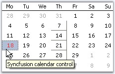
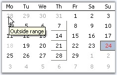

::: {style="DISPLAY: none"}
{#d2h_url_template}{#d2h_package_url style="WIDTH: 0px; DISPLAY: none; HEIGHT: 0px"}
:::

:::::: {.d2h_secondary_topic style="PADDING-BOTTOM: 10pt; MARGIN: 0pt; PADDING-LEFT: 0pt; PADDING-RIGHT: 0pt; PADDING-TOP: 0pt"}
##### Event Handling {#event-handling style="tab-stops: 0pt"}

[]{style="COLOR: #15428b"} 

MonthCalendarAdv triggers events whenever the date is selected and changed. The most widely used events are discussed below.

[]{style="COLOR: #15428b"} 

::: {align="center"}
+-------------------------------------------+-----------------------------------------------------------------------------------------------------------------------------------------------------------------------------------------+
|  MonthCalendarAdv Events                  | Description                                                                                                                                                                             |
+-------------------------------------------+-----------------------------------------------------------------------------------------------------------------------------------------------------------------------------------------+
| Border3DStyleChanged                      | Event is raised when Border3DStyle property is changed.                                                                                                                                 |
+-------------------------------------------+-----------------------------------------------------------------------------------------------------------------------------------------------------------------------------------------+
| BorderColorChanged                        | Event is raised when BorderColor property is changed.                                                                                                                                   |
+-------------------------------------------+-----------------------------------------------------------------------------------------------------------------------------------------------------------------------------------------+
| BorderSidesChanged                        | Event is raised when BorderSides property is changed.                                                                                                                                   |
+-------------------------------------------+-----------------------------------------------------------------------------------------------------------------------------------------------------------------------------------------+
| BorderStyleChanged                        | Event is raised when BorderStyle property is changed.                                                                                                                                   |
+-------------------------------------------+-----------------------------------------------------------------------------------------------------------------------------------------------------------------------------------------+
| DateCellQueryInfo[]{style="COLOR: black"} | It can be handled to provide custom formatting for calendar cells. The event handler receives an argument of type                                                                       |
|                                           |                                                                                                                                                                                         |
|                                           | DateCellQueryInfoEventArgs. The following are the event properties associated with DateCellQueryInfoEventArgs argument.                                                                 |
+-------------------------------------------+-----------------------------------------------------------------------------------------------------------------------------------------------------------------------------------------+
| DateSelected[]{style="COLOR: black"}      | It occurs when a date is selected from the calendar. It can be handled to retrieve the selected date of the MonthCalendarAdv. The event handler receives an argument of type EventArgs. |
+-------------------------------------------+-----------------------------------------------------------------------------------------------------------------------------------------------------------------------------------------+
| DateChanged                               | Handled when a selected date is changed.                                                                                                                                                |
+-------------------------------------------+-----------------------------------------------------------------------------------------------------------------------------------------------------------------------------------------+
| FirstDayOfWeekChanged                     | Handled when the first day of the week is changed using FirstDayOfWeek property.                                                                                                        |
+-------------------------------------------+-----------------------------------------------------------------------------------------------------------------------------------------------------------------------------------------+
| NoneButtonClick                           | Handled when the None button is clicked.                                                                                                                                                |
+-------------------------------------------+-----------------------------------------------------------------------------------------------------------------------------------------------------------------------------------------+
| ShowWeekNumbersChanged                    | Handled when ShowWeekNumbers property is changed. We can customize the appearance of the week numbers within this handler.                                                              |
+-------------------------------------------+-----------------------------------------------------------------------------------------------------------------------------------------------------------------------------------------+
| StretchScrollImageChanged                 | Handled when StretchScrollImage property is changed.                                                                                                                                    |
+-------------------------------------------+-----------------------------------------------------------------------------------------------------------------------------------------------------------------------------------------+
| ThemedBorderChanged                       | Handles when ThemedBorder property is changed.                                                                                                                                          |
+-------------------------------------------+-----------------------------------------------------------------------------------------------------------------------------------------------------------------------------------------+
:::

###### []{#p294}[]{#_DateCellQueryInfo_Event}3.3.3.1.5.1 DateCellQueryInfo Event {#datecellqueryinfo-event style="tab-stops: 0pt"}

[]{style="COLOR: #15428b"} 

This event is handled to provide custom formatting for calendar cells.

[]{style="COLOR: #15428b"} 

::: {align="center"}
  ---------------- -------------------------------------------------------------------
   Members         Description
  ColIndex         Specifies the column index of GridCell.
  DateValue        Specifies the date value.
  RowIndex         Specifies the row index of GridCell.
  Style            Specifies GridStyleInfo object.
  Handled          Indicates whether the event has been handled. It is a bool value.
  IsCurrentCell    Returns the current cell at run time.
  IsOutsideRange   Specifies whether the query is outside the range of a month.
  ---------------- -------------------------------------------------------------------
:::

[]{style="COLOR: #15428b"} 

Example

**[]{style="COLOR: #15428b"}** 

The style parameter can be used to set tooltips for MonthCalendarAdv control as follows. This example uses IsCurrentCell, IsOutsideRange, ColIndex and Handled members.

**[]{style="COLOR: #15428b"}** 

+-------------------------------------------------------------------------------------------------------------------------------------------------------------------------------------------------------------------------------------------------------------+
| **[\[C#\]]{style="FONT-FAMILY: 'Courier New'; COLOR: black"}**                                                                                                                                                                                              |
|                                                                                                                                                                                                                                                             |
| []{style="FONT-FAMILY: 'Courier New'; COLOR: black"}                                                                                                                                                                                                        |
|                                                                                                                                                                                                                                                             |
| [private]{style="FONT-FAMILY: 'Courier New'; COLOR: blue"}[ [void]{style="COLOR: blue"} monthCalendarAdv1_DateCellQueryInfo([object]{style="COLOR: blue"} sender, [DateCellQueryInfoEventArgs]{style="COLOR: teal"} e)]{style="FONT-FAMILY: 'Courier New'"} |
|                                                                                                                                                                                                                                                             |
| [{]{style="FONT-FAMILY: 'Courier New'"}                                                                                                                                                                                                                     |
|                                                                                                                                                                                                                                                             |
| [    [//Identifies current cell and sets the tooltip text for the calendar]{style="COLOR: green"}]{style="FONT-FAMILY: 'Courier New'"}                                                                                                                      |
|                                                                                                                                                                                                                                                             |
| [    [if]{style="COLOR: blue"} (e.IsCurrentCell)]{style="FONT-FAMILY: 'Courier New'"}                                                                                                                                                                       |
|                                                                                                                                                                                                                                                             |
| [    {]{style="FONT-FAMILY: 'Courier New'"}                                                                                                                                                                                                                 |
|                                                                                                                                                                                                                                                             |
| [        e.Style.CellTipText = [\"Syncfusion calendar control\"]{style="COLOR: maroon"};]{style="FONT-FAMILY: 'Courier New'"}                                                                                                                               |
|                                                                                                                                                                                                                                                             |
| [        e.Style.CellAppearance = Syncfusion.Windows.Forms.Grid.[GridCellAppearance]{style="COLOR: teal"}.Flat;]{style="FONT-FAMILY: 'Courier New'"}                                                                                                        |
|                                                                                                                                                                                                                                                             |
| [        e.Style.BackColor = [Color]{style="COLOR: teal"}.LightSteelBlue;]{style="FONT-FAMILY: 'Courier New'"}                                                                                                                                              |
|                                                                                                                                                                                                                                                             |
| [    }]{style="FONT-FAMILY: 'Courier New'"}                                                                                                                                                                                                                 |
|                                                                                                                                                                                                                                                             |
| [    [//Sets Tooltip text for the cells outside range]{style="COLOR: green"}]{style="FONT-FAMILY: 'Courier New'"}                                                                                                                                           |
|                                                                                                                                                                                                                                                             |
| [    [else]{style="COLOR: blue"} [if]{style="COLOR: blue"} (e.IsOutsideRange)]{style="FONT-FAMILY: 'Courier New'"}                                                                                                                                          |
|                                                                                                                                                                                                                                                             |
| [        e.Style.CellTipText = [\"Outside range\"]{style="COLOR: maroon"};]{style="FONT-FAMILY: 'Courier New'"}                                                                                                                                             |
|                                                                                                                                                                                                                                                             |
| [    [//Sets Cell Appearance to \"Raised\" for fourth Column]{style="COLOR: green"}]{style="FONT-FAMILY: 'Courier New'"}                                                                                                                                    |
|                                                                                                                                                                                                                                                             |
| [    [else]{style="COLOR: blue"} [if]{style="COLOR: blue"} (e.ColIndex == 4)]{style="FONT-FAMILY: 'Courier New'"}                                                                                                                                           |
|                                                                                                                                                                                                                                                             |
| [        e.Style.CellAppearance = Syncfusion.Windows.Forms.Grid.[GridCellAppearance]{style="COLOR: teal"}.Raised;  ]{style="FONT-FAMILY: 'Courier New'"}                                                                                                    |
|                                                                                                                                                                                                                                                             |
| [    [else]{style="COLOR: blue"}]{style="FONT-FAMILY: 'Courier New'"}                                                                                                                                                                                       |
|                                                                                                                                                                                                                                                             |
| [    [//event is stopped]{style="COLOR: green"}]{style="FONT-FAMILY: 'Courier New'"}                                                                                                                                                                        |
|                                                                                                                                                                                                                                                             |
| [    e.Handled = [false]{style="COLOR: blue"};]{style="FONT-FAMILY: 'Courier New'"}                                                                                                                                                                         |
|                                                                                                                                                                                                                                                             |
| [}]{style="FONT-FAMILY: 'Courier New'"}                                                                                                                                                                                                                     |
+-------------------------------------------------------------------------------------------------------------------------------------------------------------------------------------------------------------------------------------------------------------+

[]{style="COLOR: #15428b"} 

+---------------------------------------------------------------------------------------------------------------------------------------------------------------------------------------------------------------------------------------------------------------------------------------------------------------------------------------------------+
| **[\[VB.NET\]]{style="FONT-FAMILY: 'Courier New'; COLOR: black"}**                                                                                                                                                                                                                                                                                |
|                                                                                                                                                                                                                                                                                                                                                   |
| []{style="COLOR: black"}                                                                                                                                                                                                                                                                                                                          |
|                                                                                                                                                                                                                                                                                                                                                   |
| [Private]{style="FONT-FAMILY: 'Courier New'; COLOR: blue"}[ [Sub]{style="COLOR: blue"} monthCalendarAdv1_DateCellQueryInfo([ByVal]{style="COLOR: blue"} sender [As]{style="COLOR: blue"} [Object]{style="COLOR: blue"}, [ByVal]{style="COLOR: blue"} e [As]{style="COLOR: blue"} DateCellQueryInfoEventArgs)]{style="FONT-FAMILY: 'Courier New'"} |
|                                                                                                                                                                                                                                                                                                                                                   |
| [    [\'Identifies current cell and sets the tooltip text for the calendar ]{style="COLOR: green"}]{style="FONT-FAMILY: 'Courier New'"}                                                                                                                                                                                                           |
|                                                                                                                                                                                                                                                                                                                                                   |
| [    [If]{style="COLOR: blue"} e.IsCurrentCell [Then]{style="COLOR: blue"}]{style="FONT-FAMILY: 'Courier New'"}                                                                                                                                                                                                                                   |
|                                                                                                                                                                                                                                                                                                                                                   |
| [        e.Style.CellTipText = [\"Syncfusion calendar control\"]{style="COLOR: maroon"}]{style="FONT-FAMILY: 'Courier New'"}                                                                                                                                                                                                                      |
|                                                                                                                                                                                                                                                                                                                                                   |
| [        e.Style.CellAppearance = Syncfusion.Windows.Forms.Grid.GridCellAppearance.Flat]{style="FONT-FAMILY: 'Courier New'"}                                                                                                                                                                                                                      |
|                                                                                                                                                                                                                                                                                                                                                   |
| [        e.Style.BackColor = Color.LightSteelBlue]{style="FONT-FAMILY: 'Courier New'"}                                                                                                                                                                                                                                                            |
|                                                                                                                                                                                                                                                                                                                                                   |
| [    \'[Sets Tooltip text for the cells outside range]{style="COLOR: green"}]{style="FONT-FAMILY: 'Courier New'"}                                                                                                                                                                                                                                 |
|                                                                                                                                                                                                                                                                                                                                                   |
| [    [ElseIf]{style="COLOR: blue"} e.IsOutsideRange [Then]{style="COLOR: blue"}]{style="FONT-FAMILY: 'Courier New'"}                                                                                                                                                                                                                              |
|                                                                                                                                                                                                                                                                                                                                                   |
| [        e.Style.CellTipText = [\"Outside range\"]{style="COLOR: maroon"}]{style="FONT-FAMILY: 'Courier New'"}                                                                                                                                                                                                                                    |
|                                                                                                                                                                                                                                                                                                                                                   |
| [    \']{style="FONT-FAMILY: 'Courier New'; COLOR: maroon"}[Sets Cell Appearance to \"Raised\" for fourth Column]{style="FONT-FAMILY: 'Courier New'; COLOR: green"}                                                                                                                                                                               |
|                                                                                                                                                                                                                                                                                                                                                   |
| [    [ElseIf]{style="COLOR: blue"} e.ColIndex = 4 [Then]{style="COLOR: blue"}]{style="FONT-FAMILY: 'Courier New'"}                                                                                                                                                                                                                                |
|                                                                                                                                                                                                                                                                                                                                                   |
| [        e.Style.CellAppearance = Syncfusion.Windows.Forms.Grid.GridCellAppearance.Raised]{style="FONT-FAMILY: 'Courier New'"}                                                                                                                                                                                                                    |
|                                                                                                                                                                                                                                                                                                                                                   |
| [    [Else]{style="COLOR: blue"}]{style="FONT-FAMILY: 'Courier New'"}                                                                                                                                                                                                                                                                             |
|                                                                                                                                                                                                                                                                                                                                                   |
| [        e.Handled = [False]{style="COLOR: blue"}]{style="FONT-FAMILY: 'Courier New'"}                                                                                                                                                                                                                                                            |
|                                                                                                                                                                                                                                                                                                                                                   |
| [        [\'event is stopped ]{style="COLOR: green"}]{style="FONT-FAMILY: 'Courier New'"}                                                                                                                                                                                                                                                         |
|                                                                                                                                                                                                                                                                                                                                                   |
| [    [End]{style="COLOR: blue"} [If]{style="COLOR: blue"}]{style="FONT-FAMILY: 'Courier New'"}                                                                                                                                                                                                                                                    |
|                                                                                                                                                                                                                                                                                                                                                   |
| [End]{style="FONT-FAMILY: 'Courier New'; COLOR: blue"}[ [Sub]{style="COLOR: blue"}]{style="FONT-FAMILY: 'Courier New'"}                                                                                                                                                                                                                           |
+---------------------------------------------------------------------------------------------------------------------------------------------------------------------------------------------------------------------------------------------------------------------------------------------------------------------------------------------------+

[]{style="COLOR: #15428b"} 

::: {style="BORDER-BOTTOM: windowtext 1pt solid; BORDER-LEFT: medium none; PADDING-BOTTOM: 1pt; MARGIN-TOP: 9pt; PADDING-LEFT: 0pt; PADDING-RIGHT: 0pt; MARGIN-BOTTOM: 9pt; BORDER-TOP: windowtext 1pt solid; BORDER-RIGHT: medium none; PADDING-TOP: 1pt"}
{border="0"} Note:
:::

[]{style="COLOR: #15428b"} 

1.   In **Fig 1**, 18th is identified as the current cell and the tooltip is displayed. Also the background of the current cell is painted with LightSteelBlue.

2.   Edges of the 4th column cells (ColIndex=4), other than the current cell are set to \"Raised\" and hence shows a raised appearance.

3.   In **Fig 2**, user tries to query the cells outside the range, i.e inactive month dates and the respective tooltip is displayed.

[]{style="COLOR: #15428b"} 

{border="0"}

**[]{style="COLOR: #15428b"}** 

Figure 243**[]{style="COLOR: #15428b"}**

{border="0"}

Figure 244**[]{style="FONT-STYLE: normal; COLOR: #15428b"}**

**[]{style="COLOR: #15428b"}** 

See Also

[[]{style="COLOR: blue"}]{.UGHyperlink}

[[How to customize the appearance of the diagonal columns?]{style="COLOR: blue"}]{.UGHyperlink}

[]{#related-topics}
::::::
